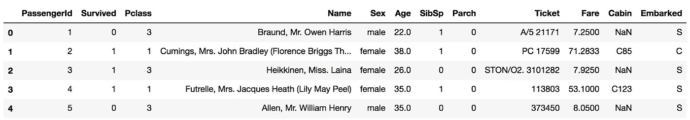

# 熊猫 vs. Spark:如何处理数据帧(下)

> 原文：<https://towardsdatascience.com/python-pandas-vs-scala-how-to-handle-dataframes-part-ii-d3e5efe8287d?source=collection_archive---------6----------------------->


“Panda statues on gray concrete stairs during daytime” by [chuttersnap](https://unsplash.com/@chuttersnap?utm_source=medium&utm_medium=referral) on [Unsplash](https://unsplash.com?utm_source=medium&utm_medium=referral). “Scala” means “stairway” in Italian, my native language: hence the choice of the picture. It just seemed appropriate.

前几天我发表了一篇[帖子](/python-vs-scala-a-comparison-of-the-basic-commands-fae23b3ede23)比较 Python 和 Scala 的基本命令:如何处理列表和数组、函数、循环、字典等等。随着我继续练习 Scala，似乎应该继续第二部分，比较如何在两种编程语言中处理数据帧，以便在建模过程之前准备好数据。在 Python 中，我们将通过使用 Pandas 库来完成所有这些，而在 Scala 中，我们将使用 Spark。

> 在这个练习中，我将使用 Titanic train 数据集，该数据集可以通过链接轻松下载[。此外，我在 Databricks 中进行了 Scala 实践:如果你也这样做，记得首先通过点击 Data 导入数据集，然后添加数据。](https://www.kaggle.com/c/titanic/data)

# 1.读取数据帧

我将导入并命名我的数据帧 *df* ，在 **Python** 中这将只有两行代码。如果您将 *train.csv* 保存在笔记本所在的同一个文件夹中，这将有效。

```
import pandas as pd
df = pd.read_csv('train.csv')
```

Scala 需要更多的输入。

```
var df = sqlContext
    .read
    .format("csv")
    .option("header", "true")
    .option("inferSchema", "true")
    .load("Filestore/tables/train.csv")
```

让我们看看这里发生了什么。Scala 不假设你的数据集有一个头，所以我们需要指定它。另外，Python 会自动为 dataframe 列分配一个 dtype，而 Scala 不会这样做，除非我们指定`.option("inferSchema", "true")`。还要注意，我没有导入 Spark Dataframe，因为我在 [Databricks](https://databricks.com/) 中练习 Scala，它是预加载的。否则我们将需要这样做。

> 注意:在 Python 中布尔值是大写的，而在 Scala 中是小写的！

# 2.显示数据帧的前几行

在 **Python** 中，`df.head()`将默认显示前五行:输出如下。



df.head() output in Python.

如果您希望看到的行数不是 5，您可以在括号中传递一个不同的数字。 **Scala** 及其`df.show()`，将默认显示前 20 行。


df.show() in Scala.

如果我们想让它更短，并且去掉省略号，以便阅读列的全部内容，我们可以运行`df.show(5, false)`。

# 3.数据帧列和数据类型

要检索列名，在这两种情况下我们只需键入`df.columns` : **Scala** 和 **Pandas** 将分别返回一个数组和一个字符串索引。

如果我们想要检查 dtypes，那么对于两种语言来说，命令还是一样的:`df.dtypes`。Pandas 将返回一个 Series 对象，而 Scala 将返回一个元组数组，每个元组分别包含


df.dtypes in Python

列和数据类型。因此，如果我们在 Python 中想要检查*年龄*列是什么类型，我们运行`df.dtypes['Age']`，而在 Scala 中我们需要过滤并使用元组索引:`df.dtypes.filter(colTup => colTup._1 == "Age")`。

# 4.汇总统计数据

这是每个数据科学家在探索他/她的数据时做的另一件事:汇总统计。对于每一个数字列，我们可以看到诸如计数、均值、中值、偏差等信息，以便立即看到是否有什么地方看起来不对劲。在这两种情况下，这将返回一个数据帧，其中列是原始数据帧的数字列，行是统计值。

在 **Python** 中，我们键入`df.describe()`，而在**Scala**T4【中。我们必须在后一种情况下添加`.show()`的原因是因为 Scala 不会自动输出结果数据帧，而 Python 会自动输出(只要我们不把它赋给新变量)。

# 5.选择列

假设我们希望看到列的子集，例如名称为和*的列保留了下来。*

在 **Python** 中，我们可以不加区分地使用`df[['Name','Survived]]`或`df.loc[:,['Name','Survived]`。请记住，这里的`:`表示“所有行”。

在 **Scala** 中，我们会键入`df.select("Name","Survived").show()`。如果你想把子集赋给一个新变量，记得省略`.show()`。

# 6.过滤

假设我们想看看幸存乘客的姓名和职业。我们需要在*幸存*列中过滤一个条件，然后选择其他条件。

在 **Python** 中，我们将再次使用`.loc`，通过在行的位置传递过滤器，然后用列表选择列。基本上和上面的例子一样，但是用一个过滤器代替了`:`，这意味着`df.loc[df['Survived'] == 1, ['Name','Pclass']]`。

在 **Scala** 中我们将使用`.filter`后跟`.select`，也就是`df.filter("Survived = 1").select("Name","Pclass").show()`。

## 6.1.过滤空值

如果我们想要检查空值，例如在*开始的*列中，它将像普通过滤器一样工作，只是条件不同。

在 **Python** 中，我们在传递条件时应用`.isnull()`，在本例中是`df[df['Embarked'].isnull()]`。由于我们没有指定任何列，这将返回一个 dataframe，它将包含所有原始列，但只有包含*和*值的行是空的。

在 **Scala** 中，我们将再次使用`.filter`:`df.filter("Embarked IS NULL").show()`。注意，我们在 Scala 中传递的布尔过滤器有点像 SQL 查询。

# 7.输入空值

在数据集中输入空值之前，我们应该始终进行一些思考，因为它会影响我们的最终模型，我们希望对此保持谨慎。然而，仅仅出于演示的目的，假设我们想将字符串“N/A”归入数据帧中的空值。

我们可以用`df = df.fillna('N/A')`或`df.fillna('N/A', inplace = True)`在 **Python** 中这样做。

在 **Scala** 中，非常类似地，这将通过`df = df.na.fill("N/A")`来实现。记住在这种情况下不要使用`.show()`,因为我们正在将修改后的数据帧赋给一个变量。

# 8.重命名列

这是你在 Scala 中需要确定的事情，因为机器学习模型需要两个名为*特征*和*标签*的列来训练。然而，举例来说，如果您不喜欢某个列的命名方式，您可能也想在 Pandas 中这样做。为此，我们想将幸存的*列改为*标签*。*

在 **Python** 中，我们将传递一个字典，其中的键和值分别是列的旧名称和新名称。这种情况下会是`df.rename(columns = {"Survived": "label"}, inplace = True)`。

在 **Scala** 中，这等于`df = df.withColumnRenamed("Survived", "label")`。

# 9.分组依据和聚合

假设我们想要分别计算男性和女性的最大*年龄*，在这种情况下`.groubpby`会派上用场。不仅检索最大值；在`.groupby`之后，我们可以使用各种聚合函数:均值、计数、中位数等等。对于这个例子，我们坚持使用`.max()`。

在 **Python** 中，这将是`df.groupby('Sex').mean()['Age']`。如果我们不在`.mean()`后指定`['Age']`，这将返回一个 dataframe，其中包含所有数字列的最大值，并按*性别*分组。

在 **Scala** 中，我们首先需要导入我们想要使用的聚合函数。

```
import org.apache.spark.sql.functions.max
df.groupBy("Sex").agg(max("Age")).show()
```

# 10.创建新列

这对于特征工程来说非常有用，我们可能想要结合两个变量来看它们的交互是如何与目标相关的。出于纯粹的演示目的，让我们看看如何创建一个包含在*年龄*和*费用之间的产品的列。*

在 Python 中，这非常简单。

`df['Age_times_Fare'] = df['Age'] * df['Fare']`

在 **Scala** 中，我们需要将`$`放在我们想要使用的列的名称之前，以便考虑具有相应名称的列对象。

`df = df.withColumn("AgeTimesFare", $"Age" * $"Fare")`

# 11.相互关系

探索数字变量和目标之间的相关性总是很方便的，在 **Python** 中，只需运行`df.corr()`就可以获得所有数字变量之间的相关系数矩阵。如果您想查看相关性，假设在*年龄*和*票价*之间，我们只需指定列:`df[['Age','Fare']].corr()`。

在 Scala 中，我们首先需要导入，然后通过指定列来运行命令。

```
import org.apache.spark.sql.functions.corr
df.select(corr("Age","Fare")).show()
```

就是这个！我希望你觉得这篇文章很有用，就像我写这篇文章一样有用。我打算发表第三部分，在那里我可以通过机器学习模型的例子来完成这个循环！


请随意查看:

[本帖第一部分](/python-vs-scala-a-comparison-of-the-basic-commands-fae23b3ede23)。

[我的其他中帖。](https://medium.com/@emmagrimaldi)

我的 LinkedIn 个人资料。

**感谢您的阅读！**