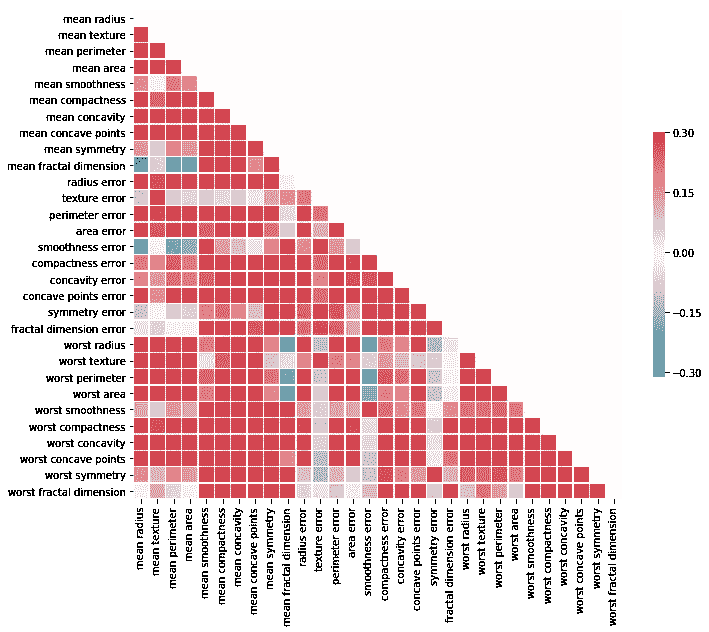

# Python 绘图 API:通过 flask API 展示您的科学 python 绘图

> 原文：<https://towardsdatascience.com/python-plotting-api-expose-your-scientific-python-plots-through-a-flask-api-31ec7555c4a8?source=collection_archive---------6----------------------->

在我作为数据科学家的日常工作中，我经常需要将相对复杂的情节集成到后台应用程序中。这些图主要用于说明算法决策，并为运营部门提供数据直觉。

一种可能的方法是构建一个返回数据的 API，并让应用程序的前端使用或多或少复杂的 javascript 图表库来呈现数据。现在，每当我想改变一些东西时，我都需要改变前端和后端。

因此，我寻找一种快速、简单和可维护的解决方案，使绘图在任何 web 前端应用程序中都可用。我还寻找一种解决方案，允许我在一个地方改变我的图，而当例如一些新的功能请求进来时，总是需要改变前端。

我想到的只是用 [matplotlib](https://matplotlib.org/) 、 [seaborn](https://seaborn.pydata.org/) 等在 python 中构建情节，然后通过 [flask](http://flask.pocoo.org/) 将它们暴露在网络上。听起来容易吗？这很容易！我会一步一步地教你。也许对你和我一样有帮助。

**我们需要什么组件:**

*   **数据集**:我们将使用来自 [scikit-learn](https://scikit-learn.org/) 的[乳腺癌数据集](https://scikit-learn.org/stable/datasets/index.html#breast-cancer-dataset)
*   **图**:让我们从 seaborn 的[简单相关图](https://seaborn.pydata.org/examples/many_pairwise_correlations.html)开始
*   **一个 API** :这里我们将使用[烧瓶](http://flask.pocoo.org/)创建一个简单的 API

因此，让我们首先加载数据并绘制图表:

Plotting a plot and return it as BytesIO

A correlation matrix plot

这将导致情节左。如你所见，这里的技巧是将绘图保存到 BytesIO 对象中。我们现在可以通过 flask API 公开这个 BytesIO 对象，这样就完成了！

A simple endpoint to return the plot

在上面的代码片段中，我们创建了一个非常简单的端点，当客户端通过给定的路径请求时，它应该返回一个绘图图像。因此，如果您的服务器运行在 localhost 上，图像将在[http://localhost:5000/plots/breast _ cancer _ data/correlation _ matrix](http://localhost:5000/plots/breast_cancer_data/correlation_matrix)下提供。

有了 flask，你可以使用 *send_file* 函数来帮助你发送一个文件到请求的客户端。在我们的例子中，这个文件是存储在 io 中的生成图。BytesIO 对象。我们只要把它传递给函数，就有了一个工作端点。你现在可以启动 flask 应用程序，你会看到:它的工作！

为了让我们的最终用户访问这个情节，我们现在将在一个 HTML 网站上集成图像。您可以只使用图像标签，它将开箱即用:

现在，您学习了如何通过 API 来展示您的科学计划。这样，您就可以帮助其他人在日常工作中更好地理解数据，而无需启动自己的 jupyter 笔记本服务器。

如果您需要更复杂的需要参数化的图，例如给定的时间范围，您可以使用查询参数，并将它们从 flask 传递到您的绘图函数。

为了说明这一点，我整理了一个更简洁的 gitlab 存储库，为您提供了更多的示例，此外还展示了一种将 dockerized flask 应用程序部署到 Heroku 的方法:

https://gitlab.com/dice89/python-plotting-api

您可以在以下位置找到部署的应用程序:

【https://python-sci-plotting.herokuapp.com/ 

我希望这篇博客教了你一个很好的小技巧，对你有所帮助！