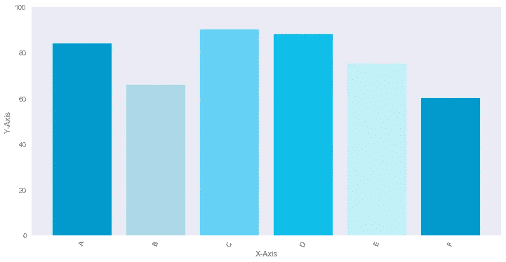
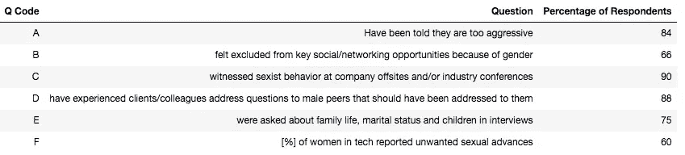
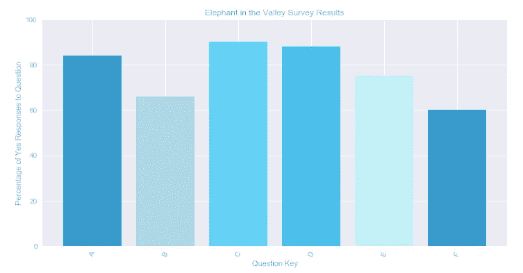
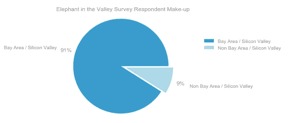
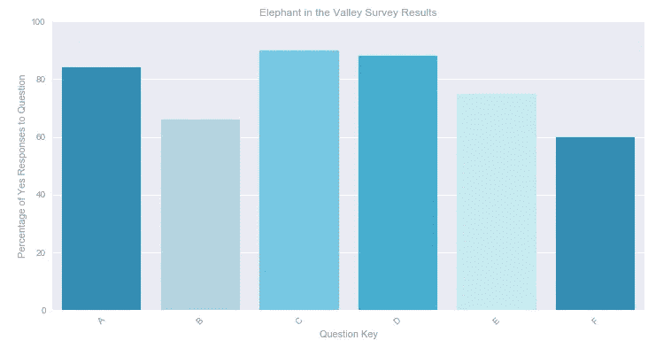

# Python 绘图基础

> 原文：<https://towardsdatascience.com/python-plotting-basics-simple-charts-with-matplotlib-seaborn-and-plotly-e36346952a3a?source=collection_archive---------1----------------------->

## 使用 Matplotlib、Seaborn 和 Plotly 的简单图表



本教程将介绍如何使用三个 Python 绘图库的基础知识——Matplotlib、Seaborn 和 Plotly。阅读完本教程后，您应该能够使用这三个库来:

*   绘制基本条形图和饼图
*   设置和自定义绘图特征，如标题、轴和标签
*   设置绘图的常规图形样式/特征，如自定义字体和颜色选择
*   理解静态 Matplotlib 和交互式 Plotly 图形在使用和风格上的区别

我在这些图表中使用的数据是基于少数故事和来自山谷中的大象的调查结果，这是一项对 200 多名科技界女性的调查。

**Matplotlib，Seaborn，和 Plotly 的区别**

我听说过 **Matplotlib** 被称为 python 绘图包的“祖父”。它真的拥有绘制数据所需的一切，而且网上有很多关于如何使用它的例子。我发现它的缺点是，它的默认风格并不总是视觉上吸引人，而且学习如何做出你想要的调整可能很复杂。有时看起来应该很简单的事情需要几行代码。

Seaborn 是 Matplotlib 的补充，从下面的例子可以看出，它是建立在 Matplotlib 功能之上的。它有更美观的默认样式选项和特定图表——特别是可视化统计数据，它使创建引人注目的图形变得容易，而使用 Matplotlib 可能会很复杂。

Plotly 是一个集成了 Python API 的在线可视化库。在您[设置您的帐户](https://plot.ly/python/getting-started/)后，当您创建图表时，它们会自动链接到您的文件中(并且根据您的帐户/文件设置是公开的)。它相对容易使用，并提供交互式绘图功能，可以很容易地嵌入到网站中。它还具有良好的默认风格特征。

**设置我们的库和数据框架**

我使用 Pandas 来组织这些地块的数据，并首先通过以下导入为我的 Jupyter 笔记本设置参数。*请注意,%matplotlib inline 只允许您运行笔记本并在输出中自动生成绘图，您只需设置一次 Plotly 默认凭证。*

```
import pandas as pd
import numpy as np
import matplotlib.pyplot as plt
import seaborn as sns
import matplotlib.font_manager
%matplotlib inlineimport plotly.plotly  as py
import plotly.graph_objs as go
plotly.tools.set_credentials_file(username='***', api_key='***')
```

我用熊猫建立了一个数据框。我们绘制的信息如下所示:



Fig.1 — Sample Responses from www.elephantinthevalley.com

**Matplotlib 条形图示例**

以下代码使用 Matplotlib 生成如下所示的条形图。您可以看到，我们首先将我们的图形设置为具有指定图形大小的子图。然后，我们使用处理所有默认样式/值的 rcParams 函数，设置我们希望作为 Matplotlib 绘图的默认文本和颜色参数。*请注意，当您在下面的示例中使用 rcParams 时，它充当一个全局参数，并且您在每次使用 Matplotlib 时都要更改默认样式。*

在这个例子中，我使用了一个自定义调色板，它是一个颜色列表，但是也可以(对于分组条形图来说是必要的)为您想要用于条形图的每组数据使用一个颜色值。还要注意，除了使用十六进制颜色代码，您还可以使用库支持的颜色名称。

我们设置总标题、轴标签、轴限制，甚至使用 rotation 参数旋转 x 轴刻度标签。

```
fig, ax = plt.subplots(figsize = (12,6))plt.rcParams['font.sans-serif'] = 'Arial'
plt.rcParams['font.family'] = 'sans-serif'
plt.rcParams['text.color'] = '#909090'
plt.rcParams['axes.labelcolor']= '#909090'
plt.rcParams['xtick.color'] = '#909090'
plt.rcParams['ytick.color'] = '#909090'
plt.rcParams['font.size']=12color_palette_list = ['#009ACD', '#ADD8E6', '#63D1F4', '#0EBFE9',   
                      '#C1F0F6', '#0099CC']ind = np.arange(len(df['Question']))bars1 = ax.bar(ind, df['Percentage of Respondents'], 
        color = color_palette_list, 
        label='Percentage of yes responses to question')ax.set_title("Elephant in the Valley Survey Results")
ax.set_ylabel("Percentage of Yes Responses to Question")
ax.set_ylim((0,100))
ax.set_xticks(range(0,len(ind)))
ax.set_xticklabels(list(df['Q Code']), rotation=70)
ax.set_xlabel("Question Key")
```

这会产生以下输出:



Fig.3 — Matplotlib Bar Chart Example

**Matplotlib 饼图示例**

下面的代码生成了下图所示的饼图。与我们的条形图示例一样，我们首先将图形设置为子图，然后通过 rcParams 重置默认的 Matplotlib 样式参数。在这种情况下，我们也在下面的代码中定义我们的数据，而不是从我们的数据框中获取。我们选择分解饼图部分，因此设置了一个名为 explode 的变量，我们将颜色选项设置为前面定义的调色板列表中的前两个条目。将轴设置为“相等”可以确保我们得到一个圆形饼图。Autopct 将我们的值格式化为带有一组小数点的字符串。我们还指定了饼图的起始角度，以获得我们想要的格式，并使用 pctdistance 和 labeldistance 放置我们的文本。

在我们设置标题后，我们还选择为该图表使用图例，并指定图例不应有框架/可见边界框，我们通过使用指定的`bbox_to_anchor`参数“锚定”图例来专门设置图例位置。*有用提示——如果您想让图例位于图形之外，首先将位置参数指定为一个特定的角，如“左上角”,然后使用 bbox_to_anchor 指定您想要将图例的“左上角”固定到的位置。*

```
fig, ax = plt.subplots()plt.rcParams['font.sans-serif'] = 'Arial'
plt.rcParams['font.family'] = 'sans-serif'
plt.rcParams['text.color'] = '#909090'
plt.rcParams['axes.labelcolor']= '#909090'
plt.rcParams['xtick.color'] = '#909090'
plt.rcParams['ytick.color'] = '#909090'
plt.rcParams['font.size']=12labels = ['Bay Area / Silicon Valley', 
         'Non Bay Area / Silicon Valley']
percentages = [91, 9]
explode=(0.1,0)ax.pie(percentages, explode=explode, labels=labels,  
       colors=color_palette_list[0:2], autopct='%1.0f%%', 
       shadow=False, startangle=0,   
       pctdistance=1.2,labeldistance=1.4)
ax.axis('equal')ax.set_title("Elephant in the Valley Survey Respondent Make-up")
ax.legend(frameon=False, bbox_to_anchor=(1.5,0.8))
```

这会产生以下输出:



Fig. 4 — Matplotlib Pie Chart Example

**Seaborn 条形图示例**

从下面的代码可以看出，Seaborn 实际上只是 Matplotlib 的一个包装器。在这个特殊的例子中，我们覆盖了默认的 rcParams 并使用了这样一个简单的图表类型，无论您是使用 Matplotlib 还是 Seaborn 绘图都没有任何区别，但是对于不改变默认样式或更复杂的绘图类型的快速图形，我发现 Seaborn 通常是不错的选择。

```
fig, ax = plt.subplots(figsize = (12,6))plt.rcParams['font.sans-serif'] = 'Arial'
plt.rcParams['font.family'] = 'sans-serif'
plt.rcParams['text.color'] = '#909090'
plt.rcParams['axes.labelcolor']= '#909090'
plt.rcParams['xtick.color'] = '#909090'
plt.rcParams['ytick.color'] = '#909090'
plt.rcParams['font.size']=12ind = np.arange(len(df['Question']))color_palette_list = ['#009ACD', '#ADD8E6', '#63D1F4', '#0EBFE9', 
                      '#C1F0F6', '#0099CC']sns.barplot(x=df['Q Code'], y = df['Percentage of Respondents'],  
            data = df, palette=color_palette_list, 
            label="Percentage of yes responses to question", 
            ax=ax, ci=None)ax.set_title("Elephant in the Valley Survey Results")
ax.set_ylabel("Percentage of Yes Responses to Question")
ax.set_ylim(0,100)
ax.set_xlabel("Question Key")
ax.set_xticks(range(0,len(ind)))
ax.set_xticklabels(list(df['Q Code']), rotation=45)
```

这里唯一的区别是我们使用了`sns.barplot`,输出可以是相同的:



Fig. 5 — Seaborn Bar Chart Example

**Plotly 条形图示例**

下面的代码使用 Plotly 设置了我们的条形图。我们正在导入我们的库，并使用相同的调色板。然后我们设置我们的条形图参数，接着是我们的整体布局参数，如我们的标题，然后我们使用字典来设置我们想要的参数，如我们的轴和字体。在这些字典中，我们能够指定子参数，如 x 轴刻度标签旋转和 y 轴范围。然后，我们创建我们的图形，向它提供我们的数据和布局，并将我们的文件输出到我们的 Plotly 帐户，以便我们可以将其作为交互式 web 图形嵌入。

```
import  plotly.plotly  as py
import plotly.graph_objs as gocolor_palette_list = ['#009ACD', '#ADD8E6', '#63D1F4', '#0EBFE9', 
                      '#C1F0F6', '#0099CC']trace = go.Bar(
            x=df['Q Code'],
            y=df['Percentage of Respondents'],
            marker=dict(
            color=color_palette_list))data = [trace]layout = go.Layout(
    title='Elephant in the Valley Survey Results',
    font=dict(color='#909090'),
    xaxis=dict(
        title='Question Key',
        titlefont=dict(
            family='Arial, sans-serif',
            size=12,
            color='#909090'
        ),
        showticklabels=True,
        tickangle=-45,
        tickfont=dict(
            family='Arial, sans-serif',
            size=12,
            color='#909090'
        ),),
    yaxis=dict(
        range=[0,100],
        title="Percentage of Yes Responses to Question",
        titlefont=dict(
            family='Arial, sans-serif',
            size=12,
            color='#909090'
        ),
        showticklabels=True,
        tickangle=0,
        tickfont=dict(
            family='Arial, sans-serif',
            size=12,
            color='#909090'
        )
    )
)fig = go.Figure(data=data, layout=layout)
py.iplot(fig, filename='barplot-elephant-in-the-valley')
```

这会产生以下输出:

Fig. 6 — Plotly Bar Chart Example

**Plotly 饼状图示例**

到目前为止，您可能已经了解了我们是如何格式化和调用 Matplotlib 和 Plotly 中的参数来构建可视化的。让我们来看最后一个图表——一个如何使用 Plotly 创建类似于上图的饼状图的例子。

下面的代码设置并输出我们的图表。我们通过旋转参数来指定我们的起始角度，并使用 hover over 参数来记录当我们将鼠标悬停在饼图的每个组件上时应该可以获得哪些信息。

```
labels = ['Bay Area / Silicon Valley', 
          'Non Bay Area / Silicon Valley']
percentages = [91, 9]trace = go.Pie(labels=labels, 
               hoverinfo='label+percent', 
               values=percentages, 
               textposition='outside',
               marker=dict(colors=color_palette_list[0:2]),
              rotation=90)layout = go.Layout(
                    title="Elephant in the Valley Survey Respondent Make-up",
                    font=dict(family='Arial', size=12, color='#909090'),
                    legend=dict(x=0.9, y=0.5)
                    )data = [trace]fig = go.Figure(data=data, layout=layout)
py.iplot(fig, filename='basic_pie_chart_elephant_in_the_valley')
```

这会产生以下输出:

Fig. 7 — Plotly Pie Chart Example

就这样，我们完成了条形图和饼图的创建和定制。希望这有助于您学习如何使用这些库，以便为您的数据创建定制的图形解决方案。

最后，我想提一下，我认为谨慎使用饼图是很重要的。虽然它们被认为是一种“基本”图表类型，但它们通常不会增加对基础数据的理解，所以要谨慎使用它们，并且只在你知道它们对理解有价值的情况下使用。

密谋愉快！

**资源:**

*   [Python 的 Plotly 入门](https://plot.ly/python/getting-started/)
*   [Matplotlib rcParams 文档](https://matplotlib.org/api/matplotlib_configuration_api.html#matplotlib.RcParams)
*   [Seaborn](https://seaborn.pydata.org/)