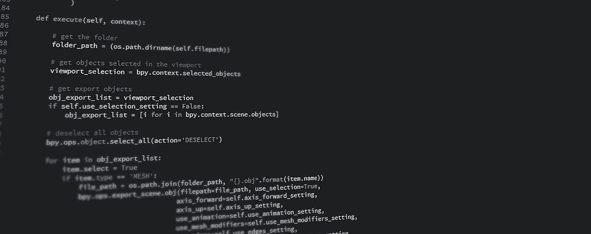

# 15 分钟 Python 编程第 1 部分

> 原文：<https://towardsdatascience.com/python-programming-in-15-min-part-1-3ad2d773834c?source=collection_archive---------2----------------------->



## 关于 Python

Python 3.0 也称为 Python 3000，是一种简单易学、功能强大的编程语言。它具有高效的高级数据结构和简单而有效的面向对象编程方法。Python 优雅的语法和动态类型，加上它的解释性质，使它成为大多数平台上许多领域中脚本和快速应用程序开发的理想语言。

## 安装 Python 3

[](https://www.python.org/downloads/) [## 下载 Python

### Python 编程语言的官方主页

www.python.org](https://www.python.org/downloads/) 

## 第一个程序

让我们编写第一个程序，打印“Hello World！”

在 Python 中，我们使用 print(" ")函数在屏幕上显示文本。我们用引号来标记字符串的开始和结束；它们不会出现在结果中。
我们可以用两种方式运行 python 程序:

1.  Python Shell
2.  Python 脚本

## 使用 Python Shell

在机器上安装 Python 之后，要在命令提示符或终端中打开 Python shell 类型“python3 ”,这将开始一个交互式 Python 会话。此交互式会话不会将您的任何代码保存在文件中；一旦您退出 shell，它就会过期。

在您的 Python shell 中，您将找到当前运行的 Python 版本、一些信息和三个等待您命令的箭头。现在让我们编写代码，在 Python shell 中打印 Hello World。

```
>>> print(“Hello, World!”)
Hello, World!
>>>
```

你一按 enter 键，Python 解释器就运行代码并给出输出。

通用 python shell 用于随时测试程序。使用帮助(任何东西)获取文档。它比任何网络界面都要快。

## 执行 Python 脚本

要运行 Python 脚本，请将 Python 代码保存在. py 文件中，并在命令提示符或终端中使用 python3 file_name.py 运行程序。

例如:
hello_world.py

```
print("Hello, World!")
```

$python3 hello_world.py
你好，世界！

在执行此操作之前，请确保更改了保存文件的目录。

当你编写大块的 Python 代码时，我们需要使用脚本模式。

您可以使用不同的文本编辑器来编写 Python 脚本，如 Sublime Text、Atom Editor。

## 数字和变量

我们知道数字无处不在，所以让我们看看 Python 是如何处理数字的。Python shell 可以当计算器用；您可以在 python shell 中执行基本的数学运算，如加法、除法等。

示例:

```
>>>3 + 3
6
>>>(84949*292)/322
77034
>>>
```

在 Python 中，我们有三种不同的数字类型，它们是整数、浮点数和复数。整数是没有小数部分的数字，可以是正数、负数或无符号数(零)。浮点值是带有小数部分的数字。

在编程中，变量只不过是某种东西的名称。变量名区分大小写。

要在 Python 中声明一个变量，你必须给出它的名字，后跟一个等号和初始化值。

当您一直将值赋给同一个变量名时，Python 会用新值替换旧值。

Python3 支持以下数据类型:

1.布尔
2。整数
3。浮子
4。复合体
5。线

数据类型. py

python3 数据类型. py

```
True <class 'bool'>167 <class 'int'>153.5 <class 'float'>(16.789+12323.45j) <class 'complex'>Mustang <class 'str'>
```

> 注意:不要以数字开始变量名。

# 用线串

在 python 中，字符串是用单引号或双引号括起来的字符序列。字符串是不可变的 Unicode 点序列。

示例:

字符串. py

python3 strings.py

```
<class ‘str’>
<class ‘str’>
Stark , CEO at Queen’s Consolidate
```

## **Python 格式化**

使用。格式()

有时我们可能想用变量值构造字符串，这种字符串的概念性构造称为字符串插值。

示例:

插值. py

python3 插值. py

```
Hey Agent 47, your code number is 1011010.
```

## 数据结构

为了有效地组织和处理内存中的数据，我们使用数据结构，在 Python 中，我们有不同类型的数据结构和对它们执行的几种操作。

现在我们将讨论 Python 中的三种主要数据结构(列表、元组、字典)

## 列表

列表是有序的、可变的值序列，类似于 C 和 C++中的数组。

为了在 Python 中声明一个列表，我们给出了用逗号分隔的列表名称。

```
my_list = [item_1, item_2, item_3, item_4]
```

类似于字符串索引，列表索引从 0 开始，列表可以被切片、连接等等。

示例:

lists.py

python3 列表. py

```
<class 'list'>
['Paris', 'New York', 'Melbourne', 'Swiss']
Paris
New York
Swiss
```

注意:负索引从列表末尾开始，索引值为-1。

我们在列表上有几个方法，这里有几个例子。

列表 _ 方法. py

python3 list_methods.py

```
['Pen', 'Pencil', 'Notepad', 'Eraser']
['Pen', 'Pencil', 'Files', 'Notepad', 'Eraser']
```

index 方法在列表中查找给定值，并返回索引值。索引方法用于搜索值发生的位置。

这是列表方法的几个例子，要了解更多我们可以使用 help(list)获得所有的列表方法。

## 元组

元组是有序的、不可变的值序列。声明元组类似于列表，我们只是将值放在一对括号中。

```
my_tuple = (item_1, item_2, item_3)
```

元组是不可变的，这意味着我们不能在元组中添加或删除项，而且元组没有索引方法。

## 为什么要用元组？

元组比列表更快，也更安全。它们是写保护的，一旦声明，我们就不能添加新的项目。

元组. py

python3 tuple.py

```
<class 'tuple'>
('Oxygen', 'Hydrogen', 'Nitrogen')
```

## 词典

字典是无序的键值对集合。键和值可以是不同的数据类型。每个值都有一个惟一的键，作为字典中该值的标识符。

定义字典

```
my_dictionary = {key_1 : value1, key_2 : value2 , key_3 : value3}
```

示例:

my_dict.py

python3 my_dict.py

```
<class 'dict'>
{'jack': 4098, 'sape': 4139, 'robb': 2323}
{'jack': 4098, 'robb': 2323}
```

## 条件句(if，elif，else)

我们总是需要检查条件并相应地改变程序行为的能力。条件语句给了我们能力。最简单的形式是“if”语句。

条件语句测试一个表达式，看它是真还是假，并根据结果进行运算。

```
if expression:
    statement(s)
```

注意:Python 必须知道当条件为真时必须执行的语句数量。为了实现这一点，出现了缩进的概念。标题下的所有语句(如果在这种情况下)必须保持相同的缩进级别(4 个空格)。

缩进的概念适用于整个 Python 程序。

例如:
临时温度

python3 临时版本

```
Let’s go to the party!
```

如果有两种可能的条件，那么我们用 **if，else** 语句。

例子:
movie_plan.py

python3 电影 _ 计划. py

```
Tickets are available, Let’s go to the movie.
```

## 多重条件

如果我们有两个以上的可能性，我们需要两个以上的分支。所以我们使用链式条件语句。elif 这个词是 else if 的缩写。elif 语句没有限制，但是最后一个分支必须是 else 语句。

示例:

calc_bmi.py

python3 clac_bmi.py

```
Computing…
Your bmi is 23.765432098765434
Perfect ! Normal weight
```

感谢阅读！

第 2 部分和第 3 部分使用以下链接

[](https://medium.com/towards-data-science/python-programming-in-15-min-part-2-480f78713544) [## 15 分钟 Python 编程第 2 部分

### 控制流程、功能、面向对象。

medium.com](https://medium.com/towards-data-science/python-programming-in-15-min-part-2-480f78713544) [](https://medium.com/towards-data-science/python-programming-in-15-min-part-3-ce882f9ab9b2) [## 15 分钟 Python 编程第 3 部分

### 异常、模块、包

medium.com](https://medium.com/towards-data-science/python-programming-in-15-min-part-3-ce882f9ab9b2) 

参考:Python 编程的现代方法——瓦姆西·鞍马，皮尔森印度公司。

[https://github.com/vamsi/python-programming-modern-approach](https://github.com/vamsi/python-programming-modern-approach)

感谢 Richa Kulkarni 对故事的贡献。

已编辑:已添加字符串。