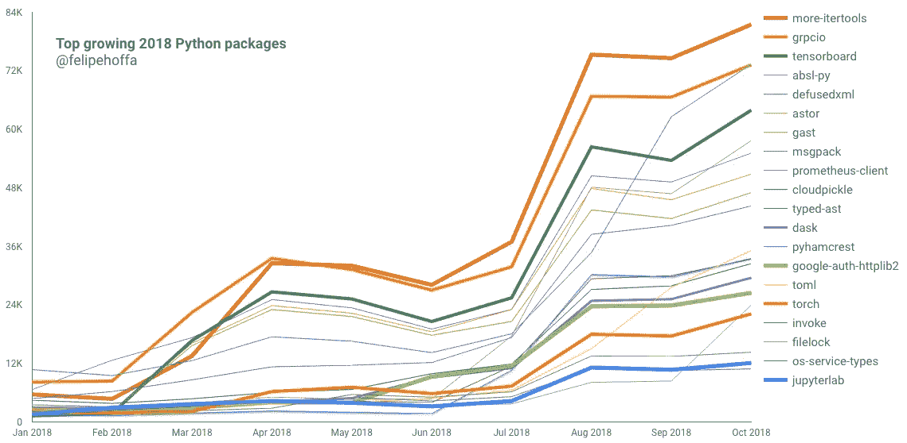
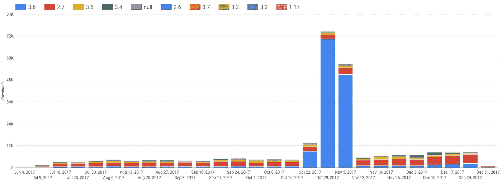
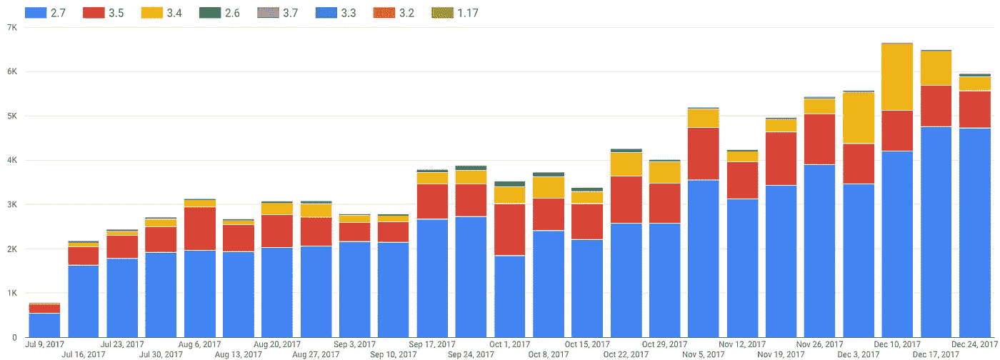
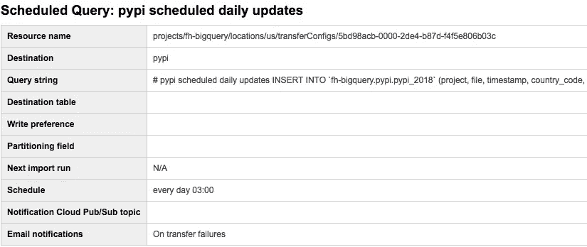

# BigQuery 中的 Python PyPI stats:重新集群

> 原文：<https://towardsdatascience.com/python-pypi-stats-in-bigquery-reclustered-d80e583e1bfe?source=collection_archive---------25----------------------->



Top growing 2018 Python packages ([arbitrary](https://github.com/fhoffa/code_snippets/blob/master/pypi/top_packages_2018.sql) selection and highlights)

## 让我们深入研究 Python 安装活动的原始日志。在这篇文章中，我们将看到如何测量一个包的流行度，哪个 Python 版本使用它，以及如何充分利用我们的查询。

Python 软件基金会为 Python 包索引中的每次下载提供原始元数据，包括从`pip install`开始的活动。现在，任何人都可以使用他们的[免费的每月万亿字节的 BigQuery 分析](https://cloud.google.com/bigquery/docs/sandbox)来把握 Python 社区的脉搏，或者只是跟随他们喜欢的项目的趋势。这也是库作者决定他们应该支持什么平台的一个很好的工具。

你可以直接从来源阅读更多关于它的信息[:](https://packaging.python.org/guides/analyzing-pypi-package-downloads/)

 [## 分析 PyPI 包下载——Python 打包用户指南

### 本节将介绍如何使用 PyPI 包数据集来了解关于托管的一个(或多个)包的下载的更多信息…

packaging.python.org](https://packaging.python.org/guides/analyzing-pypi-package-downloads/) 

例如，如果我们想检查 PySpark 自从[holden karau](https://medium.com/u/5e502786e0a2?source=post_page-----d80e583e1bfe--------------------------------)推出以来的受欢迎程度，我们可以这样做:

```
SELECT TIMESTAMP_TRUNC(timestamp, WEEK) week
  , REGEXP_EXTRACT(details.python, r'^\d*\.\d*') python
  , COUNT(*) downloads
FROM `the-psf.pypi.downloads2017*`
WHERE file.project='pyspark'
GROUP BY week, python
ORDER BY week8.4 sec elapsed, 200.88 GB processed # find improvements below
```



PySpark downloads during 2017\. Something seems weird.

在 10 月至 11 月期间，您可以看到一些奇怪的事情发生:Python 3.6 的下载量激增。谁干的？我们不知道——但是使用 BigQuery，我们可以自由地过滤掉这种可疑的活动，以便更好地了解情况:

```
SELECT TIMESTAMP_TRUNC(timestamp, WEEK) week
  , REGEXP_EXTRACT(details.python, r'^\d*\.\d*') python
  , COUNT(*) downloads
FROM `the-psf.pypi.downloads2017*`
WHERE file.project='pyspark'
GROUP BY week, python
HAVING python != '3.6' AND week<'2017-12-30'
ORDER BY week9.0 sec elapsed, 200.88 GB processed # find improvements below
```



PySpark downloads during 2017, excluding Python 3.6.

现在这看起来更好了:一旦我们排除 Python 3.6，我们会看到 PySpark 的健康采用曲线——由 Python 2.7 安装所主导。

这表明，获得原始数据比仅仅预先汇总数据更能让我们的数据更有洞察力。您可能已经注意到，我们每次都必须查询 200GB 的数据——很快就耗尽了我们每月的 1tb 免费查询量。

让我们利用[集群表](https://medium.com/google-cloud/bigquery-optimized-cluster-your-tables-65e2f684594b)的能力来改进这一点。

# 聚集表上的相同查询

让我们重写一个聚集表上的最后一个查询:

```
SELECT TIMESTAMP_TRUNC(timestamp, WEEK) week
  , REGEXP_EXTRACT(details.python, r'^\d*\.\d*') python
  , COUNT(*) downloads
FROM `fh-bigquery.pypi.pypi_2017`
WHERE project='pyspark'
AND timestamp>'2000-01-01' # nag
GROUP BY week, python
HAVING python != '3.6' AND week<'2017-12-30'
ORDER BY week5.4 sec elapsed, 9.65 GB processed # winning
```

这很酷:如果您使用我的集群表而不是现有的官方表，同样的查询将只扫描大约 5%的数据。

注意事项:

*   `FROM `fh-bigquery.pypi.pypi_2017``是您可以找到我的集群表的地方。我每年创造一个。
*   `FROM `fh-bigquery.pypi.pypi_20*``让你年年匹配。
*   `WHERE project=’pyspark'`允许您从集群中受益，集群可以在这些表格中根据项目名称进行修剪。
*   原始表上的`file.project`必须由`project`替换，因为集群不能在嵌套列上工作(还不能)。
*   `timestamp>'2000-01-01'`这是我强有力地提醒您这些是时间分区表的方式。如果您将查询限制在一年中的一段时间内，那么您查询的数据会相应减少——或者您可以从一个非常早的日期开始明确地询问所有数据。
*   `REGEXP_EXTRACT(details.python, r’^\d*\.\d*’)`将 Python 版本保留到最高有效位。
*   这些查询将只与`#standardSQL`一起运行，因为`#legacySQL`不支持集群表。

我说“我的集群表”是因为我提供它们作为一个非官方的地方来获取这些日志，同时我们改进这个过程。根据您的反馈和意见，我们将努力将这些改进整合到官方资料库中。

# 工作日志

## 重新聚类

为了对每年的现有数据进行重新聚类，我做了如下工作:

```
CREATE TABLE `fh-bigquery.pypi.pypi_2017`
PARTITION BY DATE(timestamp)
CLUSTER BY project, country_code
OPTIONS(
   description="repartitioned and clustered from [https://bigquery.cloud.google.com/table/the-psf:pypi.downloads20180906](https://bigquery.cloud.google.com/table/the-psf:pypi.downloads20180906)"
   , require_partition_filter=true
)
AS
SELECT file.project project
  , STRUCT(file.filename, file.type, file.version) file
  , * EXCEPT(file)
FROM `the-psf.pypi.downloads2017*`34 min elapsed, 2.44 TB processed
```

## 每日更新

每天凌晨 3 点，我将运行一个[计划查询](https://cloud.google.com/bigquery/docs/scheduling-queries)，添加前一天的数据:

```
INSERT INTO `fh-bigquery.pypi.pypi_2018` (project, file, timestamp, country_code, url, details, tls_protocol, tls_cipher)SELECT file.project project
  , STRUCT(file.filename, file.type, file.version) file
  , * EXCEPT(file)
FROM `the-psf.pypi.downloads2018*`
WHERE _TABLE_SUFFIX = FORMAT_TIMESTAMP('%m%d', TIMESTAMP_SUB(CURRENT_TIMESTAMP(), INTERVAL 24 HOUR))
AND timestamp > ( # for idempotency
  SELECT MAX(timestamp) 
  FROM `fh-bigquery.pypi.pypi_2018` 
  WHERE timestamp>TIMESTAMP_SUB(CURRENT_TIMESTAMP(), INTERVAL 24*2 HOUR)
)48.9 sec elapsed, 24.83 GB processed
```



Configuring a scheduled query

## 常见问题解答

## BigQuery 说它将处理大量的千兆字节，而我预期的要少一些

使用聚簇表，BigQuery 在运行查询之前给出了最大可计费字节的估计值——但是如果可能的话，查询可能会比这个值小。

一些例子:

```
SELECT *
FROM `fh-bigquery.pypi.pypi_2017`
WHERE timestamp>='2017-12-01'
LIMIT 1# 1.6s elapsed, 28.6 MB processed
# Stops scanning when it finds the first rowSELECT *
FROM `fh-bigquery.pypi.pypi_2017`
WHERE timestamp>='2017-12-01'
AND project='rpy2'
LIMIT 12.0s elapsed, 386 MB processed
# Finds the cluster that contains 'rpy2' and scans thatSELECT *
FROM `fh-bigquery.pypi.pypi_2017`
WHERE timestamp>='2017-12-01'
AND project='88888'
LIMIT 12.4s elapsed, 4.58 GB processed
# Finds the clusters which could contain '88888', but it's not thereSELECT *
FROM `fh-bigquery.pypi.pypi_2017`
WHERE timestamp>='2017-12-01'
AND project LIKE '%random%'
LIMIT 11.8s elapsed, 171 MB processed
# Opens all the clusters, until one contains a *random* projectSELECT *
FROM `fh-bigquery.pypi.pypi_2017`
WHERE timestamp>='2017-12-01'
AND project LIKE '%DOESNT-EXIST%'
LIMIT 12.7s elapsed, 221 GB processed
# Opens all the clusters, and keeps searching for an un-existing pattern
```

# 承认

*   感谢 [Donald Stufft](https://medium.com/u/969ebca04288?source=post_page-----d80e583e1bfe--------------------------------) ，让这一切[成为可能](https://github.com/pypa/linehaul)。
*   欢迎 [di_codes](https://medium.com/u/3c2614279236?source=post_page-----d80e583e1bfe--------------------------------) 加入 GCP 团队。

# 后续步骤

我们应该将这些聚集的表移动到官方回购中，但让我们先讨论它们:

*   Python [distutils-sig@讨论主题](https://mail.python.org/mm3/archives/list/distutils-sig@python.org/thread/DLDRMK33A4MDXSKUU3BDCE5BFYK5G3WA/#DLDRMK33A4MDXSKUU3BDCE5BFYK5G3WA)。

想要更多的故事？查看我的[媒体](http://medium.com/@hoffa/)，[关注我的推特](http://twitter.com/felipehoffa)，订阅 reddit.com/r/bigquery。并且[尝试 big query](https://www.reddit.com/r/bigquery/comments/3dg9le/analyzing_50_billion_wikipedia_pageviews_in_5/)——每个月你都可以从[免费获得一个完整的万亿字节的分析。](https://cloud.google.com/bigquery/docs/sandbox)

[](/these-are-the-real-stack-overflow-trends-use-the-pageviews-c439903cd1a) [## 这些是真正的堆栈溢出趋势:使用页面视图

### 直到今天，获得 Stack Overflow 的季度浏览量并不容易。了解如何获得这些…

towardsdatascience.com](/these-are-the-real-stack-overflow-trends-use-the-pageviews-c439903cd1a)