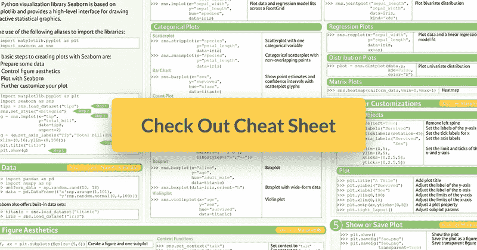

# Python Seaborn 统计数据可视化备忘单

> 原文：<https://towardsdatascience.com/python-seaborn-cheat-sheet-for-statistical-data-visualization-5428d07d2c9b?source=collection_archive---------7----------------------->

您现在很可能已经知道，通过数据可视化完成的数据故事讲述是每个数据科学家的一项基本技能:在您将原始数据转化为理解、见解和知识之后，您还需要将这些发现有效地传达给您的受众。

对于大多数初学者来说，他们使用的第一个 Python 数据可视化库自然是 Matplotlib。这是一个 Python 2D 绘图库，使用户能够制作出版物质量的图形。这是一个相当大的库，当你学习时，一个[备忘单](https://www.datacamp.com/community/blog/python-matplotlib-cheat-sheet)肯定会派上用场，但是当你设法有效地使用这个库时，你也将能够获得洞察力并更好地与其他包一起工作，例如 Pandas，它们打算随着时间的推移与 Matplotlib 建立更多的绘图集成。

您将能够处理的另一个包是 Seaborn，它是 Python 的统计数据可视化库。

DataCamp 为那些准备好开始使用这个数据可视化库的人创建了一个 Seaborn cheat sheet，并提供了一个方便的单页参考。

您将看到这个备忘单向您展示了用 Python 制作漂亮的统计图的五个基本步骤。

**查看信息图** [**此处**](https://s3.amazonaws.com/assets.datacamp.com/blog_assets/Python_Seaborn_Cheat_Sheet.pdf) **。**

本备忘单将带您完成绘制这些图所需的五个步骤:您将看到如何加载数据、设置图形美学、绘制、定制，以及最终使用 Seaborn 显示或保存您的图。

一旦你开始使用这个备忘单，以前看起来很难的事情肯定会变得更加清晰！结合 [Seaborn Gallery](http://seaborn.pydata.org/examples/index.html) 、[文档](http://seaborn.pydata.org/index.html)和我们的[教程](https://www.datacamp.com/community/tutorials/seaborn-python-tutorial)使用。

***此外，不要错过我们的其他数据科学备忘单，包括***[***SciPy***](https://www.datacamp.com/community/blog/python-scipy-cheat-sheet/)***，***[***Numpy***](https://www.datacamp.com/community/blog/python-numpy-cheat-sheet/)***，***[***Scikit-Learn***](https://www.datacamp.com/community/blog/scikit-learn-cheat-sheet/)***，***

*原载于*[*www.datacamp.com*](https://www.datacamp.com/community/blog/seaborn-cheat-sheet-python)*。*