# Python 集和集合论

> 原文：<https://towardsdatascience.com/python-sets-and-set-theory-2ace093d1607?source=collection_archive---------5----------------------->

## 了解 Python 集合:它们是什么，如何创建它们，何时使用它们，内置函数，以及它们与集合论运算的关系。

# 集合与列表和元组

列表和元组是在序列中存储值的标准 Python 数据类型。集合是另一种也存储值的标准 Python 数据类型。主要区别在于，与列表或元组不同，集合不能多次出现相同的元素，也不能存储无序值。

# Python 集合的优势

因为集合不能多次出现相同的元素，所以集合对于有效地从列表或元组中删除重复值以及执行像联合和交集这样的常见数学运算非常有用。

本教程将向您介绍几个关于 Python 集合和集合论的主题:

*   如何初始化空集和有值集？
*   如何在集合中添加和删除值
*   如何有效地将集合用于成员资格测试和从列表中删除重复值等任务。
*   如何执行常见的集合运算，如并集、交集、差集和对称差集。
*   集合和冷冻集合的区别

就这样，让我们开始吧。

# 初始化集合

集合是不同的(唯一的)不可变值的可变集合，这些值是无序的。

您可以使用`set()`初始化空集。

```
emptySet = set()
```

要用值初始化一个集合，您可以向`set()`传递一个列表。

```
dataScientist = set(['Python', 'R', 'SQL', 'Git', 'Tableau', 'SAS']) dataEngineer = set(['Python', 'Java', 'Scala', 'Git', 'SQL', 'Hadoop'])
```

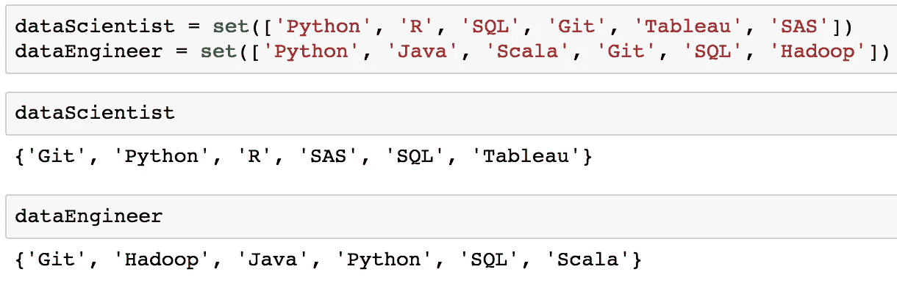

如果您查看上面的 dataScientist 和 dataEngineer 变量的输出，请注意集合中的值没有按照中添加的顺序排列。这是因为集合是无序的。

**包含值**的集合也可以用花括号初始化。

```
dataScientist = {'Python', 'R', 'SQL', 'Git', 'Tableau', 'SAS'} dataEngineer = {'Python', 'Java', 'Scala', 'Git', 'SQL', 'Hadoop'}
```

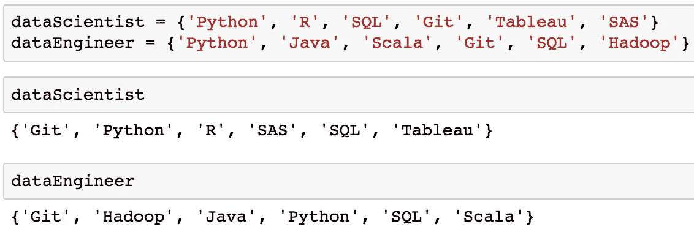

请记住，花括号只能用于初始化包含值的集合。下图显示了使用不带值的花括号是初始化字典而不是集合的方法之一。

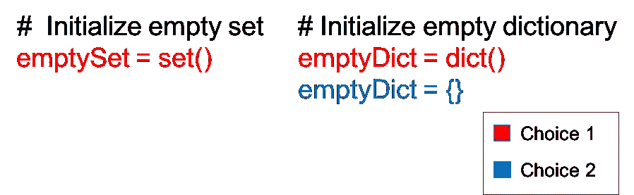

# 添加和删除集合中的值

要在集合中添加或删除值，首先必须初始化集合。

```
# Initialize set with values 
graphicDesigner = {'InDesign', 'Photoshop', 'Acrobat', 'Premiere', 'Bridge'}
```

## 向集合中添加值

您可以使用`add`方法向集合中添加一个值。

```
graphicDesigner.add('Illustrator')
```

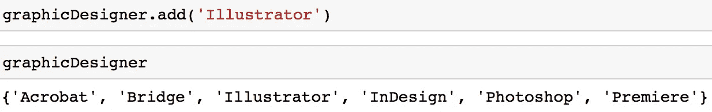

需要注意的是，您只能向集合中添加不可变的值(如字符串或元组)。例如，如果您试图向集合中添加列表，将会得到一个 TypeError。

```
graphicDesigner.add(['Powerpoint', 'Blender'])
```

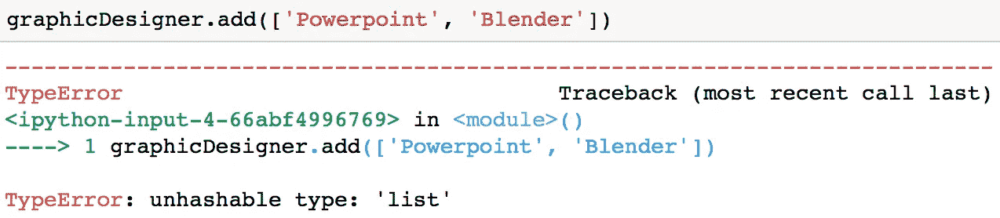

有几种方法可以从集合中删除一个值。

**选项 1:** 您可以使用`remove`方法从集合中删除一个值。

```
graphicDesigner.remove('Illustrator')
```


这种方法的缺点是，如果您试图删除一个不在您的集合中的值，您将得到一个 KeyError。

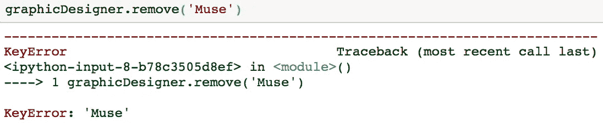

**选项 2:** 您可以使用`discard`方法从集合中移除一个值。

```
graphicDesigner.discard('Premiere')
```


这种方法相对于`remove`方法的好处是，如果您试图删除一个不属于集合的值，您将不会得到一个 KeyError。如果您熟悉字典，您可能会发现这与[字典方法 get](https://hackernoon.com/python-basics-10-dictionaries-and-dictionary-methods-4e9efa70f5b9) 的工作方式类似。

**选项 3:** 您还可以使用`pop`方法来**移除和返回**集合中的任意值。

```
graphicDesigner.pop()
```

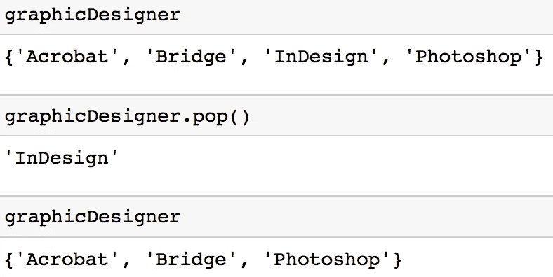

需要注意的是，如果集合为空，该方法会引发一个 KeyError。

# 从集合中删除所有值

您可以使用`clear`方法从集合中移除所有值。

```
graphicDesigner.clear()
```

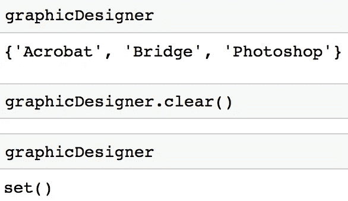

# 遍历一个集合

像许多标准 python 数据类型一样，可以遍历一个集合。

```
# Initialize a set 
dataScientist = {'Python', 'R', 'SQL', 'Git', 'Tableau', 'SAS'} for skill in dataScientist: 
   print(skill)
```

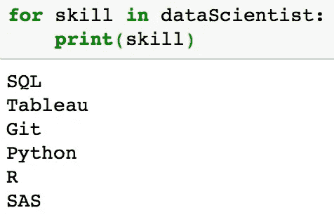

如果您查看在 dataScientist 中打印每个值的输出，请注意，在集合中打印的值没有按照它们被添加的顺序。这是因为集合是无序的。

# 将集合转换为有序值

本教程强调了集合是无序的。如果您发现您需要以有序的形式从集合中获取值，那么您可以使用`sorted`函数，它输出一个有序的列表。

```
type(sorted(dataScientist))
```

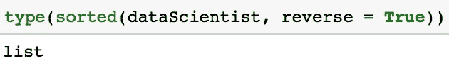

下面的代码按字母降序输出数据集 dataScientist 中的值(本例中为 Z-A)。

```
sorted(dataScientist, reverse = True)
```

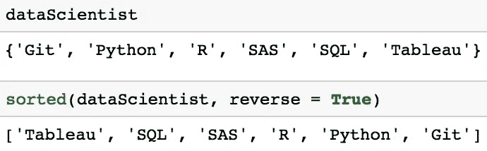

# 从列表中删除重复项

本节的部分内容之前已经在教程 [18 个最常见的 Python 列表问题](https://www.datacamp.com/community/tutorials/18-most-common-python-list-questions-learn-python#question15)中探讨过，但是需要强调的是，集合是从列表中删除重复项的最快方式[。为了说明这一点，让我们研究两种方法之间的性能差异。](https://www.peterbe.com/plog/fastest-way-to-uniquify-a-list-in-python-3.6)

**方法 1:** 使用集合从列表中删除重复项。

```
print(list(set([1, 2, 3, 1, 7])))
```

**方法 2:** 使用列表理解来删除列表中的重复项(如果你想复习列表理解，请参见本[教程](https://www.datacamp.com/community/tutorials/python-list-comprehension))。

```
def remove_duplicates(original):
    unique = []
    [unique.append(n) for n in original if n not in unique]
    return(unique)print(remove_duplicates([1, 2, 3, 1, 7]))
```

可以使用`timeit`库来测量性能差异，该库允许您对 Python 代码计时。下面的代码为每种方法运行代码 10000 次，并以秒为单位输出总时间。

```
import timeit# Approach 1: Execution time 
print(timeit.timeit('list(set([1, 2, 3, 1, 7]))', number=10000))# Approach 2: Execution time
print(timeit.timeit('remove_duplicates([1, 2, 3, 1, 7])', globals=globals(), number=10000))
```

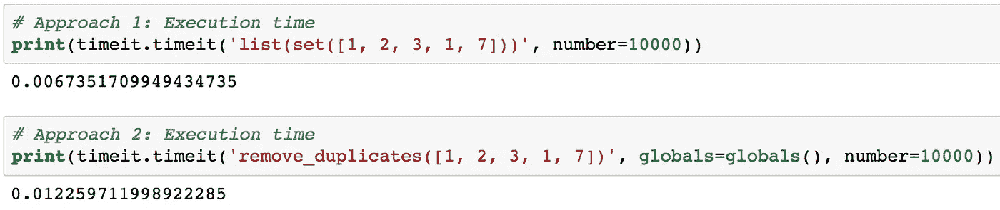

比较这两种方法表明，使用集合来删除重复项更有效。虽然这看起来像是时间上的一个小差异，但是如果你有非常大的列表，它可以节省你很多时间。

# 设置操作方法

Python 中集合的一个常见用途是计算标准数学运算，如并、交、差和对称差。下图显示了两个集合 A 和 b 上的几个标准数学运算。每个维恩图的红色部分是给定集合运算的结果集合。

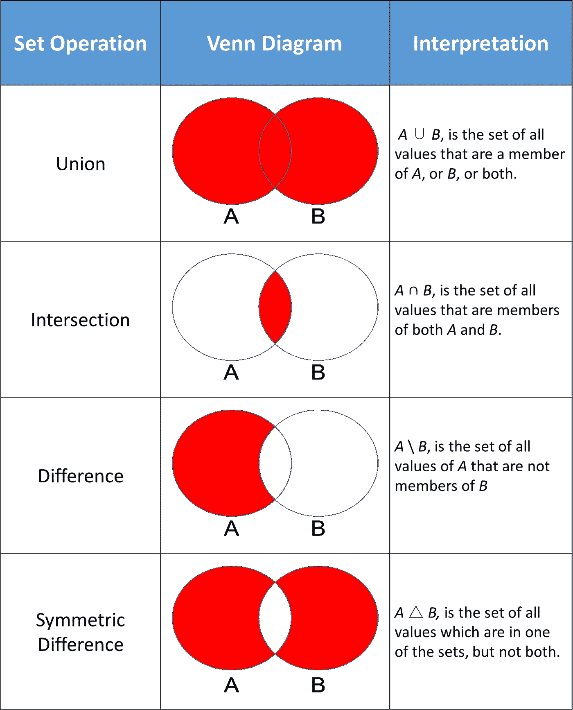

Python 集合提供了允许您执行这些数学运算的方法，以及提供等效结果的运算符。

在探索这些方法之前，让我们从初始化两组数据科学家和数据工程师开始。

```
dataScientist = set(['Python', 'R', 'SQL', 'Git', 'Tableau', 'SAS'])
dataEngineer = set(['Python', 'Java', 'Scala', 'Git', 'SQL', 'Hadoop'])
```

# 联盟

表示为 dataScientist ∪ dataEngineer 的并集是 dataScientist 和/或 dataEngineer 的所有值的集合。您可以使用`union`方法找出两个集合中的所有唯一值。

```
# set built-in function union
dataScientist.union(dataEngineer)# Equivalent Result 
dataScientist | dataEngineer
```

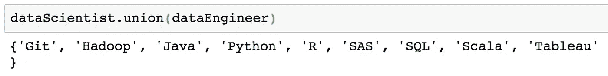

从并集返回的集合可以被可视化为下面维恩图的红色部分。

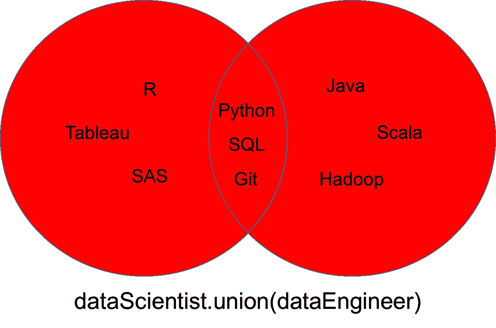

# 交集

两个集合 dataScientist 和 dataEngineer 的交集表示为 dataScientist ∩ dataEngineer，它是 dataScientist 和 dataEngineer 的所有值的集合。

```
# Intersection operation
dataScientist.intersection(dataEngineer)# Equivalent Result
dataScientist & dataEngineer
```

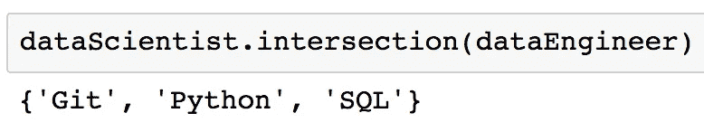

从交集返回的集合可以被可视化为下面维恩图的红色部分。

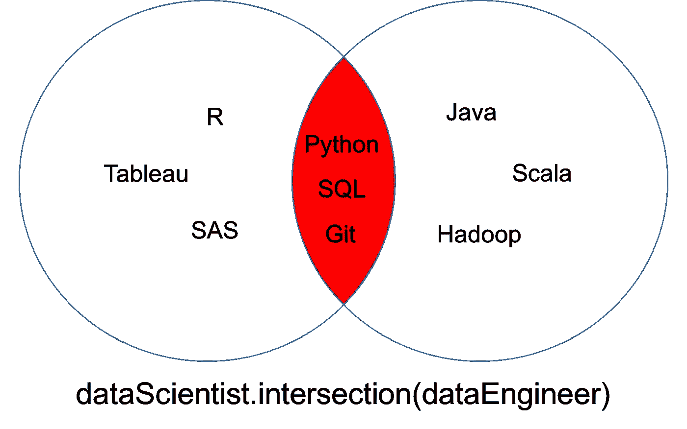

您可能会发现，在这种情况下，您希望确保两个集合没有公共值。换句话说，你希望两个集合的交集是空的。这两个集合称为不相交集合。您可以通过使用`isdisjoint`方法来测试不相交的集合。

```
# Initialize a set
graphicDesigner = {'Illustrator', 'InDesign', 'Photoshop'}# These sets have elements in common so it would return False
dataScientist.isdisjoint(dataEngineer)# These sets have no elements in common so it would return True
dataScientist.isdisjoint(graphicDesigner)
```

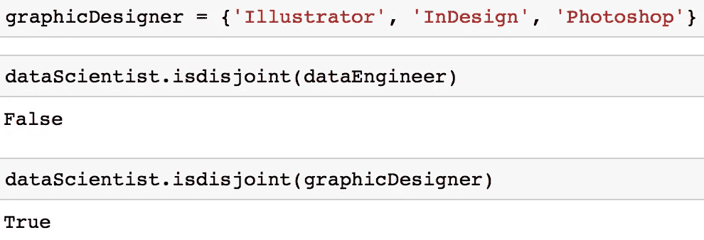

您可以注意到，在下面维恩图所示的交集中，不相交集 dataScientist 和 graphicDesigner 没有共同的值。

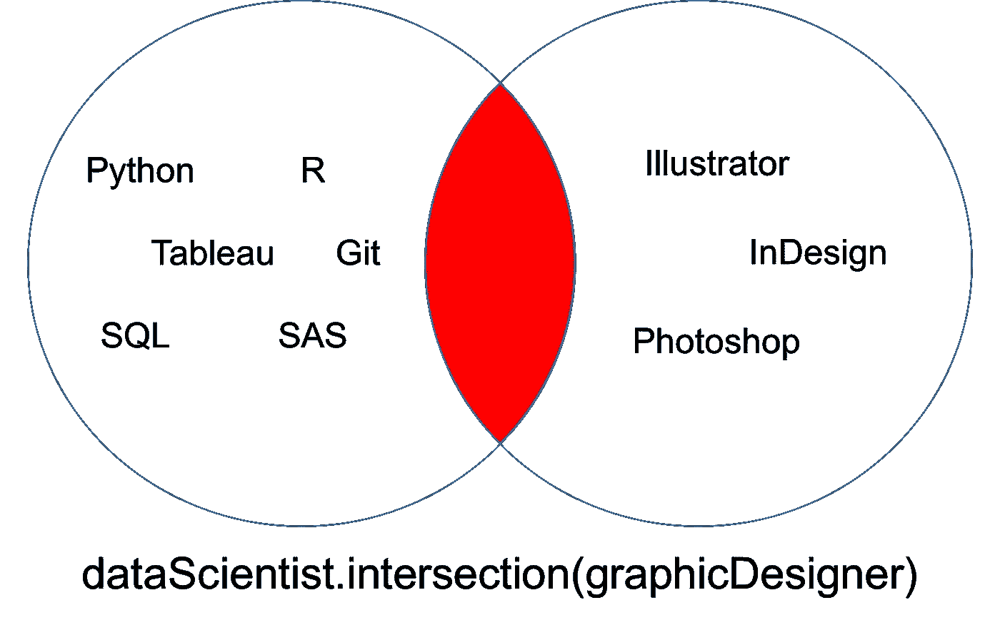

# 差异

两个集合 dataScientist 和 dataEngineer 的差，表示为 dataScientist \ dataEngineer，是 dataScientist 的所有值的集合，这些值不是 dataEngineer 的值。

```
# Difference Operation
dataScientist.difference(dataEngineer)# Equivalent Result
dataScientist - dataEngineer
```

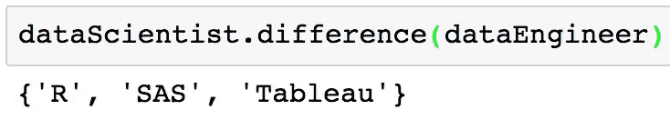

从差异返回的集合可以被可视化为下面维恩图的红色部分。

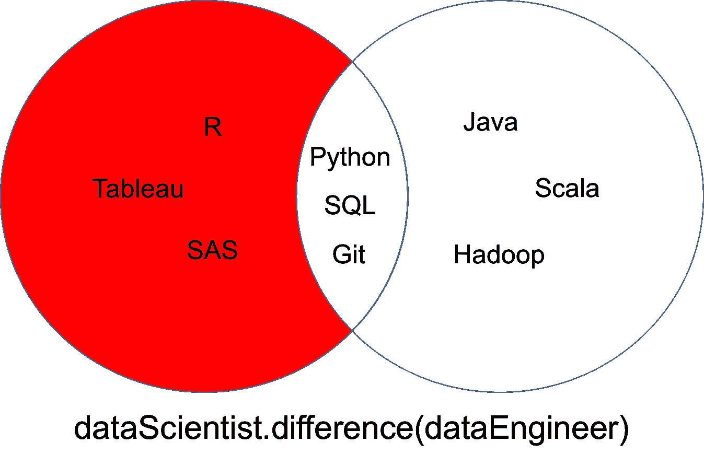

# 对称 _ 差异

两个数据集 dataScientist 和 dataEngineer 的对称差表示为 dataScientist △ dataEngineer，它是恰好是两个集合中一个集合的值而不是两个集合的值的集合。

```
# Symmetric Difference Operation
dataScientist.symmetric_difference(dataEngineer)# Equivalent Result
dataScientist ^ dataEngineer
```

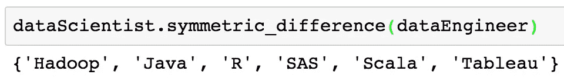

从对称差返回的集合可以被可视化为下面维恩图的红色部分。

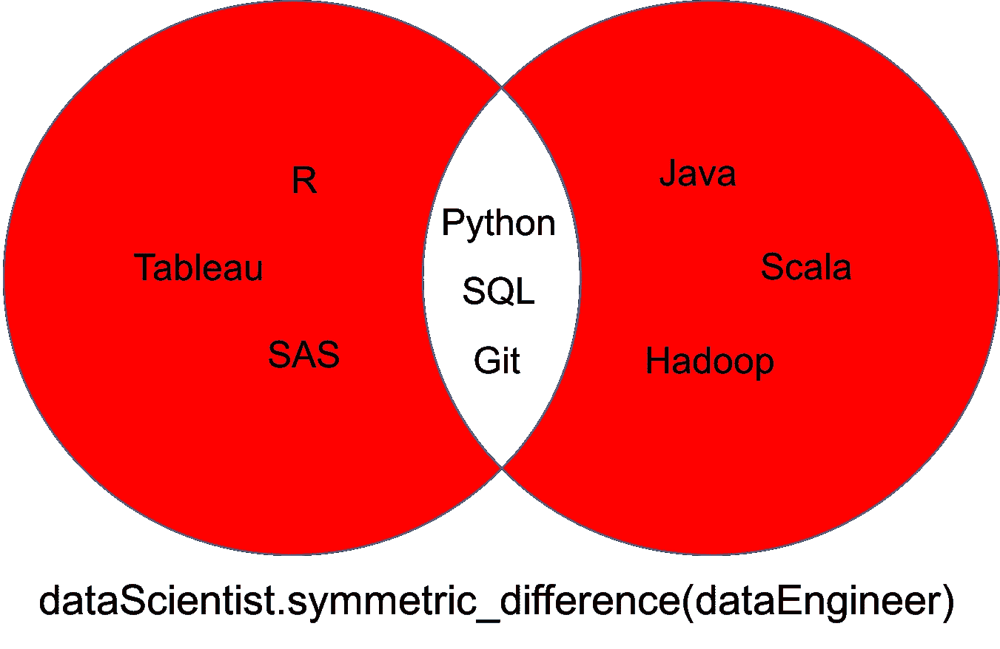

# 集合理解

您可能之前已经了解了[列表理解](https://www.datacamp.com/community/tutorials/python-list-comprehension#plc)、[字典理解](https://www.datacamp.com/community/tutorials/python-dictionary-comprehension)和生成器理解。还有一套理解。集合理解非常相似。Python 中的集合理解可以按如下方式构造:

```
{skill for skill in ['SQL', 'SQL', 'PYTHON', 'PYTHON']}
```

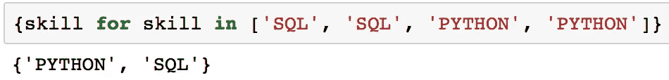

上面的输出是两个值的集合，因为集合不能有相同元素的多次出现。

使用集合理解背后的想法是让你用代码写和推理，就像你用手做数学一样。

```
{skill for skill in ['GIT', 'PYTHON', 'SQL'] if skill not in {'GIT', 'PYTHON', 'JAVA'}}
```

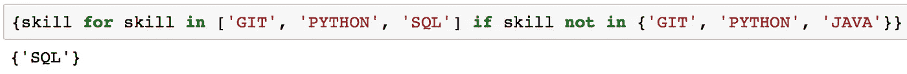

上面的代码类似于您之前了解到的集合差异。只是看起来有点不一样。

# 会员测试

成员资格测试检查特定元素是否包含在序列中，例如字符串、列表、元组或集合。在 Python 中使用集合的一个主要优点是它们为成员测试进行了高度优化。例如，集合比列表更有效地进行成员资格测试。如果你有计算机科学背景，这是因为对于列表，集合中成员测试的平均用例时间复杂度是 O(1)比 O(n)。

下面的代码显示了一个使用列表的成员测试。

```
# Initialize a list
possibleList = ['Python', 'R', 'SQL', 'Git', 'Tableau', 'SAS', 'Java', 'Spark', 'Scala']# Membership test
'Python' in possibleList
```

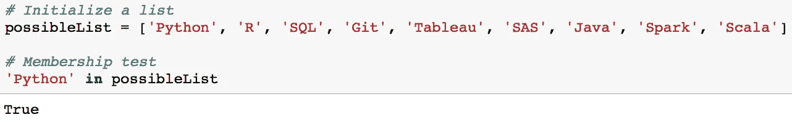

对于器械包也可以做类似的事情。集合只是碰巧更有效率。

```
# Initialize a set
possibleSet = {'Python', 'R', 'SQL', 'Git', 'Tableau', 'SAS', 'Java', 'Spark', 'Scala'}# Membership test
'Python' in possibleSet
```

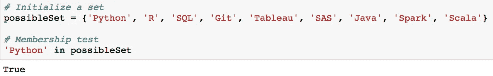

由于`possibleSet`是一个集合，值`'Python'`是`possibleSet`的值，这可以表示为`'Python'` ∈ `possibleSet`。

如果你有一个不属于集合的值，比如`'Fortran'`，它将被表示为`'Fortran'` ∉ `possibleSet`。

## 子集

理解成员关系的一个实际应用是子集。

我们先初始化两组。

```
possibleSkills = {'Python', 'R', 'SQL', 'Git', 'Tableau', 'SAS'} mySkills = {'Python', 'R'}
```

如果集合`mySkills`的每个值也是集合`possibleSkills`的值，那么`mySkills`被称为`possibleSkills`的子集，数学上写成`mySkills` ⊆ `possibleSkills`。

您可以使用`issubset`方法查看一个集合是否是另一个集合的子集。

```
mySkills.issubset(possibleSkills)
```

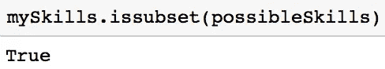

因为该方法在这种情况下返回 True，所以它是一个子集。在下面的维恩图中，注意集合`mySkills`的每个值也是集合`possibleSkills`的值。

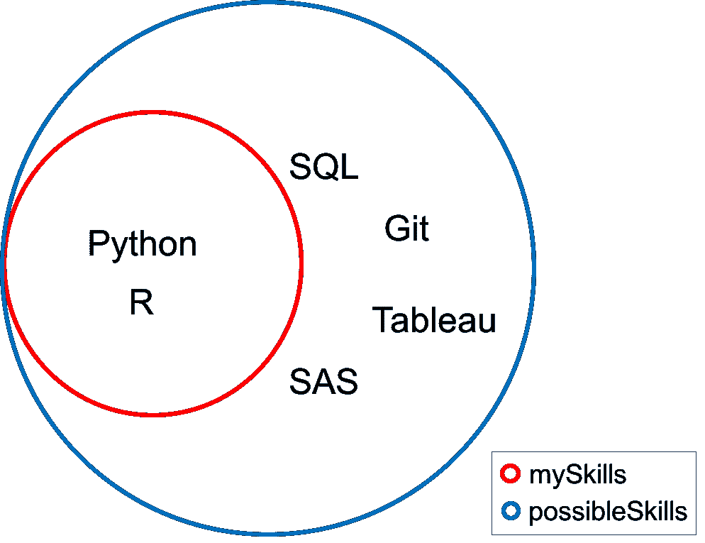

# 冰冻集

您遇到了嵌套列表和元组。

```
# Nested Lists and Tuples
nestedLists = [['the', 12], ['to', 11], ['of', 9], ['and', 7], ['that', 6]]
nestedTuples = (('the', 12), ('to', 11), ('of', 9), ('and', 7), ('that', 6))
```

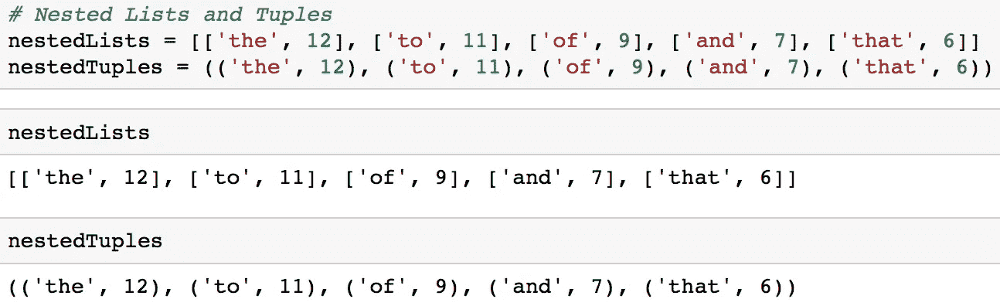

嵌套集合的问题是你通常不能有嵌套集合，因为集合不能包含可变值。

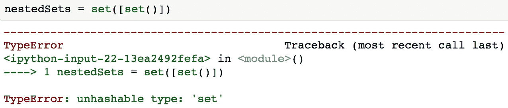

在这种情况下，您可能希望使用冷冻箱。除了 frozenset 是不可变的之外，frozenset 与集合非常相似。

你可以用`frozenset()`制作一个冰冻人。

```
# Initialize a frozenset
immutableSet = frozenset()
```

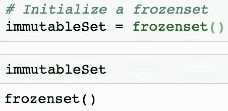

如果您使用类似下面代码的 frozenset，您可以创建一个嵌套集。

```
nestedSets = set([frozenset()])
```

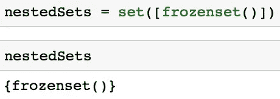

重要的是要记住，frozenset 的一个主要缺点是，由于它们是不可变的，这意味着您不能添加或删除值。

# 结论

Python 集合对于从列表等集合中有效移除重复值以及执行联合和交集等常见数学运算非常有用。人们经常遇到的一些挑战是何时使用各种数据类型。例如，如果你觉得不确定什么时候使用字典比使用字典更有利，我鼓励你去看看 DataCamp 的[日常练习模式](https://www.datacamp.com/community/blog/introducing-daily-practice-mode)。如果您对本教程有任何问题或想法，请在下面的评论中或通过 [Twitter](https://twitter.com/GalarnykMichael) 联系我们。

*最初发表于*[*www.datacamp.com*](https://www.datacamp.com/community/tutorials/sets-in-python)*。*