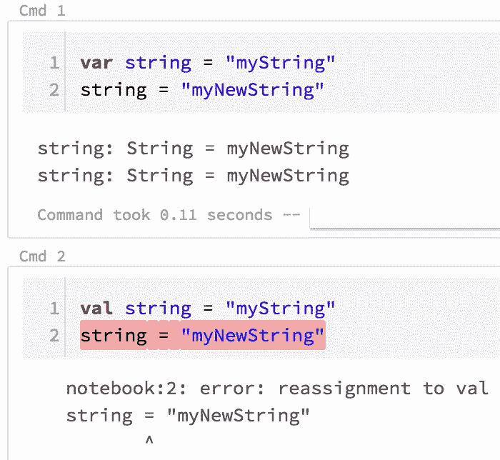
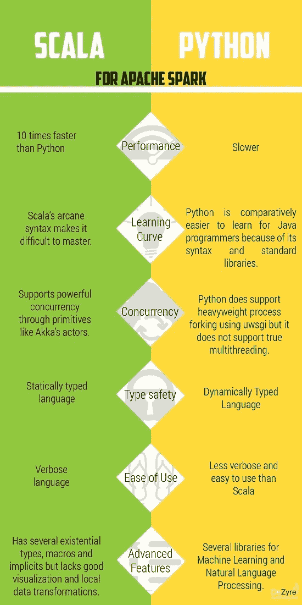

# Python 与 Scala:基本命令的比较(第一部分)

> 原文：<https://towardsdatascience.com/python-vs-scala-a-comparison-of-the-basic-commands-fae23b3ede23?source=collection_archive---------3----------------------->


“MacBook Pro on brown wooden table” by [Max Nelson](https://unsplash.com/@maxcodes?utm_source=medium&utm_medium=referral) on [Unsplash](https://unsplash.com?utm_source=medium&utm_medium=referral)

我最近开始玩一点 Scala，我不得不说这是一种创伤。我**喜欢**学习新事物，但在用 Python 编程数月后，在解决数据科学问题时将它放在一边并切换模式是不自然的。在学习一门新语言的时候，不管是编码还是口语，出现这种情况是很正常的。我们倾向于用我们知道的东西来填补我们不知道的东西的空白，即使它们不属于我们试图写/说的语言！当试图学习一门新语言时，完全被你想学的语言所包围是很重要的，但首先，在已知语言和新语言之间建立良好的平行关系是很重要的，至少在开始时是如此。这对我很有用，我是一个双语的人，在成年后很快就学会了第二语言。一开始，我需要意大利语(我所知道的语言)和英语(我正在学习的语言)之间的联系，但是随着我的英语越来越流利，我开始忘记平行关系，因为这变得很自然，我不再需要先在脑子里翻译它了。事实上，我决定写这篇文章的原因是为了在 Python 和 Scala 之间建立并行性，对于像我一样精通其中一种，并开始学习另一种的人来说。

我最初是想把重点放在熊猫/Sklearn 和 Spark 上，但我意识到，不先把基础打好，意义不大。这就是为什么在这篇文章中，我们将看看 Python 和 Scala 的基础知识:如何处理字符串、列表、字典等等。我打算在不久的将来发表第二部分，其中我将介绍如何用两种语言处理数据帧和构建预测模型。

# 1.重要的事情先来

第一个区别是当编码是这两种语言时使用的约定:如果你不遵循它，这不会抛出一个错误或任何类似的东西，但它只是一个编码者遵循的非书面规则。

当定义一个新的变量、函数或其他东西时，我们总是选择一个对我们有意义的名字，这个名字很可能由两个或更多的单词组成。如果是这种情况，在 Python 中我们将使用`snake_case`，而在 Scala 中`camelCase`:差别是显而易见的。在蛇的情况下，所有的单词都是小写的，我们使用`_`来分隔它们，在骆驼的情况下没有分隔，除了第一个单词，所有的单词都是大写的。

另一个显著的区别是我们如何定义两种语言中的变量。在 Python 中，我们只需创建一个名称，并将其赋给我们需要的值，而在 Scala 中，我们需要指定我们是在定义一个变量还是一个值，我们通过在名称前分别放置`var`或`val`来做到这一点(注意，无论我们是在赋数值还是字符串，这都是有效的)。



Initializing values and variables in Scala.

`var`和`val`的区别很简单:变量可以修改，而值不能。在图中所示的例子中，我实例化了一个`var`字符串，然后将其更改为:all good。然后，我将同一个字符串赋给了一个`val`，并试图再次改变它:不可行。

在 Python 中，不需要指定:如果你想改变你之前分配的东西，这取决于你。在 Python 的情况下，我只需要做`string = 'my_string'`。

另一个普遍的区别是关于注释。在 Python 中，只有一种方法可以做到这一点，不管是单行还是多行，那就是在每一行的注释前加一个`#`:

`# this is a commented line in Python`

Scala 提供了两种注释方式，要么将`//`放在每一行，要么将注释放在`/*`和`*/`之间:

```
// this is a commented line in Scala
/* and this is a multiline comment, still in Scala...
...just choose! */
```

现在，非常基础的解释，让我们看看潜水更深。

# 2.列表和数组

list(Python 中的)或 Array(Scala 中的)是最重要的对象:它们可以包含字符串和/或数字，我们可以操作它们，遍历它们，添加或减去元素等等。它们基本上可以服务于任何目的，我不认为我曾经不使用它们编码过任何东西，所以让我们看看我们可以用它们做什么，以及如何做。

## 2.1.规定

让我们创建一个包含数字和字符串混合的列表。

`my_list = [2, 5, 'apple', 78] **# Python**`

```
var myArray = Array(2, 5, "apple", 78) **// Scala**
**/* notice that in Scala I wrapped the string between "", and that is the only way to do it! In python you can use both "" and '' indifferently */**
```

## 2.2.索引

列表和数组都是零索引的，这意味着第一个元素放在索引 0 处。所以，如果我们想提取第二个元素:

`my_list[1] **# Python** uses [] to index`

`myArray(1) **// Scala** uses () to index`

## 2.3.限幅

在这两种语言中，切片时不会计算第二个索引。所以，如果我们想提取前三个元素:

`my_list[0:3] **# Python** slicing works like indexing`

`myArray.slice(0,3) **// Scala** needs the .slice()`

## 2.4.检查第一个、最后一个、最大和最小元素

```
**# Python**my_list[0]     # first element
my_list[-1]    # last element
max(my_list)   # maximum element
min(my_list)   # minimum element# NOTE: min() and max() will work exclusively if the list contains 
# numbers only!**// Scala**myArray.head    // first element
myArray(0)      // other way to check the first element
myArray.last    // last element
myArray.max     // maximum element
myArray.min     // minimum element/* NOTE: .min and .max will work exclusively if the array contains numbers only!*/
```

## 2.5.总和与乘积

对于 min 和 max，只有当列表/数组只包含数字时，才支持这些操作。此外，为了将 Python 列表中的所有元素相乘，我们需要建立一个`for`循环，这将在本文中进一步讨论。与 Scala 不同，它没有预加载的功能。

`sum(my_list) # summing elements in **Python**'s list`

```
// **Scala**
myArray.sum   // summing elements in array
myArray.product  // multiplying elements in array
```

## 2.6.添加元素

列表和数组是没有顺序的，所以通常的做法是在末尾添加元素。假设我们想要添加字符串`"last words"`:

`my_list.append('last words') # adding at the end of **Python**'s list`

`myArray :+= "last words" // adding at the end of **Scala**'s array`

如果出于某种原因，我们想在最开始添加一些东西，就说数字`99`:

```
my_list.insert(0, 99) # this is a generic method in **Python**. The 
# first number you specify in the parenthesis is the index of the 
# position where you want to add the element.
# 0 means that you want the element to be added at the very 
# beginningmyArray +:= 99 /* adding an element at the beginning of **Scala**'s array */
```

# 3.打印

这也是我们在编码时一直使用的东西，幸运的是这两种语言之间只有一点点差别。

`print("whatever you want") # printing in **Python**`

`println("whatever you want") // printing in **Scala**`

# 4.For 循环

这里有一些不同:Python 需要缩进来创建语句后的块和冒号，而 Scala 需要括号中的 for 条件，以及不需要缩进的花括号中的块。尽管如此，我还是喜欢使用缩进，它让代码看起来更整洁。

```
# for loop in **Python**
for i in my_list:
    print(i)// for loop in **Scala**
for (i <- myArray){
    println(i)
}
```

# 5.映射和/或过滤

在 Python 中，所有的事情都可以通过使用列表理解来完成。在 Scala 中，我们将不得不使用函数。

## 5.1.绘图

假设我们有一个只有数值的列表/数组，我们想把它们都增加三倍。

`[i*3 for i in my_list] # mapping in **Python**`

`myArray.map(i => i*3) // mapping in **Scala**`

## 5.2.过滤

假设我们有一个只有数值的列表/数组，我们想只过滤那些能被 3 整除的数值。

`[i for i in my_list if i%3 == 0] # filtering in **Python**`

`myArray.filter(i => i%3 == 0) // filtering in **Scala**`

## 5.3.过滤和映射

如果我们想找到偶数并且只将它们乘以 3 呢？

`[i*3 for i in my_list if i%2 == 0] # **Python**`

`myArray.filter(i => i%2 == 0).map(i => i*3) // **Scala**`

# 6.字典/地图

虽然它们在两种语言中的名称不同，但它们完全是一回事。它们都有`keys`，我们给它们赋值`values`。

## 6.1.创建字典/地图

让我们创建一个存储我的名、姓和年龄的数据库，并假设我 18 岁。

```
# **Python**
my_dict = {
'first_name': 'Emma',
'last_name': 'Grimaldi',
'age': 18
}
```

在 Scala 中，我们可以用两种不同的方式做到这一点。

```
// **Scala** mode 1
var myMap = (
"firstName" -> "Emma",
"lastName" -> "Grimaldi",
"age" -> 18
)// Scala mode 2
var myMap = (
("firstName", "Emma"),
("lastName", "Grimaldi"),
("age", 18)
)
```

## 6.2.添加到字典/地图

让我们把我的原籍国加入我的字典/地图。

`my_dict['country_of_origin'] = 'Italy' # creating new key in **Python**`

`myMap += ("countryOfOrigin" -> "Italy") /* creating new key in **Scala** */`

## 6.3.索引

这与索引列表/数组的工作方式相同，但是我们使用的是键，而不是位置。如果我想看我的名字:

```
# **Python**
my_dict['first_name']// **Scala**
myMap("firstName")
```

## 6.4.环

如果我们想打印字典/映射，在这两种情况下，我们都必须通过键和值进行 for 循环。

```
# Python
for key, value in my_dict.items():
    print(key)
    print(value)// Scala
for ((key, value) <- myMap){
    println(key)
    println(value)
}
```

# 7.元组

是的，它们在两种语言中的叫法是一样的！但是，虽然它们在 Python 中是零索引，但在 Scala 中却不是。让我们创建一个元组`(1, 2, 3)`，然后调用第一个值。

```
# Python
my_tup = (1, 2, 3)
my_tup[0]
# the indexing is the same as lists// Scala
myTup = (1, 2, 3)
myTup._1
// the indexing is way different than arrays!
```

# 8.设置

是的，另一个共同的名字！在下面的两个例子中，集合将只包含`1, 3, 5`，因为集合不接受副本。

`my_set = {1, 3, 5, 1} # in **Python**, sets are defined by curly braces`

`mySet = Set(1, 3, 5, 1) // **Scala**`

# 9.功能

到目前为止，我们已经做了很多，如果你成功了，做得很好！这是这篇文章的最后一段，幸运的是在 Python 和 Scala 之间定义函数并没有太大的不同。它们都以`def`开头，而前者需要一个`return`语句，后者不需要。另一方面，Scala 想知道我们将要输入和输出什么类型的变量，而 Python 并不关心。让我们编写一个非常简单的函数，它接受一个字符串作为输入，并返回前 5 个字符。

```
# **Python**
def chop_string(input_string):
    return input_string[0:5]
```

缩进在 Python 中也很重要，否则函数将不起作用。Scala 只是喜欢它的花括号。

```
// **Scala**
def chopString(inputString: String): String = {
    inputString.slice(0, 5)
}
```

就是这样！我希望这对那些刚刚开始熟悉 Python 或 Scala 的人有所帮助。下一步将构建类似的指南，探索熊猫/sklearn 和 sparks 的不同之处，期待！我希望你也一样！

如果你想知道为什么应该使用 Python 而不是 Scala，或者反之亦然，我发现下面的图片非常有助于澄清两者之间的直接差异。



[source link](https://www.kdnuggets.com/2018/05/apache-spark-python-scala.html)


请随意查看:

[本帖第二部分](https://medium.com/@emmagrimaldi/python-pandas-vs-scala-how-to-handle-dataframes-part-ii-d3e5efe8287d)

我的其他媒体帖子。

[我的 LinkedIn 个人资料。](https://www.linkedin.com/in/emmagrimaldi/)

**感谢您的阅读！**