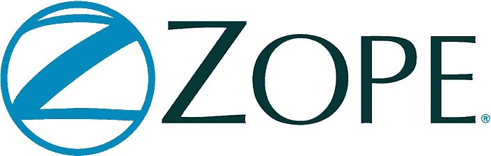
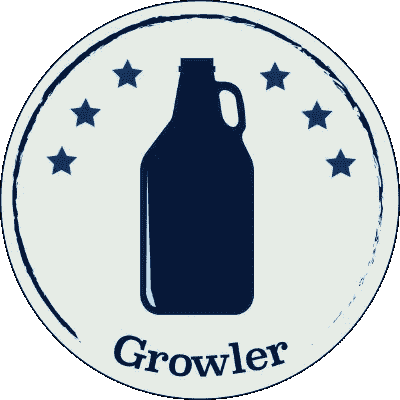

# Python Web 框架-Python 中 Web 框架的详细列表

> 原文：<https://towardsdatascience.com/python-web-framework-a-detailed-list-of-web-frameworks-in-python-1916d3c6222d?source=collection_archive---------3----------------------->

*Python Web Framework — A Detailed List of Web Frameworks in Python*

# 什么是 Python Web 框架？

Python Web framework 是允许开发人员编写 Web 应用程序或服务的包或模块的集合。有了它，开发人员不需要处理像协议、套接字或进程/线程管理这样的底层细节。

Python web 框架将帮助您:

*   解释请求(获取表单参数，处理 cookies 和会话，..)
*   产生响应(以 HTML 或其他格式呈现数据，..)
*   持久存储数据(和其他东西)

现在，让我们看看最有用和最著名的 Python web 框架，来帮助您进行 web 开发。

学习: [Python 元组 vs 列表——列表和元组的比较](https://data-flair.training/blogs/python-tuples-vs-lists/)

# Python 全栈框架

Python 中的全栈框架试图为应用程序提供完整的解决方案。它试图为堆栈中的每一层提供组件。

# a.姜戈

Django Python 是为有期限的完美主义者设计的框架。有了它，你可以用更少的时间和代码构建更好的 Web 应用。Django 以专注于自动化而闻名。它还信奉干(不要重复自己)原则。

Django 最初是为内容管理系统开发的，但是现在被用于多种 web 应用程序。这是因为它的模板、自动数据库生成、DB 访问层和自动管理界面生成。它还提供了一个用于开发的 web 服务器。

使用 Django Python 的大公司有- Instagram、Pinterest、Disqus、Mozilla、华盛顿时报和 Bitbucket。事实上，当我们想到“框架”和“Python”这两个术语时，首先想到的是 Django。
我们将在下一课看到更多关于姜戈的内容。

# b.涡轮齿轮

*Python TurboGears — Python Web 框架*

使用 TurboGears，您可以在几分钟内创建一个数据库驱动的、可扩展的应用程序。

它是一个带有 ORM 的 MVC web 框架，具有真正的多数据库支持和对水平数据分区的支持。它还有一个小部件系统来简化 AJAX 应用程序的开发。你可以另外安装它的模板引擎 Kajiki。

了解:[如何在 Windows 上安装 Python](https://data-flair.training/blogs/install-hadoop-windows/)

TurboGears 是一个微框架和全栈解决方案。它的 PyPI 包叫做 tg.devtools。

# c.web2py

*Python Web 框架— Python web2py*

使用 web2py，您可以通过提供的 web 界面开发、部署、调试、测试、管理数据库和维护应用程序。它没有配置文件，你甚至可以从 USB 驱动器上运行它。

web2py 使用 MVC 内置的票务系统来管理错误。

# d.立方体网络

CubicWeb 是一个语义 Web 应用框架，它以查询语言和选择+查看机制为特色。它还具有多个数据库、安全性、工作流和可重用组件。

# e.姜戈-霍索奇

Django-hotsauce 是一个通用的 web 工具包，位于 Django 和其他框架之上。它是一个交互式 Pythonic API，允许您使用 WSGI 1.0 规范创建可伸缩的 web 应用程序。它还为 Schevo DBMS、Durus、ZODB 和 Authkit 项目提供了本机绑定。

学习:[2018 年我应该学习 Python 的 7 个理由](https://data-flair.training/blogs/reasons-why-should-i-learn-python/)

# f.乔托

一个严格的 MVC 框架，严格分离模型、视图和控制器元素，Giotto 确保设计者、Web 开发者和系统管理员可以独立工作。它还包括控制器模块，允许您在 web、irc 或命令行上构建应用程序。这些都是最流行的 Python web 框架。

# g.神交

Grok 构建在现有的 Zope 3 库之上。它旨在通过强调约定胜于配置和 DRY(不要重复自己)来提供更容易的学习曲线和更敏捷的开发体验。

# h.塔架

*Python Web Framework — Python Pylons*

Pylons 是一个轻量级 Web 框架，旨在实现灵活性和快速开发。它结合了 Ruby、Python 和 Perl 的最佳思想，形成了一个结构化但极其灵活的 Python Web 框架。有了 Pylons，Web 开发变得快速、灵活和容易。塔是建立在粘贴的顶部。但在与金字塔合并形成塔项目后，它处于仅维护状态。

# 一.里尔

可以使用 Reahl 用纯 Python 开发 web 应用。但是，您可以使用常规 Python 代码来使用、定制或编写小部件。这些小部件描述了特定的服务器端和客户端行为。

# j.喘息网

Wheezy 是一个轻量级、高性能和高并发性的 WSGI web 框架。它的主要特性包括路由、模型更新/验证、身份验证/授权、具有依赖性的内容缓存、中间件等等。有了这些，我们就能建立现代、高效的网络。

# k.Zope2

*Python Web Framework — Python Zope*

Zope2 是 Python web 框架的鼻祖，它是一个网络家族。它是一个 web 框架和通用应用服务器。今天，它主要用于 CMS。我们还有 Zope3，它是一个独立的框架和相关库的集合。

# 长度龙卷风

*Python Web Framework — Tornado*

虽然 Tornado 并不出名，但它在非阻塞 I/O 方面非常出色。您可以扩展它来处理数万个开放连接。它为长轮询、WebSockets 和其他需要持续连接的应用提供了一个完美的框架。官方上，Tornado 只支持 Linux 和 BSD OS (Windows 和 Mac OS X-仅用于开发)。Tornado 起源于 FriendFeed 项目，现在属于脸书。

# Python 中的非全栈框架

Python 非全栈框架将提供基础应用服务器。这要么作为它自己的独立进程在 Apache 上运行，要么在其他环境中运行。我们来看看最受欢迎的。

# a.蟒蛇瓶

Bottle 是一个简单快速的微框架，可以用来创建小型 Web 应用程序。它提供带有 URL 参数支持、模板、键/值数据库和内置 HTTP 服务器的请求调度路由。它还为第三方 WSGI/HTTP-server 和模板引擎提供了适配器。这些都在一个文件中；除了 Python 标准库之外，没有任何依赖关系。

# b.樱桃派

*Python Web Framework — Python CherryPy*

这是一个 pythonic 化的、面向对象的 HTTP 框架。CherryPy 支持的 web 应用程序是一个独立的 Python 应用程序，它嵌入了自己的多线程 web 服务器。在某种程度上，CherryPy 是程序员和问题之间的一种方式。它还支持各种 web 服务器，如 Apache、IIS 等。CherryPy 将允许您一次启动多个 HTTP 服务器。

# c.蟒蛇皮烧瓶

*Python Web 框架— Python Flask*

就像我们之前说过的，Flask 是 Python 的一个微框架。它包括一个内置的开发服务器和单元测试支持。它还完全支持 Unicode，支持 RESTful 请求调度和 WSGI 遵从性。

学习: [Python 正则表达式](https://data-flair.training/blogs/python-regex-tutorial/)

当你想开发小而简单的应用程序时，Flask 会很有用。有了它，您可以随心所欲地操作您的数据库——使用 SQLAlchemy 或其他任何东西。LinkedIn 和 Pinterest 使用 goof Flask 就是一个例子。

# d.紧抱

*Python Web Framework — Python Hug*

Hug 是 Python 最快的 web 框架之一。有了它，您可以构建 API。它支持几个 API 版本、自动 API 文档和注释驱动的验证。它构建在另一个 JSON 框架 Falcon 之上。

# e.金字塔

*Python Web Framework — pyramid-positive*

与我们目前讨论的一些不同，Pyramid 是大型应用程序的框架。它是灵活的；金字塔 web 应用程序从单个文件模块开始，并演变成一个雄心勃勃的项目。你可以说它使现实世界的 Web 应用程序开发和部署变得更加有趣、可预测和高效。实际上，金字塔是一个塔架项目。

# f.信天翁

它是一个小型、灵活的 Python 工具包，允许您开发高度有状态的 Web 应用程序。Albatross 部署到 CGI、FastCGI 和 ModPython 服务器。

# g.电路

Circuits 很像 CherryPy，但它是开发独立多进程应用程序的高效 web 框架。它支持并发、异步 I/O 组件，并且是事件驱动的。

# h.猎鹰

*Python Web Framework — Python Falcon*

Falcon 是一个面向小型应用程序、应用程序后端和高级框架的微框架，它鼓励遵循 REST 的概念。它是 Python 最快的 web 框架之一，被 EMC、Hurricane Electric、OpenStack、Opera Software、Wargaming 和其他公司使用。

# 一.咆哮者

*Python Web Framework — Python Growler*

Growler 构建于 asyncio 之上，灵感来源于 Node.js 的 Connect 和 Express 框架，如果想要 ORM 或者模板化，必须手动安装。它通过中间件链来处理请求。

# j.更多路径

MorePath 是一个灵活的、模型驱动的 web 框架。它支持 REST，关注可重用性和可扩展性。

# k.比重瓶

Pycnic 是 Python 开发 JSON APIs 最快的 web 框架之一。该框架是面向对象的，并针对 JSON APIs 进行了优化。它只包含创建 Web APIs 的工具，这些工具占用的内存更少。

# 长度萨尼奇

*Python Web Framework — Python Sanic*

Sanic 是一个类似烧瓶的框架，但是速度很快。它支持异步请求处理程序，并使代码非阻塞和快速。

这就是 Python Web 框架教程。希望你喜欢我们的解释。

# 结论

这些是 Python web 开发中最著名的 Python Web 框架。你喜欢 python web 开发框架吗？告诉我们，你最喜欢哪一个？或者，如果您对 Python web 框架有任何疑问，请发表评论。