# 带有 Flask 和 Raspberry Pi 的 Python WebServer

> 原文：<https://towardsdatascience.com/python-webserver-with-flask-and-raspberry-pi-398423cc6f5d?source=collection_archive---------0----------------------->

让我们创建一个简单的网络服务器来控制你家里的事情。有很多方法可以做到这一点。例如，在我的教程:[IoT——仅使用 HTML 和 Shell 脚本通过互联网控制 Raspberry Pi 机器人](https://www.hackster.io/mjrobot/iot-raspberry-pi-robot-with-video-streamer-and-pan-tilt-f50e53)中，我们已经探索了如何使用*light tpd web 服务器通过本地网络控制机器人。对于这里的这个项目，我们将使用 [FLASK](http://flask.pocoo.org/) ，一个非常简单和免费的 Python 微框架。有了 Flask，通过互联网控制 Raspberry GPIOs 将变得非常简单。*

> *看完这篇教程，请访问它的续篇:* [*从数据到图形:一个带 Flask 和 SQLite 的 Web Jorney*](https://medium.com/@rovai/from-data-to-graph-a-web-jorney-with-flask-and-sqlite-6c2ec9c0ad0)

# 1.介绍

Flask 被称为微框架，因为它不需要特殊的工具或库。它没有数据库抽象层、表单验证或任何其他组件，而现有的第三方库提供了通用功能。然而，Flask 支持可以添加应用程序特性的扩展，就好像它们是在 Flask 本身中实现的一样。

在本教程中，我们将使用 Raspberry Pi 作为本地 Web 服务器，我们将通过一个简单的网页来控制其 3 个编程为输出的 gpio(充当*致动器*)和监视器 2 个编程为输入的 gpio(*传感器*)。

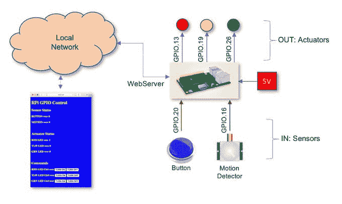

上面的框图显示了我们想要实现的目标

下面的视频可以给出一些提示:

> 请注意，您将在这里学习的使用 Flask 的 Python WebServer 可以直接应用于任何 Linux/OS 机器，并对 Windows PCs 进行一些调整(不幸的是，这不是我的专业领域)。

# 2.安装 FLASK 并设置您的 RPi 服务器

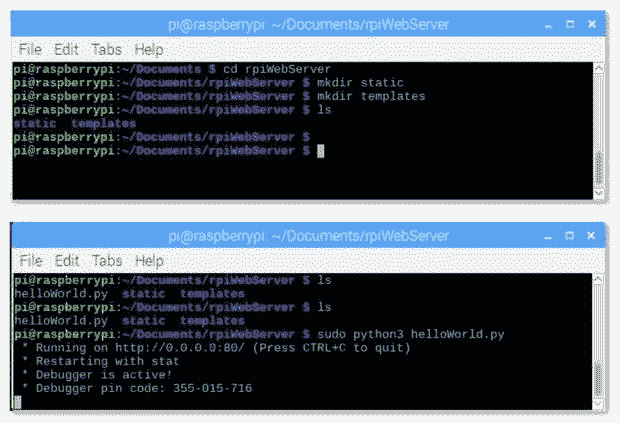

## **砂箱安装**

首先要做的是在你的树莓派上安装 Flask。转到终端并输入:

```
sudo apt-get install python3-flask
```

当你开始一个新项目时，最好是创建一个文件夹来组织你的文件。例如:

```
mkdir rpiWebServer
```

上面的命令将创建一个名为“Server”的文件夹。我们将在那里保存我们的 python 文件(应用程序):

```
/home/pi/Documents/Server
```

在这个文件夹中，让我们创建另外两个子文件夹:*静态*用于 CSS 和最终的 JavaScript 文件，以及*模板*用于 HTML 文件(或者更准确地说，Jinja2 模板。但是不要担心。转到您新创建的文件夹:

```
cd rpiWebServer
```

并创建两个新的子文件夹:

```
mkdir static
```

和

```
mkdir templates
```

最终的文件夹“树”，看起来会像:

```
/rpiWebServer
    /static
    /templates
```

## Python 服务器应用程序

现在，让我们用 Flask 创建我们的第一个 python 服务器:

*   打开你的 Python3 IDE，Thonny 或者 Geany。
*   在您的 IDE 上复制下面的“Hello Word”代码，并将其保存为例如 helloWorld.py

```
from flask import Flask
app = Flask(__name__)
@app.route('/')
def index():
    return 'Hello world'
if __name__ == '__main__':
    app.run(debug=True, port=80, host='0.0.0.0')
```

上述代码的作用是:

1.将 Flask 模块加载到 Python 脚本中:

```
from flask import Flask
```

2.创建名为 app 的 Flask 对象:

```
app = Flask(__name__)
```

3.当有人访问服务器的根 URL ('/')时，运行 index()函数。在这种情况下，只发送文本“Hello World！”通过“返回”到客户的网络浏览器

```
def index():
   return "Hello Word"
```

4.一旦这个脚本从命令行在终端上运行，服务器就开始“监听”端口 80，报告任何错误:

```
if __name__ == '__main__':
   app.run(debug=True, port=80, host='0.0.0.0')
```

## Raspberry PI IP 地址:

如果您不确定您的 RPi IP 地址，请在您的终端上运行:

```
ifconfig
```

在 wlan0: section 你会找到。就我而言:

```
10.0.1.27
```

## 运行应用程序

现在，运行上面的应用程序:

```
sudo python3 helloWorld.py
```

在上面的第一张图片上，你可以看到终端上会出现什么。除非您键入[CTRL] + [C]，否则应用程序将会运行。

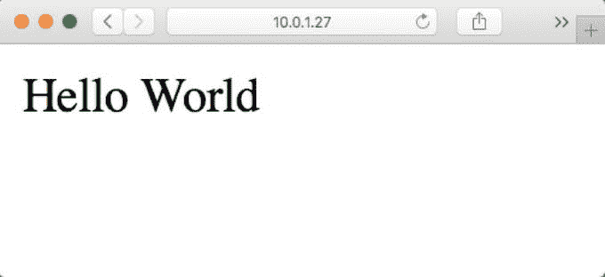

现在，你必须打开与你的树莓连接到同一个 wifi 网络的任何网络浏览器，并键入它的 IP 地址，如上面第二张图片所示。如上图所示,“Hello World”应该会出现在您的浏览器中。

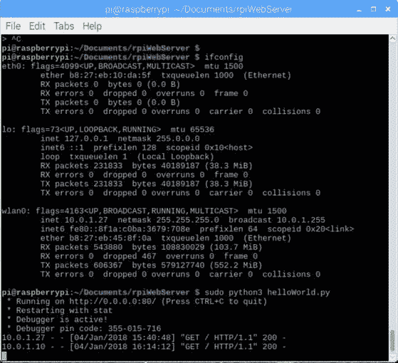

注意上图底部有 2 条线。这几行显示两个不同的 web 浏览器请求了根 URL，我们的服务器返回了 HTTP 状态代码 200 表示“OK”。我在 RPI 本身(10.1.0.27)和我的 Mac (10.1.0.10)上输入了我们的 RPi 服务器地址。对于每个新的请求，只要应用程序正在运行，终端就会出现一个新的行。

# 3.创建合适的服务器网页

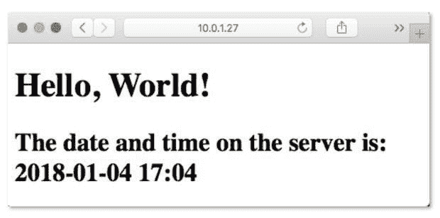

让我们完善我们的“Hello World”应用程序，创建一个 HTML 模板和一个 CSS 文件来设计我们的页面。事实上，这是很重要的，否则，你将会使 Python 脚本变得复杂。

**模板**

创建一个位于“模板”子文件夹中的 HTML 文件，我们可以使用单独的文件，在需要插入动态数据的地方放置占位符。

因此，我们将创建一个名为*index.html*的文件，保存在 */templates* 中。您可以使用任何文本编辑器来创建您的 HTML 文件。可以是 Geany、终端的“nano”或位于“附件”主菜单下的 RPi 文本编辑器(LeafPad)。

> GEANY 可用于同时处理所有项目文件。py；。html 和。css)对于更大更复杂的项目来说，这是一个很好的选择

好了，让我们创建 */templates/index.html* :

```
<!DOCTYPE html>
   <head>
      <title>{{ title }}</title>
   </head>
   <body>
      <h1>Hello, World!</h1>
      <h2>The date and time on the server is: {{ time }}</h2>
   </body>
</html>
```

> *注意，HTML 模板中的* ***双花括号*** *中的任何内容都被解释为一个变量，该变量将通过 render_template 函数从 Python 脚本传递给它。*

现在，让我们创建一个新的 Python 脚本。我们将把它命名为 *helloWorldTemplate.py:*

```
'''
Code created by Matt Richardson 
for details, visit:  http://mattrichardson.com/Raspberry-Pi-Flask/inde...
'''
from flask import Flask, render_template
import datetime
app = Flask(__name__)
@app.route("/")
def hello():
   now = datetime.datetime.now()
   timeString = now.strftime("%Y-%m-%d %H:%M")
   templateData = {
      'title' : 'HELLO!',
      'time': timeString
      }
   return render_template('index.html', **templateData)
if __name__ == "__main__":
   app.run(host='0.0.0.0', port=80, debug=True)
```

注意，我们使用“now”对象中的日期和时间创建了一个格式化的`string("timeString")`，其中存储了当前时间。

在上面的代码中，下一件重要的事情是我们创建了一个变量字典(一组键，比如与值相关联的标题，比如 HELLO！)传递到模板中。在“返回”上，我们将使用*模板数据*字典中的变量将*index.html*模板返回到网络浏览器。

执行 Python 脚本:

```
sudo python3 helloWorldTemplate.py
```

打开任何网络浏览器，输入您的 RPi IP 地址。上图是结果。

> *请注意，每当您使用 Python 脚本传递的实际变量数据刷新页面时，页面的内容都会发生动态变化。在我们的例子中，“标题”是一个固定值，但是“时间”每秒都在改变它。*

现在，让我们在页面上添加一些样式，创建一个 CSS 文件并将其存储在/static/style.css 上:

```
body {
   background: blue;
   color: yellow;
}
```

您还必须修改 index.html 文件，通知它查找 style.css 文件。您可以在“head”处插入“link”:

```
<!DOCTYPE html>
   <head>
      <title>{{ title }}</title>
      <link rel="stylesheet" href="../static/style.css/">
   </head>
   <body>
      <h1>Hello, World!</h1>
      <h2>The date and time on the server is: {{ time }}</h2>
   </body>
</html>
```

> *记住，index.html 在“下”/template，style.css 在“下”/static，所以，注意，你必须告诉 HTML 再次“向上”和“向下”去寻找 static 子文件夹:../static/style . CSS .*

下图是新风格的网页！

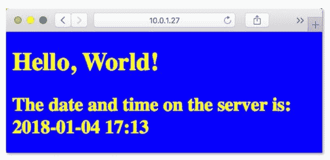

有关 Raspberry Pi 的更详细的 Flask 概述，请访问 Raspberry Pi 组织项目:[python-we b-server-with-Flask](https://projects.raspberrypi.org/en/projects/python-web-server-with-flask)。

# 4.硬件

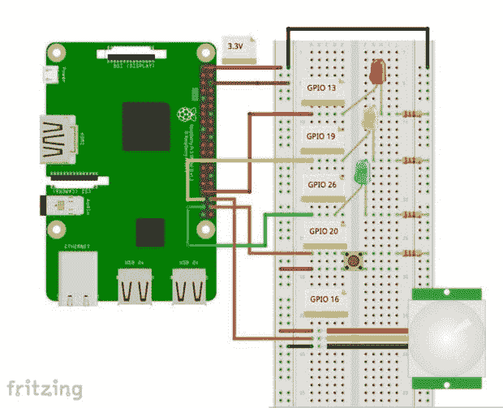

硬件很简单。仅遵循上述电气连接。

# 5.读取 GPIO 状态

现在让我们通过监控它们的 GPIOs 来读取我们的“传感器”的状态。

## **Python 脚本**

让我们创建一个新的 Python 脚本，并将其命名为 app.py:

```
'''
	Raspberry Pi GPIO Status and Control
'''
import RPi.GPIO as GPIO
from flask import Flask, render_template
app = Flask(__name__)
GPIO.setmode(GPIO.BCM)
GPIO.setwarnings(False)
button = 20
senPIR = 16
buttonSts = GPIO.LOW
senPIRSts = GPIO.LOW

# Set button and PIR sensor pins as an input
GPIO.setup(button, GPIO.IN)   
GPIO.setup(senPIR, GPIO.IN)

@app.route("/")
def index():
	# Read Sensors Status
	buttonSts = GPIO.input(button)
	senPIRSts = GPIO.input(senPIR)
	templateData = {
      'title' : 'GPIO input Status!',
      'button'  : buttonSts,
      'senPIR'  : senPIRSts
      }
	return render_template('index.html', **templateData)
if __name__ == "__main__":
   app.run(host='0.0.0.0', port=80, debug=True)
```

注意，我们所做的只是将 GIPOs 20 和 16 定义为输入，读取其值并将其存储在两个变量上:buttonSts 和 *senPIRSts。*在函数 index()中，我们将通过变量字典中的“button”和“senPIR”变量将这些值传递给我们的网页: *templateData。*

*创建 app.py 后，在终端上运行它:*

```
python3 app.py
```

## **模板**

我们还创建一个新的 index.html 来显示两个传感器的 GPIO 状态:

```
<!DOCTYPE html>
   <head>
      <title>{{ title }}</title>
      <link rel="stylesheet" href='../static/style.css'/>
   </head>
   <body>
	  <h1>{{ title }}</h1>
      <h2>Button pressed:  {{ button }}</h1>
      <h2>Motion detected: {{ senPIR }}</h2>
   </body>
</html>
```

> 不要忘记刷新页面以查看结果。

按下按钮或在 PIR 传感器前移动并刷新页面。

图为网页。

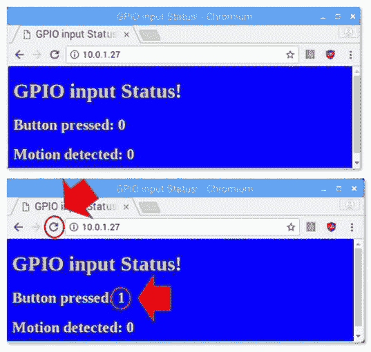

# 6.控制 GPIOs

现在我们知道了如何“读取”GPIO 状态，让我们来改变它们。我们要做的是通过网页“命令”这些“致动器”。我们有 3 个 led 连接到树莓 GPIOs。远程命令他们，我们将改变他们的地位从低到高，反之亦然。例如，我们可以用继电器代替发光二极管来控制你房间的灯和/或风扇。

## **python 脚本**

让我们创建一个新的 Python 脚本，并将其命名为 app.py:

```
'''
	Raspberry Pi GPIO Status and Control
'''
import RPi.GPIO as GPIO
from flask import Flask, render_template, request
app = Flask(__name__)
GPIO.setmode(GPIO.BCM)
GPIO.setwarnings(False)
#define actuators GPIOs
ledRed = 13
ledYlw = 19
ledGrn = 26
#initialize GPIO status variables
ledRedSts = 0
ledYlwSts = 0
ledGrnSts = 0
# Define led pins as output
GPIO.setup(ledRed, GPIO.OUT)   
GPIO.setup(ledYlw, GPIO.OUT) 
GPIO.setup(ledGrn, GPIO.OUT) 
# turn leds OFF 
GPIO.output(ledRed, GPIO.LOW)
GPIO.output(ledYlw, GPIO.LOW)
GPIO.output(ledGrn, GPIO.LOW)

@app.route("/")
def index():
	# Read Sensors Status
	ledRedSts = GPIO.input(ledRed)
	ledYlwSts = GPIO.input(ledYlw)
	ledGrnSts = GPIO.input(ledGrn)
	templateData = {
              'title' : 'GPIO output Status!',
              'ledRed'  : ledRedSts,
              'ledYlw'  : ledYlwSts,
              'ledGrn'  : ledGrnSts,
        }
	return render_template('index.html', **templateData)

@app.route("/<deviceName>/<action>")
def action(deviceName, action):
	if deviceName == 'ledRed':
		actuator = ledRed
	if deviceName == 'ledYlw':
		actuator = ledYlw
	if deviceName == 'ledGrn':
		actuator = ledGrn

	if action == "on":
		GPIO.output(actuator, GPIO.HIGH)
	if action == "off":
		GPIO.output(actuator, GPIO.LOW)

	ledRedSts = GPIO.input(ledRed)
	ledYlwSts = GPIO.input(ledYlw)
	ledGrnSts = GPIO.input(ledGrn)

	templateData = {
              'ledRed'  : ledRedSts,
              'ledYlw'  : ledYlwSts,
              'ledGrn'  : ledGrnSts,
	}
	return render_template('index.html', **templateData)
if __name__ == "__main__":
   app.run(host='0.0.0.0', port=80, debug=True)
```

我们在上述代码中的新内容是新的“路线”:

```
@app.route("/<deviceName>/<action>")
```

在网页上，呼叫将按照以下格式生成:

```
[http://10.0.1.27/ledRed/on](http://10.0.1.27/ledRed/on)
```

或者

```
[http://10.0.1.27/ledRed/off](http://10.0.1.27/ledRed/off)
```

对于上面的例子， *ledRed* 是“设备名称”，而 *on* 或 *off* 是可能的“动作”的例子。

这些路线将被识别并适当地“工作”。主要步骤是:

*   例如，在其等效的 GPIO 引脚上转换字符串“ledRED”。整数变量 ledRed 相当于 GPIO13。我们将把这个值存储在变量“执行器”上
*   对于每个致动器，我们将分析“动作”，或“命令”并正确地动作。例如，如果“action = on ”,我们必须使用命令:GPIO.output(actuator，GPIO。高)
*   更新每个执行器的状态
*   更新变量库
*   把数据还给 index.html

## **模板**

现在让我们创建一个 index.html 来显示每个执行器的 GPIO 状态，更重要的是，创建“按钮”来发送命令:

```
<!DOCTYPE html>
   <head>
      <title>GPIO Control</title>
      <link rel="stylesheet" href='../static/style.css'/>
   </head>
   <body>
		<h1>Actuators</h1>
		<h2> Status </h2>
		<h3> RED LED ==>  {{ ledRed  }}</h3>
		<h3> YLW LED ==>  {{ ledYlw  }}</h3>
		<h3> GRN LED ==>  {{ ledGrn  }}</h3>
		<br>
		<h2> Commands </h2>
		<h3> 
			RED LED Ctrl ==> 
			<a href="/ledRed/on" class="button">TURN ON</a>  
			<a href="/ledRed/off"class="button">TURN OFF</a>
		</h3>
		<h3> 
			YLW LED Ctrl ==> 
			<a href="/ledYlw/on" class="button">TURN ON</a>  
			<a href="/ledYlw/off"class="button">TURN OFF</a>
		</h3>
		<h3> 
			GRN LED Ctrl ==> 
			<a href="/ledGrn/on" class="button">TURN ON</a>  
			<a href="/ledGrn/off"class="button">TURN OFF</a>
		</h3>

   </body>
</html>
```

只为了给一个更好的“伏”，我创建了一个类“按钮”。如果你愿意，你只能保留正常链接。

在 style.css 文件下:

```
body {
	background: blue;
	color: yellow;
}
.button {
  font: bold 15px Arial;
  text-decoration: none;
  background-color: #EEEEEE;
  color: #333333;
  padding: 2px 6px 2px 6px;
  border-top: 1px solid #CCCCCC;
  border-right: 1px solid #333333;
  border-bottom: 1px solid #333333;
  border-left: 1px solid #CCCCCC;
}
```

图为控制我们的执行器的网站。

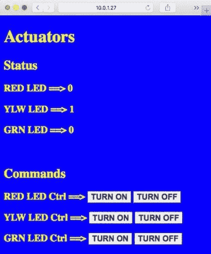

# 7.集成传感器和执行器


现在，我们必须将之前开发的两个部分放在一起。最终的 Python 脚本如下所示:

```
'''
	Raspberry Pi GPIO Status and Control
'''
import RPi.GPIO as GPIO
from flask import Flask, render_template, request
app = Flask(__name__)
GPIO.setmode(GPIO.BCM)
GPIO.setwarnings(False)
#define sensors GPIOs
button = 20
senPIR = 16
#define actuators GPIOs
ledRed = 13
ledYlw = 19
ledGrn = 26
#initialize GPIO status variables
buttonSts = 0
senPIRSts = 0
ledRedSts = 0
ledYlwSts = 0
ledGrnSts = 0
# Define button and PIR sensor pins as an input
GPIO.setup(button, GPIO.IN)   
GPIO.setup(senPIR, GPIO.IN)
# Define led pins as output
GPIO.setup(ledRed, GPIO.OUT)   
GPIO.setup(ledYlw, GPIO.OUT) 
GPIO.setup(ledGrn, GPIO.OUT) 
# turn leds OFF 
GPIO.output(ledRed, GPIO.LOW)
GPIO.output(ledYlw, GPIO.LOW)
GPIO.output(ledGrn, GPIO.LOW)

@app.route("/")
def index():
	# Read GPIO Status
	buttonSts = GPIO.input(button)
	senPIRSts = GPIO.input(senPIR)
	ledRedSts = GPIO.input(ledRed)
	ledYlwSts = GPIO.input(ledYlw)
	ledGrnSts = GPIO.input(ledGrn)
	templateData = {
      		'button'  : buttonSts,
      		'senPIR'  : senPIRSts,
      		'ledRed'  : ledRedSts,
      		'ledYlw'  : ledYlwSts,
      		'ledGrn'  : ledGrnSts,
      	}
	return render_template('index.html', **templateData)

@app.route("/<deviceName>/<action>")
def action(deviceName, action):
	if deviceName == 'ledRed':
		actuator = ledRed
	if deviceName == 'ledYlw':
		actuator = ledYlw
	if deviceName == 'ledGrn':
		actuator = ledGrn

	if action == "on":
		GPIO.output(actuator, GPIO.HIGH)
	if action == "off":
		GPIO.output(actuator, GPIO.LOW)

	buttonSts = GPIO.input(button)
	senPIRSts = GPIO.input(senPIR)
	ledRedSts = GPIO.input(ledRed)
	ledYlwSts = GPIO.input(ledYlw)
	ledGrnSts = GPIO.input(ledGrn)

	templateData = {
	 	'button'  : buttonSts,
      		'senPIR'  : senPIRSts,
      		'ledRed'  : ledRedSts,
      		'ledYlw'  : ledYlwSts,
      		'ledGrn'  : ledGrnSts,
	}
	return render_template('index.html', **templateData)
if __name__ == "__main__":
   app.run(host='0.0.0.0', port=80, debug=True)
```

最后的 index.html:

```
<!DOCTYPE html>
   <head>
      <title>GPIO Control</title>
      <link rel="stylesheet" href='../static/master.css'/>
   </head>
   <body>
		<h1>RPi GPIO Control</h1>
		<h2> Sensor Status </h2>
		<h3> BUTTON ==>  {{ button  }}</h3>
		<h3> MOTION ==>  {{ senPIR  }}</h3>
		<br>

		<h2> Actuator Status </h2>
		<h3> RED LED ==>  {{ ledRed  }}</h3>
		<h3> YLW LED ==>  {{ ledYlw  }}</h3>
		<h3> GRN LED ==>  {{ ledGrn  }}</h3>
		<br>
		<h2> Commands </h2>
		<h3> 
			RED LED Ctrl ==> 
			<a href="/ledRed/on" class="button">TURN ON</a>  
			<a href="/ledRed/off"class="button">TURN OFF</a>
		</h3>
		<h3> 
			YLW LED Ctrl ==> 
			<a href="/ledYlw/on" class="button">TURN ON</a>  
			<a href="/ledYlw/off"class="button">TURN OFF</a>
		</h3>
		<h3> 
			GRN LED Ctrl ==> 
			<a href="/ledGrn/on" class="button">TURN ON</a>  
			<a href="/ledGrn/off"class="button">TURN OFF</a>
		</h3>

   </body>
</html>
```

图为最终的网页。

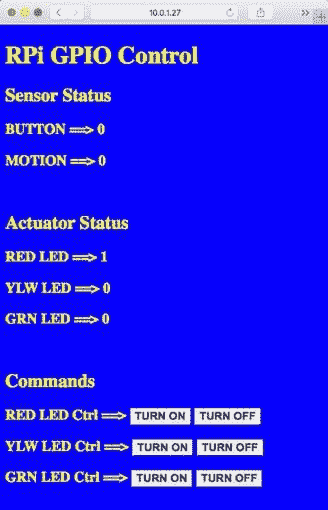

# 8.使用模板更进一步

正如我们之前简单讨论过的， *render_template()函数*调用与 Flask 框架捆绑在一起的 *Jinja2 模板*引擎。Jinja2 用 render_template()调用中提供的参数给出的相应值替换{{ … }}块。

但这并不仅仅是 Jinja2 能做的。例如，模板也支持在块中给出的控制语句。我们可以改变我们的 index.html 模板，以便添加条件语句，根据执行器的实际值来部署特定的按钮。换句话说，“切换”致动器状态。让我们用条件语句重写 index.html 的状态和命令部分:

```
<!DOCTYPE html> 
  <head> 
     <title>GPIO Control</title> 
     <link rel="stylesheet" href='../static/master.css'/> 
  </head> 
  <body> 
		<h1>RPi GPIO Control</h1> 
		<h2> Sensor Status </h2> 
		<h3> BUTTON ==>  {{ button  }}</h3> 
		<h3> MOTION ==>  {{ senPIR  }}</h3> 
		<br> 
		<h2> Actuator Status & Control </h2> 
		<h3> RED LED ==>  {{ ledRed  }}  ==>   
			 
				<a href="/ledRed/off"class="button">TURN OFF</a> 
			 
				<a href="/ledRed/on" class="button">TURN ON</a>  
				 
		</h3> 
		<h3> YLW LED ==>  {{ ledYlw  }}  ==>   
			 
				<a href="/ledYlw/off"class="button">TURN OFF</a> 
			 
				<a href="/ledYlw/on" class="button">TURN ON</a>  
				 
		</h3> 
		<h3> GRN LED ==>  {{ ledGrn  }}  ==>   
			 
				<a href="/ledGrn/off"class="button">TURN OFF</a> 
			 
				<a href="/ledGrn/on" class="button">TURN ON</a>  
				 
		</h3> 
  </body> 
</html>
```

下图显示了结果:

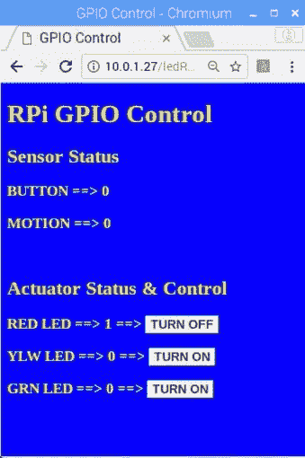

这只是 Python 和 Flask 所能做的一小部分。如果你真的想深入了解 Flask，你可以跟随 Miguel Grimberg 的伟大教程:[Flask Mega 教程，](https://blog.miguelgrinberg.com/post/the-flask-mega-tutorial-part-i-hello-world)

# 9.结论


一如既往，我希望这个项目可以帮助其他人找到进入令人兴奋的电子世界的方法！

详情和最终代码，请访问我的 GitHub 仓库: [RPi-Flask-WebServer](https://github.com/Mjrovai/RPi-Flask-WebServer)

而要学习如何处理数据、图形、数据库，也可以看我的教程:[从数据到图形。带烧瓶和 SQLite 的 Web Jorney](https://www.hackster.io/mjrobot/from-data-to-graph-a-web-jorney-with-flask-and-sqlite-4dba35)

更多项目，请访问我的博客:【MJRoBot.org 

来自世界南部的 Saludos！

下节课再见！

谢谢你，

马塞洛