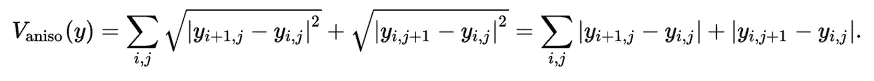
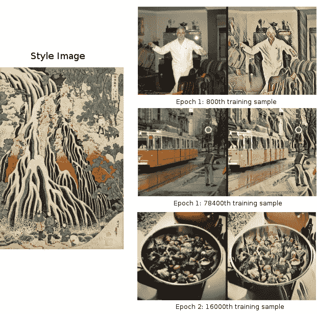
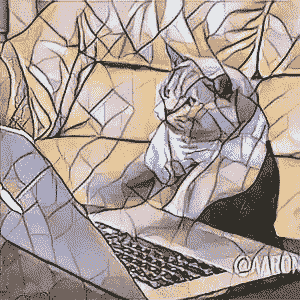
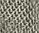

# Pytorch 实现实时风格转换的感知损失

> 原文：<https://towardsdatascience.com/pytorch-implementation-of-perceptual-losses-for-real-time-style-transfer-8d608e2e9902?source=collection_archive---------2----------------------->

在这篇文章中，我将简要回顾我在 [Pytorch](http://pytorch.org/) 中编写和训练实时风格转换模型的经历。这项工作在很大程度上基于 [Abhishek Kadian 的实现，](https://github.com/abhiskk/fast-neural-style)，它工作得非常好。我做了一些修改，既是为了好玩，也是为了更熟悉 Pytorch。

该模型使用[中描述的方法进行实时风格转换和超分辨率](https://arxiv.org/abs/1603.08155)以及[实例归一化](https://arxiv.org/pdf/1607.08022.pdf)。(未实现超分辨率)

我在实现中添加了三个主要部分:

1.  使用[官方预培训的 VGG 模型](http://pytorch.org/docs/master/torchvision/models.html)
2.  在培训期间输出中间结果
3.  添加[总变差正则化](https://www.wikiwand.com/en/Total_variation_denoising)如文中所述

## 使用官方预先训练的 VGG 模型


Model structure from [the paper](https://arxiv.org/abs/1603.08155)

首先，我们需要快速浏览一下模型结构。本文的主要贡献是提出将生成的图像前馈到预训练的图像分类模型，并从一些中间层提取输出来计算损失，这将产生类似于 Gatys 等人的[](https://arxiv.org/abs/1508.06576)**的结果，但具有明显更少的计算资源。因此，该结构的第一部分是一个“图像变换网络”,它从输入图像生成新的图像。而第二部分简单来说就是一个“损耗网络”，也就是前馈部分。损失网络的权重是固定的，在训练过程中不会更新。**

**Abhishek 的实现使用传统的 VGG 模型，具有 BGR 信道顺序和[-103.939，-116.779，-123.680]到中心信道的偏移(这似乎也是该论文所使用的)。【pytorch 官方预训车型使用统一格式:**

> **所有预训练模型都期望输入图像以相同的方式归一化，即形状为(3 x H x W)的 3 通道 RGB 图像的小批量，其中 H 和 W 预计至少为 224。必须将图像加载到[0，1]的范围内，然后使用`mean = [0.485, 0.456, 0.406]`和`std = [0.229, 0.224, 0.225]`进行归一化**

**下面是从官方预训练模型中提取输出的代码:**

```
**LossOutput = namedtuple("LossOutput", ["relu1_2", "relu2_2", "relu3_3", "relu4_3"])
# [https://discuss.pytorch.org/t/how-to-extract-features-of-an-image-from-a-trained-model/119/3](https://discuss.pytorch.org/t/how-to-extract-features-of-an-image-from-a-trained-model/119/3)
class LossNetwork(torch.nn.Module):
    def __init__(self, vgg_model):
        super(LossNetwork, self).__init__()
        self.vgg_layers = vgg_model.features
        self.layer_name_mapping = {
            '3': "relu1_2",
            '8': "relu2_2",
            '15': "relu3_3",
            '22': "relu4_3"
        }

    def forward(self, x):
        output = {}
        for name, module in self.vgg_layers._modules.items():
            x = module(x)
            if name in self.layer_name_mapping:
                output[self.layer_name_mapping[name]] = x
        return LossOutput(**output)**
```

**启动:**

```
**vgg_model = vgg.vgg16(pretrained=True)
if torch.cuda.is_available():
    vgg_model.cuda()
loss_network = LossNetwork(vgg_model)
loss_network.eval()**
```

**除非明确指定，否则在 VGG 模型中没有批处理规范化。因此，激活值与之前的实现相比有很大不同。一般来说，你需要按比例增加样式损失(gram 矩阵),因为大多数激活小于 1，采用点积会使它更小。**

## **在培训期间输出中间结果**

****

**Epoch 2, 75200th training sample**

**这在根据风格权重比例调整内容权重时很有帮助。您可以在训练过程中停止训练并重新调整参数，而不必等待 4 个小时才能完成训练。**

## **添加[总变差正则化](https://www.wikiwand.com/en/Total_variation_denoising)如文中所述**

**论文在实验部分提到了这一点，但似乎 Abhishek 并没有实现:**

> **输出图像用总变分正则化进行正则化，强度在 1 × 10e-6 和 1 ×10e-4 之间，通过每个样式目标的交叉验证进行选择。**

****

**The total variation norm formula for 2D signal images from [Wikipedia](https://www.wikiwand.com/en/Total_variation_denoising)**

**这很容易实现:**

```
**reg_loss = REGULARIZATION * (
    torch.sum(torch.abs(y[:, :, :, :-1] - y[:, :, :, 1:])) + 
    torch.sum(torch.abs(y[:, :, :-1, :] - y[:, :, 1:, :]))
)**
```

**[Pytorch 亲笔签名](http://pytorch.org/docs/master/autograd.html)将为您处理反向传播。在实践中，我还没有发现如何调整正则化权重。到目前为止，我使用的权重似乎对输出图像没有太大影响。**

# **培训结果**

**该模型使用 Microsoft COCO 数据集进行训练。图像的大小被调整为 256×256，网络被训练大约 2 个时期，批次大小为 4(与纸张相同)。使用 GTX1070 的训练时间约为 4 到 4.5 小时，与论文报道的时间相当。根据我粗略的实验，大量的计算时间被用于标准化输入图像。如果我们使用原始的 VGG 模型(未测试)，训练可能会更快。在一些手动调整之后，内容权重与样式的比率通常被设置为 1 : 10e3 ~ 10e5。**

****

**An example model (waterfall) (pardon my poor GIMP skill…)**

**因为网络是完全卷积的，你可以在测试时间向网络提供比 256 x 256 更大或更小的图像。我写了一些脚本来转换动画 gif 和视频，使用 [scikit-video](http://www.scikit-video.org/) 和 [ffmpeg](https://www.ffmpeg.org/) 来取乐:**

****

**Some additional style images used**

****

**Mosaic-styled cat typing**

**原视频鸣谢:[背包环游新西兰](https://www.youtube.com/watch?v=QdEsM7-_DLI)。处理速度在每秒 4 帧左右。我没有调准帧率，所以下面几个视频的时间都比原来慢。**

**Mosaic style**

**Candy Style**

## **经验教训**

1.  **记住将输出 numpy 数组裁剪到[0，255]范围，并将其转换为 uint8。否则 matplot.pyplot.imshow 会显示奇怪的结果。花了相当多的时间在错误的方向上调试，认为模型训练代码有一些严重的错误。**
2.  **记得使用 [model.train()](http://pytorch.org/docs/master/nn.html#torch.nn.Module.train) 和 model.eval()。它仅对包含丢弃或批量规范化图层的模型有效，但这是一个需要保持的好习惯。如果你来自喀拉斯，尤其容易忘记。**

## **可能的改进和未来的工作**

1.  **有时网络会在开放区域生成一些奇怪的补丁。还不知道是哪里来的，怎么修。**
2.  **对于不同风格的图像，为 relu1_2、relu2_2、relu3_3、relu4_3 输出分配不同的权重可能会产生更好的结果。**
3.  **尝试使用不同的预训练网络作为损耗网络。**
4.  **也尝试实现超分辨率**
5.  **比较来自[循环的结果](https://github.com/junyanz/pytorch-CycleGAN-and-pix2pix)。我试过 CycleGAN，但训练时间太长，我当时失去了耐心。应该稍后再试。**
6.  **生成视频时，调整连续帧之间的变化。这应该有助于减少播放过程中的闪烁。我听说有人使用这种技术，但还不知道如何实际操作。**

****

**A sample of the weird patches**

## **感谢阅读！**

**代码位于本 Github repo 的[。由于这基本上是一个个人有趣的项目，文档是不存在的，代码的主要部分驻留在两个 Jupyter 笔记本中:](https://github.com/ceshine/fast-neural-style) [style-transfer.ipynb](https://github.com/ceshine/fast-neural-style/blob/201707/style-transfer.ipynb) 和 [Video.ipynb](https://github.com/ceshine/fast-neural-style/blob/201707/Video.ipynb) 。很抱歉。**

**(2011/11/30 更新:修复了上述笔记本的链接。与此同时，这里有更新版本的笔记本:[01-image-style-transfer . ipynb](https://github.com/ceshine/fast-neural-style/blob/master/notebooks/01-image-style-transfer.ipynb)和 [03-Video-Creation.ipynb](https://github.com/ceshine/fast-neural-style/blob/master/notebooks/03-Video-Creation.ipynb) 。)**