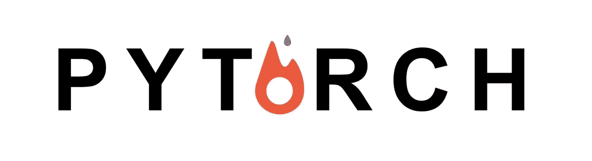
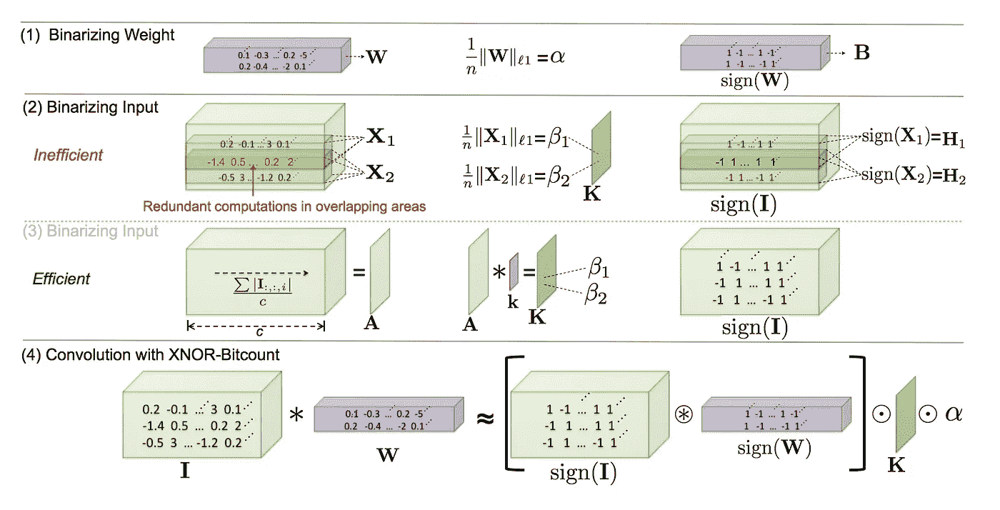
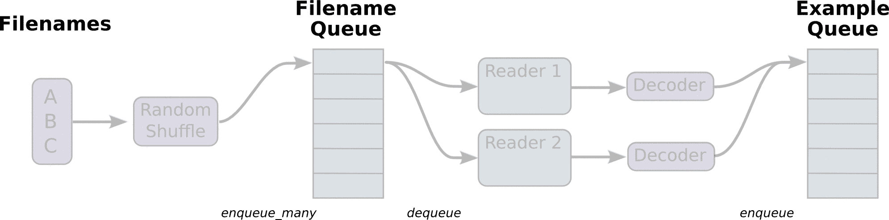
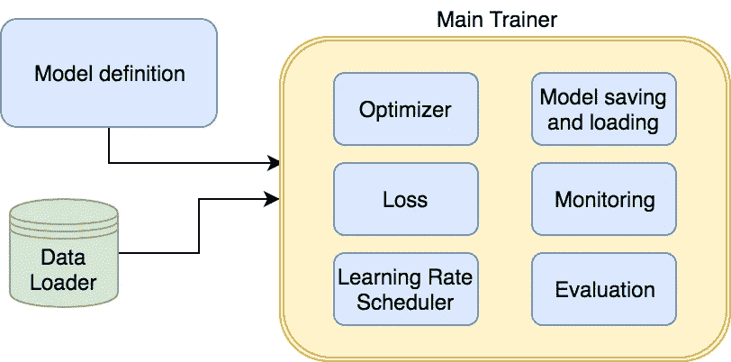

# PyTorch 教程精华

> 原文：<https://towardsdatascience.com/pytorch-tutorial-distilled-95ce8781a89c?source=collection_archive---------2----------------------->

## 从 TensorFlow 迁移到 PyTorch

当我刚开始研究 PyTorch 时，几天后我就放弃了。与 TensorFlow 相比，我很难理解这个框架的核心概念。这就是为什么我把它放在我的“知识书架”上，然后忘记了它。但是不久前，PyTorch 的新版本发布了。所以我决定再给它一次机会。过了一段时间，我明白了这个框架真的很容易使用，它让我很高兴用 PyTorch 编码。在这篇文章中，我会试着解释清楚它的核心概念，这样你会有动力至少现在就试一试，而不是在几年或更久之后。我们将涵盖一些基本原则和一些先进的东西，如学习率调度，自定义层等。

## 资源

首先，你应该知道 PyTorch 的[文档](http://pytorch.org/docs/master/)和[教程](http://pytorch.org/tutorials/)是分开存放的。有时，由于快速的开发和版本变化，他们可能不会见面。所以填免费调查[源代码](http://pytorch.org/tutorials/)。它非常清晰明了。最好提一下，有很棒的 [PyTorch 论坛](https://discuss.pytorch.org/)，在那里你可以问任何合适的问题，你会很快得到答案。对于 PyTorch 用户来说，这个地方似乎比 StackOverflow 更受欢迎。

## PyTorch as NumPy

所以让我们深入 PyTorch 本身。PyTorch 的主要构件是张量。真的，它们和 [NumPy 的](https://docs.scipy.org/doc/numpy-dev/user/quickstart.html)很像。Tensors 支持很多相同的 API，所以有时你可以使用 PyTorch 作为 NumPy 的替代。你可能会问这是什么原因。主要目标是 PyTorch 可以利用 GPU，以便您可以将数据预处理或任何其他计算密集型工作转移到机器学习领域。很容易将张量从 NumPy 转换成 PyTorch，反之亦然。让我们检查一些代码示例:

## 从张量到变量

张量是 PyTorch 中令人敬畏的一部分。但主要我们想要的是建立一些神经网络。什么是反向传播？当然我们可以手动实现，但是这是什么原因呢？谢天谢地，自动微分存在。为了支持它，PyTorch [为你提供了变量](http://pytorch.org/tutorials/beginner/examples_autograd/two_layer_net_autograd.html)。变量是张量之上的包装器。有了它们，我们可以建立我们的计算图，并在以后自动计算梯度。每个变量实例都有两个属性:`.data`包含初始张量本身，`.grad`包含相应张量的梯度。

您可能会注意到，我们已经手动计算并应用了我们的梯度。太乏味了。我们有优化器吗？当然啦！

现在我们所有的变量都会自动更新。但是你应该从上一个片段中得到的要点是:在计算新的梯度之前，我们仍然应该手动置零梯度。这是 PyTorch 的核心概念之一。有时，我们为什么要这样做可能不是很明显，但另一方面，我们可以完全控制我们的渐变，何时以及如何应用它们。

## 静态与动态计算图

PyTorch 和 TensorFlow 的下一个主要区别是它们的图形表示方法。Tensorflow [使用静态图](https://www.tensorflow.org/programmers_guide/graphs)，这意味着我们定义它一次，然后一次又一次地执行那个图。在 PyTorch 中，每次向前传递都会定义一个新的计算图。一开始，这些方法之间的区别并不是很大。但是当你想调试你的代码或者定义一些条件语句时，动态图就变得很少了。您可以直接使用您喜欢的调试器！比较 while 循环语句的下两个定义 TensorFlow 中的第一个和 PyTorch 中的第二个:

在我看来，第二个解决办法比第一个容易得多。你对此有什么看法？

## 模型定义

好了，现在我们看到在 PyTorch 中构建一些 if/else/while 复杂语句很容易。但是让我们回到通常的模型。该框架提供了非常类似于 [Keras](https://keras.io/) 的现成层构造器:

> `nn`包定义了一组**模块**，大致相当于神经网络层。模块接收输入变量并计算输出变量，但也可以保存内部状态，例如包含可学习参数的变量。`nn`包还定义了一组在训练神经网络时常用的有用的损失函数。

此外，如果我们想构建更复杂的模型，我们可以子类化提供的`nn.Module`类。当然，这两种方法可以混合使用。

在`__init__`方法中，我们应该定义所有将在以后使用的层。在`forward`方法中，我们应该提出如何使用已经定义的层的步骤。像往常一样，向后传球将被自动计算。

## 自定义层

但是如果我们想定义一些带有非标准 backprop 的定制模型呢？这里有一个例子——XNOR 网络公司:

我不会深究细节，更多关于这种类型的网络，你可以在[初始论文](https://arxiv.org/abs/1603.05279)中读到。与我们的问题相关的是，反向传播应该只应用于小于 1 和大于-1 的权重。在 PyTorch 中，它[可以很容易地实现](http://pytorch.org/docs/master/notes/extending.html):

正如你所看到的，我们应该只定义两个方法:一个用于向前传递，一个用于向后传递。如果我们需要从正向传递中访问一些变量，我们可以将它们存储在`ctx`变量中。注意:在以前的 API 中，向前/向后方法不是静态的，我们将所需的变量存储为`self.save_for_backward(input)`，并以`input, _ = self.saved_tensors`的形式访问它们。

## 使用 CUDA 训练模型

我们之前讨论过如何将一个张量传递给 CUDA。但是如果要传递整个模型，从模型本身调用`.cuda()`方法就可以了，把每个输入变量包装到`.cuda()`就够了。在所有的计算之后，我们应该用`.cpu()`方法得到结果。

此外，PyTorch 在源代码中支持直接设备分配:

因为有时我们希望在 CPU 和 GPU 上运行相同的模型，而不修改代码，所以我提出了某种包装器:

## 重量初始化

在张量流中，权重初始化主要在张量声明期间进行。PyTorch 提供了另一种方法——首先，应该声明张量，下一步应该改变张量的权重。权重可以初始化为对张量属性的直接访问，调用`torch.nn.init`包中的一堆方法。这个决定可能不是很直接，但当您想要用相同的初始化来初始化某个类型的所有层时，它会变得很有用。

## 从反向中排除子图

有时，当您想要重新训练模型的某些层或为生产模式做准备时，您可以禁用某些层的亲笔签名机制，这非常有用。为此， [PyTorch 提供了两个标志](http://pytorch.org/docs/master/notes/autograd.html) : `requires_grad`和`volatile`。第一个将禁用当前层的渐变，但子节点仍然可以计算一些。第二个将禁用当前层和所有子节点的自动签名。

## 培训过程

PyTorch 中还存在其他一些附加功能。例如，你可以使用[学习率调度器](http://pytorch.org/docs/master/optim.html#how-to-adjust-learning-rate)，它将根据一些规则调整你的学习率。或者，您可以启用/禁用具有单个训练标志的批量定额层和辍学。如果你想很容易改变随机种子分别为 CPU 和 GPU。

此外，您可以打印关于您的模型的信息，或者用几行代码保存/加载它。如果你的模型是用 [OrderedDict](https://docs.python.org/3/library/collections.html) 或基于类的模型来初始化的，那么字符串表示将包含层的名称。

根据 PyTorch 文档，使用`state_dict()`方法的保存模型[更可取](http://pytorch.org/docs/master/notes/serialization.html)。

## 记录

记录训练过程是非常重要的一部分。不幸的是，PyTorch 没有任何类似 tensorboard 的工具。因此，您可以使用带有 [Python 日志模块](https://docs.python.org/3/library/logging.html)的普通文本日志，或者尝试一些第三方库:

*   [用于实验的简单记录器](https://github.com/oval-group/logger)
*   [tensor board 的语言无关接口](https://github.com/torrvision/crayon)
*   [在不接触张量流的情况下记录张量板事件](https://github.com/TeamHG-Memex/tensorboard_logger)
*   [py torch 的张量板](https://github.com/lanpa/tensorboard-pytorch)
*   [脸书可视化智慧图书馆](https://github.com/facebookresearch/visdom)

## 数据处理

您可能还记得 TensorFlow 中提出的[数据加载器，甚至试图实现其中的一些。对我来说，花了大约 4 个小时或更多的时间来了解所有管道应该如何工作。](https://www.tensorflow.org/api_guides/python/reading_data)

Image source: TensorFlow docs

最初，我想在这里添加一些代码，但我认为这样的 gif 将足以解释所有事情如何发生的基本想法。

PyTorch 开发者决定不重新发明轮子。他们只是使用多重处理。要创建您自己的定制数据加载器，从`torch.utils.data.Dataset`继承您的类并更改一些方法就足够了:

你应该知道的两件事。首先，图像尺寸不同于张量流。它们是[batch _ size x channels x height x width]。但是这种转换可以通过预处理步骤`torchvision.transforms.ToTensor()`在没有交互的情况下完成。在[转换包](http://pytorch.org/docs/master/torchvision/transforms.html)中也有很多有用的实用程序。

第二件重要的事情是你可以在 GPU 上使用固定内存。为此，您只需要为一个`cuda()`调用添加一个额外的标志`async=True`，并从带有标志`pin_memory=True`的数据加载器中获取固定批次。关于此功能[的更多信息在这里](http://pytorch.org/docs/master/notes/cuda.html#use-pinned-memory-buffers)讨论。

## 最终架构概述

现在你知道了模型、优化器和许多其他东西。什么才是把它们全部合并的正确方法？我建议将您的模型和所有包装器拆分成这样的构件:

为了清楚起见，这里有一些伪代码:

## 结论

我希望这篇文章能让你理解 PyTorch 的要点:

*   它可以作为 Numpy 的替代产品
*   这对于原型制作来说真的很快
*   调试和使用条件流很容易
*   有许多现成的好工具

PyTorch 是一个快速发展的框架，有一个很棒的社区。我认为今天是尝试的最佳时机！