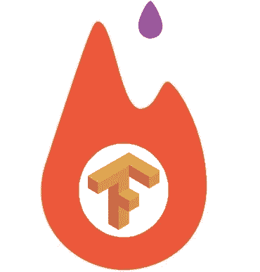
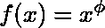
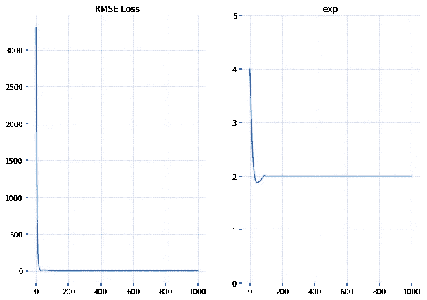
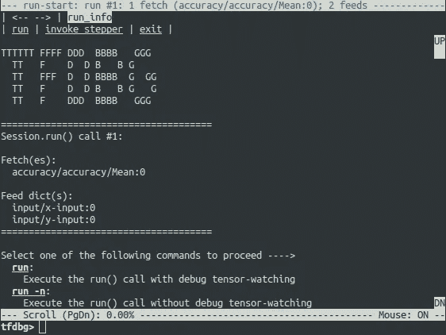

# PyTorch 与 TensorFlow —发现差异

> 原文：<https://towardsdatascience.com/pytorch-vs-tensorflow-spotting-the-difference-25c75777377b?source=collection_archive---------0----------------------->



在这篇文章中，我想探讨两个流行的深度学习框架:PyTorch 和 TensorFlow 之间的一些关键异同。为什么是这两个而不是其他的？有许多深度学习框架，其中许多是可行的工具，我选择这两个只是因为我对具体比较它们感兴趣。

# 起源

TensorFlow 由 Google Brain 开发，并在 Google 积极用于研究和生产需求。它的闭源前身叫做 DistBelief。

PyTorch 是在脸书开发和使用的基于 lua 的 Torch 框架的表亲。然而，PyTorch 并不是一套简单的支持流行语言的包装器，它被重新编写和修改以使速度更快，感觉更自然。

比较两个框架的最好方法是在两个框架中都编写一些代码。我已经为这个帖子写了一个配套的 jupyter 笔记本，你可以在这里得到它。所有代码都将在帖子中提供。

首先，让我们为两个框架中的以下函数编写一个简单的近似器:



我们将尝试找到未知参数*φ*给定数据 *x* 和函数值 *f(x)* 。是的，使用随机梯度下降是一种矫枉过正，解析解可能很容易找到，但这个问题将作为一个简单的例子很好地服务于我们的目的。

我们将首先用 PyTorch 解决这个问题:

如果你在深度学习框架方面有一些经验，你可能已经注意到我们正在手工实现梯度下降。不太方便吧？令人高兴的是，PyTorch 拥有`optimize`模块，其中包含了诸如 RMSProp 或 Adam 等流行优化算法的实现。我们将带着动力使用新加坡元



Loss function and exponent plots for PyTorch

正如你所看到的，我们很快从训练数据中推断出真实指数。现在让我们继续张量流:


Loss function and exponent plots for TensorFlow

如您所见，TensorFlow 中的实现也可以工作(令人惊讶的是🙃).它花费了更多的迭代来恢复指数，但我确信原因是我没有充分利用 optimiser 的参数来达到可比的结果。

现在我们准备探索一些不同之处。

# 差异#0 —采用

目前，TensorFlow 被许多研究人员和行业专业人士视为随身工具。这个框架有很好的文档记录，如果文档还不够，互联网上有很多写得非常好的教程。你可以在 github 上找到数百个已经实现和训练过的模型，从这里开始。

PyTorch 与其竞争对手相比相对较新(仍处于测试阶段)，但它的发展势头很快。文档和[官方教程](http://pytorch.org/tutorials/)也不错。PyTorch 还包括几个超级易用的流行计算机视觉架构的[实现](http://pytorch.org/docs/torchvision/models.html)。

# 区别#1 —动态与静态图形定义

这两个框架都在张量上操作，并将任何模型视为有向无环图(DAG ),但是它们在如何定义它们上有很大的不同。

TensorFlow 遵循“数据即代码，代码即数据”习语。在 TensorFlow 中，您可以在模型运行之前静态定义图形。与外部世界的所有通信都是通过`tf.Session`对象和`tf.Placeholder`进行的，它们是在运行时将被外部数据替代的张量。

在 PyTorch 中，事情更加命令化和动态化:您可以随时定义、更改和执行节点，没有特殊的会话接口或占位符。总的来说，该框架与 Python 语言集成得更紧密，大多数时候感觉更原生。当你在 TensorFlow 中写作时，有时你会觉得你的模型在一堵砖墙后面，有几个小孔可以沟通。无论如何，这听起来或多或少还是一个品味问题。

然而，这些方法不仅在软件工程的角度上有所不同:有几种动态神经网络体系结构可以从动态方法中受益。回想一下 RNNs:对于静态图，输入序列长度将保持不变。这意味着，如果你为英语句子开发一个情感分析模型，你必须将句子长度固定到某个最大值，并用零填充所有较小的序列。不太方便吧。在递归 RNNs 和树形 RNNs 领域，你会遇到更多的问题。目前 Tensorflow 通过 [Tensorflow Fold](https://github.com/tensorflow/fold) 对动态输入的支持有限。PyTorch 默认拥有它。

# 区别#2 —调试

由于 PyTorch 中的计算图是在运行时定义的，所以您可以使用我们最喜欢的 Python 调试工具，如 pdb、ipdb、PyCharm 调试器或旧的可信打印语句。

TensorFlow 就不是这样。您可以选择使用名为 [tfdbg](https://www.tensorflow.org/programmers_guide/debugger) 的特殊工具，该工具允许在运行时计算张量流表达式，并浏览会话范围内的所有张量和操作。当然，你不能用它来调试任何 python 代码，所以有必要单独使用 pdb。



# **差异#3 —可视化**

Tensorboard 在可视化方面非常棒😎。这个工具是 TensorFlow 自带的，对于调试和比较不同的训练运行非常有用。例如，假设您训练了一个模型，然后调整了一些超参数并再次训练它。两次运行可以同时显示在 Tensorboard 上，以指示可能的差异。Tensorboard 可以:

*   显示模型图
*   绘制标量变量
*   可视化分布和直方图
*   可视化图像
*   可视化嵌入
*   播放音频

Tensorboard 可以显示各种摘要，这些摘要可以通过`tf.summary`模块收集。我们将为我们的玩具指数示例定义汇总操作，并使用`tf.summary.FileWriter`将它们保存到磁盘。

启动 Tensorboard 执行`tensorboard --logdir=./tensorboard`。这个工具在云实例上使用非常方便，因为它是一个 webapp。

PyTorch 这边的 Tensorboard 竞争对手是 [visdom](https://github.com/facebookresearch/visdom) 。它功能不全，但使用起来更方便。另外，[与 Tensorboard 的集成](https://github.com/torrvision/crayon)确实存在。此外，您可以自由使用标准绘图工具— [matplotlib](http://matplotlib.org/) 和 [seaborn](http://seaborn.pydata.org/) 。

# 差异#4 —部署

如果我们开始谈论部署，TensorFlow 现在显然是赢家:它有 [TensorFlow 服务](https://tensorflow.github.io/serving/)，这是一个在专用 gRPC 服务器上部署您的模型的框架。也支持移动。

当我们切换回 PyTorch 时，我们可能会使用 [Flask](http://flask.pocoo.org) 或另一种替代方式在模型之上编写一个 REST API。如果 gRPC 不适合您的用例，这也可以用张量流模型来完成。然而，如果性能是一个问题，TensorFlow 服务可能是一个更好的选择。

Tensorflow 还支持 PyTorch 目前缺乏的[分布式训练](https://www.tensorflow.org/deploy/distributed)。

# 差异#5 —数据并行

PyTorch 区别于 TensorFlow 的最大特征之一是[声明式数据并行性](http://pytorch.org/tutorials/beginner/former_torchies/parallelism_tutorial.html):您可以使用`torch.nn.DataParallel`包装任何模块，它将(几乎神奇地)在批处理维度上并行化。通过这种方式，您几乎可以毫不费力地利用多个 GPU。

另一方面，TensorFlow 允许您微调要在特定设备上运行的每个操作。尽管如此，定义并行性需要更多的手动操作，并且需要仔细思考。考虑在 TensorFlow 中实现类似于`DataParallel`的代码:

```
def make_parallel(fn, num_gpus, **kwargs):
    in_splits = {}
    for k, v in kwargs.items():
        in_splits[k] = tf.split(v, num_gpus)out_split = []
    for i in range(num_gpus):
        with tf.device(tf.DeviceSpec(device_type="GPU", device_index=i)):
            with tf.variable_scope(tf.get_variable_scope(), reuse=tf.AUTO_REUSE):
                out_split.append(fn(**{k : v[i] for k, v in in_splits.items()}))return tf.concat(out_split, axis=0)def model(a, b):
    return a + bc = make_parallel(model, 2, a=a, b=b)
```

也就是说，当使用 TensorFlow 时，你可以实现你在 PyTorch 中可以做的一切，但需要更多的努力(你有更多的控制权作为奖励)。

同样值得注意的是，这两个框架都支持分布式执行，并为定义集群提供了高级接口。

# 区别# 6——框架还是库

让我们为手写数字建立一个 CNN 分类器。现在 PyTorch 将真正开始看起来像一个*框架*。回想一下，编程框架为我们提供了某些领域中有用的抽象，以及使用它们来解决具体问题的便捷方式。这就是框架和库的本质区别。

这里我们介绍`datasets`模块，它包含用于测试深度学习架构的流行数据集的包装器。另外`nn.Module`用于构建一个定制的卷积神经网络分类器。`nn.Module`是 PyTorch 给我们创建复杂深度学习架构的一个积木。在`torch.nn`包中有大量现成的模块，我们可以将其用作我们模型的基础。请注意 PyTorch 如何使用面向对象的方法来定义基本的构建模块，并在提供通过子类化来扩展功能的能力的同时，给我们一些“轨道”来继续前进。

下面是对[稍加修改的版本 https://github . com/py torch/examples/blob/master/mnist/main . py](https://github.com/pytorch/examples/blob/master/mnist/main.py):

普通 TensorFlow 感觉更像一个库，而不是一个框架:所有的操作都是非常低级的，即使你可能不想写，也需要编写大量的样板代码(让我们一次又一次地定义这些偏差和权重……)。

随着时间的推移，围绕 TensorFlow 出现了一整套高级包装器的生态系统。这些都旨在简化您使用库的方式。他们中的许多人目前位于`tensorflow.contrib`模块(这不被认为是一个稳定的 API)，一些人开始迁移到主存储库(见`tf.layers`)。

所以，在如何使用 TensorFlow 以及什么样的框架最适合这个任务上，你有很大的自由度: [TFLearn](http://tflearn.org/) ， [tf.contrib.learn](https://www.tensorflow.org/get_started/tflearn) ， [Sonnet](https://github.com/deepmind/sonnet) ， [Keras](http://keras.io/) ，plain `tf.layers`等。老实说，Keras 值得另一篇文章，但目前不在这个比较的范围之内。

这里我们将使用`tf.layers`和`tf.contrib.learn`来构建我们的 CNN 分类器。代码遵循[TF . layers 官方教程](https://www.tensorflow.org/tutorials/layers):

因此，TensorFlow 和 PyTorch 都提供了有用的抽象来减少样板代码的数量并加速模型开发。它们之间的主要区别是 PyTorch 可能感觉更“pythonic 化”，并且具有面向对象的方法，而 TensorFlow 有几个选项供您选择。

我个人认为 PyTorch 更清晰，对开发者更友好。它的`torch.nn.Module`给了你以 OOP 方式定义可重用模块的能力，我发现这种方法非常灵活和强大。稍后你可以通过`torch.nn.Sequential`组成各种模块(你好，✋🏻).此外，所有内置模块都在一个[功能表](http://pytorch.org/docs/nn.html?highlight=sequential#torch-nn-functional)中，这非常方便。总的来说，API 的所有部分都配合得很好。

当然，你可以用普通的 TensorFlow 编写非常简洁的代码，但是在你得到它之前需要更多的技巧和反复试验。当使用 Keras 或 TFLearn 这样的高级框架时，至少要准备好失去 TensorFlow 提供的一些灵活性。

# 结论

TensorFlow 是一个非常强大和成熟的深度学习库，具有强大的可视化功能和几个用于高级模型开发的选项。它具有生产就绪型部署选项和对移动平台的支持。如果您满足以下条件，TensorFlow 是一个不错的选择:

*   为生产开发模型
*   开发需要在移动平台上部署的模型
*   想要良好的社区支持和全面的文档
*   想要各种形式的丰富学习资源(TensorFlow 有一整个 [MOOC](https://www.udacity.com/course/deep-learning--ud730)
*   想要或需要使用 Tensorboard
*   需要使用大规模分布式模型训练

PyTorch 仍然是一个发展势头迅猛的年轻框架。如果您符合以下条件，您可能会发现它非常适合:

*   做研究或者你的生产非功能需求不是很苛刻
*   想要更好的开发和调试体验
*   *爱*万物蟒

如果你有时间，最好的建议是两者都试试，看看哪一个最适合你的需求。

如果你喜欢这篇文章，请留下一些👏。它让我知道我在帮忙。

# PyTorch 1.0 笔记

PyTorch 1.0 即将发布。它引入了[许多令人惊叹的特性](https://developers.facebook.com/blog/post/2018/05/02/announcing-pytorch-1.0-for-research-production/)，包括原生 C++ API、JIT 编译和 ONNX 集成。这意味着您将能够编写生产就绪的服务，并做 TensorFlow 服务所做的事情。这是 PyTorch 迈出的一大步，肯定会增强它作为研究和生产用途的全功能框架的地位。

# 联系我们

需要 TensorFlow 或 PyTorch 的帮助？请通过 **datalab@cinimex.ru** 联系我们

想要定期获得关于数据科学和创业的有趣资源吗？

跟我来🐦[推特](https://twitter.com/kdubovikov)和📝[中等](https://medium.com/@dubovikov.kirill)。