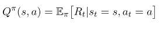
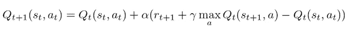
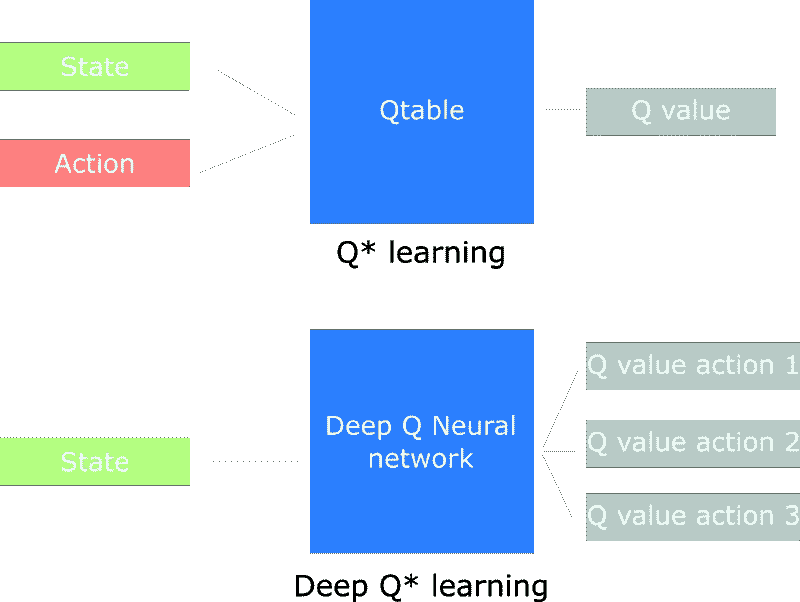
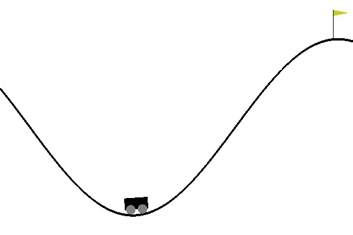

# Q 学习和深度 Q 网络

> 原文：<https://towardsdatascience.com/q-learning-and-deep-q-networks-436380e8396a?source=collection_archive---------14----------------------->

强化学习的旅程还在继续……是时候分析一下臭名昭著的 Q-learning 了，看看它是如何成为 AI 领域的新标准的(在神经网络的一点帮助下)。

重要的事情先来。在[的上一篇帖子](/the-secrets-behind-reinforcement-learning-25b87befb2d3)中，我们看到了强化学习背后的基本概念，我们使用代理、环境、状态(S)、动作(A)和奖励(R)来构建问题。我们讨论了如何将整个过程描述为马尔可夫决策过程，并引入了术语策略和值。最后，我们对基本方法进行了一个快速的高层次概述。

请记住，目标是找到最佳策略，而策略是状态和动作之间的映射。所以，我们需要找到当我们站在一个特定的状态下采取什么行动来最大化我们的预期回报。找到最优策略的一种方法是利用价值函数(一种无模型技术)。

在这里，我们将得到新的东西。事实上，现在有两种价值函数在使用。状态值函数 V(s)和动作值函数 Q(s，a)。

*   **状态价值函数**:是根据政策从一个状态行动时达到的预期收益。
*   **动作价值函数**:给定状态和动作的期望收益。

你可能会问有什么区别？第一个值是特定状态的值。第二个是该状态的值加上来自该状态的所有可能动作的值。

当我们有了动作值函数，即 Q 值，我们可以简单地从一个状态中选择执行具有最高值的动作。但是我们如何找到 Q 值呢？

# 什么是 Q 学习？

所以，我们将从试错中学习 Q 值？没错。我们初始化 Q，我们选择一个动作并执行它，我们通过测量回报来评估它，并相应地更新 Q。首先，随机性将是一个关键因素，但随着智能体探索环境，算法将为每个状态和动作找到最佳 Q 值。我们可以用数学来描述这个吗？

谢谢理查德 E. **贝尔曼**。上述方程被称为贝尔曼方程，并在今天的研究中发挥了巨大作用。但是它说明了什么？

Q 值，也就是一个状态和动作的最大未来回报，是当前回报加上下一个状态的最大未来回报。如果你仔细想想，这很有道理。Gamma (γ)是一个介于[0，1]之间的数字，它用于随着时间的推移对奖励进行折现，假设开始时的行为比结束时的行为更重要(这一假设被许多现实生活中的用例所证实)。结果，我们可以**迭代更新 Q 值**。

这里要理解的基本概念是，贝尔曼方程将状态彼此联系起来，因此，它将作用值函数联系起来。这有助于我们迭代环境并计算最佳值，从而为我们提供最佳策略。

最简单的形式是，Q 值是一个矩阵，状态是行，动作是列。我们随机初始化 Q 矩阵，智能体开始与环境互动，并测量每个动作的回报。然后，它计算观察到的 Q 值并更新矩阵。

# 探索与开发

如上所述，该算法是一种贪婪算法，因为它总是选择具有最佳值的动作。但如果某个行为产生非常大回报的概率非常小呢？代理永远不会到达那里。这是通过添加随机探索修复的。每隔一段时间，代理会执行一次**随机移动**，不考虑最优策略。但是因为我们希望算法在某个点上收敛，所以随着游戏的进行，我们降低了采取随机行动的概率。

# 为什么要深入？

q 学习好。没有人能否认这一点。但是它在大的状态空间中无效的事实仍然存在。想象一个有 1000 个状态，每个状态有 1000 个动作的游戏。我们需要一张包含一百万个单元格的表格。与国际象棋或围棋相比，这是一个非常小的状态空间。还有，Q 学习不能用于未知状态，因为它不能从以前的状态推断出新状态的 Q 值。

如果我们用机器学习模型来近似 Q 值呢。如果我们用神经网络来逼近它们呢？这个简单的想法(当然还有执行)是 DeepMind 以 5 亿美元从谷歌收购的原因。DeepMind 提出了一个名为 Deep Q Learner 的算法，并用它来玩 Atari 游戏，掌握得无懈可击。

在深度 Q 学习中，我们利用神经网络来逼近 Q 值函数。网络接收状态作为输入(无论是当前状态的帧还是单个值),并输出所有可能动作的 Q 值。最大的产出是我们下一步的行动。我们可以看到，我们并不局限于完全连接的神经网络，但我们可以使用卷积、递归和任何其他类型的模型来满足我们的需求。

我认为是时候在实践中使用所有这些东西，并教代理人玩[山地车](https://gym.openai.com/envs/MountainCar-v0/)了。目标是让一辆汽车开上一座小山。这辆汽车的发动机不够强劲，不能一次爬完这座山。所以，成功的唯一方法就是来回开车造势。

我将解释更多关于深度 Q 网络和代码。首先，我们应该建立一个具有 3 个密集层的神经网络，我们将使用 Adam 优化来训练它。

关键点:

*   代理拥有一个包含所有过去经历的记忆缓冲区。
*   他的下一步行动由网络的最大输出(Q 值)决定。
*   损失函数是预测 Q 值和目标 Q 值的均方误差。
*   根据贝尔曼方程，我们知道目标是 R + g*max(Q)。
*   目标值和预测值之间的差异称为时间差异误差(TD 误差)

在我们训练我们的 DQN 之前，我们需要解决一个对代理如何学习估计 Q 值起着至关重要作用的问题，这就是:

# 体验回放

体验重放是一个概念，我们通过重放帮助代理记住并且不忘记它以前的动作。每隔一段时间，我们会对一批以前的经历进行采样(存储在一个缓冲区中),然后反馈给网络。这样，代理**重温了它的过去**并改善了它的记忆。这项任务的另一个原因是迫使代理人从振荡中释放自己，振荡是由于一些状态之间的高度相关性而发生的，并导致重复相同的动作。

最后，我们让我们的代理与环境互动，并训练他预测每个下一步行动的 Q 值

如你所见，这与 Q 表示例的过程完全相同，不同之处在于，下一个动作来自 DQN 预测，而不是 Q 表。因此，它可以应用于**未知的**状态。这就是神经网络的神奇之处。

你刚刚创造了一个学习开车上山的代理。太棒了。而且更牛逼的是，完全相同的代码(我是说复制粘贴)可以用在更多的游戏中，从 Atari、超级马里奥到 Doom(！！！)

厉害！

我保证，再坚持一会儿。

厉害！

在下一集，我们将继续深入 Q 学习领域，讨论一些更高级的技术，如双 DQN 网络、决斗 DQN 和优先体验重放。

一会儿见…

> ***如果你有任何想法、评论、问题或者你只是想了解我的最新内容，请随时与我联系***[**Linkedin**](https://www.linkedin.com/in/sergios-karagiannakos/)**[**Twitter**](https://twitter.com/KarSergios)**[**insta gram**](https://www.instagram.com/sergios_krg/)**[**Github**](https://github.com/SergiosKar)**或者********

*****要阅读整个深度强化学习课程，学习所有你需要了解的人工智能知识，去* [*这里*](https://medium.com/@SergiosKar/deep-reinforcement-learning-course-baa50d3daa62) *。*****

*****最初发布于 2018 年 10 月 1 日*[*sergioskar . github . io*](https://sergioskar.github.io/Deep_Q_Learning/)*。*****