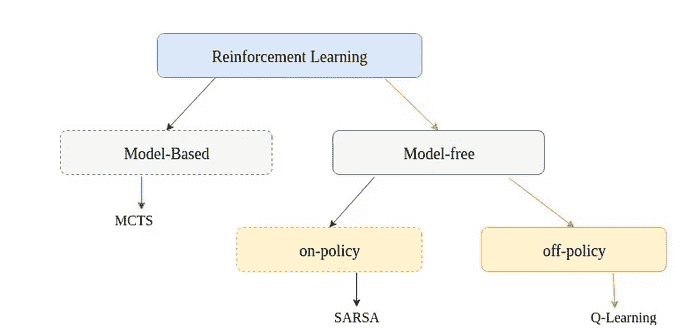
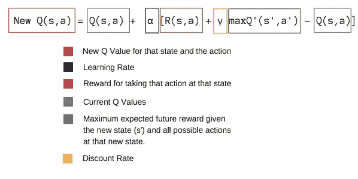

# q-局部搜索

> 原文：<https://towardsdatascience.com/q-localsearch-51e276d04d20?source=collection_archive---------12----------------------->


Photo by [Franki Chamaki](https://unsplash.com/photos/z4H9MYmWIMA?utm_source=unsplash&utm_medium=referral&utm_content=creditCopyText) on [Unsplash](https://unsplash.com/?utm_source=unsplash&utm_medium=referral&utm_content=creditCopyText)

## 一种基于 Q 学习的特征选择算法

“这次我不会再开什么无聊的玩笑，也不会做什么参考”，她就是这么说的！

在今天的文章中，我将尝试向您解释我上周一直在做什么，以及我在我的[上一篇文章](https://medium.com/@amineremache/the-local-search-problem-part-1-4daedbb2e482)中谈论的内容，任何评论或建议都将是很好的，即使您觉得您并不关心，也许您正在从一个可能有所帮助的角度看待它，您可以在此链接中找到完整的代码(确保选择分支:“local-search-rl”)。

总之，在这部分代码中，你可以看到有初始局部搜索函数和 q-局部搜索函数，保持代码的可扩展性很好，所以当我需要实现一个新算法时，我所要做的就是在它们之间进行选择，因为它们不会影响其他部分。

BSO algorithm

如果我们在蜜蜂的水平上考虑局部搜索的初始算法，它进行穷举搜索，换句话说，它采用解决方案，一个接一个地翻转它的所有位，并每次进行评估，这使得复杂性，如果我们将其作为训练模型的成本，相当于模型的属性数量(例如声纳数据集，有 60 个属性， 这意味着我们将训练 60 个模型)并且这仅针对单个蜜蜂，并且针对单次迭代，这使得复杂度: ***o(最大 Iter x Nbr 蜜蜂 x Nbr 本地 Iter x Nbr 属性)***

这是初始的本地搜索功能:

The original local search algorithm

Q-LocalSearch 背后的想法是提供“过滤”数据的子集(仍然是可选的)，智能地翻转属性**，或者换句话说，根据**策略**，以避免穷举搜索。**

**我们首先解释什么是 Q-Learning:**

**Q-learning 是由(Watkins & Dayan，1992)提出的一种无模型、非策略的强化学习算法。它包括评估状态-动作对的良好性。状态 s 和行动 a 的 q 值定义为在状态 s 采取行动 a，然后遵循*政策*的预期累积回报。**

****

**Reinforcement learning basic classification, [Source](https://www.mathworks.com/examples/matlab/community/36132-maze-solving-using-q-learning-algorithm)**

****蒙特卡罗树搜索** (MCTS)、**状态-动作-奖励-状态-动作** (SARSA)和 Q-Learning 是这种分类的一些示例算法。**

# **q 表**

**Q-Table 只是简单的跟踪表的一个花哨的名字，就像 T2 ADL T3 在他的文章 T5 中所说的。它通常由 2D 数组组成，其中行代表状态，列代表可能的动作，因为当您处理特性选择时，使用静态数据结构是不明智的，所以我使用字典列表[索引是 nbrOnes(state)]字典列表[关键字是“state”][关键字是“action”](python 中的字典或 dict，就像 JAVA 中的 HashMap)**

```
q_table[nbrOnes(state)][“state”][“action”]
```

# **q 函数**

**Q 学习算法基于下面给出的贝尔曼最优方程:**

**Q(状态，动作)= R(状态，动作)+ Gamma * Max[Q(下一个状态，所有动作)]**

****

**The Q-function explained**

**这就是我们每次更新表的方式，我们使用 Q 值来选择下一个状态，在这种情况下，要翻转哪些属性，这是 Q-LocalSearch 函数:**

**The Q-localSearch algorithm**

# **概述**

**为了概括我们今天在这里所做的事情，我们谈到了 Q-learning，以及我们如何使用它来制作所谓的 Q-LocalSearch 函数，这是一种使用 Q-learning 算法进行特征选择的方法。**

**对于这个模型，我们有:**

*   ****状态**:是特征的组合**
*   ****动作**:翻转特征**
*   ****奖励**:目前，我们认为状态动作的准确性(适合度)是一种奖励，但是在下一篇文章中，我们可能会更深入，看看为什么它不是定义它的最佳方式。**

**我真的希望你喜欢它，我试图把我认为重要的一切，如果你需要更多的细节，不要犹豫留下评论，或 PM 我。**

**是的，你可以随时查看我的[上一篇文章](https://medium.com/@amineremache/the-one-with-reinforcement-learning-9bcbddd75d15)。**

***原载于 2018 年 12 月 26 日*[*amineremache.blogspot.com*](https://amineremache.blogspot.com/2018/12/q-localsearch.html)*。***