# 基于深度学习的计算机视觉在制造业中的质量检测

> 原文：<https://towardsdatascience.com/quality-inspection-in-manufacturing-using-deep-learning-based-computer-vision-daa3f8f74f45?source=collection_archive---------5----------------------->

## 通过图像识别去除劣质材料来提高产量

**作者:帕萨·德卡**和**罗希特·米塔尔**

**工业制造中的自动化:**

当今制造业自动化水平的提高也要求在很少人工干预的情况下实现材料质量检测的自动化。自动化质量检测的趋势是达到人类水平或更高的精度。为了保持竞争力，现代工业企业努力实现自动化的数量和质量，而不牺牲其中一个。这篇文章向用户展示了深度学习的一个用例，并展示了优化整个堆栈(算法、推理框架和硬件加速器)以获得最佳性能的需求。

**质量检测深度学习:**

为了达到行业标准，制造企业的质量检查员通常在产品制造完成后检查产品质量，这是一项耗时的人工工作，不合格产品会导致上游工厂产能、耗材、劳动力和成本的浪费。随着人工智能的现代趋势，工业企业正在寻求在生产周期中使用基于深度学习的计算机视觉技术来自动化材料质量检测。目标是最大限度地减少人工干预，同时达到人类水平或更高的精度，并优化工厂产能、劳动力成本等。深度学习的用途是多种多样的，从自动驾驶汽车中的物体检测到医学成像中的疾病检测，深度学习已经被证明可以达到人类水平的准确性，甚至更好。

**什么是深度学习？**

深度学习是学习数据的深度结构化和非结构化表示的领域。当数据庞大而复杂时，深度学习是人工智能的发展趋势，可以抽象出更好的结果。深度学习架构由神经网络的深层组成，如输入层、隐藏层和输出层。隐藏层用于理解数据的复杂结构。神经网络不需要被编程来执行复杂的任务。千兆字节到兆兆字节的数据被馈送到神经网络架构，以便自己学习。下面是深度神经网络的示例:

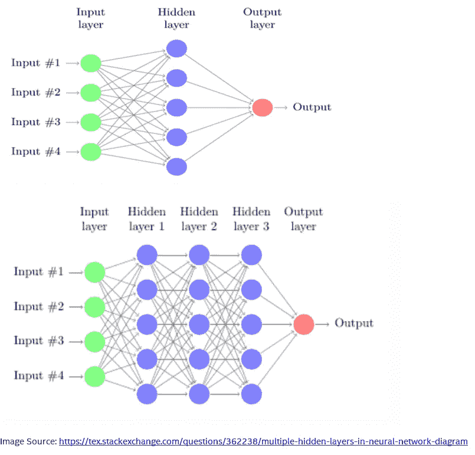

**卷积神经网络**:

卷积神经网络是一类常用于图像分析的深度神经网络。卷积层对输入应用卷积运算，并将结果传递给下一层。例如，1000 乘 1000 像素的图像有一百万个特征。如果第一个隐藏层有 1000 个神经元，那么在第一个隐藏层之后，它最终会有 10 亿个特征。有这么多特征，很难防止神经网络用较少的数据过度拟合。训练一个具有十亿个特征的神经网络的计算和存储要求是非常高的。卷积运算为这一问题带来了解决方案，因为它减少了自由要素的数量，从而允许网络更深且要素更少。与完全连接的图层相比，使用卷积图层有两个主要优势-参数共享和连接稀疏。

卷积神经网络在图像中寻找模式。图像与较小的矩阵进行卷积，并且该卷积寻找图像中的模式。前几层可以识别线/角/边等，这些模式被传递到更深的神经网络层，以识别更复杂的特征。CNN 的这个属性确实很擅长识别图像中的物体。

卷积神经网络(又名 ConvNet)只不过是一系列层。三种主要类型的层用于构建 ConvNet 架构:**卷积层**、**池层**和**全连接层**。这些层是堆叠的层，以形成完整的 ConvNet **架构:**

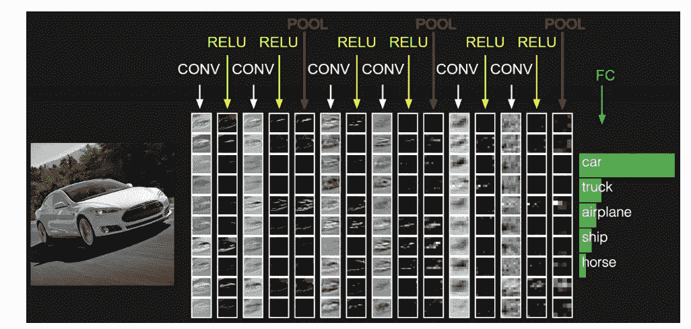

图片来源:[http://cs231n.github.io/convolutional-networks/](http://cs231n.github.io/convolutional-networks/)

下图阐明了**卷积层**的概念:

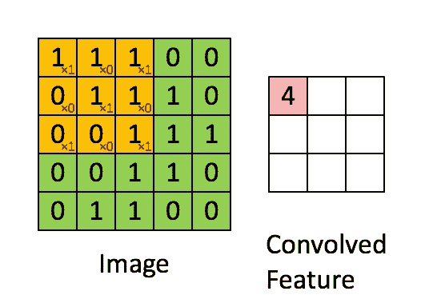

下图阐明了**池层(平均或最大池)**的概念:

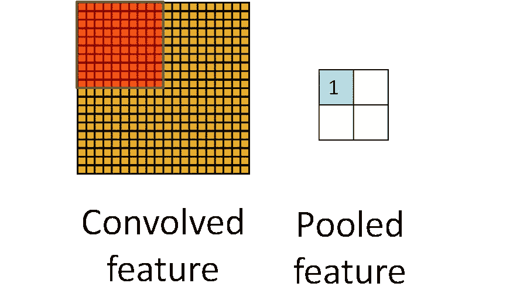

以下是 CNN 最初的架构之一:

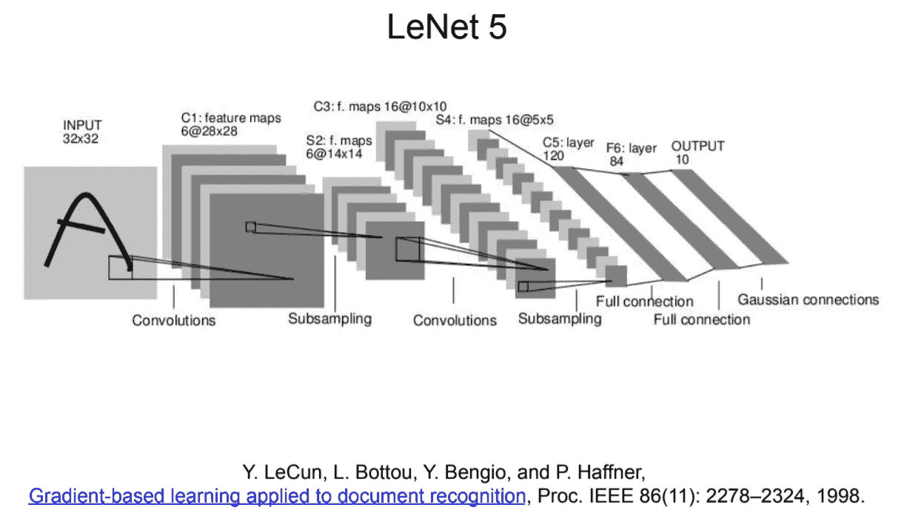

**可视化 CNN** :

以下是平面上裂纹的图像:

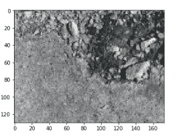

类似于 LENET-5 架构的两层 Conv(一个 3X3 过滤器)、ReLU 和 Max Pooling (2X2)应用于上面的裂缝图像。从下面可以看出，CNN 架构关注的是裂缝区域的区块及其在整个表面的扩散:

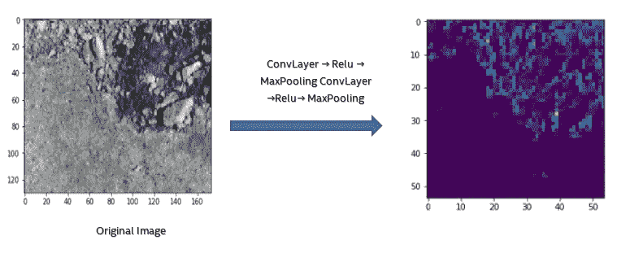

**案例分析:**

**为了保持我们工作的机密性，我们在下面呈现一个抽象用例:**

**问题陈述:**

检测硬件制造中的劣质材料是一个容易出错且耗时的手动过程，会导致误报(将劣质材料检测为优质材料)。如果在生产线末端检测到有缺陷的组件/零件，就会造成上游劳动力、耗材、工厂产能和收入的损失。另一方面，如果未检测到的不良零件进入最终产品，将会影响客户和市场反应。这可能对本组织的声誉造成不可挽回的损害。

**总结**:

我们使用深度学习对硬件产品进行自动化缺陷检测。在我们的硬件制造过程中，可能会出现划痕/裂纹等损坏，使我们的产品无法用于生产线的后续工序。我们的深度学习应用程序以人类水平的精度在毫秒内检测到裂纹/划痕等缺陷，并通过热图解释图像中的缺陷区域。

**我们深度学习架构的细节**:

为了更好地描述，我们在下面使用一个带有集成芯片的电路板示例图像:

**我们的第一次进场**:

我们采用了纯计算机视觉方法(非机器学习方法)的组合来从原始图像中提取感兴趣区域(ROI ),并采用纯深度学习方法来检测 ROI 中的缺陷。

**为什么在 DL** 之前提取 ROI？

当捕捉图像时，相机组件、照明等。专注于赛道的整个区域(下图)。我们只检查芯片区域的缺陷，不检查电路中的其他区域。我们通过几个实验发现，当神经网络仅关注感兴趣的区域而不是整个区域时，DL 准确性显著增加。

*   首先用计算机视觉(非机器学习方法)提取“感兴趣区域(ROI)”。这里，我们对图像进行多种处理，如灰度缩放、腐蚀、膨胀、关闭图像等变换。并最终根据用例类型/产品类型等从图像中绘制出 ROI。侵蚀的基本概念就像土壤侵蚀一样——它侵蚀掉前景对象的边界。扩张与侵蚀正好相反，它增加了前景对象的大小。通常，在像噪声去除这样的情况下，侵蚀之后是膨胀。开放只是侵蚀和扩张的另一个名称。它在消除噪音方面很有用。关闭与打开相反，先膨胀后侵蚀。它在关闭前景对象内的小孔或对象上的小黑点时很有用。梯度变换是图像的膨胀和腐蚀之间的差异。总的来说，这些步骤有助于打开原始图像中几乎看不见的裂缝/划痕。参考下图:

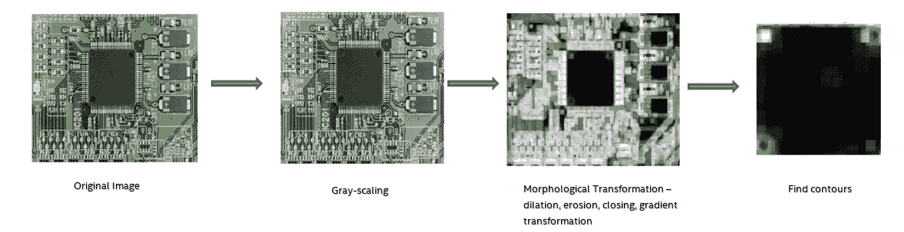

*   第二，使用深度神经网络(基于深度神经网络(CNN)的模型)来检测缺陷，使用已证实的 CNN 拓扑，例如 Inception Net(又名 Google Net)、Res Net、Dense Net:

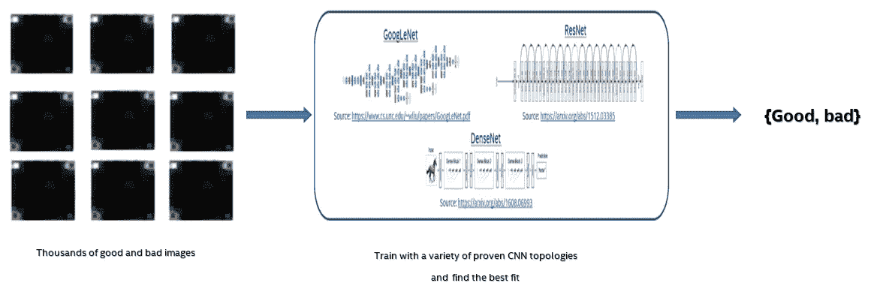

为了找到最佳架构，需要进行实验的其他一些领域

*   **数据扩充**:我们有几千张被标记为缺陷的独特图像，还有几千张被标记为良好图像。扩充对于避免过度适应训练集至关重要。我们做了 X 个随机裁剪和 Y 个旋转(1 个原始图像产生 X*Y 个增强图像)。在增强之后，我们有 X*Y 千个有缺陷的图像和 X*Y 千个好的图像。参考 CNN 在这方面的一篇原始论文[https://papers . nips . cc/paper/4824-imagenet-class ification-with-deep-convolutionary-neural-networks . pdf](https://papers.nips.cc/paper/4824-imagenet-classification-with-deep-convolutional-neural-networks.pdf)
*   **初始化策略**用于 **CNN** 拓扑结构:

我们用自己的 FC 层和 sigmoid 层(二进制分类)替换了最终连接的层，如下图所示:

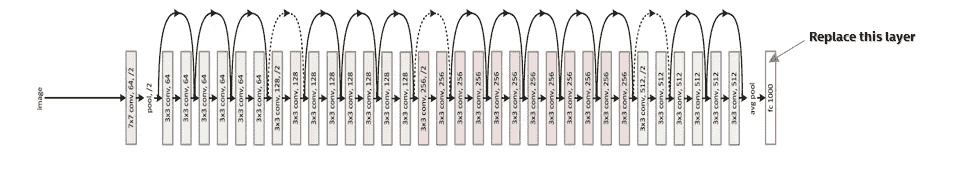

对于每个 CNN 拓扑，我们考虑 ImageNet 初始化，而不是随机初始化每一层中的权重，当我们使用 ImageNet 初始化时，我们的 DL 准确性比随机大大增加。

*   **损失函数**和**优化器**:

**交叉熵损失**:交叉熵损失，或对数损失，测量分类模型的性能，其输出是 0 和 1 之间的概率值。交叉熵损失随着预测概率偏离实际标签而增加。因此，当实际观察值为 1 时，预测概率为 0.01 将是糟糕的，并导致高损失值。完美的模型的对数损失为 0

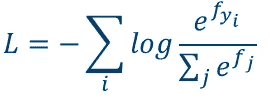

**SGD** 和**内斯特罗夫动量:SGD** 或随机梯度下降是一种[迭代方法](https://en.wikipedia.org/wiki/Iterative_method)用于[优化](https://en.wikipedia.org/wiki/Mathematical_optimization)一个[可微](https://en.wikipedia.org/wiki/Differentiable_function) [目标函数](https://en.wikipedia.org/wiki/Objective_function)(损失函数)，它是随机的，因为它从数据中抽取随机样本来做梯度下降更新。动量是梯度的移动平均值，它用于更新网络的权重，并有助于在正确的方向上加速梯度。**内斯特罗夫**是最近开始流行的一个版本的动量。

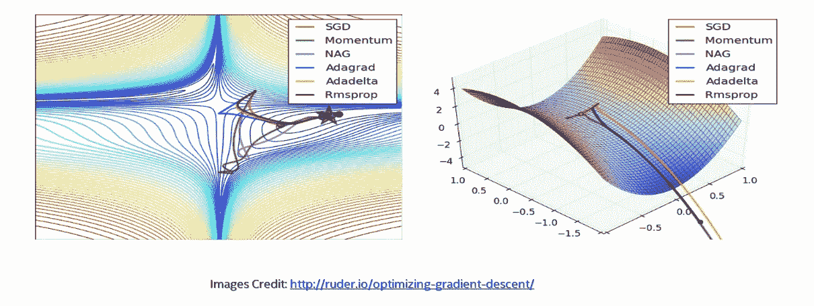

**我们的第二种方法**:

**对第一种方法的评论**:在提取感兴趣区域时，每当产品类型、电路板类型/芯片类型(在我们的抽象示例中)、摄像机设置/方向等发生变化时，都需要重写代码。这是不可伸缩的。

**解决方案:**我们构建了一个端到端的两步 DL 架构。在第一步中，我们没有使用 CV 方法，而是使用 DL 方法来预测 ROI 本身。我们用边界框工具&手动创建了一个带标签的数据集，我们让训练一个 DL 架构来预测 ROI。这种技术的一个缺点是标签数据集必须足够明确和广泛，以包括所有产品类型等。(在我们的抽象示例的情况下，为电路板类型/芯片类型)用于深度神经网络在看不见的图像上很好地概括。参考下图:

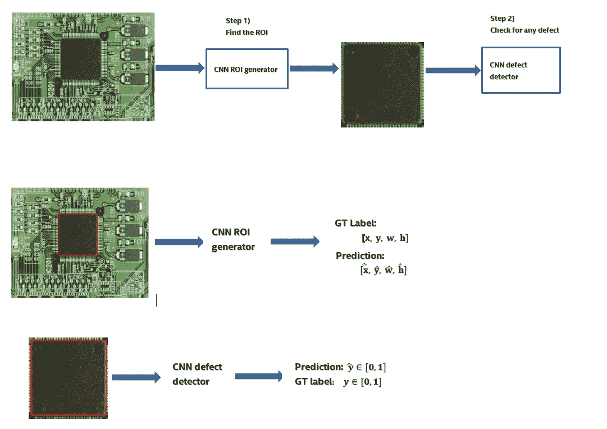

*   **CNN ROI 生成器损失函数:**

我们最初使用基于平方距离的损失函数如下:

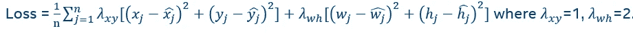

在验证集上对 Resnet50 模型进行 20 个时期的训练后，我们在平均遗漏面积和 IOU 上实现了以下验证指标:

**平均漏测面积= 8.52 * 10–3**

**Ave. IOU(交集/并集)= 0.7817**

我们希望至少在欠条上有所改进

我们想出了一个基于面积的损失，请参考下图，以了解我们如何使用基本数学来计算地面真实值和预测标签之间的相交面积。在损失函数中，我们希望惩罚错过的区域和超出的区域。理想情况下，我们希望对遗漏区域的惩罚多于对超出区域的惩罚:

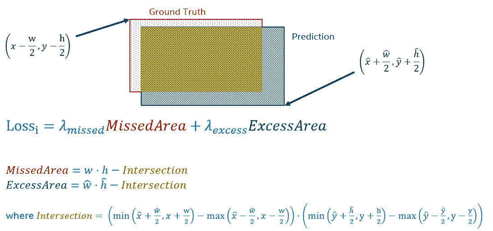

上面的损失函数是可微的，因此我们可以对损失函数进行梯度下降优化

*   **CNN ROI 生成器增强**:我们只是在训练时间和测试时间在我们预测的 ROI 上增加了 5%(左右)的余量
*   **CNN ROI 生成器结果:**我们使用 resnet 50(ImageNet initialization)topology 和 SGD +内斯特罗夫动量优化器，其中=2，=1 在**区域基于损失**如上所述。为多个时期训练 Resnet50 模型，我们希望最小化我们的平均值。错过的区域和最大化我们的平均值。IOU(最佳 IOU 为‘1’)。经过 20 个时期的训练后，我们在验证集上实现了以下内容，通过基于面积的损失和增加，我们改进了(如上所述)我们关于遗漏面积和 IOU 的验证度量:

平均缺失面积= 3.65 * 10–3

平均 IOU(并集上的交集)= 0.8577

**实验&基准**:

图像总数:几千张图像

数据分割:80:10:10 分割，仅使用独特的图像

使用的框架:PyTorch & Tensorflow / Keras

重量初始化:在 ImageNet 上预先训练

优化器:学习率= 0.001 的 SGD，使用动量= 0.9 的内斯特罗夫

损失:交叉熵

批量:12 个

纪元总数:24

图像形状:224 x224 x3(Inception V3 除外，它需要 299x299x3)

标准:最低验证损失

我们对这两种方法的基准测试相当接近，CV+DL(第一种)方法的结果比 DL+DL(第二种)方法好不了多少。我们相信，如果我们能创建一个广泛和明确的带标签的包围盒数据集，我们的 DL+DL 会更好。

成功完成训练后，必须找到推理解决方案来完成整个端到端解决方案。我们使用英特尔 OpenVino 软件来优化除 CPU 之外的不同类型硬件中的推理，如 FPGA、英特尔 Movidius 等。

**推论**:

**英特尔开放 Vino** :基于卷积神经网络(CNN)，英特尔开放 Vino 工具包将工作负载扩展到整个英特尔硬件，并最大限度地提高性能:

-在边缘实现基于 CNN 的深度学习推理

-使用通用 API 支持跨计算机视觉加速器(CPU、GPU、英特尔 Movidius 神经计算棒和 FPGA)的异构执行

-通过函数库和预先优化的内核加快上市时间

-包括针对 OpenCV 和 OpenVX*的优化调用

请参考以下开放式葡萄酒架构图:

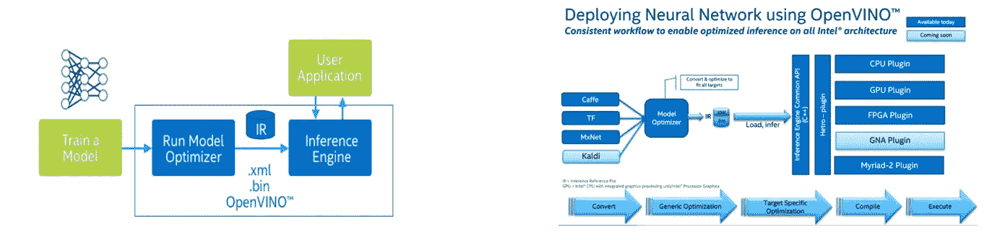

两步部署:

-第一步是使用**模型优化器**将预训练模型转换成 IRs:

**产生一个有效的中间表示**:如果这个主转换工件无效，那么推理机就不能运行。模型优化器的主要职责是生成两个文件来形成中间表示。

**产生优化的中间表示:**预训练的模型包含对训练很重要的层，例如丢弃层。这些层在推理过程中没有用，可能会增加推理时间。在许多情况下，这些层可以从生成的中间表示中自动移除。但是，如果一组层可以表示为一个数学运算，因此可以表示为一个层，则模型优化器会识别这种模式并用一个层替换这些层。结果是一个比原始模型层数更少的中间表示。这减少了推断时间。

IR 是描述整个模型的一对文件:

**。xml** :描述网络拓扑

**。bin** :包含权重和偏差二进制数据

-第二步是使用**推理引擎**来读取、加载和推理 IR 文件，使用跨 CPU、GPU 或 VPU 硬件的通用 API

打开 Vino 文档:[https://software . Intel . com/en-us/inference-trained-models-with-Intel-dl-deployment-toolkit-beta-2017 R3](https://software.intel.com/en-us/inference-trained-models-with-intel-dl-deployment-toolkit-beta-2017r3)

**样本图像上的推理基准:**

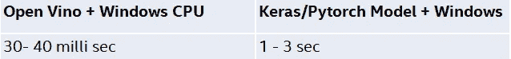

很明显，使用软件堆栈进行优化对于减少推理时间至关重要。使用 OpenVino 软件优化，延迟时间提高了 30 到 100 倍。此外，英特尔 Movidius 和 FPGA 等其他英特尔硬件加速器也进行了相同的推理测试。目的是看看加速器相对于传统 CPU 能有多少改进。下面是一些关于示例图像的推理基准:

使用英特尔 Movidius Myriad1，使用 NCS SDK 将我们的 Resnet-50 Tensorflow/Keras 模型转换为 NCS 图形，Raspberry Pi 托管图像，推理由 movidius stick 中的视觉处理单元执行。movidius stick 的计算能力较低，因此该加速器没有提供大的性能提升。此外，使用的软件框架是一个 NCS 图，它可能不包含 OpenVino 等框架的所有性能提升(稀疏性、量化等)。

*使用为我们的 Resnet-50 型号提供的位流，在 linux 机器上使用 Open Vino 配置和编程 FPGA 板。FPGA 就像一个真正的加速器，在相同的软件框架(OpenVino)下，比 CPU 进一步提高了约 10 倍。

**上述性能数字清楚地表明，需要一个整体视图来提高深度学习性能。优化的软件堆栈和硬件加速器都是实现最佳性能所必需的。**

**用热图可视化我们的 CNN**:

通常，深度神经网络因可解释性低而受到批评，大多数深度学习解决方案在标签分类完成时就停止了。我们想解释我们的结果，为什么 CNN 架构将一个图像标记为好或坏(我们案例研究的二进制分类)，CNN 最关注图像中的哪个区域。

基于麻省理工学院[https://arxiv.org/pdf/1512.04150.pdf](https://arxiv.org/pdf/1512.04150.pdf)的这项研究，已经提出了结合全局最大池层的类激活图来定位特定于类的图像区域。

全球平均池通常作为一个正则化，防止在训练期间过度拟合。本研究证实，全局平均池层的优势不仅仅是作为一个正则化层，只要稍加调整，网络就能保持其卓越的定位能力，直到最后一层。这种调整允许在单次向前传递中容易地识别区别性图像区域，用于各种各样的任务，甚至那些网络最初没有被训练的任务。

以下是使用 ImageNet 上训练的 Resnet-50 架构，在“平面上的裂纹”图像上使用该技术的热图解释。正如我们所看到的，热图聚焦于下面的裂缝区域，尽管建筑并没有在这样的图像上训练——

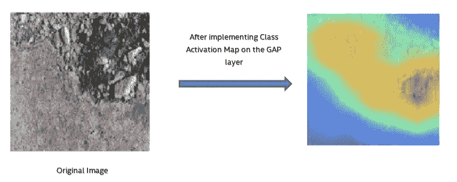

**总结&结论:**

通过基于深度学习的计算机视觉，我们实现了人类水平的准确性，并且我们的两种方法——c v+ DL 和 DL+DL(在本博客的前面讨论过)都更好。我们的解决方案是独特的——我们不仅使用深度学习进行分类，还使用图像本身的热图来解释缺陷区域。

人的因素不能完全分离，但我们可以大大减少人为干预。最佳模型总是在 FPR(假阳性率)和 FNR(假阴性率)或精确度和召回率之间微调。对于我们的用例，我们使用一个针对低 FNR(高召回率)优化的模型成功地自动化了缺陷检测。我们大幅降低了人工审查率。通过我们的案例研究，我们证明了我们可以通过深度学习实现材料检测自动化，并降低人工审查率。

参考资料:

[https://www . coursera . org/learn/卷积神经网络](https://www.coursera.org/learn/convolutional-neural-networks)

[https://arxiv.org/abs/1512.03385](https://arxiv.org/abs/1512.03385)

[http://cs231n.github.io/convolutional-networks/](http://cs231n.github.io/convolutional-networks/)

[https://papers . nips . cc/paper/4824-imagenet-class ification-with-deep-convolutionary-neural-networks . pdf](https://papers.nips.cc/paper/4824-imagenet-classification-with-deep-convolutional-neural-networks.pdf)

www.quora.com

【https://arxiv.org/pdf/1512.04150.pdf 

[https://keras.io/](https://keras.io/)

[https://pytorch.org/](https://pytorch.org/)

[https://opencv.org/](https://opencv.org/)

[https://software.intel.com/en-us/openvino-toolkit/](https://software.intel.com/en-us/openvino-toolkit/)

[https://movidius.github.io/ncsdk/](https://movidius.github.io/ncsdk/)