# 分位数回归，从线性模型到树再到深度学习

> 原文：<https://towardsdatascience.com/quantile-regression-from-linear-models-to-trees-to-deep-learning-af3738b527c3?source=collection_archive---------4----------------------->

假设一位房地产分析师想根据房屋年龄和离就业中心的距离等因素来预测房价。典型的目标将是在给定这些因素的情况下，生成最佳房价点估计值，其中“最佳”通常指的是使与现实的平方偏差最小化的估计值。

但是如果他们不仅想预测一个单一的估计值，还想预测可能的范围呢？这被称为*预测区间*，产生它们的一般方法被称为*分位数回归*。在这篇文章中，我将描述这个问题是如何形式化的；如何用六种线性的、基于树的、深度学习的方法实现(用 Python — [这里是 Jupyter 笔记本](https://colab.research.google.com/drive/1nXOlrmVHqCHiixqiMF6H8LSciz583_W2))；以及它们在真实数据集上的表现。

# 分位数回归最小化分位数损失

正如回归最小化平方误差损失函数来预测单点估计一样，分位数回归在预测某个分位数时最小化*分位数损失*。最常见的分位数是中间值，或第 50 个百分位数，在这种情况下，分位数损失就是绝对*误差的总和。其他分位数可以给出预测区间的端点；例如，中间 80%的范围由第 10 和第 90 个百分位数定义。分位数损失根据所评估的分位数而不同，例如，对于较高的分位数，负误差越多，惩罚越多；对于较低的分位数，正误差越多，惩罚越多。*

在深入研究公式之前，假设我们已经对一个真值为零的单点进行了预测，我们的预测范围从-1 到+1；也就是说，我们的误差范围也是从-1 到+1。该图显示了分位数损失如何随误差而变化，具体取决于分位数。

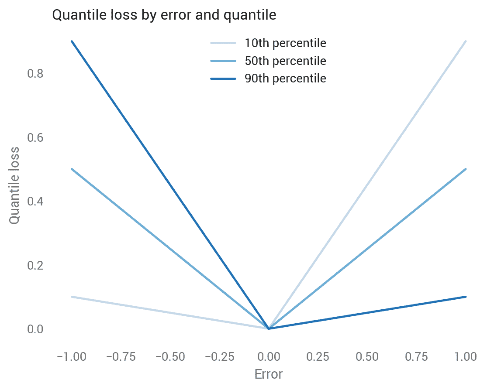

让我们分别看一下每一行:

*   **中间的蓝线显示了中位数**，其围绕零对称，其中所有损失都等于零，因为预测是完美的。到目前为止看起来不错:中间值旨在将预测集一分为二，因此我们希望对低估和高估进行同等的权衡。我们很快就会看到，中位数周围的分位数损失是绝对偏差的一半，因此-1 和+1 都是 0.5，0 是 0。
*   **浅蓝色线显示第 10 个百分位数**，负误差损失较低，正误差损失较高。第 10 个百分位数意味着我们认为有 10%的可能性真实值低于预测值，因此低估比高估损失更小是有意义的。
*   **深蓝色线显示第 90 百分位，**是第 10 百分位的反向模式。

对于低估和高估的预测，我们也可以通过分位数来观察这一点。分位数越高，分位数损失函数对低估的惩罚越多，对高估的惩罚越少。

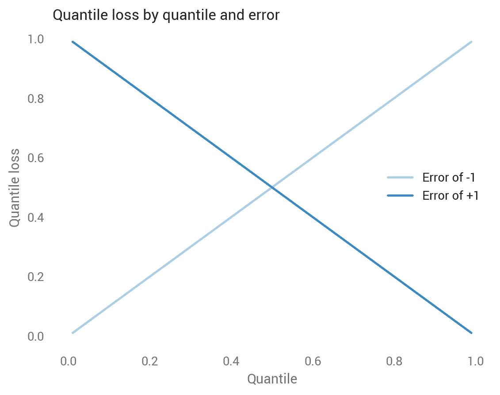

鉴于这种直觉，以下是分位数损失公式([来源](/deep-quantile-regression-c85481548b5a)):

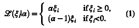

在 Python 代码中，我们可以用`maximum`语句替换分支逻辑:

```
def quantile_loss(q, y, f):
  # q: Quantile to be evaluated, e.g., 0.5 for median.
  # y: True value.
  # f: Fitted (predicted) value.
  e = y - f
  return np.maximum(q * e, (q - 1) * e)
```

接下来，我们将了解六种方法——OLS、线性分位数回归、随机森林、梯度增强、Keras 和 tensor flow——并了解它们如何处理一些真实数据。

# 数据

该分析将使用[波士顿住房数据集](https://www.kaggle.com/c/boston-housing)，该数据集包含代表波士顿地区城镇的 506 个观察值。它包括 13 个特征和目标，即业主自住房屋的中值。因此，分位数回归预测的是房屋中值低于某个值的城镇(而不是房屋)的比例。

我对 80%的模型进行训练，对剩下的 20%进行测试。为了更容易可视化，第一组模型使用了一个单一的特征:`AGE`，1940 年之前建造的业主自住单元的比例。正如我们可能预料的那样，有旧房子的城镇有较低的房屋价值，尽管这种关系是吵闹的。

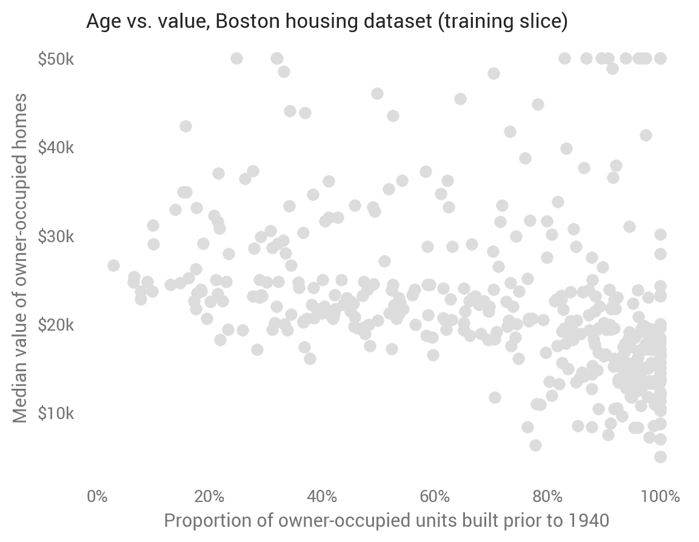

对于每种方法，我们将预测测试集上的第 10、30、50、70 和 90 个百分点。

# 普通最小二乘法

尽管 OLS 预测的是平均值而不是中值，但我们仍然可以根据标准误差和逆正态 CDF 来计算预测区间:

```
def ols_quantile(m, X, q):
  # m: OLS statsmodels model.
  # X: X matrix.
  # q: Quantile.
  mean_pred = m.predict(X)
  se = np.sqrt(m.scale)
  return mean_pred + norm.ppf(q) * se
```

这种基线方法产生以平均值(预测为中位数)为中心的线性和平行分位数。一个调整良好的模型将显示大约 80%的点在顶线和底线之间。请注意，这些点与第一个散点图不同，因为这里我们显示的是评估样本外预测的测试集。

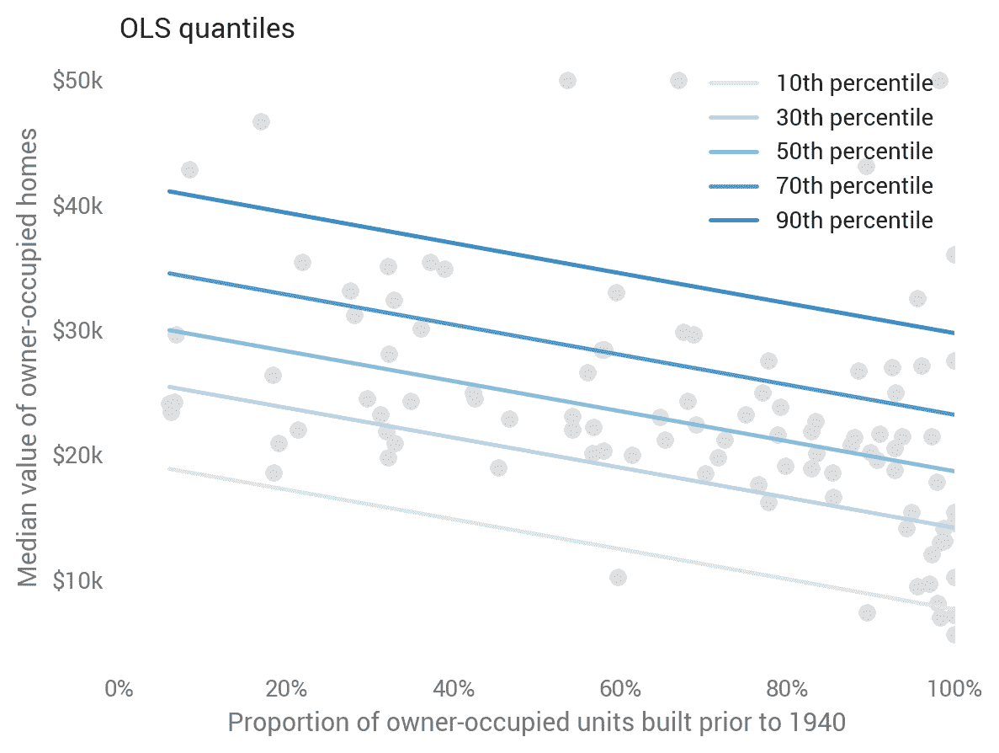

# 线性分位数回归

线性模型从平均值扩展到中位数和其他分位数。线性分位数回归预测给定的分位数，放松了 OLS 的平行趋势假设，同时仍然保持线性(在引擎盖下，它最小化了分位数损失)。这是用`statsmodels`直截了当的说法:

```
sm.QuantReg(train_labels, X_train).fit(q=q).predict(X_test)
# Provide q.
```

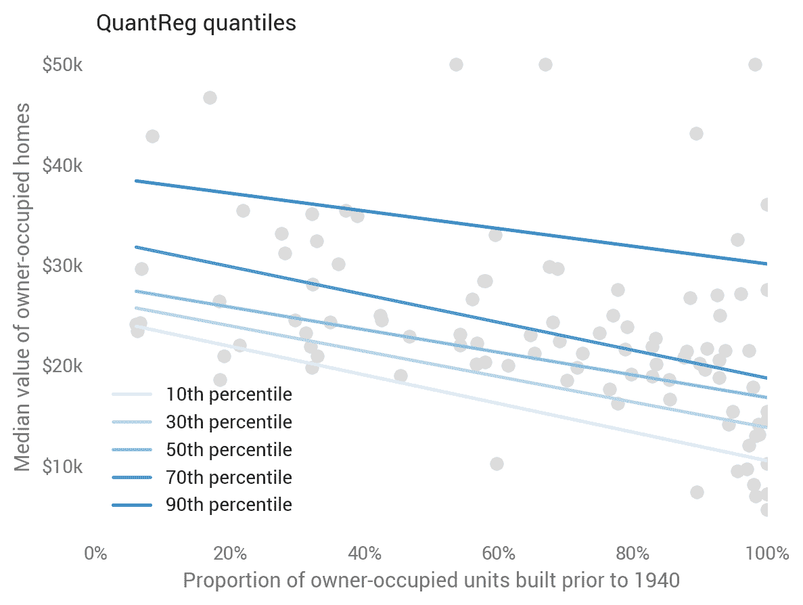

# 随机森林

我们第一次离开线性模型是[随机森林](https://en.wikipedia.org/wiki/Random_forest)，一个树木的集合。虽然这个模型没有明确地预测分位数，但我们可以将每棵树视为一个可能的值，并使用其[经验 CDF](https://en.wikipedia.org/wiki/Empirical_distribution_function) ( [Ando Saabas 在此](https://blog.datadive.net/prediction-intervals-for-random-forests/))计算分位数:

```
def rf_quantile(m, X, q):
  # m: sklearn random forests model.
  # X: X matrix.
  # q: Quantile.
  rf_preds = []
  for estimator in m.estimators_:
    rf_preds.append(estimator.predict(X))
  # One row per record.
  rf_preds = np.array(rf_preds).transpose()
  return np.percentile(rf_preds, q * 100, axis=1)
```

在这种情况下，它变得有点疯狂，表明过度拟合。由于随机森林更常用于高维数据集，我们将在向模型添加更多要素后再讨论它们。

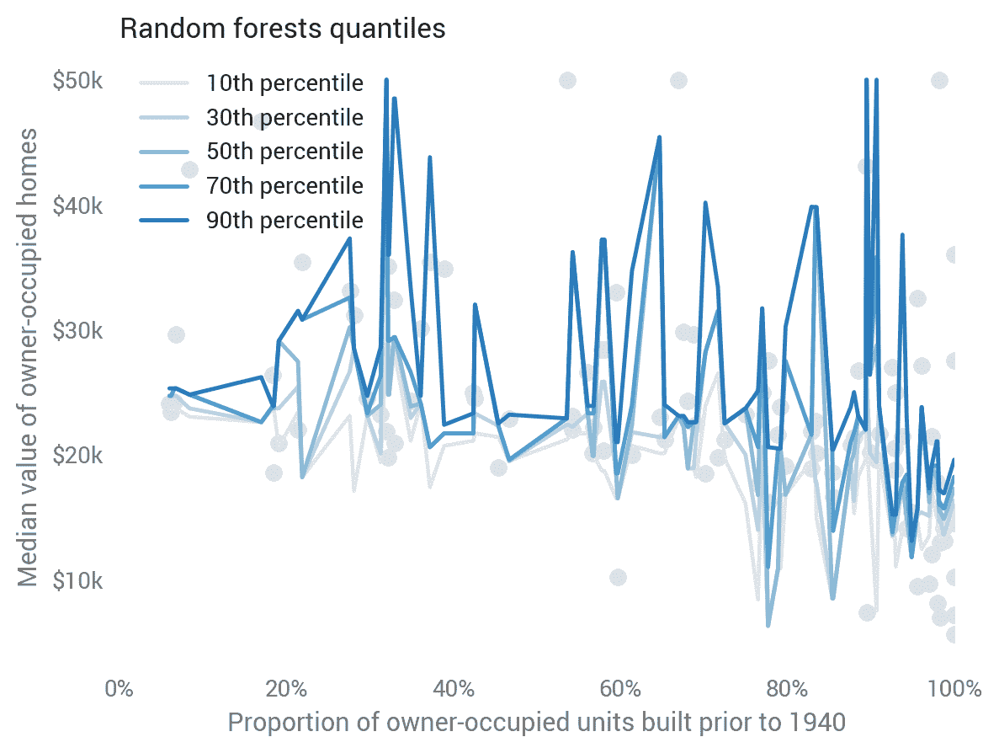

# 梯度推进

另一种基于树的方法是[梯度提升](https://en.wikipedia.org/wiki/Gradient_boosting)，`scikit-learn`的[实现，其中](http://scikit-learn.org/stable/modules/generated/sklearn.ensemble.GradientBoostingRegressor.html)支持显式分位数预测:

```
ensemble.GradientBoostingRegressor(loss='quantile', alpha=q)
```

虽然不像随机森林那样不稳定，但在单特征模型上看起来也不太好。

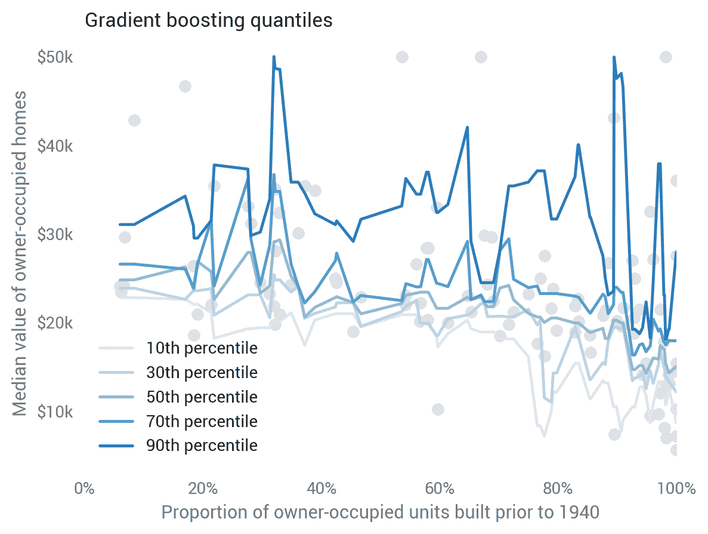

# 深度学习

[Keras](https://keras.io/) 是一个用户友好的神经网络工具包包装器，包括 [TensorFlow](http://tensorflow.org) 。我们可以使用深度神经网络通过传递分位数损失函数来预测分位数。代码有点复杂，所以查看一下 [Jupyter 笔记本](https://colab.research.google.com/drive/1nXOlrmVHqCHiixqiMF6H8LSciz583_W2#scrollTo=g7s7Grj-A-Sf)或[阅读更多来自](/deep-quantile-regression-c85481548b5a)Sachin Abeywardana 的内容，看看它是如何工作的。

最深层的网络是带有纽结的线性模型(称为*校正线性单位*，或 *ReLUs* )，我们可以在这里直观地看到:Keras 预测，大约 70%建于 1940 年之前的城镇的房屋价值会出现更多的聚集，而在非常低和非常高的年龄段会出现更多的分散。基于测试数据的拟合，这似乎是一个很好的预测。

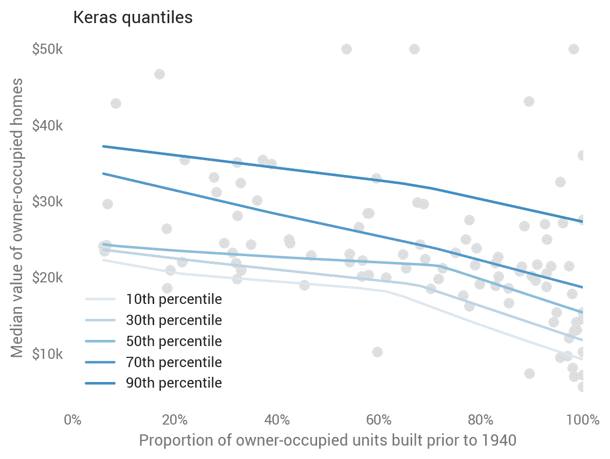

# 张量流

Keras 的一个缺点是每个分位数必须单独训练。为了利用分位数共有的模式，我们必须使用 TensorFlow 本身。参见[朱庇特笔记本](https://colab.research.google.com/drive/1nXOlrmVHqCHiixqiMF6H8LSciz583_W2#scrollTo=g7s7Grj-A-Sf)和[雅各布·茨威格](https://medium.com/u/4459aa7bce57?source=post_page-----af3738b527c3--------------------------------)的[文章](/deep-quantile-regression-in-tensorflow-1dbc792fe597)了解更多信息。

我们可以在其预测中看到分位数之间的这种共同学习，其中模型学习一个共同的扭结，而不是每个分位数的单独扭结。这看起来是一个受奥卡姆启发的好选择。

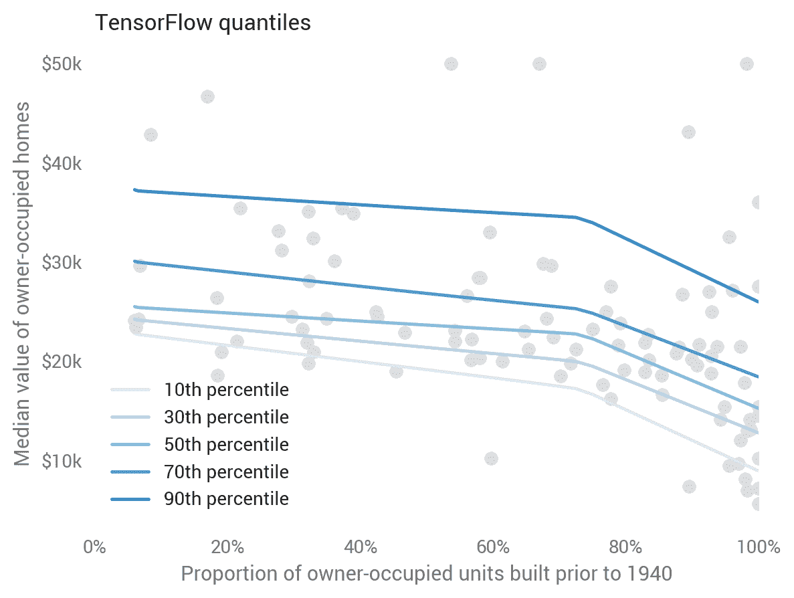

# 哪个做得最好？

目测表明深度学习做得很好，线性模型做得还可以，基于树的方法做得很差，但是我们能量化哪个最好吗？是的，我们可以，使用测试集的分位数损失。

回想一下，分位数损失因分位数而异。因为我们计算了五个分位数，所以测试集中的每个观察值都有五个分位数损失。所有分位数观察的平均值证实了视觉直觉:随机森林表现最差，而张量流表现最好。

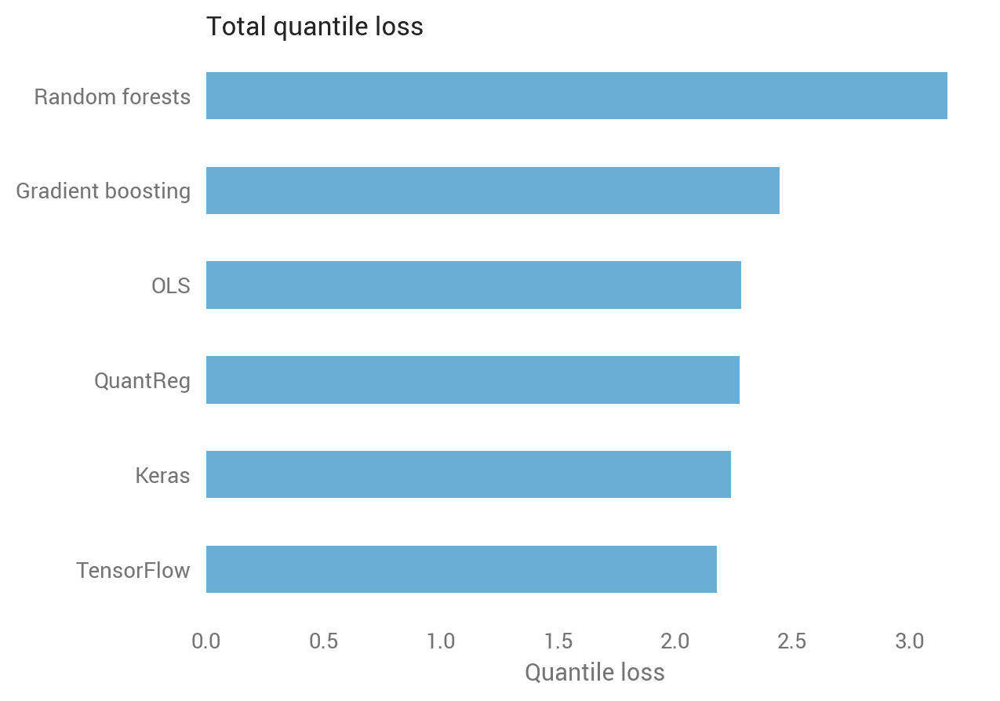

我们也可以通过分位数来打破这一点，揭示出基于树的方法在第 90 个百分位数表现特别差，而深度学习在较低的分位数表现最好。

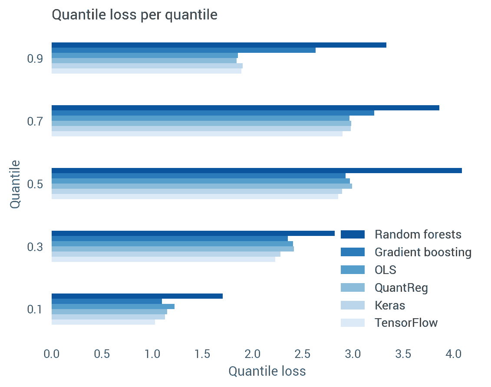

# 较大的数据集为 OLS 提供了更多的改进机会

因此，随机森林对于这种单要素数据集来说很糟糕，但这不是它们的用途。如果我们将其他 12 个特征添加到波士顿住房模型中会发生什么？

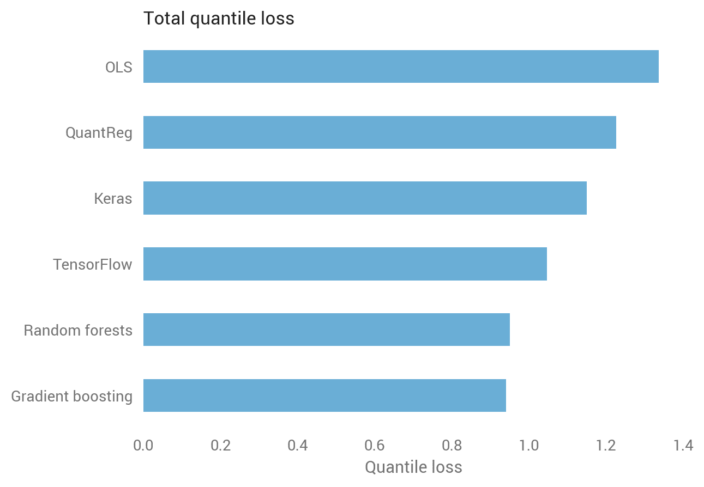

基于树的方法卷土重来，虽然 OLS 有所改善，但 OLS 和其他非树方法之间的差距越来越大。

现实世界的问题往往超出预测手段。也许一个应用开发者感兴趣的不仅仅是用户的预期使用量，还有他们成为超级用户的概率。或者某车险公司想知道不同门槛下司机高额理赔的几率。经济学家可能希望从一个数据集到另一个数据集随机估算信息，从 CDF 中挑选以确保适当的变化(我将在后续文章中探讨这个例子)。

分位数回归对于这些用例中的每一个都是有价值的，机器学习工具通常可以胜过线性模型，尤其是易于使用的基于树的方法。在你自己的数据上尝试一下，让我知道效果如何！