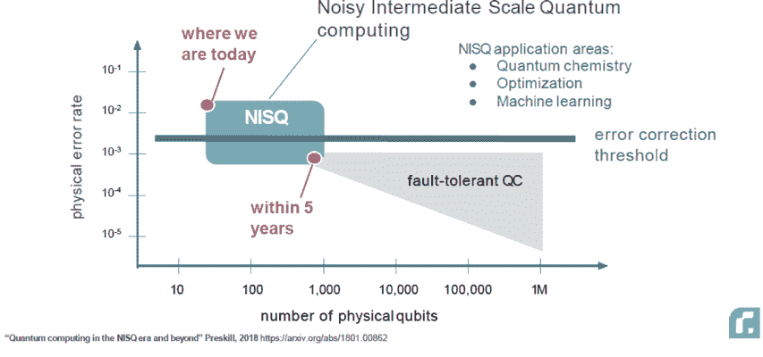

# 量子优势，或者量子计算机工作的实际演示

> 原文：<https://towardsdatascience.com/quantum-advantage-b3458646bd9?source=collection_archive---------8----------------------->

量子计算在科技界变得越来越明显。有十几家硬件公司，每家都在试图建立自己的量子计算机，从 Xanadu 这样的小型初创公司，到 D-Wave 或 Rigetti 这样的中型公司，再到谷歌、微软或 IBM 这样的大型企业。最重要的是，有几十家软件公司试图在现有的不完善的设备上实现量子算法。今天，我们生活在 NISQ 时代——嘈杂的中等规模量子——明年将有多达 128 个量子比特可用。

硬件公司正忙于扩大量子计算机的规模，提高计算的保真度，减少噪音。然而，每个人心里想的都是量子优势，这是一个实际的证明，量子计算机可以比经典计算机更好地解决现实世界的问题。

展示量子优势是硬件和软件公司的圣杯。谷歌[最近宣布](https://www.technologyreview.com/s/612381/google-has-enlisted-nasa-to-help-it-prove-quantum-supremacy-within-months/?fbclid=IwAR3Vjq52SB1RoBP_NalMvMrA1uKvrlxim8y0o15pPMNBardZD9J_mCTiEkQ)与美国宇航局合作，共同致力于此，里盖蒂[设立了 100 万美元的奖金](https://medium.com/rigetti/the-rigetti-quantum-advantage-prize-8976492c5c64)“用于量子云服务平台上量子优势的首次决定性展示”，普遍预期这一目标应该可以在未来 12 个月内实现。

量子优势并不意味着量子计算机会突然取代经典计算机。它更多的是证明，对于经典计算机难以解决的一些问题，量子计算能够提供令人信服的解决方案。到目前为止，当提供量子推进的解决方案后来再次被经典计算机击败时，有很多激动人心的事情，但也有很多破碎的梦想和倒退，例如尤因·唐在去年夏天的一些案例中展示了这一点(查看[的论文](https://arxiv.org/pdf/1807.04271.pdf)或[在量子](https://www.quantamagazine.org/teenager-finds-classical-alternative-to-quantum-recommendation-algorithm-20180731/)中的故事)。

努力展示量子优势是我们公司[波尔科技](https://www.bohr.technology/)的主要目标之一。我们专注于优化问题，特别是在运输和物流方面，因为我们相信我们将能够在那里展示量子优势。对于在 NISQ 设备上演示量子优势的问题，我们有两个一般性的假设:

1.  经典计算机难以解决且规模迅速扩大(例如指数级)的问题；
2.  稀疏的数据集，来自难以生成或经典近似的概率分布。

例如，通过某些蒙特卡罗模拟、强力方法和全树搜索来满足这些类型的假设。现实世界的应用包括优化特定问题和稀疏数据的预测。这正是我们现在在波尔科技公司关注的问题。我们希望在接下来的 12 个月内展示量子计算的优势和广泛的商业应用。

我们认为，要实现这一宏伟目标，我们需要尽可能多地引进人才。这就是为什么两个月前我们决定启动 [bqResearcher 计划](https://www.bohr.technology/bqresearcher)来聚集量子计算社区，为这个单一目标而共同努力。我们的大部分研究是开源的，我们希望它保持这种方式，以便取得更快的进展。

最终，量子优势的结论性证明将成为计算本身历史上的一个伟大里程碑。