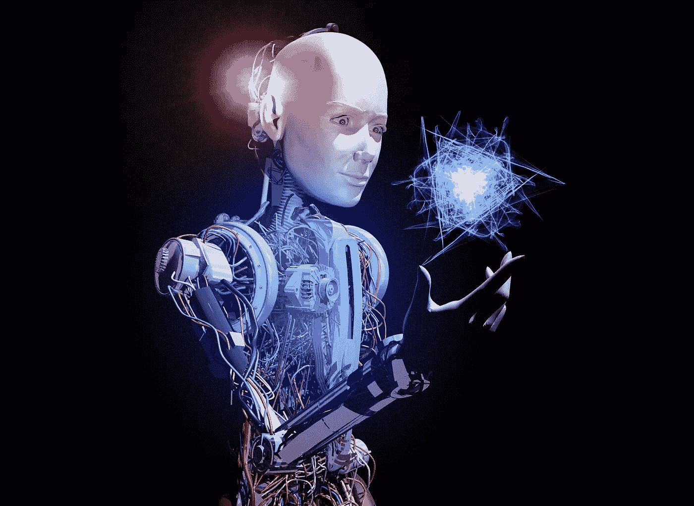
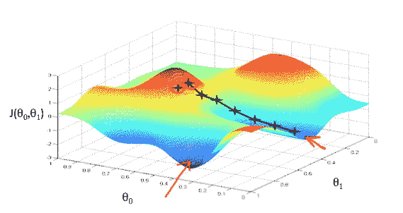
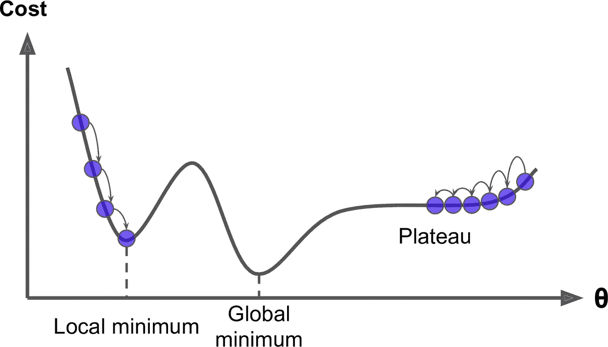
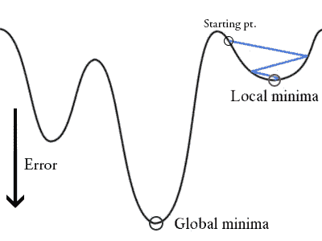
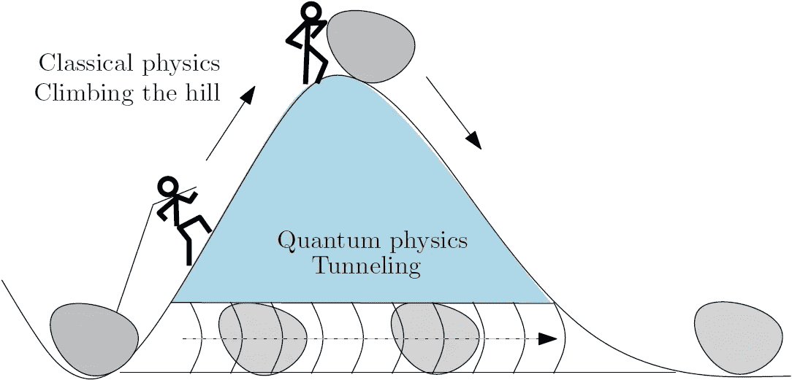

# 量子计算和人工智能喜结连理

> 原文：<https://towardsdatascience.com/quantum-computing-and-ai-tie-the-knot-d4440267451b?source=collection_archive---------4----------------------->

2018 年，量子技术人员和大胆的开发人员正在使用量子算法来改造人工神经网络优化领域:机器学习和 AI 的蜜蜂膝盖。因此，我们可以满怀信心地说，多亏了量子算法，量子计算和人工智能的未来无可救药地纠缠在一起。因此，让我们深入探究在数字时代兴风作浪的量子算法。我将特别关注*量子退火*(与感觉押韵)，这是一种独特的动物，它似乎在一个人工智能丰富的领域茁壮成长，而经典算法往往难以或完全失败:训练人工神经网络。

# 训练你的神经网络有困难？加入俱乐部…

相当令人惊讶的是，你可以训练人工[神经网络](https://jasonroell.com/2017/06/12/from-fiction-to-reality-a-beginners-guide-to-artificial-neural-networks/)，如 [RNNs](https://jasonroell.com/2017/06/26/understanding-recurrent-neural-networks-the-prefered-neural-network-for-time-series-data/) 和[CNN](https://jasonroell.com/2017/06/19/how-do-computers-see/)变得明智，不会犯两次同样的错误。正是这种遵循埃丝特·戴森建议的能力使神经网络成为驱动机器学习和人工智能的智能引擎。也就是说，训练神经网络是一项众所周知的棘手任务。但这并没有阻止研究人员和编码人员在过去几年里努力工作，寻找新的方法来减少尖端优化算法的训练错误。减少误差问题的第一次尝试是众所周知的爬山法。让我们浏览一遍。

# 爬山

属于爬山俱乐部的优化算法总是在进行下一步之前检查*梯度*(或多或少是一个图形函数的斜率的陡度)。但是这冒着错过图表中真实活动的风险。登山者经常发现自己面临的两个敌人是*高原问题*和*局部最小值问题*。总之，这些问题就相当于徒步旅行者在海市蜃楼般的沙漠中迷路，或者被困在一个泥泞的小山谷中。但是让我们深入挖掘一下…

# 高原问题

当一个优化过程进入平台期时，这意味着它对于每个输入(x)得到大致相同的输出(y)。因为对于长的平坦延伸，函数的斜率为零或接近零，所以优化算法在找到边之前可能会耗尽时间。就像闪闪发光的沙漠海市蜃楼一样，平坦函数的长期延伸会产生一种错觉，即当你还没有接近它时，你已经达到了最佳状态(在这种情况下是全局最小值)。

source: safaribooksonline.com

# 局部最小值问题

局部最小值是一个函数图中相对较小的谷，其最深和最重要的谷位于别处。你可以把优化过程(当它在一个函数中寻找最小值的时候)想象成一个沙滩球:它会向山下滚去，最终停在眼前*风景的最低点，即使在附近小山的另一边有一个更深的山谷。这就是问题所在。*

source: safaribooksonline.com

# 最激动人心的解决方案

除了传统的爬山方法，还有很多其他的方法可以帮助你走出由局部最小值问题引起的可怕的山谷和由高原问题引起的沙漠海市蜃楼。但是为了手头的目的，让我们只关注最令人兴奋的解决方案:*模拟退火。*这是一种野生的优化动物，它正在以一种计算巧妙的方式处理山谷和高原，至少值得思考几段时间…

# 最热门和最酷的经典优化算法

开门见山地说，模拟退火从物理学中偷师，将时间和温度捆绑在一个优雅的算法中。是的，你没看错:一个带有*温度*参数的算法。当你运行一个模拟退火算法时，它从手边的函数的整个景观中开始一个完全随机的、狂热的选择序列。这是流程中最热的阶段。但是，随着温度参数随着时间的推移而下降，随机选择覆盖的景观范围越来越窄。最后，我们进入过程的*酷*阶段，因为算法开始瞄准(如果运气好的话)最深的谷或最高的峰，那里是优化的圣杯:全局最小值或最大值。

虽然模拟退火算法中的代码通常包含一些复杂的数学运算，但时间和温度之间的潜在联系是很容易理解的。想象一下，一个炽热的东西在未知的地方疯狂移动，击中了视线内的一切，并向我们报告了一张非常粗略的地形图。然后，你可以想象逐渐变冷的东西越来越慢，越来越小心地穿过越来越窄的地形区域，记录它们进一步潜入最深的山谷或爬上最高峰的细节……好吧，如果你仍然不确定我到底在说什么，这里有一个[优秀的动画](https://youtu.be/C86j1AoMRr0?t=5m26s)应该可以做到这一点。

# 量子退火(哦，多好的感觉)

当传统爬山法的其他替代方案都不理想时，模拟退火通常可以让你摆脱困境。但这是一种极其专业的方法，它至少有一个令人不寒而栗的缺点:你必须无限长时间地运行该算法，才能平稳地达到绝对零度，从而保证你在能源格局中达到真正的全球最小值或最大值。因为你可能没有永恒的空闲，你永远不会知道你的优化解决方案是否陷入了另一个陷阱。

进入*量子*退火。首先，重要的是要记住，量子退火算法的基本形式与模拟退火算法非常相似。为什么？因为*量子隧穿强度*在量子退火中的作用与温度在模拟退火中的作用相同。久而久之，量子退火炉中的量子隧穿强度急剧下降，就像模拟退火炉中的温度急剧下降一样。也很容易想象隧道强度和温度之间的相似性。久而久之和量子隧穿强度下降，系统变得越来越舒适，在能源景观的每个渐进更深的山谷，越来越不倾向于隧道的出路。最终，当它发现自己(理想情况下)处于能源领域最深、最舒适的谷底(也就是全球最小值)时，它会完全放弃挖隧道。

# 不是你祖母的量子计算机

你一定会注意到，相对传统的量子计算机和量子退火计算机之间的第一个区别是它们使用的量子位数量。虽然传统量子计算机的最新技术在 2018 年推出了几十个量子位，但领先的量子退火器拥有超过 2000 个量子位。当然，代价是量子退火器不是通用的，而是专门的量子计算机，在技术上只处理优化问题和采样问题。因为解决最优化问题被认为是通往人工智能乐土的关键途径之一，所以从现在开始我将把重点放在它上面。

# 令人眩晕的混乱状态

在我们将量子退火算法应用于量子退火器中的量子位池之前，它们是一团乱麻:一个最模糊且不相连的配置。这意味着我们一开始对量子系统一无所知，它可能处于任何 2^n 不同状态(其中 *n* 是量子比特的数量)。对于一台拥有 2000 个量子位的量子退火机来说，这是一个*疯狂的*可能状态数。如果你对此有任何疑问，试着在你最喜欢的计算器中输入 2 个⁰⁰⁰来寻求第二种意见。

# 量子许愿井

单个量子位总是从初始的多云叠加状态开始，这使它们处于最小可能的能量。物理学家喜欢把这种最低能量状态想象成量子势阱的底部，看起来有点像一个大字母 u。

# U

0/1

然后[量子退火](https://www.youtube.com/watch?v=UV_RlCAc5Zs)出现，迫使叠加态分成两半，两个状态，两个底部:0 和 1。结果看起来更像一个大写字母 W:

# W

0 1

量子退火者的下一步是开始在量子概率游戏中装载骰子以支持房子。

# 偏见

在外加磁场的帮助下，量子退火器推动每个量子位严重偏向 **0** 或 **1:** ，有利于上面 W 中的第一次或第二次倾斜。

# 连接器

当量子退火机通过磁场给骰子(也就是单个量子位)加载*偏置*时，他们也在忙着通过*耦合器*用理论线将成对的骰子绑在一起。具体来说，一个*耦合器*可以做两件事情中的一件。它可以保证一对量子比特始终处于同一状态:要么都是 **0** ，要么都是 **1** 。*或*它可以保证两个相邻的量子位始终处于相反的状态: **0** 和 **1** ，或 **1** 和 **0** 。量子耦合器使用(惊喜，惊喜)[量子纠缠](https://jasonroell.com/2018/02/01/the-need-promise-and-reality-of-quantum-computing/)将量子比特捆绑在一起，创建耦合。

# 塑造能源景观

作为一名使用 quantum annealer 的有抱负的开发人员，您的工作是通过编码一组偏差和耦合来加载所有的 quantum 骰子，这些偏差和耦合定义了您希望可靠的 annealer 解决的优化问题。另一种看待它的方式是，你正在雕刻，或者至少产生一个复杂的能量景观，它由峰和谷组成，代表了你的最优化问题中所有可能的结果。然后你就可以让量子 annealer 去搜索并找出能源领域最深的谷底，这也是最优解。如果你一直成功，那么你的量子退火能力可能有助于为子孙后代提供新一代的机器学习和人工智能。

# 量子计算和人工智能新闻

2017 年 8 月 31 日，大学太空研究协会(USRA) [宣布](https://www.prnewswire.com/news-releases/first-quantum-annealing-computer-in-the-united-states-to-have-more-than-2000-qubits-installed-and-operational-300512217.html)与美国宇航局和谷歌合作，将[量子人工智能实验室](https://research.google.com/pubs/QuantumAI.html)(量子人工智能实验室)的量子退火计算机升级为 [D-Wave 2000Q](https://www.dwavesys.com/d-wave-two-system) 。最新的 D-Wave 拥有几乎是其前身两倍的量子位和“绝热量子计算”的新诀窍，正在追求优化问题池中更大的鱼。USRA 团队甚至着眼于使用量子算法和 D-Wave 来解决“NASA 任务中涉及的挑战性计算问题”另一方面，合作伙伴谷歌已经盯上了人工智能:

> *我们对将量子计算应用于人工智能和机器学习特别感兴趣。*

但不仅仅是谷歌和美国宇航局可以访问量子人工智能实验室。信不信由你，你也可以。如果你是一个合格的候选人，你可能会有一些时间和最新的 D-Wave 一起尝试你的天才想法。用实验室自己的话说，“[通话开启](http://www.usra.edu/quantum/rfp/)。”

嗯，这就是我今天的全部内容。如果你喜欢这篇文章，我会非常兴奋，如果你点击拍手按钮:)或与你好奇的朋友分享。我在我的个人博客(jasonroell.com)上有更多类似的东西，或者你可以订阅我的媒体简介，让我一写完文章就发给你！(多牛逼？！)

无论如何，再次感谢你的阅读祝你有美好的一天！