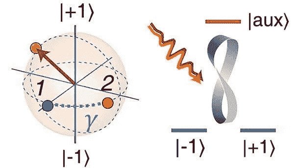
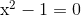
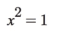
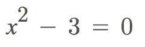
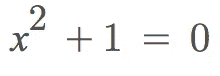

# Python 程序员的量子计算笔记:复数

> 原文：<https://towardsdatascience.com/quantum-computing-notes-for-a-python-programmer-complex-numbers-2e1a574bdb88?source=collection_archive---------5----------------------->

Image from — [https://phys.org/news/2017-11-simple-beautiful-quantum.html](https://phys.org/news/2017-11-simple-beautiful-quantum.html)

> 但是如果量子力学不是通常意义上的物理学——如果它不是关于物质、能量、波或粒子的——那么它是关于什么的呢？
> 
> 从我的角度来看，它是关于信息和概率
> 和可观察到的事物，以及它们之间的相互关系。
> 
> 自德谟克里特斯以来的量子计算(第 110 页)

这些系列笔记，最初是我为自己写的，是我希望成为一个关于量子力学基本方面，更准确地说是关于量子计算的小系列。我不会试图对任何我不完全理解的事情做出任何流行科学的、不着边际的解释。当类似的事情发生时，我会诚实地写下我不理解的事实(可能会发生很多次)。但除此之外，这组特殊的音符还有一个非常特殊的用途。它们是从开发人员的角度编写的。这意味着，即使它们本质上是严格的，它们的一个主要焦点是放在实现部分，准确地说是使用 Python。

## 我为什么要写这些笔记？

我已经给出了上述论点的一个方面，但我只想在这里声明，我属于一类愚蠢的人，他们什么都不懂，除非他们试图向别人解释，还试图用手做。我写这些笔记的原因也是试图向我自己解释量子力学和量子计算的神秘而迷人的主题。

顾名思义，它们是纯粹的笔记。这意味着，他们可能有涂鸦，错误，不成熟的想法和解决方案。尽管如此，这些笔记确实有一个有用的特点。我可以回头看看它们并改正我的错误(并在我改正的时候更新它们),同时(希望)像我这样的人也能跟着做并从中受益。

另一方面，我不会给任何人任何其他的理由去遵循这些笔记。我不会告诉你“量子计算将会改变一切。你需要掌握它，它是下一个“数据科学”(我们没有证据，除了一类问题，QC 实际上提供了超越经典计算的任何好处)或“RSA 处于危险之中，让我们拯救它”或诸如此类的事情。量子力学和量子计算本身就是非常有趣和迷人的学习科目。我在学习它们的时候很开心。我只想尽可能地分享快乐。仅此而已。

我已经对高中水平的数学有了基本的了解，比如基础代数，基础集合论，三角学。任何其他数学形式都将在途中推导出来。

好吧，你相信了吗？那我们跳进去吧！

## 我们的旅程从复数开始

我们记得复数，对吗？在高中数学的某个阶段，到处都是那些看起来很有趣的数字和符号？它们是什么？更重要的是，为什么我们(事实上地球上所有的量子力学和量子计算文献)需要它们？让我们稍微回到基础。我们从下面的等式开始。

在计算机科学中，我们称这些方程为“多项式”。现在，这可能不是显而易见的，但是如果我们稍微思考一下，我们会发现，我们可以通过指定系数来唯一地表示一个多项式。作为一个例子，上面的一个是多项式 *P(x) = {1，-1 }*({ x 的最高次幂的系数，然后是下一个，…直到常数项})看着多项式我们可以说 P ⊂ ℝ，即*p 的成员取自所有实数的集合*。关于多项式，我们通常会问的另一件事是——“它的根是什么？”根是方程的解。他们可以是很多人。像下面这样解上面的方程

给了我们等式的两个根。例如+1 和-1，它们正好在ℝ.的范围内到目前为止一切顺利。比方说，当我们试图解决

这给了我们√3。啊！我们有麻烦了。我们有一个⊂ ℝ，它的根不是来自 r。数学上我们说——“ℝis**不是**代数闭的”。

当我们试图解决时，问题变得更糟

因为根是… √-1，在平方根符号下有一个负数违背了我们的标准代数直觉，然而我们试图求解的方程是有效的，因此我们需要一种方法来表达这些新的数字。这就是我们发展虚数概念的原因。虚数，记为 *i* ，定义为√-1。复数是这样一个数，它有两个分量，一个实数，一个虚数。

如果我们仔细研究，我们会发现，真正“代数闭”的数的集合是ℂ，也就是所有复数的集合。这是一个非常重要的属性。我们将会看到在进行量子计算时，我们如何从中受益。形式上我们说——“任何系数来自ℂ的多项式，都有ℂ".的根

查看以下麻省理工开放式课程的精彩视频，进一步了解复数在量子力学中的重要性。

## 复数代数

一个复数通常是这样表示的——a+*I*b 这里我们说 *a* 是复数的实部， *b* 是复数的虚部。我们可以在一个复数上定义如下

> 设 z = a +ib 是一个复数，那么 Re{z} = a，Im{z} = b，这样我们就得到了实部和虚部。

我们可以定义两种基本运算，例如对复数的+和*(加法和乘法)。它们看起来如下

*   要将两个复数相加，我们只需分别将实部和虚部相加。所以，如果 a+ *i* b 和 c+ *i* d 是两个复数那么它们的和可以写成——(a+b)+*I*(c+d)。如果我们用 Z1 和 Z2 来表示它们，那么从复数之和的定义中可以清楚地看出 Z1+Z2 = Z2 + Z1
*   为了将上述两个复数相乘，我们所做的是简单的乘法，然后重新排列(记住 *i = -1)。*看起来是这样的——(a+*I*b)*(c+*I*d)=(AC-BD)+*I*(ad+BC)。同样清楚的是，Z1 * Z2 = Z2 * Z1

一旦我们定义了加法和乘法，我们就可以问这样的问题:“什么是加法恒等式？”"什么是乘法逆运算？"等等。有些答案很直接。加法恒等式是 0+ *i* 0。a+ *i* b 的加法逆是-a *+i* (-b)但是乘法呢？嗯，稍微想一想，我们就能看出乘法恒等式是 1+ *i* 0。利用 Z * (1/Z) = 1+0 *i* 的恒等式我们可以求出乘法逆。我们可以验证，复数ℂ的集合在这两种运算下形成了 ***场*** 。(如果你不知道什么是 ***字段*** ，那么你可能想看看这里的)

关于复数，我们还需要了解其他一些事情。

*   共轭——复数 Z 的共轭写为 Z 上面的一条杠，通过改变复数分量的符号来定义。所以 a+ *i* b 的共轭是 a- *i* b
*   一个复数的模数——设 a+ *i* b 是一个复数那么模数定义为√ *(a +b)。*我们把它写成复数旁边的两条平行线。比如— |Z|。利用共轭的定义和乘法是如何定义的，很容易说明√( Z *共轭(Z)) = |Z| = √ *(a +b )*

我们在定义复数代数的各个方面时所做的选择，以及它自己的性质，当我们第一次看到它们时，可能看起来有点武断，但如果我们研究复数的几何，那么它看起来一点也不武断或随意。我们将在这些笔记的下一页看到这一点。

第一页到此为止。在下一页，我们将看到复数的几何以及一些 Python 代码(毕竟这是给 Python 程序员的一个提示)。如果你喜欢这个音符，请尽可能多的鼓掌。这对我将是鼓舞人心的。

## 来源

1.  计算机科学家的量子计算
2.  [量子纠缠的数学](https://arxiv.org/abs/1604.01790) —布兰道、哈罗等。
3.  [虚数视觉指南](https://betterexplained.com/articles/a-visual-intuitive-guide-to-imaginary-numbers/)——更好的解释。
4.  [量子力学的本质第二部分:复数](https://medium.com/@notaredpanda/the-essence-of-quantum-mechanics-part-2-complex-numbers-1b051478fc2d)
5.  [麻省理工学院 8.04 量子物理 I，2016 年春季](https://www.youtube.com/playlist?list=PLUl4u3cNGP60cspQn3N9dYRPiyVWDd80G)

[这里](/quantum-computing-notes-for-a-python-programmer-geometry-of-complex-numbers-469a6265e0c7)是第二部分，如果你喜欢这个就继续吧:)