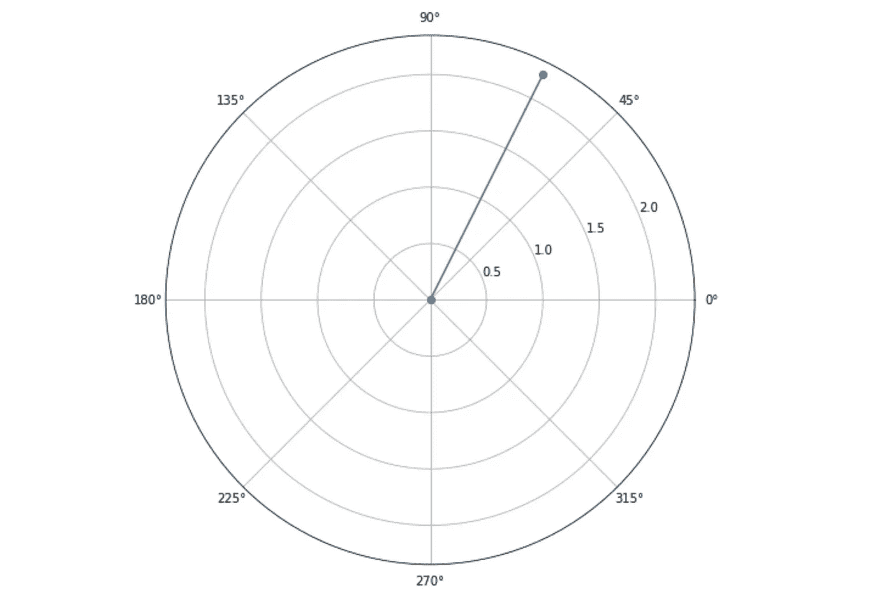
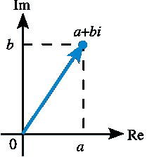
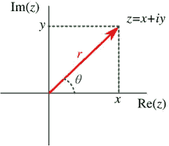
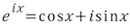
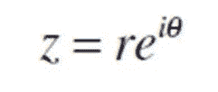
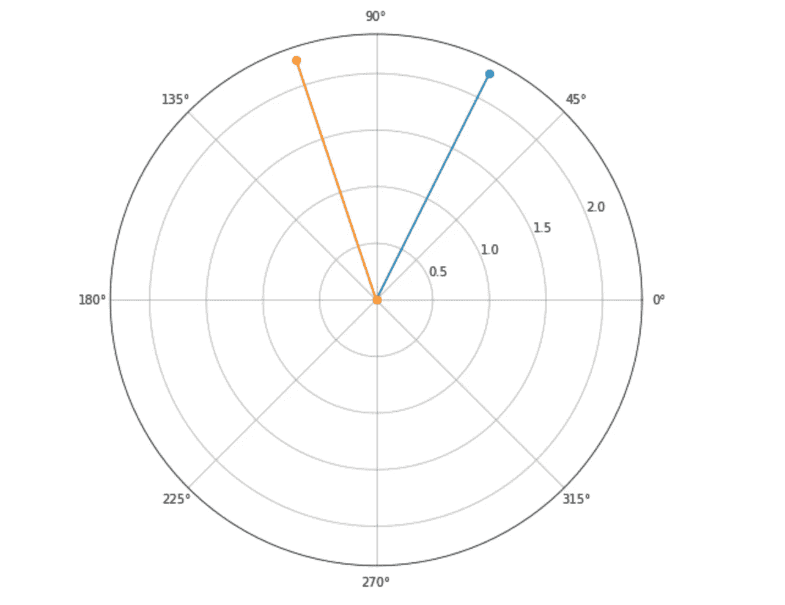
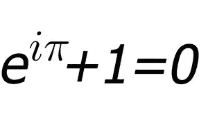

# Python 程序员的量子计算笔记:复数的几何

> 原文：<https://towardsdatascience.com/quantum-computing-notes-for-a-python-programmer-geometry-of-complex-numbers-469a6265e0c7?source=collection_archive---------21----------------------->



Polar representation of 1+2i

你好，欢迎回来！在本系列的前一期中，我们看了复数代数。在现在的这幅中，我们将看到它的几何解释。我们还将探索一些 Python 代码来表示复数的各个方面。

## 如何在二维平面上表示一个复数

复数有一种直观简单的方式来表达自己，几何。从物理学的角度来看这也很有趣。这种表示复数的方式最初是由法国数学家 [Jean-Robert Argand](https://en.wikipedia.org/wiki/Jean-Robert_Argand) 于 1813 年提出的，因此它被称为 Argand 图以纪念他的贡献。

事情是这样的。如果我们有一个复数 z = a+ *i* b，那么我们可以用 X 轴表示 Re{z}，Y 轴表示 Im{z}。看起来是这样的。



Argand Representation of a+ib

它说，如果我们从原点开始，然后在 X 轴上移动“a”的距离，然后沿着 Y 轴移动“b”的距离，那么我们就到达了由 a+ *i* b 表示的点，它非常简洁优雅。但它的用处不止于此。这与乘法规则相结合，将为我们提供一个非常有用的工具来毫不费力地执行旋转和缩放。但是为了做到这一点，我们需要理解如何以极坐标形式表示复数。



Polar form of complex number

> 与帖子相关的所有代码都可以在[本](https://gist.github.com/rcshubhadeep/919801ada2983e9c93db30f8eb8ed2c5)笔记本中找到

从上图和使用基本的三角学可以清楚地看出

x = r * cos *θ* 和 y = r * sin *θ。*

然后利用简单的毕达哥拉斯法则我们也可以推断

*r*= |*x+I*y | =*√(x+y)*

和

*θ = arctan(y/x)*

如果我们现在使用这些关系，那么我们可以重写

x+*I*y = r * cos(*θ)+I*r * sin*(θ)= r *(T27)cos(*θ)+I*sin*(θ))**

在这里，我们要停下来，记住数学最著名的公式之一，欧拉公式。它只是简单地说了以下内容—



Euler’s Formula

这是杰出的。因为它将指数函数与三角函数联系起来。(要想简单直观地证明这一点，你可以查看由[而非小熊猫](https://medium.com/@notaredpanda)发布的[这篇](https://medium.com/@notaredpanda/the-essence-of-quantum-mechanics-part-2-complex-numbers-1b051478fc2d)帖子。这基本上取决于泰勒级数展开。).利用这个公式，我们可以把最后一个方程改写成下面的形式



其中 Z = a+ *i* b(或者 x+ *i* y 或者随便你怎么说:)，我们已经定义了 r 和 *θ。*

## 用复数乘一个东西是什么？

嗯，很简单，把一个数乘以一个复数，把它旋转复数的角度。让我再告诉你一遍——

*   *将一个数乘以一个复数，将该数旋转复数的角度。*

假设我们有一个复数 1+ *i* 2。它可以用下图来表示


现在我们想把它旋转 45 度。嗯，如果我们计算的话我们会看到，45°角的复数是 1+ *i* 。因此，如果我们将 1+2 *i* 乘以 1+ *i* ，我们将执行 45°旋转。但是…

## 我们是 Python 程序员

没错！我们不喜欢这么多手工的东西。我们宁愿用 Python 编写一个优雅的解决方案来为我们完成这项工作。女士们，先生们，我们提出的“旋转”功能旋转一个复数的任何给定的角度。

```
import mathdef rotate(number, degree):
    n = number
    return (math.e**(math.radians(degree)*1j)) * n
```

对之前给定的数字应用“旋转”。我们得到下面的图(我显示了原始数字和旋转后的数字)



Rotating a given number by 45º

## 等等，那个“1j”是什么？

Python 是一种非常强大的语言，像许多其他东西一样，它也支持开箱即用的复数。python 中定义复数的方式是在虚数部分附加一个“j”(为什么“ *j* ”？为什么不是那个熟悉的“*我*”？那个我没看懂)。事情是这样的

```
c = 1+2j
print("c, Re{c} = %d Im{c} = %d and Length : "%d" % (c.real, c.imag, abs(c)))
```

“abs”给出了复数的长度(意思是√ *(x +y ))*

“c.real”给出实部，“c.imag”给出虚部。

## 角度怎么弄？

内置的复杂数据类型非常方便，但也非常基本。它不支持一些高级操作。为此，我们有“cmath”(复杂数学的缩写)模块。为了得到一个复数的角度，我们将使用“cmath”中的“phase”函数

```
import cmathc = 1+2j
cmath.phase(c)
```

## 趣味活动:用 Python 证明欧拉恒等式

我们知道著名的欧拉恒等式(也被称为数学中最美的方程)



Euler’s Identity

下面是一行代码，使用 Python 验证了这一点

```
import math
print ((math.e**(math.pi*1j)).real + 1)
```

它将打印“0.0”

查看下面的笔记本，了解详细的代码示例

这次到此为止。我知道这是一个非常基本和简短的介绍复数，但是，我希望你喜欢它。您可以随时查阅高级资料(在资料部分列出)进行进一步阅读。

感谢您的阅读。如果你喜欢这篇文章，请尽情鼓掌，这会鼓励我写更多。我们将在第三部分再次见面，届时我们将讨论量子力学的一个中心思想:线性。

## 来源

*   计算机科学家的量子计算
*   [虚数视觉指南](https://betterexplained.com/articles/a-visual-intuitive-guide-to-imaginary-numbers/)——更好解释。
*   [复数的几何](https://www.amazon.com/Geometry-Complex-Numbers-Dover-Mathematics/dp/0486638308) —汉斯·施韦德菲格
*   [量子力学的本质第二部分:复数](https://medium.com/@notaredpanda/the-essence-of-quantum-mechanics-part-2-complex-numbers-1b051478fc2d)

[联系我](https://www.linkedin.com/in/shubhadeep-roychowdhury/)！(如果你愿意)我很乐意听到你的反馈。