# 用 Python 实现量子物理可视化

> 原文：<https://towardsdatascience.com/quantum-physics-visualization-with-python-35df8b365ff?source=collection_archive---------2----------------------->

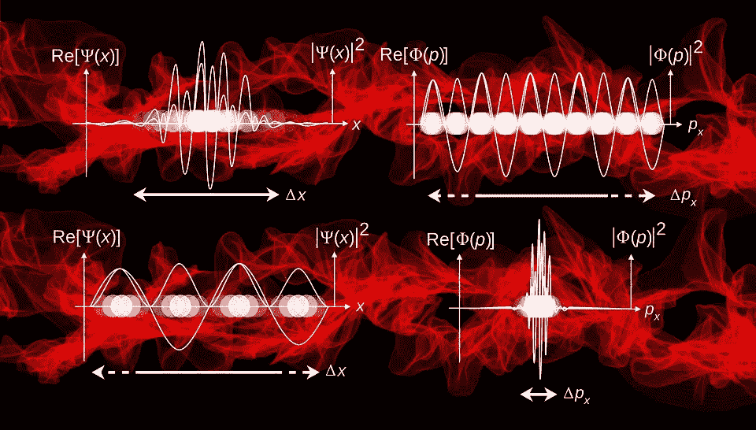

在这个博客上，我决定复习一些大学水平的量子化学，来推导电子轨道。额外有趣的部分是，我们将会可视化波函数和电子概率..用 Python！

## 薛定谔方程

1926 年，Erwin Schrodinger 提出了著名的波动方程，将系统的能量与其波动特性联系起来。因为它在氢原子上的应用相当复杂，我们将首先用波动方程来求解盒中粒子。用 1D 表示的薛定谔波动方程是

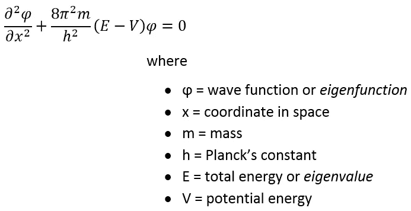

## 可视化盒子中的粒子

现在，为了简化我们的方程，我们假设盒子中有一个**粒子。**


Particle In A Box

盒子里的粒子问题并不对应于任何真实的化学系统。在我们的上下文中，它的用处在于它阐明了几个量子力学特征。势垒处的势能设为无穷大(即粒子不能逃逸)，势垒内的势能设为 0。在这些条件下，经典力学预言，粒子在盒子的任何部分都有相等的概率，粒子的动能允许有任何值。考虑到这个假设，我们得到了粒子在势垒处和盒子内部的能量的不同方程。

在势垒处，V 是无穷大，因此粒子不存在:

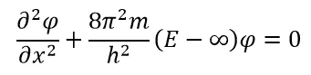

在盒子内部，V 是零，因此波可以具有任何有限值:

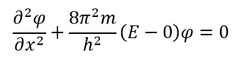

在盒子里，我们可以重新排列方程式如下:

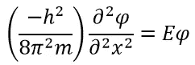

正如我们在上面看到的，波函数是这样的，如果微分两次，应该给出相同的函数乘以 e。正弦函数具有这种行为。

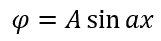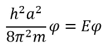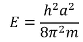

现在，我们需要评估常数α和α的值。对于α，我们使用势垒处的波动方程，其中波函数等于 0。

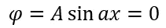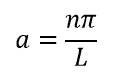

现在代入α的值:

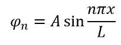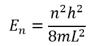

我们可以通过要求波函数归一化来确定 A 的值。这是因为，粒子一定存在于盒子的某个地方。因此，在盒子中找到粒子的概率之和是 1:

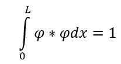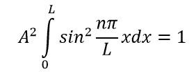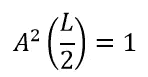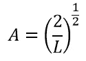

代入这些值，最终的波和能量方程为:

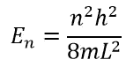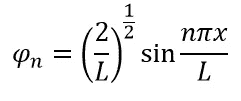

使用 Python 可视化能量和波函数:

```
import matplotlib.pyplot as plt
import numpy as np#Constants
h = 6.626e-34
m = 9.11e-31#Values for L and x
x_list = np.linspace(0,1,100)
L = 1def psi(n,L,x):
    return np.sqrt(2/L)*np.sin(n*np.pi*x/L)def psi_2(n,L,x):
    return np.square(psi(n,L,x))plt.figure(figsize=(15,10))
plt.suptitle("Wave Functions", fontsize=18)for n in range(1,4):
    #Empty lists for energy and psi wave
    psi_2_list = []
    psi_list = []
    for x in x_list:
        psi_2_list.append(psi_2(n,L,x))
        psi_list.append(psi(n,L,x)) plt.subplot(3,2,2*n-1)
    plt.plot(x_list, psi_list)
    plt.xlabel("L", fontsize=13)
    plt.ylabel("Ψ", fontsize=13)
    plt.xticks(np.arange(0, 1, step=0.5))
    plt.title("n="+str(n), fontsize=16)
    plt.grid() plt.subplot(3,2,2*n)
    plt.plot(x_list, psi_2_list)
    plt.xlabel("L", fontsize=13)
    plt.ylabel("Ψ*Ψ", fontsize=13)
    plt.xticks(np.arange(0, 1, step=0.5))
    plt.title("n="+str(n), fontsize=16)
    plt.grid()plt.tight_layout(rect=[0, 0.03, 1, 0.95])
```

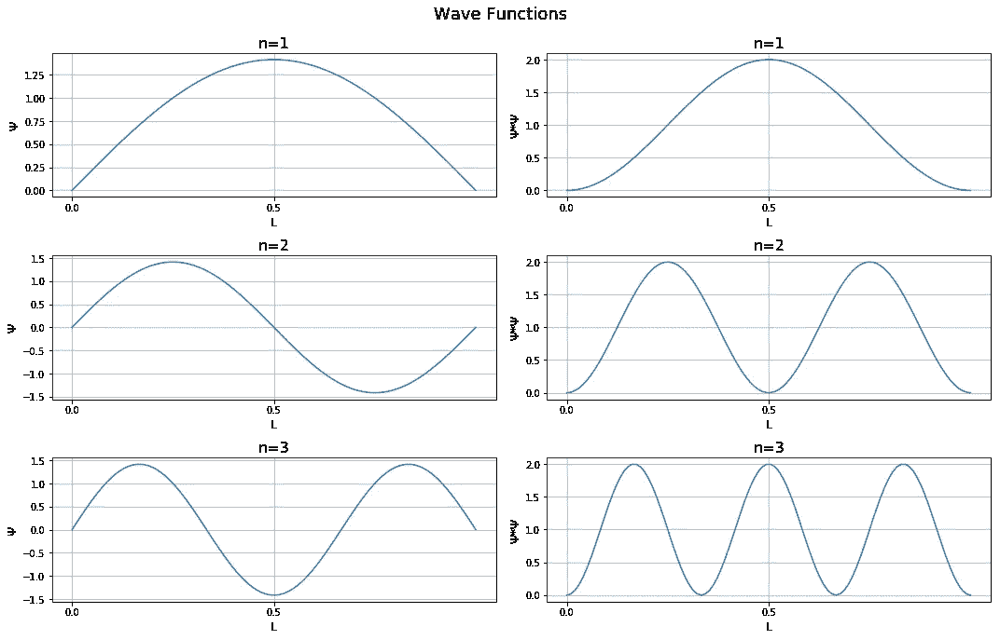

请注意，在一些区域中，ψ**和ψ*****ψ在相同的区域中都为零。这就是所谓的节点。轨道的能级不是连续的。它们存在于不同的层次，由节点的位置来表示。此外，随着 n 值的增加，盒子内部的波密度也增加。**

## **可视化轨道**

**现在，为了得到关于量子数的波动方程，它需要以下 3D 格式:**

**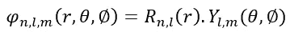**

**现在，变量的分离取决于原子的类型，这太复杂了，无法在这篇博文中讨论。相反，我们将直接为绘图编写解决方案。下面，我们将使用氢原子的 R 和 Y 的函数，而不用推导它们。**

**首先，让我们看看 1s 轨道:**

**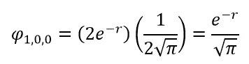**

**1s 波函数揭示了当我们远离原子核时，电子出现的概率呈指数下降。它也揭示了一个球形。**

```
import matplotlib.pyplot as plt
import numpy as np#Probability of 1s
def prob_1s(x,y,z):
    r=np.sqrt(np.square(x)+np.square(y)+np.square(z))
    #Remember.. probability is psi squared!
    return np.square(np.exp(-r)/np.sqrt(np.pi))#Random coordinates
x=np.linspace(0,1,30)
y=np.linspace(0,1,30)
z=np.linspace(0,1,30)elements = []
probability = []for ix in x:
    for iy in y:
        for iz in z:
            #Serialize into 1D object
            elements.append(str((ix,iy,iz)))
            probability.append(prob_1s(ix,iy,iz))

#Ensure sum of probability is 1
probability = probability/sum(probability)#Getting electron coordinates based on probabiliy
coord = np.random.choice(elements, size=100000, replace=True, p=probability)
elem_mat = [i.split(',') for i in coord]
elem_mat = np.matrix(elem_mat)
x_coords = [float(i.item()[1:]) for i in elem_mat[:,0]] 
y_coords = [float(i.item()) for i in elem_mat[:,1]] 
z_coords = [float(i.item()[0:-1]) for i in elem_mat[:,2]]#Plotting
fig = plt.figure(figsize=(10,10))
ax = fig.add_subplot(111, projection='3d')
ax.scatter(x_coords, y_coords, z_coords, alpha=0.05, s=2)
ax.set_title("Hydrogen 1s density")
plt.show()
```

**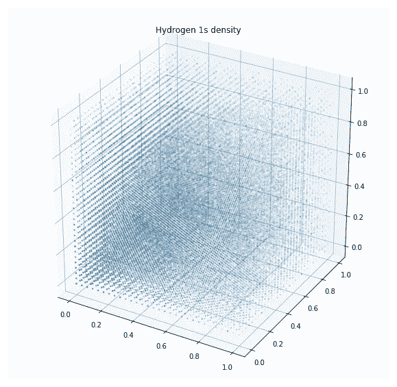**

**从上面的电子密度图中很难看出。然而，你可以看到它是球形的。当我们离中心越远，密度就越小。一般来说，截止点是当电子出现的概率为 99%时。**

**对于其他 spdf 轨道，也可以得到相同的密度图。希望这篇博客已经激发了你对量子物理和 Python 编程的兴趣！关于基于 python 的可视化的更多内容，请查看我的博客:[基于 Python 的 Matplotlib 绘图](/python-based-plotting-with-matplotlib-8e1c301e2799)**