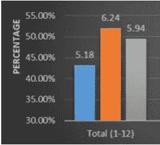

# 四分卫

> 原文：<https://towardsdatascience.com/quarterbacks-82a1ace17311?source=collection_archive---------7----------------------->

这是另一个关于幻想作品的四集系列，部分链接到我之前的“破碎”系列。在这个系列中，我将关注每个团队的幻想作品。具体来说，每个位置的幻想 12 强球员和其他幻想 12 强球员在同一支球队打球的比例是多少。从这个系列赛开始，我将着眼于四分卫的位置。请关注本系列的下三篇文章，关于跑卫、外接球手和紧逼端。

**问题**

在其他三个技能位置上，fantasy QB1 与其他 12 强玩家的游戏比例是多少？换句话说，有百分之多少的 fantasy QB1 玩家也玩 fantasy RB1、WR1 或 TE1？

**数据**

为了这项研究，我找出了自 2000 年以来每个位置上排名前 12 的球员。从那里，我发现哪些 QB1 也和另一个 12 强幻想玩家在同一个队里玩。为了澄清，以下是 2016 年前五大 QB:

最后三列中的任何一列的“1”意味着 QB 也在该位置上与前 12 名球员一起比赛。最后三列中的“0”意味着 QB 没有在那个位置上与前 12 名球员一起比赛。例如，Aaron Rodgersplayed 使用了 12 强的梦幻接球手，但没有使用 12 强的梦幻跑锋或严密的末端。另一方面，柯克考辛斯打了一个前 12 名的梦幻紧密端，但没有打前 12 名的梦幻跑卫或接球手。自 2000 年以来，每一个排名前 12 的 QB 都是如此。

**结果**

在你深入阅读这个图表之前，让我解释一下发生了什么。首先，你会注意到我把前 12 名幻想四分卫分成了三个子类别:整体(第一类)、上半部分(第二类)和下半部分(第三类)。每个聚类有三个条形，每个条形代表一个技能位置(RB、WR、TE)。每个条形显示了每个位置前 12 名玩家的百分比，假设他们玩的是幻想 QB1。每个条形上方的数字是每个子类别中幻想 QB1 的预期数量，这些 QB1 将与该条形各自位置上的前 12 名幻想玩家一起玩。

例如，图表的这一部分对应于上面的第一个分类，它是整个子类别。这个集群显示了有多少 QB1 将在其他三个技能位置上与另一个 12 强幻想玩家一起玩。每个条形上方的数字是将在该条形位置与另一名前 12 名玩家一起玩的幻想 QB1 的预期数量。例如，我们可以预计大约五个幻想 QB1 也玩一个幻想 RB1(蓝色条)。此外，我们可以预计大约六个幻想 QB1 的发挥要么幻想 WR1 或 TE1(橙色和灰色酒吧)。

现在您已经理解了图表，我们可以看看第二和第三个子类别，即上半部分和下半部分。当我们将前 12 名分解为前 6 名和后 6 名时，分布稍微有些倾斜。例如，我们可以预计大约 3-4 个前 6 名 QB 使用 fantasy WR1，而只有 2-3 个后 6 名 QB 使用前 12 名 fantasy receiver。在紧尾位置，数字也是类似的，我们可以预计有三个前 6 名 QB 与 TE1 一起玩，而只有 2-3 个后 6 名 QB 与 TE1 一起玩。至于跑卫，划分相当均匀，前 6 名和后 6 名都有大约 2-3 名 QB1 使用 RB1。

**解释和结论**

这是什么意思？首先，我们可以期待更多的 QB1 玩家玩梦幻 WR1 或 TE1，而不是 RB1，这是有道理的。除非进攻是非常动态的，也就是去年的猎鹰队，否则传球比赛的成功通常会给跑动中的比赛带来打击。如果一个球队的 RB1 也是一个很好的传球接球手，就像猎鹰队进攻中的德文塔·弗里曼一样，那会很有帮助。然而，从这个意义上来说，去年似乎是一个异数，因为只有 5 个 QB1 与 fantasy WR1 一起比赛，但有 7 个 QB1 与 fantasy RB1 一起比赛。这可能是由于跑卫位置的“复兴”，特别是后场的 3 人后卫是很好的接球手。这种趋势还会继续吗？过去几年表明它不会，但它有一个机会，现在在联盟中打球的老黄牛。

我试图找到前 12 名 QB 和其他前 12 名玩家之间的额外相似之处，但总体来说，这似乎非常随机。在很大程度上，你可以依靠某个 QBs 来完成 QB1，同时也支持至少一个 WR1 或 TE1。亚伦·罗杰斯、汤姆·布拉迪和德鲁·布里斯都是 QB1 的常客，他们也一直支持 WR1 或者 TE1。卡森·帕尔默、埃利·曼宁和马特·莱恩都支持 WR1，但这并不总是让他们成为 QB1。然而，当他们作为 QB1 完成时，他们总是支持 WR1。有一个四分卫特别让我印象深刻:菲利普·里弗斯。在里弗斯手下，充电器从来没有幻想过 WR1(抱歉基南艾伦)。事实上，充电器上一次 WR1 是在 2000 赛季之前。然而，里弗斯是 TE1 的永久支持者。难道不是安东尼奥·盖茨(很快就是亨特·亨利)吗？

总的来说，我们可以预计大约一半的 QB1 支持 12 强梦幻接收机或紧端。我们还可以预计，前 12 名 QB 中约有 5 名将使用 fantasy RB1，但鉴于跑锋力量的转移，这一数字可能会增加。总而言之，顶级 QB 相对来说是可预测的，它们的顶级接收者或紧密末端通常会顺其自然。QB 排名的下半部分更不可预测，因此并不总是支持前 12 名的幻想接收机。至于苏格兰皇家银行，其在 12 家顶级 QB 中的分布相当均匀，甚至比接收方更难预测。和 QB1 一起玩的 RB1 通常也是通过空气获得产量的主力，或者他们的 QB 勉强进入前 12 名。

感谢阅读，请务必关注本系列的下一篇文章，关于跑卫，接下来是接球手和紧逼端。敬请期待！

*原载于 2017 年 9 月 18 日*[*【dynastyfootballfactory.com】*](https://dynastyfootballfactory.com/production-partners-quarterbacks-2/)*。*