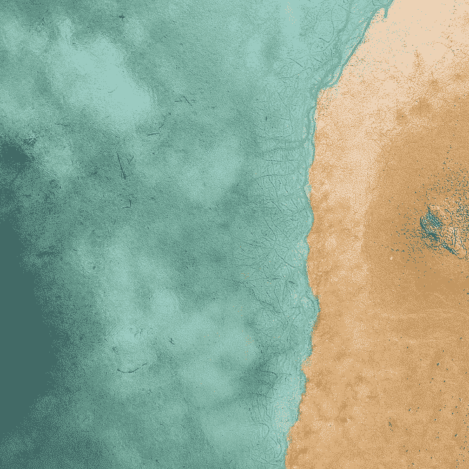
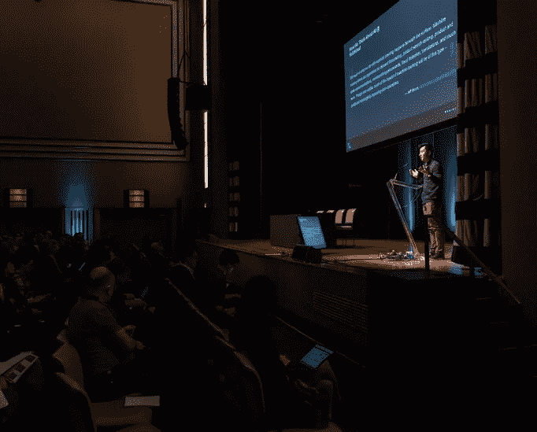
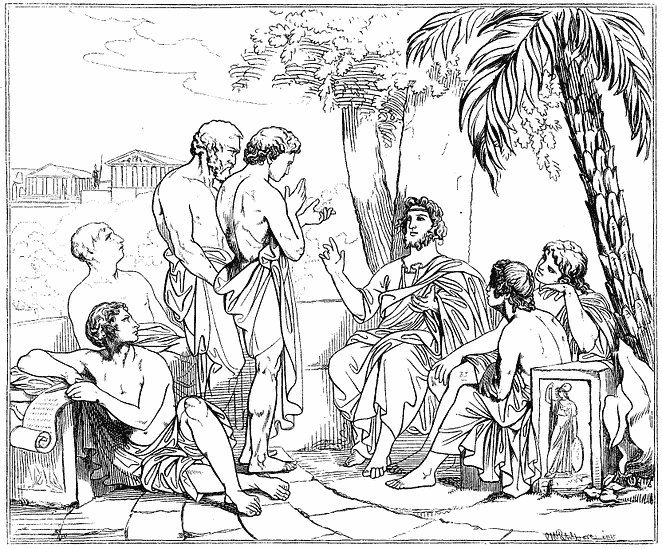
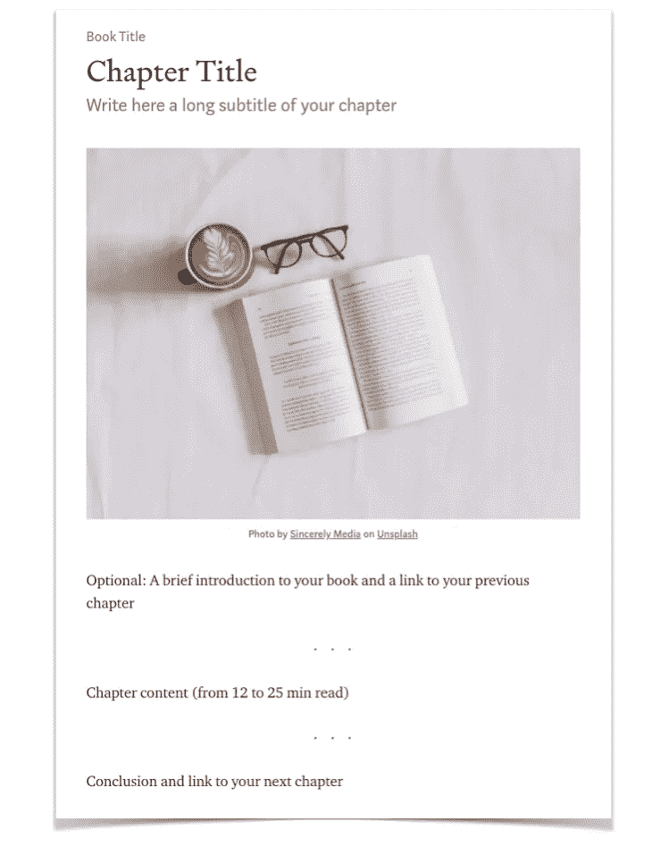
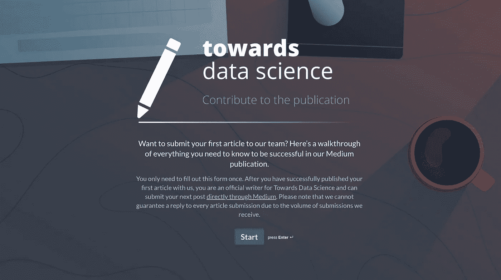

# 为迈向数据科学而写作

> 原文：<https://towardsdatascience.com/questions-96667b06af5?source=collection_archive---------0----------------------->

## 最后更新于 2023 年 3 月

## 与更广泛的受众分享您的概念、想法和代码

[About us](https://towardsdatascience.com/about) — Photo by [Mia Baker](https://unsplash.com/@miabaker?utm_source=unsplash&utm_medium=referral&utm_content=creditCopyText)

# **新作者**

首次与 TDS 分享您的作品之前，您需要了解的所有信息:

1.  [**为什么会成为投稿人？**](#dee8)
2.  [**提交规则**](#003e)
3.  [**指引**](#1d11)
4.  [**长篇帖子、专栏和在线书籍**](#f916)
5.  [**如何才能有所贡献？**](#aaad)
6.  [**常见问题**](#b160)

# **当前作者**

为已经用 TDS 出版的作者提供的资源和建议:

 [## 如何充分利用你作为 TDS 作者的经历

### 我们的资源和常见问题快速指南

towardsdatascience.com](/how-to-make-the-most-of-your-experience-as-a-tds-author-b1e056be63f1) 

# 为什么要成为投稿人？

走向数据科学公司经营一个独立的媒体出版物。我们正在寻找作家提出专注于数据科学、机器学习、人工智能和编程的最新内容。如果你喜欢写这些话题，请继续读下去！

用你的文章接触更广泛的读者。我们是世界上最受欢迎的数据科学博客之一，也是拥有超过 [60 万追随者](https://towardsdatascience.com/about)的最受欢迎的媒体出版物。

以下是我们为确保你的文章能被尽可能多的读者所接受而做的一些事情:

*   我们有一个自定义域(towardsdatascience.com，而不是 medium.com/towards-data-science)，可以帮助你的文章带来更多的流量。
*   我们与 Medium 密切合作，确保 TDS 中的故事符合 Medium 的编辑和发行标准，因此 TDS 中的故事经常会进一步发行。
*   我们在出版物的页面和社交媒体上展示我们的内容: [Linkedin](https://www.linkedin.com/company/towards-data-science/) 和 [Twitter](https://twitter.com/TDataScience) 。
*   我们发送以故事和作家为特色的时事通讯。

**通过** [**中等合伙人计划**](https://medium.com/creators) **挣钱。**作者可以选择对 TDS 上的故事进行计量，并通过[媒体合作伙伴计划](https://medium.com/creators)基于媒体成员的参与度来赚钱。“计量”是指让一个故事有资格在 Medium 的计量付费墙后面赚钱。

作为媒体合作伙伴计划的一部分，作者保留他们通过媒体帐户获得的 100%的收入。但是，中等合作伙伴计划不是由 TDS 管理的，我们不会直接向自愿投稿的投稿人支付费用。

**您将仍然是您作品** [**的唯一所有者，并且可以随时删除它，甚至在我们发布它之后。我们的编辑和社区提供的反馈将出现在你文章的相关位置。你可以拒绝或回复他们。**](https://medium.com/policy/medium-terms-of-service-9db0094a1e0f)

# 提交规则

在提交你的文章之前，有一些基本的事情你需要知道。确保你很好地阅读了每一点，并理解它们，因为通过向 TDS 提交文章，你同意遵守所有这些。

1.  **Medium 的** [**规则**](https://medium.com/policy/medium-rules-30e5502c4eb4) **和** [**服务条款**](https://medium.com/policy/medium-terms-of-service-9db0094a1e0f) **适用于面向数据科学(TDS)，因为它是一个媒体出版物。在提交文章之前，请务必阅读。**
2.  我们发布的每篇文章都采用了 [**媒体的策展方针**](https://help.medium.com/hc/en-us/articles/360006362473-Medium-s-Curation-Guidelines-everything-writers-need-to-know) **。**这意味着如果你的帖子质量不够高，不符合指导原则，我们不会将它发布到数据科学上。
3.  **请花几分钟时间熟悉一下我们的** [**作者使用条款和条件**](/author-terms-and-conditions-of-use-b9b3935ff999) **，以及我们的** [**隐私政策**](/privacy-policy-b9f519aae672)——它们规定了贡献者和 TDS 之间的关系。
4.  请不要一次提交超过三个故事。为了确保及时回复所有作者，我们要求您一次最多只向我们发送三个故事，并等待我们的回复，然后再发送下一个故事。如果你写了一个更长的系列，你可以一次发完，但是请在你的第一个帖子里留个便条让我们的团队知道。
5.  **你可以对已发表的文章做一些小的编辑**，只要他们尊重我们的规则和指导方针。此外，您可以随时从我们的出版物中删除您的文章。
6.  **您与我们分享的任何文章必须完全是您自己的原创作品**；你不能把其他作家的话当成你自己的话来呈现，我们也不允许人工智能生成文本，即使你是促成其创作的人。
7.  我们可能会直接编辑您的内容，以纠正基本的拼写错误，并更新最少的格式设置。此外，我们可能会删除来源不明的图片。
8.  我们可以以任何理由删除你在数据科学上发布的任何文章。如果我们这样做，你的内容将不会丢失，但仍然托管在 Medium.com 和重定向到那里。
9.  如果我们的编辑团队发现一处或多处违反我们的规则，我们可以从我们的出版物中删除您和您的所有文章，并将它们报告给 Medium。

# 指导方针

如何让你的文章准备出版！

我们的目标是在创新、信息和哲学之间取得平衡。我们想听听你的意见！但是我们确实要求，如果你不是一个专业作家，你在准备你的文章时考虑以下几点。我们想发表人们想读的高质量、专业的文章。

## 1.你的故事是一个需要被讲述的故事吗？

动笔之前，先问问自己:这个故事是不是一个需要讲的故事？

如果你已经读了很多文章讨论同一个问题或者解释同一个概念，在写另一篇文章之前要三思。如果你有一个激进的、新的观点，我们想听听你的意见……但是，我们需要你说服我们，你的文章是与众不同的，能打动我们的读者。

相反，如果你的文章涉及一个服务不足的领域或提出一个新的想法或方法，这正是我们所追求的！

## 2.你的信息是什么？

从一开始就让我们知道你的主要信息是什么。给你的作品一个简洁的介绍，告诉我们:

*   你的小说创意是什么？
*   我们为什么要关心？
*   你打算如何证明你的观点？

一旦你解决了这个问题，你就可以随心所欲地交谈了，但是要不断地回到中心信息，给我们一个可靠的结论。

请记住,《走向数据科学》不是你的个人博客，请保持敏锐和切题！

## 3.在互联网上，没有人知道你是一只狗

你有了一个新的想法或做事的新方法，你想告诉社区并开始讨论。太棒了，这也是我们想要的，但我们不会想当然地认为你知道你在说什么，或者我们应该不加批判地相信你说的话……你必须说服我们(你的观众):

*   主题很重要
*   有一个缺口需要填补
*   你有答案了
*   你的解决方案有效
*   你的想法是基于想法和证据的逻辑发展
*   如果你给我们一个教程，告诉我们为什么人们需要使用这个工具，为什么你的方法比已经发表的方法更好。

你可以通过解释背景、展示例子、提供实验或者只是展示你从各种来源提取的数据如何让你综合这个新想法来做到这一点。

有反对你的观点或发现的论点吗？解释为什么那个解释与你的想法相冲突，为什么你的想法在上面。

## 4.你有没有一个有深刻见解的小标题？

如果你向上滚动到这一页的顶部，你会看到一个标题和副标题的例子。你的文章需要有一个短标题和一个长副标题，告诉读者你的文章是关于什么的，或者为什么他们应该阅读它。你的标题有助于吸引潜在的读者，并使你的意图清晰。为了保持一致并给读者最好的体验，我们不允许标题或副标题全部大写。我们也要求你避免在你的标题和副标题中使用脏话。

当你的副标题位于标题正下方且格式正确时，它会出现在一些帖子预览中，这有助于提高你的点击率。要在 Medium 上正确设置字幕格式，请将其打出，突出显示文本，然后在弹出窗口中单击两个 t 中较小的一个。

## 5.是什么让你的帖子对读者有价值？

一篇成功的帖子有一个明确的目标，并且会兑现它的承诺。如果你的标题告诉我们你要解开一个复杂的算法，展示一个新库的好处，或者带领我们通过你自己的数据管道，确保这篇文章的其余部分能够完成。这里有一些建议可以帮助你计划和执行一篇精心制作的文章:

**1。决定你的主题是什么——什么不是** 如果你不确定你的帖子将会是关于什么的，当你的读者阅读它时，他们知道的机会很小。定义你的文章要解决的问题，并坚持下去:任何与你文章的核心无关的东西都应该被剔除。

**2。根据你的主题制定一个清晰的计划** ，为你的文章勾勒出一个清晰的结构，并记住它将遵循的整体结构。请记住，你的主要目标是让你的读者参与进来并保持良好的导向，所以考虑格式以及如何将主题分成易于理解的部分永远不会太早。考虑沿途添加章节标题，使你的结构清晰可见。

**3。使用清晰的、行动驱动的语言** 如果你仍然在寻找作为数据科学作者的个人声音，一个好的开始就是保持事物的干净、清晰和易于理解。

如果你的文章充满了中性的、一般的动词(如 be、have、go、become、make 等。)，尽量混入更精准的动作动词。当有意义时，使用具体的、生动的描述词，而不是沉闷的描述词(例如，根据上下文，你可以用“无摩擦”、“可访问”或“直截了当”来代替“容易”)。

在与 TDS 分享之前，不要忘记校对几次你的草稿——寻找拼写、标点和语法问题，并尽最大努力改正它们。如果你需要一些外部支持，像 Grammarly 这样的工具可能并不完美，但它们会有所帮助；请一个信任的朋友来看一看从来都不是一个坏主意，大声朗读或聆听你的帖子也不是一个坏主意。

如果你想在基础知识之外扩展你的工具包，互联网上有很多很好的写作资源。这里有一些想法可以帮助你开始:

*   为学术期刊写作的 10 个技巧。守护者
*   来自成功作家的 6 条最佳建议
*   [史蒂芬·平克的风格感](https://www.scientificamerican.com/article/steven-pinker-s-sense-of-style/)

**4。包括你自己的图像、图表和 gif 图片让你的读者理解你的要点的最有效的方法之一就是用你引人注目的视觉效果来说明它们。**

例如，如果你在谈论你建立的数据管道，文本只能带你到这里；添加图表或流程图可以使事情更加清晰。如果你正在讲述一个算法或另一个抽象的概念，用图表、图画或 gif 来补充你的口头描述，使它更加具体。(如果你使用的是其他人创作的图片，你需要仔细地找到并引用它们——阅读下面的图片指南，了解更多细节。)

一个强大的视觉组件会吸引你的读者的注意力，并引导他们阅读你的文章。这也将帮助你作为一个作者发展个人风格，在媒体上增加你的追随者数量，并在社交媒体上吸引更多的关注。

## 6.你的代码和方程式显示得好吗？

TDS 读者喜欢修改您与他们分享的想法和工作流，这意味着在您的帖子中包含代码实现和相关等式通常是一个好主意。

为了使代码片段更容易访问和使用，避免截图。相反，这里有两个解决方案供您选择:

*   使用介质的本机[代码块&内联代码](https://help.medium.com/hc/en-us/articles/215194537-Format-text)
*   [嵌入 GitHub gists](https://help.medium.com/hc/en-us/articles/214981378-Using-embeds)

为了与你的读者分享数学方程式， [Embed.fun](https://embed.fun/) 是一个很好的选择。或者，您可以[使用 Unicode 字符](https://medium.com/@tylerneylon/how-to-write-mathematics-on-medium-f89aa45c42a0#.tb4rw3gqc)并上传结果方程的图像。

当你在文章中包含代码或等式时，一定要解释清楚，并围绕它添加一些上下文，以便所有层次的读者都能理解。

要了解更多关于在你的媒体文章中使用这些嵌入和其他内容，请查看这个[资源](https://help.medium.com/hc/en-us/articles/214981378-Using-embeds)。

## 7.检查你的事实

每当你提供一个事实，如果它不是不言自明的，让我们知道你从哪里学到的。告诉我们你的来源是谁，你的数据来自哪里。如果我们想进行对话，我们需要达成共识。也许你说的一些事情会引发一场讨论，但是如果我们想确保我们没有误解，我们需要回到原文，自己阅读，以防我们错过了拼图中的一个重要部分，这使得你说的一切都有意义。

## 8.你的结论是否切中要害，不具有推广性？

请确保你在文章的结尾包含一个结论。这是帮助你的读者回顾并记住你所讲述的要点或观点的好方法。你也可以用你的结论链接一篇原创帖子或者几篇相关文章。

请不要要求鼓掌，不要包含三个以上的链接到以前发表的文章。读者知道他们可以点击你的个人资料来查看你的所有帖子，他们知道他们可以关注你，所以没有必要请求它。

向您的媒体档案或社交媒体帐户添加额外链接是可以的，但请避免使用行动号召(CTA)按钮。

对于您的**参考文献**，请遵守以下格式:

【X】n .姓名，[职务](/post-for-writers-2-ebd32d1fac21)(年份)，来源

例如，您的第一个参考应该是这样的:

[1] A. Pesah，A. Wehenkel 和 G. Louppe，(2018)，NeurIPS 2018 元学习研讨会

## 9.你的标签够精确吗？

你的标签越具体，读者就越容易找到你的文章，我们也越容易对你的文章进行分类并推荐给相关读者。

我们可能会在发布前更改一两个标签。我们这样做只是为了让我们的不同部分与我们的读者相关。例如，我们希望避免将一篇关于线性回归的文章贴上“人工智能”的标签。

## 10.你有惊艳的形象吗？

一个伟大的形象会吸引和激发读者。这就是为什么所有最好的报纸总是展示令人难以置信的图片。

你可以这样做，为你的帖子添加一个精彩的特色图片:

*   使用****。Unsplash 上的大部分内容都是可以不用征得同意就可以使用的。你可以在这里了解更多关于他们的执照[。](https://unsplash.com/license)****

** [## 中等+不光滑

### Unsplash 上的每一张照片，现在都有介质版。

medium.com](https://medium.com/unsplash/medium-unsplash-2fee8d662dd1) 

*   **自己拿一个**。几乎可以肯定的是，你的手机足以捕捉到你周围的凉爽图像。你甚至可能已经在你的手机上有了一张图片，这将是你文章的一个很好的补充。
*   **做一个很棒的图**。如果你的文章涉及数据分析，花些时间制作至少一张真正独一无二的图表。可以试试 R，Python，D3.js 或者 Plotly。

**如果您决定为您的文章**中使用的图像购买许可证，请注意我们只允许在以下许可证下使用图像:(I)不过期；以及(ii)可在 TDS 出版物上用于商业目的。您有责任确保遵守许可使用条款。您还必须在图像下方包含一个标题，如下所示，或按照许可提供商的其他要求:“*图像通过【您的姓名】下的【许可提供商的姓名】获得*。”最后，请[给我们](mailto:publication@towardsdatascience.com)发电子邮件，告知我们所购买许可的收据或其他证据的副本，以及相应的许可使用条款。

如果你选择使用人工智能工具(如 DALL E 2、DALL E、Midjourney 或 Stable Diffusion 等)为你的文章创建图像，你有责任确保你已经阅读、理解并遵循了该工具的条款。您在 TDS 上使用的任何图像都必须获得商业使用许可，包括人工智能生成的图像。并非所有的人工智能工具都允许将图像用于商业目的，有些需要付费才能使用。

你用 AI 工具生成的图像不能侵犯其他创作者的版权。如果人工智能生成的图像与现有的版权图像或虚构角色(如哈利·波特、弗雷德·弗林斯通等)相似或相同。)，不允许在 TDS 上使用。使用你的最佳判断，避免人工智能生成的图像复制或接近模仿另一个作品。如果有疑问，使用图像搜索工具——像[谷歌镜头](https://support.google.com/websearch/answer/1325808?)、 [TinEye](https://tineye.com/) 或其他——来检查你的图像是否与现有作品过于相似。我们还可能要求您提供您在 AI 工具中使用的文本提示的详细信息，以确认您没有使用受版权保护的作品的名称。

您的文本提示不能使用真实人物的名字，如果您的图像中有真实人物(无论是名人、政治家还是其他任何人)，也不能使用。

请记住引用你的图片来源，即使你没有法律义务这样做。如果您自己创建了一张图片，您可以在标题中添加(*图片作者*)。无论您决定采用哪种方式，您的图像源应该如下所示:

(**Left**) Photo by [Marco Xu](https://unsplash.com/@marcute?utm_source=medium&utm_medium=referral) on [Unsplash](https://unsplash.com/?utm_source=medium&utm_medium=referral) | (**Middle**) Photo by [Nubia Navarro (nubikini)](https://www.pexels.com/@nubikini?utm_content=attributionCopyText&utm_medium=referral&utm_source=pexels) from [Pexels](https://www.pexels.com/photo/action-blur-car-child-386009/?utm_content=attributionCopyText&utm_medium=referral&utm_source=pexels) | (**Right**) Image by [Micha Sager](https://pixabay.com/users/michasager-6459346/?utm_source=link-attribution&amp;utm_medium=referral&amp;utm_campaign=image&amp;utm_content=2755908) from [Pixabay](https://pixabay.com/?utm_source=link-attribution&amp;utm_medium=referral&amp;utm_campaign=image&amp;utm_content=2755908)

(**Left**) Photo by the author | (**Middle**) Photo from [Toronto Machine Learning Summit](https://torontomachinelearning.com/) (TMLS), 2018\. Reposted with permission | (**Right**) Plato in his academy, drawing after a painting by Swedish painter Carl Johan Wahlbom, [Public Domain](https://en.wikipedia.org/wiki/Plato#/media/File:Plato_i_sin_akademi,_av_Carl_Johan_Wahlbom_(ur_Svenska_Familj-Journalen).png).

> 你的图片应该有来源和链接。如果您自己创建了图像，您可以添加“按作者分类的图像”。

**如果你创作了一幅受现有图片轻微启发的图片**，请添加标题“图片由作者创作，灵感来自出处[包含链接]。”**如果您已经编辑了现有的图片**，请确保您有权使用和编辑该图片，并附上标题“图片来源[包含链接]，经作者许可编辑。”

## 危险区🚩

**未经所有者明确许可，请勿使用您在网上找到的图像(包括徽标和 gif)。将源添加到图像并不授予您使用它的权利。**

## **11。你从哪里得到的数据？**

走向数据科学团队致力于创建一个尊重数据科学作者、研究人员和读者的社区。对于我们的作者来说，这意味着尊重他人的工作，注意尊重与图像、出版材料和数据相关的版权。请始终确保您有权收集、分析和展示您在文章中使用的数据。

有很多很好的免费数据来源。尝试搜索大学数据库、政府开放数据网站和国际机构，如 [UCI 欧文机器学习库](https://archive.ics.uci.edu/ml/index.php)、[美国政府](https://data.gov/)和[世界银行开放数据](https://data.worldbank.org/)。不要忘记那些保存着与物理、天体物理、地球科学、体育和政治等领域相关的特定数据的网站，如 [CERN](http://opendata.cern.ch/) 、 [NASA](https://data.nasa.gov/) 和 [FiveThirtyEight](https://data.fivethirtyeight.com/) 。

TDS 是由商业实体 Medium 托管的商业出版物。因此，在将您的文章提交给我们之前，**请验证您的数据集是** [**许可用于商业用途的**](/writers-faq-462571b65b35#1b06) **，或者获得使用它的书面许可**。请注意，并非我们列出的网站上的所有数据集都可以使用。无论您从哪里获得数据，我们都建议您仔细检查数据集是否允许商业使用。

如果你不确定自己是否有权将其用于商业目的，可以考虑联系所有者。许多作者收到一封精心设计的电子邮件后会得到快速、积极的回复。解释您打算如何使用这些数据，分享您的文章或想法，并提供 TDS 的链接。当你得到许可时，请将一份副本发送到 publication@towardsdatascience.com[给我们。](mailto:publication@towardsdatascience.com)

如果您计划使用 web 抓取来创建自己的数据集，这一点尤其重要。如果网站没有明确允许出于商业目的的数据抓取，我们强烈建议您联系网站所有者以获得许可。没有明确的许可，我们不能发表你的作品，所以请通过电子邮件转发给我们一份。

有时候，简单的效果最好！如果您只是想要一个数据集来解释算法是如何工作的，您总是可以创建一个人工的或模拟的数据集。这里有一个快速的[教程](/top-3-python-packages-to-generate-synthetic-data-33a351a5de0c)，和一篇[文章](/the-perks-of-data-science-how-i-found-my-new-home-in-dublin-5ff84fc97ec4)，它使用了一个你可能会觉得有帮助的模拟数据集。

请记住添加一个链接到存储数据集的站点，并在您的文章中注明所有者/创建者。理想情况下，这是在第一次提到数据集时完成的，或者在文章末尾的资源列表中完成。请仔细遵循您在网站上找到的与归属相关的任何说明。如果您已经创建了自己的人工或模拟数据集，提及这一点也很重要。

我们知道解释许可证可能具有挑战性。你有责任确保在 TDS 发表的文章中展示你的数据和发现，但如果你遇到困难，请联系我们的[编辑团队](mailto:publication@towardsdatascience.com)寻求帮助。我们宁愿在您项目的早期阶段与您合作，而不是因为数据集许可问题而不得不拒绝您完成的文章。

## 12.你尊重过媒体的指导方针吗？

我们发布的每篇文章都采用了 [Medium 的监管指南](https://help.medium.com/hc/en-us/articles/360006362473-Medium-s-Curation-Guidelines-everything-writers-need-to-know)。这意味着，如果你的帖子质量不够高，无法进行管理，或者没有遵循管理指南，我们不会将它发布到数据科学上。

 [## 媒体的策展指南:作家需要知道的一切

### 我们的编辑策展团队每天审查数以千计的故事。我们有超过 35 名策展人，他们拥有各种各样的…

help.medium.com](https://help.medium.com/hc/en-us/articles/360006362473-Medium-s-Curation-Guidelines-everything-writers-need-to-know) 

## **13。你的内容是原创吗？**

虽然我们确实接受已经发布的内容(例如，在您的个人博客或网站上)，但我们的重点是向读者推广和分享新的原创内容。这意味着，通过首先(或独家)在 TDS 上发布您的文章，您将有更大的机会出现在我们的出版物、我们的社交媒体渠道和我们的时事通讯中。

我们喜欢原创内容，因为这是我们的观众从未见过的东西。我们希望尽可能多地接触新材料，并保持 TDS 的新鲜和最新。

原创性也意味着你(和你的合著者，如果有的话)是你文章中每一个元素的唯一创造者。任何时候你依靠别人的话，你必须引用和引述他们适当，否则我们认为这是一个抄袭的例子。这当然适用于人类作者，但也适用于人工智能生成的文本。我们一般不允许任何由 TDS 上的 ChatGPT 之类的工具创建的语言；如果您的文章讨论了这些工具，并且您希望包括您生成的文本示例，请尽量减少这些示例，引用它们的来源和您使用的提示，并且非常清楚(例如，通过使用引号)人工智能生成部分的开始和结束位置。

## 14.在提交帖子之前，您收到任何反馈了吗？

养成在发表文章前向朋友寻求反馈的习惯。在那篇文章上花了这么大力气，你不会想让一个愚蠢的错误把读者推开。

## 15.您的媒体简介是否已正确完成？

请附上你的**真实姓名**、一张**照片**和一份**简历**。我们不发表匿名作者的文章——当读者将你的文字与一个真实的人联系起来时，更容易与他们建立信任。

使用你的个人资料来介绍你自己、你的专长、你的成就——[优化它将有助于](https://medium.com/creators-hub/you-are-your-storys-best-asset-fd70c7d8c32)你与你的受众发展一种有意义的关系，而不仅仅是一篇帖子。如果你不确定你的简历应该包括什么，这里有一些有用的建议，告诉你如何确保简历既有效又有吸引力。

如果你是一家公司，并希望与我们一起发表，请注意，我们几乎只发表来自一个真实人物的媒体简介的文章。

## 16.你好点了吗？

花一分钟思考一下你目前为止所做的工作，以及你希望发表的文章。你给谁带来了什么价值？与你以前发表的文章相比，这篇文章在哪些方面更好或更差？

# 长篇文章、专栏和在线书籍

有很多话要说？很好。我们喜欢深入复杂的话题，我们的读者也是如此。以下是你如何在 TDS 上发表长篇文章、专栏和在线书籍的方法。

## 长格式帖子

我们喜欢长篇大论！如果你的文章阅读时间少于 25 分钟，我们建议你*不要*把它分成多个片段——保持原样。一篇文章可以让读者更容易地搜索和找到他们需要的所有信息，也不太可能错过你论点的重要部分。

要创建更流畅的阅读体验，您可以添加目录来引导读者阅读您的文章。添加高质量的图像和大量的空白也是一个好主意——长文本不一定是一堵文字墙。

我们会定期在我们的[深度潜水页面](https://towardsdatascience.com/tagged/deep-dives)添加最吸引人和最有想法的长篇帖子。

## 列

如果你的帖子的阅读时间超过 25 分钟，或者如果你打算在多篇文章中关注同一主题并持续更长时间，你可以创建自己的 TDS 专栏。只需要三个步骤:

1.  **为你的帖子添加自定义标签。**这个标签必须是独一无二的，并能反映你项目的主题。每次你发布带有那个标签的帖子，它都会被添加到你的专栏登陆页:[towards data science . com/tagged/【你的标签](http://towardsdatascience.com/tagged/[your-tag)】。
2.  给你的帖子添加一个踢球者。就像在你的标题上面加了一个副标题。
3.  将你的 kicker 链接到你专栏的登陆页面。

如果您在这个过程中遇到任何问题，请在这里告诉我们[，我们将帮助您创建它。如果你想看看专栏是什么样的，可以看看 Callum Ballard 的音乐和 Kate Marie Lewis 的社交距离。](mailto:publication@towardsdatascience.com)

您可以创建一个 TDS 专栏，并邀请多位作者投稿。只要让你的同事知道你决定使用哪个标签，他们就可以在他们的文章中添加相同的标签。这里是我们团队的一些例子。

## 在线书籍

如果你有一个开放式的话题，打算写一段时间，专栏是一个很好的形式。另一方面，如果你的想法有一个有限的、确定的范围，并且从一篇文章到下一篇文章有一个清晰的进展感，你可能想创作一系列感觉更像在线书籍的文章。这是我们推荐使用的格式。

保持每篇文章(或“章节”)的阅读时间在 12 到 25 分钟之间，目标是一个系列至少有 5 篇文章(但可能不超过 16 篇)。您可以在每篇文章中添加指向前面或后面项目的链接，例如，在引言和/或结论中。

要发布您的在线图书，您可以一次性将所有文章提交给我们的编辑团队，或者在完成每篇文章后逐一提交。我们将对它们进行审查，并在它们出现时发布，因此请在您的草稿中添加一个快速的[私人注释](https://help.medium.com/hc/en-us/articles/214035868-Leave-a-note)(最好添加到您的标题中，我们不太可能会错过它)，让我们知道您的帖子是计划中的在线图书项目的一部分。

请确保每篇文章或在线书籍章节都遵循与 TDS 发布的任何其他帖子相同的准则和规则。如果你决定向第三方出版商出售或独家授权你的书，你必须确保他们同意你继续用 TDS 出版这本书。如果您没有此类同意，您有责任从 TDS 出版物中删除您的内容。

# 如何提交文章？

*注意:如果你在 TDS 上的最新文章在 2020 年 1 月 1 日之前发表，请通过我们下面的在线表格提交你的下一篇文章。随着 TDS 近年来的发展，我们已经更新了我们的指南和作者术语，您需要在与我们一起发布下一篇帖子之前查看它们。*

**要成为作家，请使用我们的** [**表格**](https://towardsdatascience.typeform.com/to/feqmih) **发送您的文章。**请注意**我们只在介质**上工作。我们不校对你的博客、PDF 或谷歌文档上发表的文章。此外，由于我们收到的提交量很大，我们不能保证对提交的每篇文章都进行回复。

[Contribute](https://towardsdatascience.typeform.com/to/feqmih)

**如果您对我们的在线表格有问题，**您可以通过电子邮件向 publication@towardsdatascience.com 发送您文章的链接。请确保遵循下面列出的说明:

*   不要通过电子邮件向我们发送您已经通过我们的表格发送的文章。
*   虽然我们有一个开放的提交政策，我们不接受或发表所有提交给我们的文章。由于我们收到的邮件数量，我们无法保证回复每封邮件。
*   请注意**我们只在介质**上工作。我们不校对你的博客、PDF 或谷歌文档上发表的文章。
*   **我们只发表遵循** [**媒体的策展方针**](https://help.medium.com/hc/en-us/articles/360006362473) **的文章。**
*   请**在电子邮件中附上您的简历或 LinkedIn 个人资料的链接**。
*   使用您的**专业或学术电子邮件地址**。这有助于我们验证您的个人资料和简历。

最后，一旦你向我们发表了你的第一篇文章，我们将把你作为投稿人添加到 TDS 媒体出版物中，你将能够直接通过媒体**提交后续文章** [**。**](https://help.medium.com/hc/en-us/articles/213904978-Add-draft-or-post-to-publication)

# 常见问题

*   [**我把文章提交给 TDS 会怎么样？**](/writers-faq-462571b65b35#b4d9) **✨**
*   [我可以复制帖子吗？](https://medium.com/p/462571b65b35#79d4)如果原文章是外媒，是。但是不要重复你已经在媒体上发表的文章。
*   我可以写我公司的产品吗？
*   我的帖子被拒绝了，你能告诉我为什么吗？
*   我可以付费出版吗？不

[我们所有的常见问题](/writers-faq-462571b65b35)**