# 为数据科学快速研究熊猫

> 原文：<https://towardsdatascience.com/quick-dive-into-pandas-for-data-science-cc1c1a80d9c4?source=collection_archive---------0----------------------->


Pandas — Data Science Fundamentals

Pandas 是一个基于 [NumPy](/lets-talk-about-numpy-for-datascience-beginners-b8088722309f) 构建的开源 python 库。它允许您进行快速分析以及数据清理和准备。想到熊猫的一个简单方法就是简单地把它看作 Python 版的微软 Excel。

我喜欢熊猫的一个很酷的地方是，它可以很好地处理来自各种来源的数据，例如；Excel 表格、csv 文件、sql 文件甚至网页。

## 安装熊猫

如果您有 [Anaconda](http://anaconda.com/) ，您可以简单地从您的终端或命令提示符安装 Pandas，使用:

`conda install pandas`

如果您的计算机上没有 Anaconda，请使用以下命令从您的终端安装 Pandas:

`pip install pandas`

# 熊猫数据结构

## 系列

Series 是一维数组，与 NumPy 数组非常相似。事实上，Series 是建立在 NumPy 数组对象之上的。series 与 NumPy 数组的不同之处在于 Series 可以有一个访问标签，使用该标签可以对其进行索引。

```
import numpy as np
import pandas as pd
```

以下是创建熊猫系列的基本语法:

```
my_series = pd.Series(data, index)
```

从上面可以看出，`data`可以是任何对象类型，比如字典、列表，甚至是一个 NumPy 数组，而`index`表示系列将被索引的轴标签。

我们将从各种对象类型中创建一个系列。


注:需要注意的是，`index` 轴是可选的。意思是，你可以决定不传进去。如果没有索引被传递，Pandas 将创建一个默认值`index`，其值`[0, ..., len(data) - 1]`如下所示:

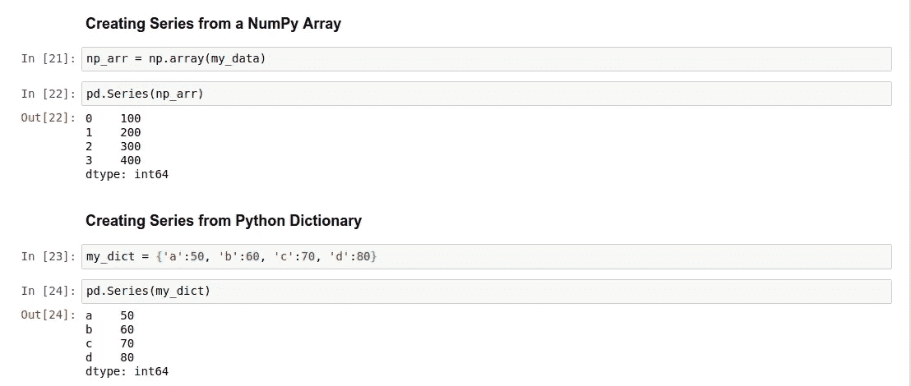

每当从 Python 字典创建 Series 时，Pandas 将键设置为 Series 的`index`，并将值设置为相应的数据点，如上面的`out[24]`所示。

> Pandas 系列与 NumPy 数组的区别在于 Pandas 系列可以保存各种对象类型。

**从系列中抓取信息**

我们可以像使用 python 字典一样从一个系列中获取信息:

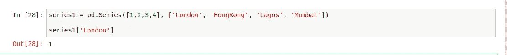

**对数列进行算术运算**

基于`index`完成系列操作。当我们使用任何数学运算，如-、+、/、*，pandas 使用`index` *的值进行计算。*结果值随后被转换成浮点数，这样你就不会丢失任何信息。

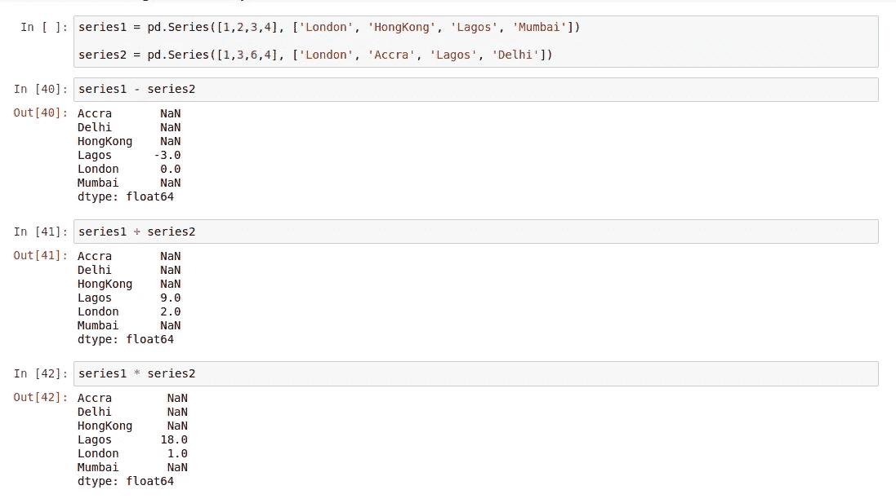

从上面来看，熊猫在这个系列中找不到匹配的，它给了它一个`NaN`值。

## 数据帧

数据帧是二维数据结构，其中数据以表格形式排列，即以行和列排列。熊猫数据框使处理你的数据变得容易。您可以选择、替换列和行，甚至重塑您的数据。

以下是创建数据帧的基本语法:

```
pd.DataFrame(data,index)
```

让我们创建一个 5 行 4 列的随机数数据帧:

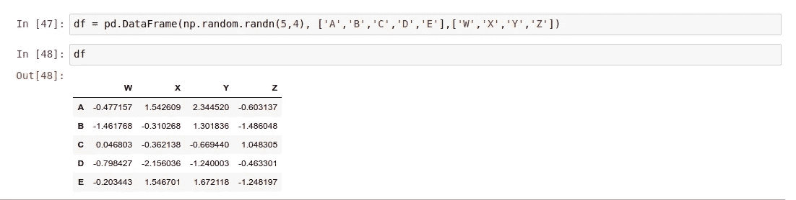

正如我们所见，上面的每个专栏实际上只是一个熊猫系列，它们都有一个共同的`index`。因此，可以肯定地说，数据帧是共享相同`index`的系列的集合。在下面的示例中，我们将从一个系列中创建一个数据帧:

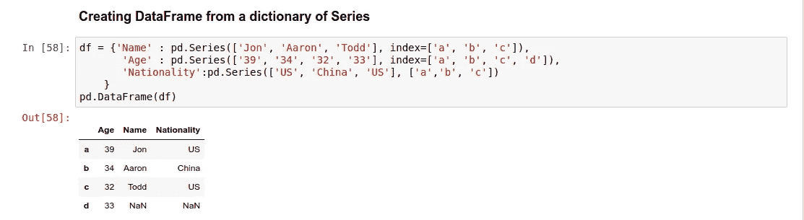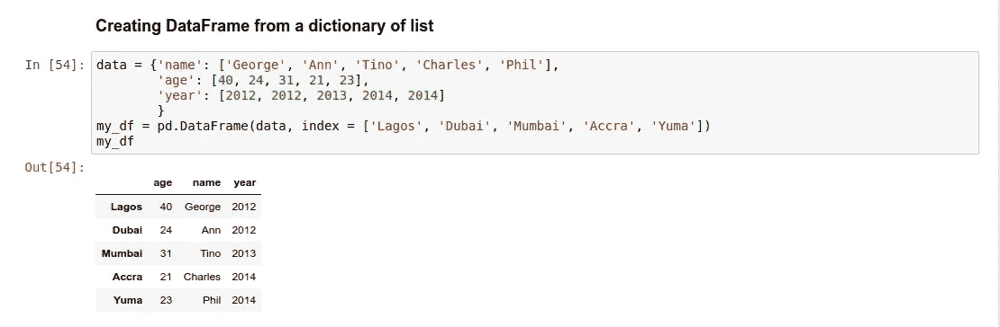

**从数据帧中选择列**

使用括号符号`[]`，我们可以很容易地从数据帧中抓取对象，就像处理 Series 一样。先来抢个专栏`name`:

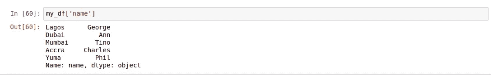

因为我们获取了单个列，所以它返回一个系列。继续使用`type()`确认返回的数据类型:

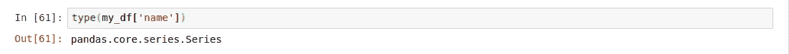

如果我们获取多个列，结果将是一个数据帧:

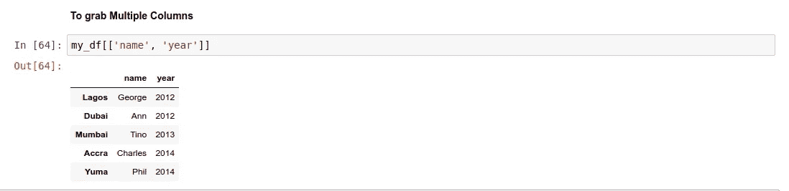

**向数据框架添加列**

当创建一个新列时，您必须像它已经存在一样定义它。有数据框架的:

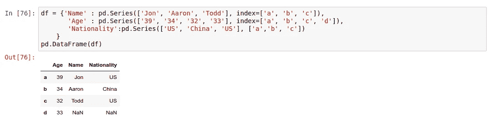

我们可以通过重新创建新列或从现有列添加新列，如下所示:

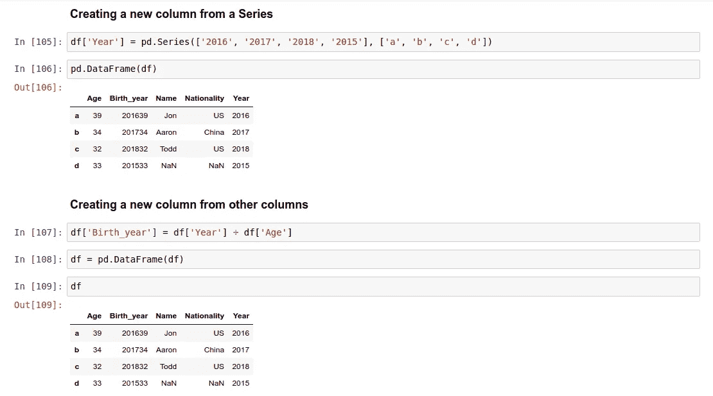

**从数据帧中删除行/列**

我们可以使用`.drop()`功能删除一行或一列。为此，我们必须为*行*指定`axis=0` ，为*列*指定`axis=1` 。

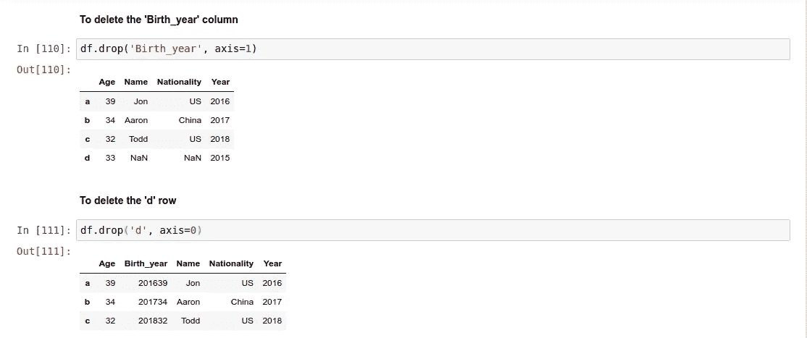

值得注意的是，无论何时使用`.drop()` 方法，Pandas 都不会永久删除一行/一列，除非您告诉它这样做。这是因为熊猫不希望你意外丢失数据。

打电话`df`确认。要永久删除一行/一列，您必须像这样设置`inplace=True`:

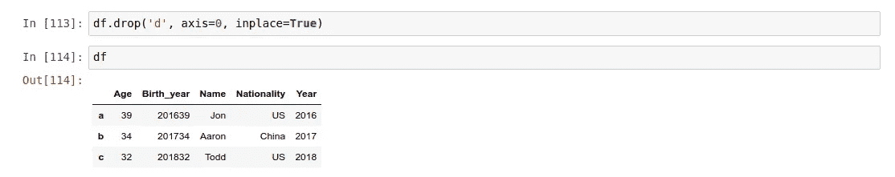

**选择数据帧中的行**

要选择行，我们必须使用接受标签名的`.loc[]`或接受行的索引位置的`.iloc[]`来调用行的位置。

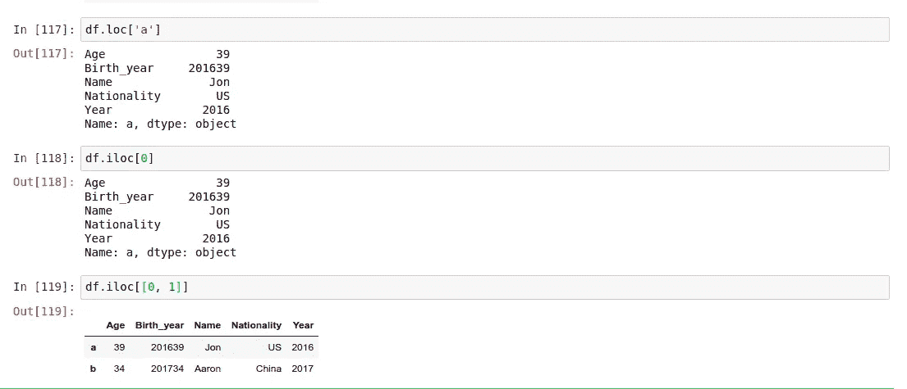

我们也可以像在 [NumPy](/lets-talk-about-numpy-for-datascience-beginners-b8088722309f) 中那样，通过指定我们想要的行和列，使用列符号`:`来选择行和列的子集。假设我们想要第`'c'`行的`'Name’`:

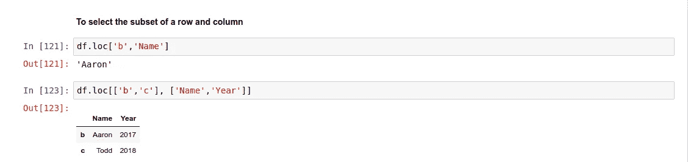

**条件选择**

Pandas 允许您使用括号符号`[]`进行条件选择。下面的示例返回其中`'W'>0` *:* 的行

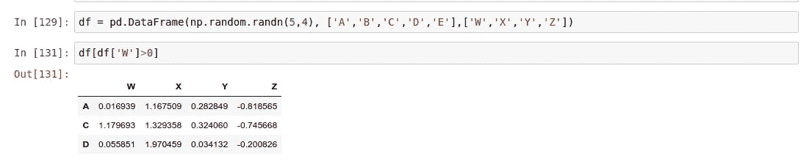

假设我们只想返回列`'X'`的值，其中`'W'>0` *:*

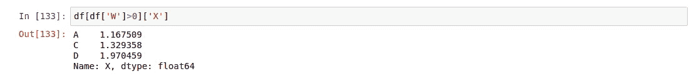

继续尝试这个:`df[df['W']>0][['X','Y']]` ，你应该得到这个:

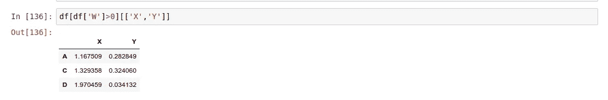

上述一行抽象也可以通过将其分解为多个步骤来实现:

```
my_series = df['W']>0
result = df[my_series]
my_cols = ['X','Y']
result[my_cols]
```

使用多个条件，我们可以通过使用逻辑操作符& (AND)和| (OR)来获得数据帧中的值。例如，要返回值，其中`'W'>0` 和`'X'>1` *，*使用:

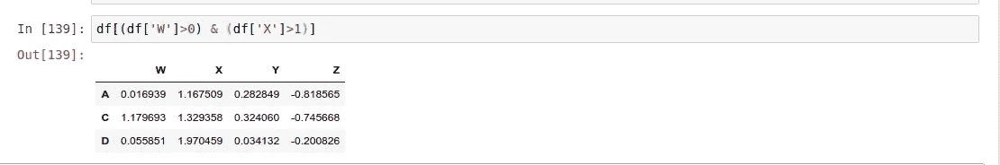

**重置数据帧的索引**

当你的索引看起来不完全是你想要的样子时，你可以使用`.reset_index()`很容易地重置它。这将我们的 DataFrame 索引重置为名为`index` 的列，Pandas 的默认索引值`[0, ..., len(data) - 1]`是我们的新索引。

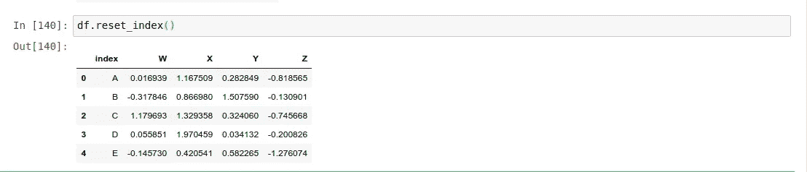

不出所料，`.reset_index()`不会永久重置索引，直到您指定:`.reset_index(inplace=True)`

**设置数据帧的索引**

类似地，我们可以通过使用`set_index()`函数来指定想要使用哪一列作为我们的索引标签。为此，我们将创建一个名为`"ID'`的新列，并将其设置为我们的新索引:

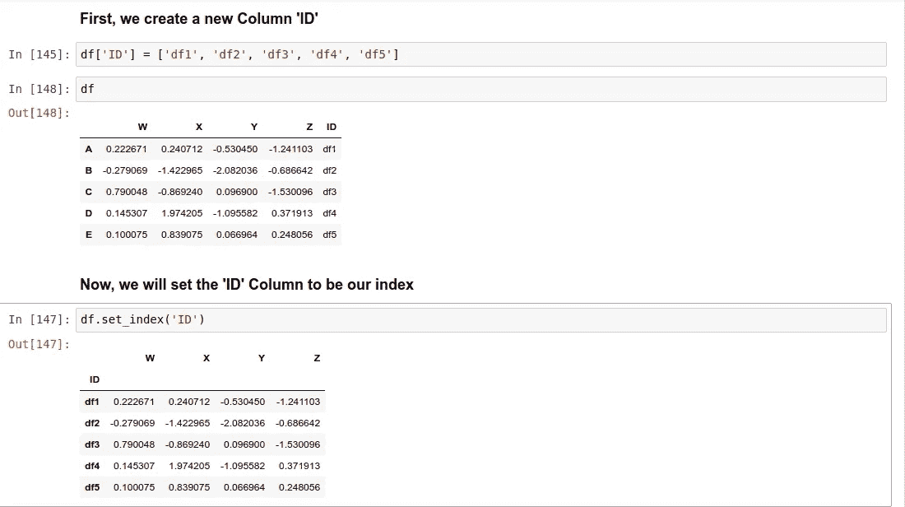

> 不像`*.reset_index()*`重置旧的索引并使用默认的熊猫索引作为我们的新索引，`*.set_index()*`完全覆盖旧的索引。

**多级指标(** MultiIndex) **和指标层次**

多索引只是一个元组数组，其中每个元组都是唯一的。它可以从一个数组列表(使用`MultiIndex.from_arrays`)、一个元组数组(使用`MultiIndex.from_tuples`)或一组交叉的可重复项(使用`MultiIndex.from_product`)中创建。

让我们从一个 turple 创建一个 MultiIndex:

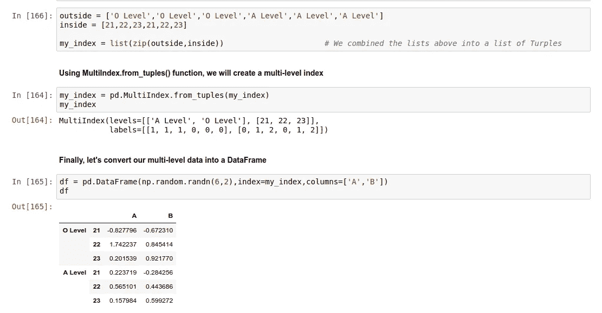

我们可以继续使用`.loc[]`从 MultiIndex 中获取行，如下所示:

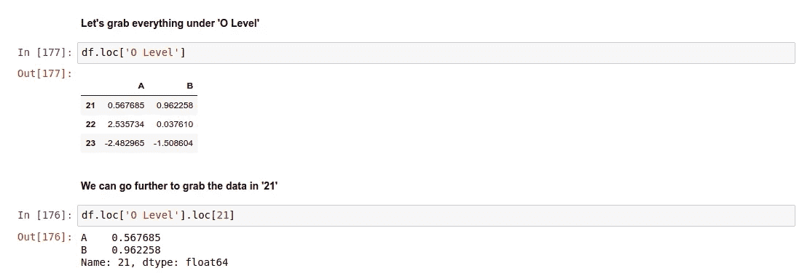

正如我们所看到的，我们的数据框架`df`的前两列没有名字。我们可以像这样用`.index.names`给它们命名:

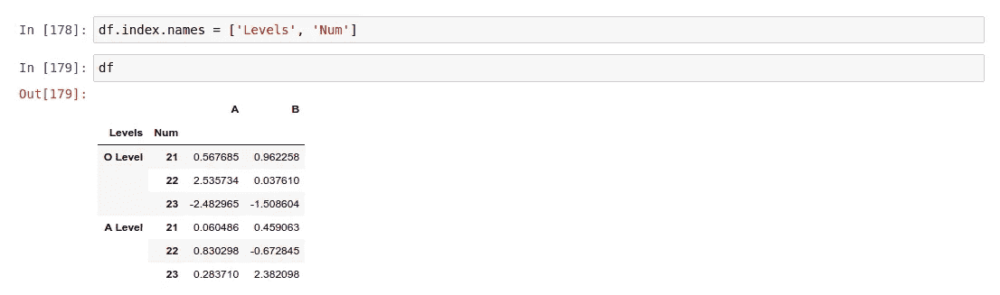

**横切面的行列**

使用`.xs`方法，我们可以很容易地选择多索引中特定级别的数据。例如，假设我们想要获取所有级别，其中`Num = 22`:

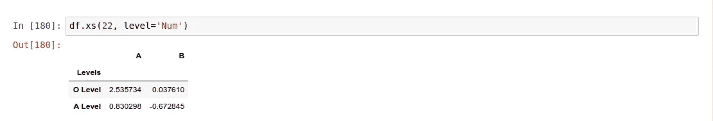

## 缺失数据

很多时候，当你使用 Pandas 读入数据并且有缺失点时，Pandas 会自动用一个`NaN or Null`值来填充这些缺失点。因此，我们可以使用`.dropna()`删除那些自动填充的值，或者使用`.fillna().`填充它们

假设我们有一个数据框架:

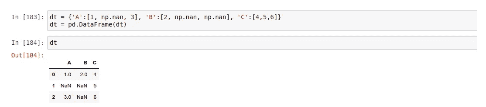

使用`.dropna()`方法，我们告诉 Pandas 删除任何有一个或多个缺失值的行或列。要删除一行，使用`.dropna(axis=0)`和`.dropna(axis=1)`删除一列。

> 注意，如果您没有指定轴，Pandas 默认假设您正在删除一行。


同样，使用`.fillna()`方法，我们可以用我们想要的值替换数据帧中缺失的值。让我们用`10`替换所有的`NaN`值:

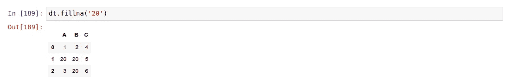

我们也可以选择只填充特定列或行中缺少的值。让我们用平均值替换列`'A'`中缺失的值:

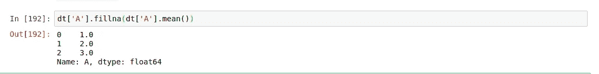

从上面可以看出，列`'A'`的平均值是 2.0，因此它用 2.0 替换了第二行。

同样，`.dropna()`和`.fillna()`不会永久出现，直到您设置了`inplace=True`

**分组依据**

Grouby 允许您根据列对行进行分组，以便您可以对它们执行聚合函数(如求和、均值、中值、标准差等)。

使用`.groupby()`方法，我们可以根据`'Company'` 列对行进行分组，并对其调用聚合函数`.mean()`:

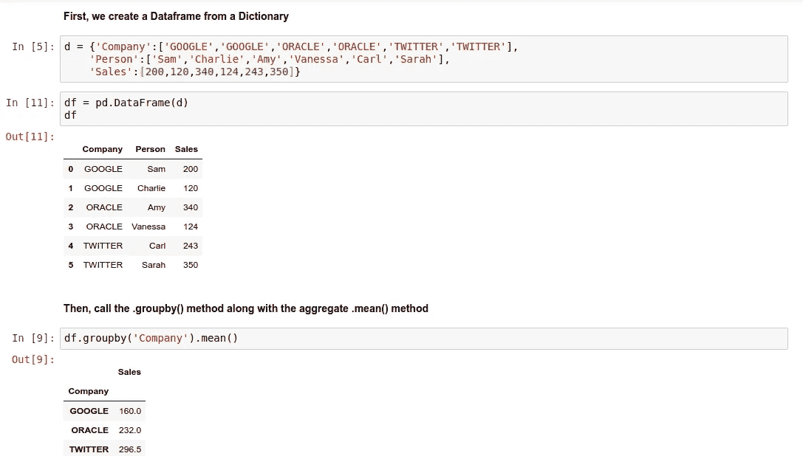

如你所见，我们的结果是每个公司的平均值。

**计数**

使用`count()` 方法，我们可以获得一个项目在数据帧中出现的次数。

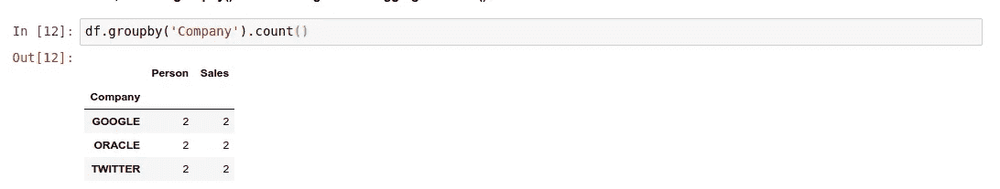

**形容**

`.describe()`方法用于获得数据帧的概貌。它为我们提供了每个数据帧索引的摘要。

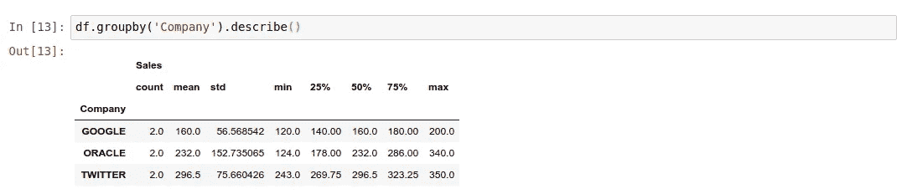

如果你不喜欢这个布局，你可以使用`.transpose()`方法得到一个不同的布局。

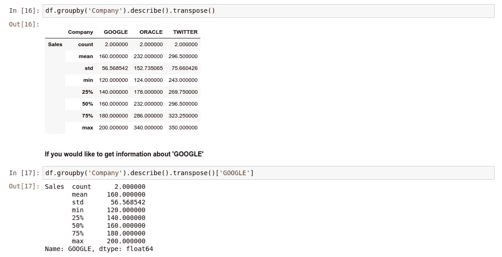

**连接、合并和连接数据帧**

**串联**

串联基本上将数据帧粘合在一起。当连接数据帧时，请记住，维度应该沿着要连接的轴匹配。拥有，数据帧列表:

```
df1 = pd.DataFrame({'A': ['A0', 'A1', 'A2', 'A3'],
                        'B': ['B0', 'B1', 'B2', 'B3'],
                        'C': ['C0', 'C1', 'C2', 'C3'],
                        'D': ['D0', 'D1', 'D2', 'D3']},
                        index=[0, 1, 2, 3])df2 = pd.DataFrame({'A': ['A4', 'A5', 'A6', 'A7'],
                        'B': ['B4', 'B5', 'B6', 'B7'],
                        'C': ['C4', 'C5', 'C6', 'C7'],
                        'D': ['D4', 'D5', 'D6', 'D7']},
                         index=[4, 5, 6, 7]) df3 = pd.DataFrame({'A': ['A8', 'A9', 'A10', 'A11'],
                        'B': ['B8', 'B9', 'B10', 'B11'],
                        'C': ['C8', 'C9', 'C10', 'C11'],
                        'D': ['D8', 'D9', 'D10', 'D11']},
                        index=[8, 9, 10, 11])
```

我们可以使用`pd.concat()`方法连接它们:

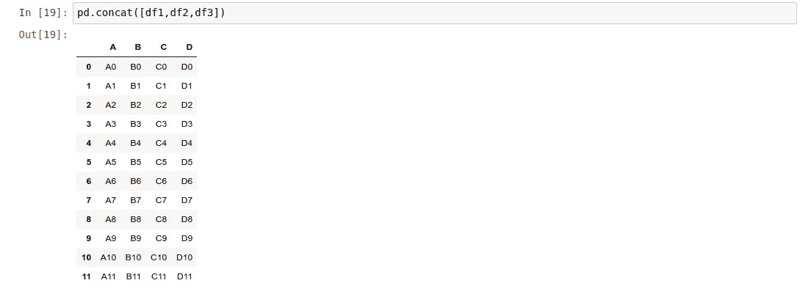

因为我们没有指定希望在哪个轴上发生串联，所以默认情况下，Pandas 使用行轴。它把两行连接在一起。如果我们希望沿着列进行连接，我们必须设置`axis=1`:

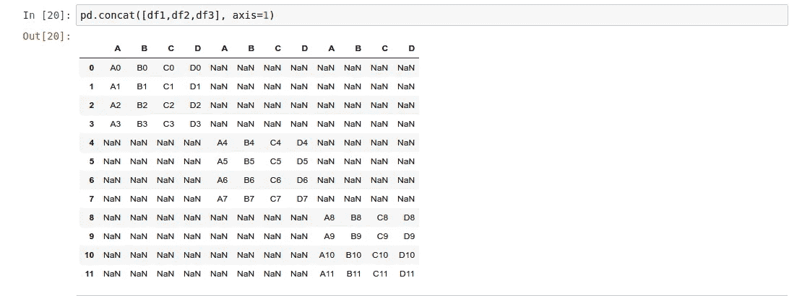

注意这里我们有一堆缺失的值。这是因为 DataFrame 没有包含我们希望它连接的所有索引的值。因此，当使用`pd.concat()`时，确保您的数据正确包含轴上的所有信息。

**合并**

使用`pd.merge()`函数，Pandas 允许您像合并 SQL 表一样合并数据帧。合并数据帧的语法是`pd.merge(left, right, how='inner', on='Key'`。`left`表示应该出现在左侧的数据帧，`right`表示应该出现在右侧的数据帧，`how='inner'`表示合并操作应该作为交集`inner`还是并集`Outer`来处理。最后，`on='Key'`表示发生合并的键列。在合并功能发生之前，该键列在所有数据帧中必须是相似的。

有两个数据帧都有一个`key`列，我们可以这样合并它们:

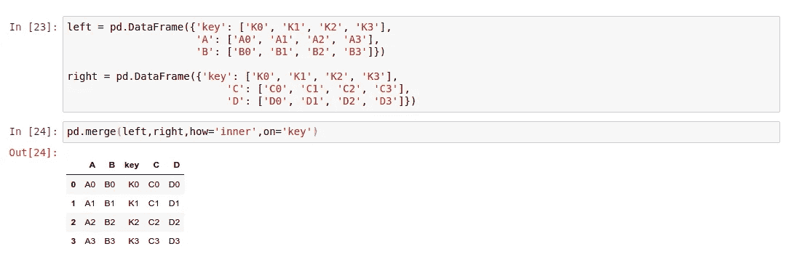

我们还可以通过简单地传递键来合并多个键:

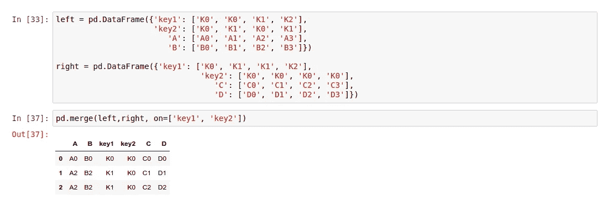

**加入**

对于将两个可能索引不同的数据帧的列组合成单个数据帧，联接是一种更方便的方法。联接类似于合并，但不同之处在于联接方法发生在索引键而不是列上。

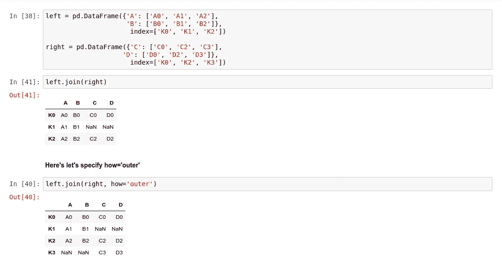

## 在数据帧中查找唯一值

唯一值就是数据帧中的不同值。在数据帧中查找唯一值有三种主要的有用方法。

使用`.unique()`，我们可以找到以下数据帧的`col2`中的所有唯一值:

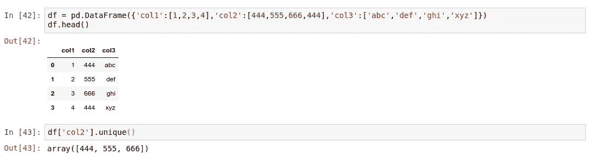

我们可以选择使用`.nunique()`来计算数据帧中唯一值的数量，而不是显示唯一值:

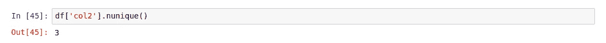

最后，我们可以决定使用`.value_counts()`只返回一个惟一值在一列中出现的次数:

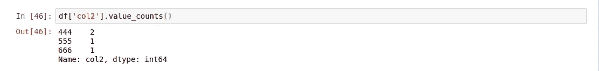

**apply()方法**

`.apply()`方法用于调用数据帧上的自定义函数。想象我们有一个函数:

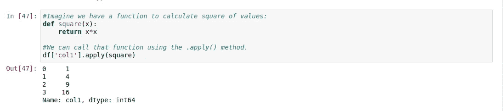

在上面的例子中，我们将函数传播给列中的每个元素。我们还可以将内置函数应用于数据帧。假设我们想要得到`col3`中字符串的长度:

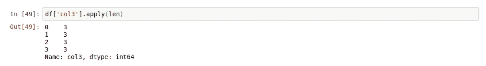

有时，您可能会定义一个最终只使用一次的函数。不用在几行代码中定义这样的函数，您可以简单地使用 lambda 表达式，这是该函数的简化版本。例如，我们可以用 lambda 表达式来表示上面`ln[47]`中的平方函数:

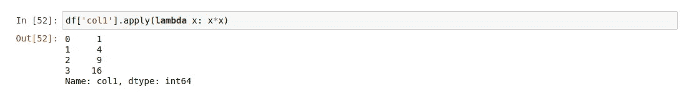

**获取数据帧属性**

属性是数据帧的列名和索引名。假设我们不确定数据帧中的列名是否包含空格字符，我们可以简单地获得它们的属性:

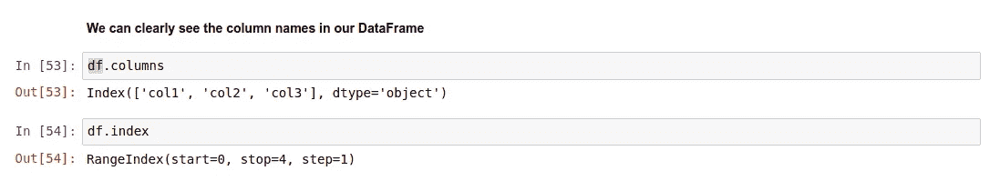

**对数据帧进行排序和排序**

假设我们想要显示数据帧，其中某一列以升序显示，我们可以使用`.sort_values():`很容易地对其进行排序

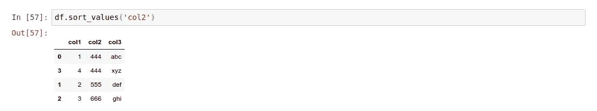

如您所见，`col2`中的值是从最低到最高显示的。还要注意`index`是如何连接到每一行的，这样信息就不会丢失。

**查找空值**

假设您有一个大型数据集，Pandas 使用`.isnull():`使得定位空值变得非常容易

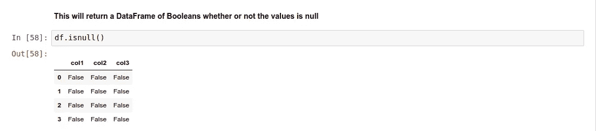

**透视表**

您可能已经熟悉 Excel 中的数据透视表。数据透视表是汇总另一个表中数据的表。它使您能够自动对存储在一个表中的数据进行分组、切片、筛选、排序、计数、合计或平均。有数据框架的:

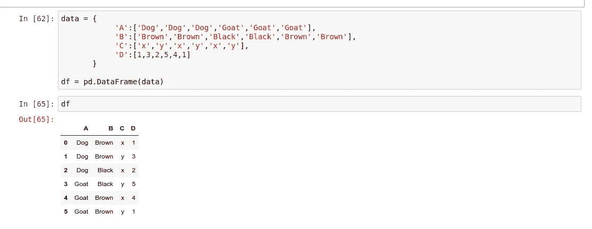

我们可以使用语法从它创建一个数据透视表:`.pivot_table(data, values='', index=[''], columns=['']).`其中`values`表示我们想要组成数据点的列，`index`是您想要对数据进行分组的列，`columns`表示应该定义数据帧的列。你可以在这里阅读更多关于数据透视表[的内容。](https://pandas.pydata.org/pandas-docs/stable/generated/pandas.pivot_table.html)

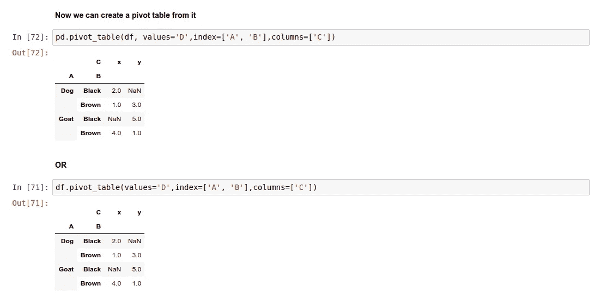

在上面的例子中，我们得到了一些`NaN`值，因为对于那些特定的点没有匹配的值。

## 数据输入和输出

使用`pd.read_`方法，Pandas 允许您从各种来源访问数据，例如:excel 表、csv、sql 或 html。

要引用任何文件，你必须确保它与你的 jupyter 笔记本在同一个目录下。

**读取 CSV 文件**

使用`pd.read_csv()`我们可以将. csv 文件的内容输出为数据帧，如下所示:

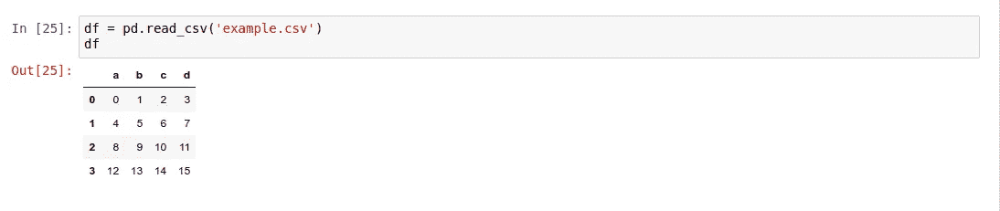

**写入 CSV 文件**

我们可以创建一个数据帧，并使用`.to_csv()`将其存储在一个`.csv`文件中，如下所示:

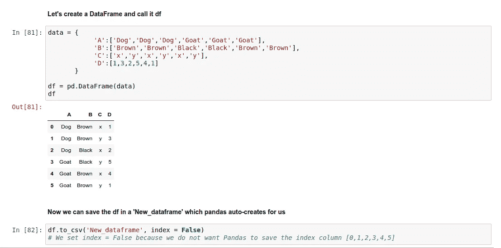

要确认数据已保存，请继续阅读您刚刚使用`pd.read_csv('New_dataframe')`创建的 csv 文件。

**从 Excel 文件中读取**

Excel 文件是很好的数据来源。使用`pd.read_excel()`我们可以从 excel 文件导入数据。请记住，Pandas 只能导入 excel 文件中的数据，而不能导入宏、图像或公式。excel 文件中有宏、图像或公式会导致`pd.read_excel()` 方法崩溃。

假设我们有一个 excel 文件`'excel_output.xlsx'`，让我们继续输出它的内容:

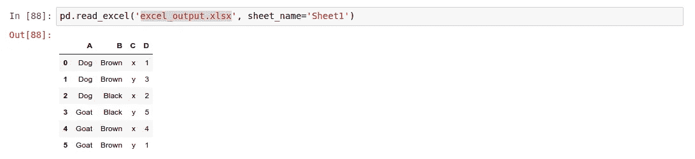

请记住，每个 excel 文件都包含一个或多个工作表。在我们的例子中，`Sheet1`指的是我们想要读取的`'excel_output.xlsx'`中的特定工作表。

**写入 Excel 文件**

就像我们对 csv 所做的那样，我们可以创建一个数据帧，并使用`.to_excel()`将其存储在一个`.xlsx`文件中，如下所示:

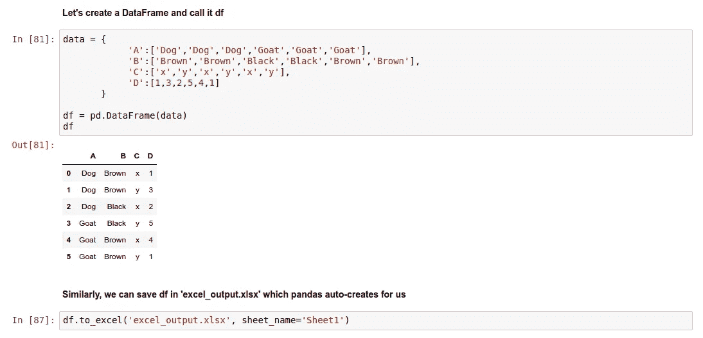

**从 HTML 中读取**

要从 HTML 文件中读取数据，需要安装 htmllib5、lxml 和 BeautifulSoup4。在您的终端运行中:

```
conda install lxml
conda install html5lib
conda install BeautifulSoup4
```

使用`.read_html()`让我们告诉熊猫从这个 [html 页面](https://en.wikipedia.org/wiki/List_of_banks_in_the_United_Kingdom)读取表格。由于该页面中有不同的表，我们可以使用索引号`[0, ..., len(tables) - 1]`来访问我们想要的特定表。对于本例，我们将返回该页面中的第二个表。

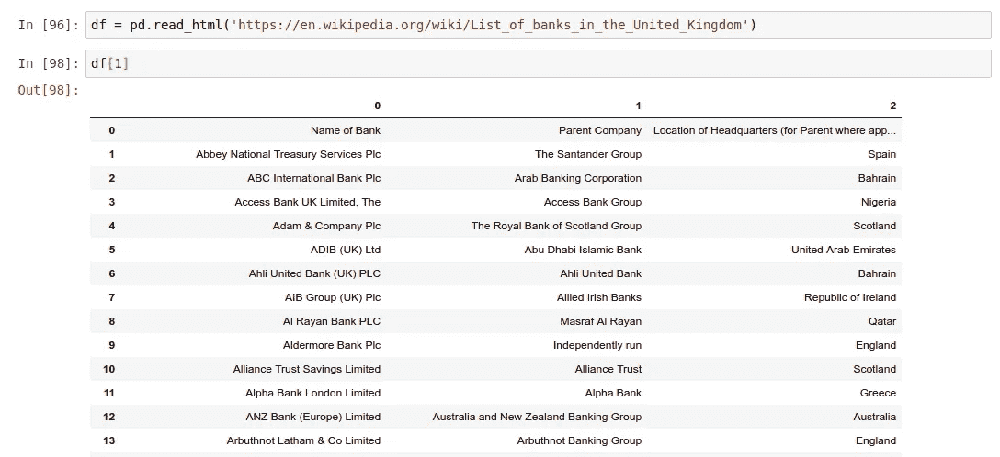

本教程到此结束，恭喜！

如果您完成了本课，您应该对什么是 Pandas 以及如何使用它进行数据准备有很好的了解。你现在需要做的就是练习！练习！练习！。

有问题，遇到困难或者只是想打个招呼？请使用评论框。如果这个教程在某些方面对你有帮助，给我看一些👏。