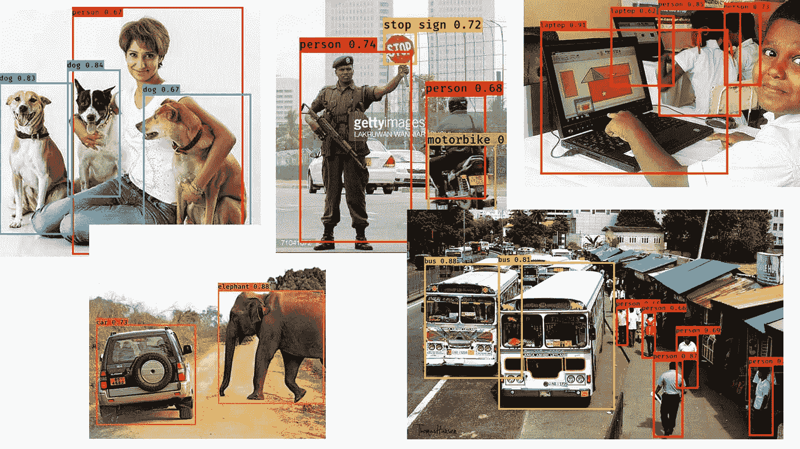

# 快速实现 Yolo V2 与 Keras！

> 原文：<https://towardsdatascience.com/quick-implementation-of-yolo-v2-with-keras-ebf6eb40c684?source=collection_archive---------1----------------------->

I do not hold ownership to any of the above pictures. These are merely used for educational purposes to describe the concepts.

多年来，实时多目标定位一直是数字图像处理领域的一个大争论。随着深度学习和卷积神经网络的发明，这些努力已经产生了非常有前景的结果，训练有素的模型能够非常准确地检测许多类别的对象，这种能力现在已经掌握在我们手中。

在这篇文章中，我打算介绍一个著名的模型，称为 Yolo，代表“你只看一次”，由 [Joseph Redmo 等人](https://arxiv.org/abs/1612.08242)提出，该模型已经朝着对象的快速多本地化及其使用 Keras 的实现迈出了一大步，Keras 是一个高级深度学习库。

让我们首先看一下分类、定位和检测这三个术语之间的区别。我们经常在图像处理领域听到这些术语，它们在应用中各不相同。
**分类** —指识别图像中是否存在给定对象。常见的例子:猫或不猫。
**定位** —不仅指识别图像中是否存在给定对象，还指使用边界框来区分对象的位置。
**检测** —简单地说就是在一幅图像中进行多次定位。

Yolo 正在解决图像中物体的检测问题，随着 Yolo V2 论文[的发表，这一技术在该领域迅速推广。让我们看看约洛·V2 算法的主要步骤。这些可以指出如下:](https://arxiv.org/abs/1612.08242)

*   使用网格分割图像(例如:19x19)
    将图像分割成一个由更小图像组成的网格，可以更容易地检测到每个单元内的物体。
*   在每个网格单元上执行图像分类和定位
    每个单元的向量表示检测到物体的概率，边界框的尺寸和检测到的图像的类别作为该步骤的输出给出。
*   执行阈值处理，删除多个检测到的实例
    阈值处理选择概率最高的单元，以便选择更正确的边界框
*   执行非最大值抑制以进一步细化方框
    非最大值抑制技术提供了一种便捷的方法，使用一种称为[并集交集](https://www.pyimagesearch.com/2016/11/07/intersection-over-union-iou-for-object-detection/)的计算来进一步细化结果

附加点-锚定框用于检测一个网格单元中的多个对象。与其他算法相比，这是约罗 V2 算法的一个特点。

Yolo 的第一个实现是由 Joseph Redmon 等人使用 C 语言中称为 [Darknet](https://pjreddie.com/darknet/) 的模型提出的，随着该方法的发展，还构建了当前更流行的 ML 库(如 Tensorflow 和 Keras)的实现。

我的 [Github 库在这里](https://github.com/miranthajayatilake/YOLOw-Keras)展示了一个使用 Keras 的算法的快速实现。使用该代码，任何人都可以用自己的图像进行测试，并深入了解其工作原理。关于它的安装和执行的所有细节可以在回购中找到。

请在您的应用程序中自由使用代码，并分享传播知识！