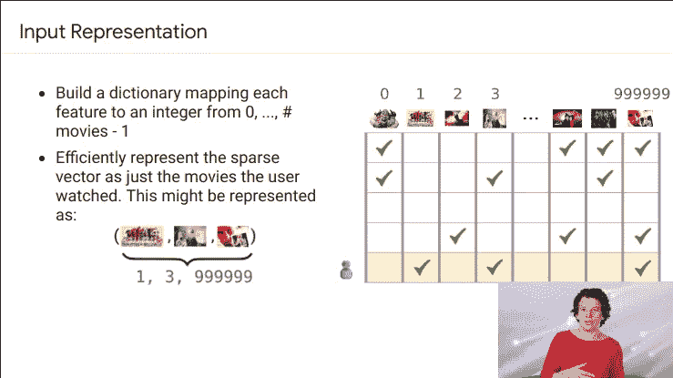
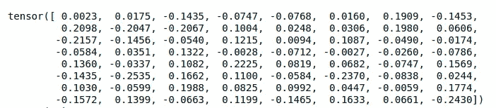
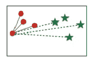
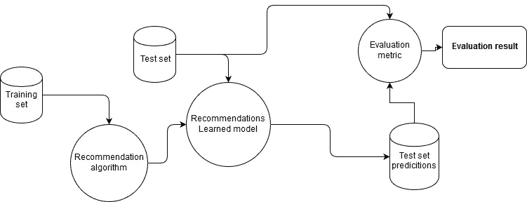
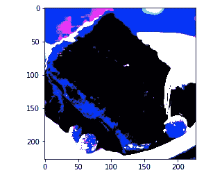
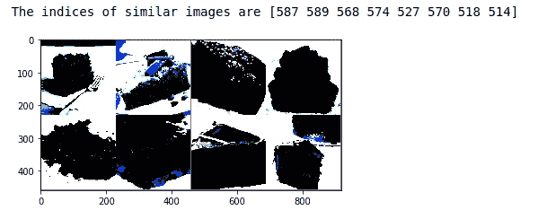
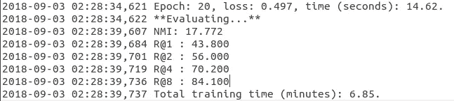

# 快速回顾，进入具有代理的嵌入式模型

> 原文：<https://towardsdatascience.com/quick-review-to-leap-into-embedded-models-with-proxies-c6f39e24d06d?source=collection_archive---------16----------------------->

作为后续工作，我制作了一个 Jupyter 笔记本。这里收集的部分图片取自那里:【https://arxiv.org/pdf/1703.07464.pdf】https://github . com/rachuism/food-classifier-proxy-NCA/blob/master/visualization . ipynb 还有这里:

顾名思义，嵌入是为了让东西变得更小。在深度学习的情况下，它包括将项目(例如，电影、文本等)映射到低维实向量，使相似的项目彼此靠近。

所以让我们以一部电影的推荐系统为例。我们需要跟踪每个用户的口味来提取数据。但是，如果我们正在跟踪一组，例如，一百万部电影呢？对整个集合进行编码将如下所示:

Taken from Google’s developers course

这对于处理深度学习模型是非常低效的。相反，我们试图使用各种数学技术来减少这个空间的维数。下图显示了巨大的编码是如何“嵌入”网络的。

Taken from Google’s developers course

在我的模型的训练期间，嵌入大小被选择为 64。这就是为什么当张量被打印出来时，有 64 个元素塑造了它:

这个项目的另一个关键词是“代理”,在这个例子中，它是作为模型参数的一部分学习的。它努力将一个数据集表示成一个点。根据经验，在代理上公式化的学习问题表现出比其他度量学习方法更快的收敛。

作为一个帮助理解它的例子，让我们首先理解“三元组”的概念:有一个“锚”点 **x** ，我们想减少到另一个相似点 **y** 的距离，并增加到不同点**z**的距离。下图试图简化理解:

Taken from the aforementioned paper

让我们想象我们的定位点是孤立的红色圆圈，它离其余的圆圈较近，离星星较远。这是总结代理意图的最佳实例。在下面的方案中，右图显示了一个大点如何表示一组点。

Taken from the aforementioned paper

可以看出，代理充当每个点集的上限表示。在这些距离上计算损耗，试图保持 **x** 尽可能靠近 **y** 并尽可能远离**z**

# 资料组

该数据集由 20 个食物类别和每个类别的 100 张图像组成。所选的种类有苹果派、面包布丁、牛肉片、甜菜沙拉、巧克力蛋糕、巧克力慕斯、甜甜圈、贝奈特饼、本尼迪克特蛋卷、法式面包卷、汤团、虾和玉米粉、烤三文鱼、猪排、千层面、馄饨、煎饼、法式吐司、意大利肉酱面、泰式炒面。

链接到数据集(UPMC-20 国集团):[http://visiir.lip6.fr/](http://visiir.lip6.fr/)

# 培训和评估

下图解释了评估系统的工作流程。首先，将训练集提供给推荐算法，该算法产生可用于生成新预测的推荐模型。为了评估该模型，将保留的测试集提供给学习模型，其中为每个用户-项目对生成预测。**具有已知标签的预测(真值)**然后被用作评估算法的输入，以产生评估结果。

因为我只处理了 20 个类，所以我将其中的 50%用于训练集，50%用于评估

对于远程度量学习来说，类的数量很少，因为与类内变化相比，类内变化很大。这就是后来 NMI 抛出低值的原因。

# **预言。邻域成分分析**

NCA 由一种监督学习方法组成，用于根据给定的数据距离度量将多元数据分类到不同的类中。(k 个最近邻居)。在“预测”步骤中，我使用:**sk learn . metrics . pairwise . pairwise _ distances(X)**来查找更接近我的查询的图像。

在这个例子中，我选择作为查询的图像是小菜一碟，经过一些转换(输入被调整为 256 × 256 像素，然后被随机裁剪为 227 × 227。像素的亮度已被缩放)看起来像这样:

UPMC20 dataset

对该照片的检索是来自同一类(蛋糕)的图像:

UPMC20 dataset

# 理解日志

纪元的数量已被设置为 20。有两个概念可以理解在“评估步骤”中损失是如何计算的

.log file

NMI:归一化互信息，定义为聚类和地面实况的互信息与其调和平均值的比值。它量化了通过其他随机变量获得的关于一个变量的信息量。

k 时回忆:*k 时回忆是前 k 项推荐中相关项目的比例。*所以在 R@1 的的情况下，它意味着相关项目出现在第一个位置的概率为 40%，在 R@8 的情况下，它意味着相关项目出现在前 8 个位置的概率为 84%。这就是为什么参数“K”越大，其召回率越大的原因。数学上可以定义为:**召回@k =(推荐项目数@k 相关)/(相关项目总数)。**

# **参考**

 [## 推荐系统的召回率和 k 精度

### 附例详细说明

medium.com](https://medium.com/@m_n_malaeb/recall-and-precision-at-k-for-recommender-systems-618483226c54) 

**不要大惊小怪使用代理的距离度量学习**[https://arxiv.org/pdf/1703.07464.pdf](https://arxiv.org/pdf/1703.07464.pdf)