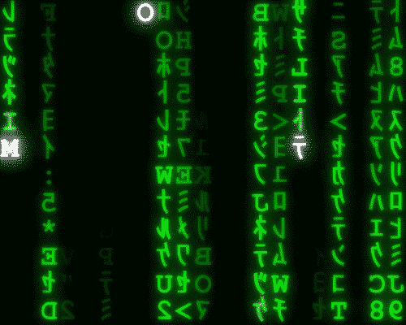
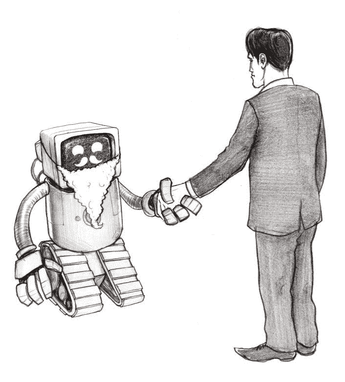

# 伦理人工智能设计的快速押韵

> 原文：<https://towardsdatascience.com/quick-rhymes-for-ethical-ai-designs-2f5afba090e7?source=collection_archive---------13----------------------->

我最近在读丹尼尔·卡内曼的《思考的快慢》，其中一部分讲述了如何写出令人难忘的信息。要点——人们记得押韵的东西。

我想我应该写几首关于伦理人工智能的押韵诗，希望下次你开始一个项目时会想到。

开始了。

# 喂你的人工智能偏向数据

# 稍后会显示出这种偏见

阿勒格尼州立大学曾经创造了一种算法来帮助警察，建议他们巡逻的路线以及他们应该停下来搜查的人。它偏向于检查黑人人口较多的社区。

为什么？这并不是因为黑人天生就有什么不好的地方。这是因为该算法是基于人类警察生成的数据集进行训练的。那些警察，不管是有意还是无意，都有自己的种族偏见。给人工智能输入同样的数据，它也会有偏差。

我们希望人工智能做出理性的决定，并帮助人类识别和避免偏见。因此，当你训练一个人工智能时，确保你使用的是无偏见的数据。

***延伸阅读***

[弗吉尼亚·尤班克斯的《自动化不平等》](https://www.amazon.co.uk/dp/B0739MF8VF/ref=dp-kindle-redirect?_encoding=UTF8&btkr=1)

# 显示你的算法不透明

# 如果它的意思不明显

想象一下，你申请了一笔抵押贷款，而自动验证系统拒绝了你。你问它为什么，你得到的答案是；

那不是很透明…你想要的是简单明了的英语(或者任何最适合你的语言！)，对其得出结论的原因的通俗易懂的描述。

如果处理得当，这对企业也有好处。算法如何工作的复杂性通常是一个区别点。我们被 Spotify、网飞和亚马逊这样的企业所吸引，部分原因是它们的算法能够很好地了解我们是谁，并做出明智的推荐。共享简单语言的含义和意图而不是代码保留了这一优势。

***延伸阅读***

[未来生命研究所的透明可解释人工智能](https://futureoflife.org/2018/02/13/transparent-interpretable-ai/)

# 无方向性的情报不好

# 如果我们自己的价值观不被理解

我们为什么要造 AI？为了人类的利益。即使我们变得自私，这也是为了至少一个人的利益。如果我们追求智慧或者追求智慧本身，却不知道我们人类的价值观是什么，也没有办法将其编码到系统中，那么它与我们的价值观相一致的机会就像是在瞎猜。

这个主题领域被称为人工智能对齐

***延伸阅读***

[罗辛·沙阿的《校准通讯》](https://rohinshah.com/alignment-newsletter/)

[什么是我的 AI 调整](/what-is-ai-alignment-2bbbe4633c7f)

[保罗·克里斯蒂亚诺所著《一切》](https://medium.com/@paulfchristiano)

[Nick Bostrom 的超智能](https://www.amazon.co.uk/Superintelligence-Dangers-Strategies-Nick-Bostrom/dp/0198739834/ref=sr_1_1?ie=UTF8&qid=1541421517&sr=8-1&keywords=superintelligence)

# 分享就是关怀

好吧，我扯掉了这个。但如果一个人或一家企业创造了能产生大量财富的人工智能，而这种财富是没人能追上的，特别是因为他们可以用这笔财富来打造一个更有能力的系统，那这笔财富就应该被分享。如果我们现在就这样做，那就太好了，就算没有人工智能(这是一厢情愿的想法)，但如果我们考虑到一种技术可以创造比没有人工智能时我们所能创造的财富多几个数量级的财富，这个问题就会变得更加严重。

***进一步阅读***

[机器人的崛起:马丁·福特的技术与大规模失业威胁](https://www.amazon.co.uk/dp/B01DRYIS4K/ref=dp-kindle-redirect?_encoding=UTF8&btkr=1)

# 你还没有释放你的人工智能

# 你还有责任

除非在非常特殊的情况下，你在人工智能中创造意识，而我们没有达到这种状态的路线图，否则创造者对人工智能的所作所为负有伦理和道德责任。Virginia Eubanks 在这方面做了一些很好的工作——我们将自动化作为抽象的道德层。

***进一步阅读***

[哈佛大学人工智能解释能力](https://dash.harvard.edu/bitstream/handle/1/34372584/2017-11_aiexplainability-1.pdf?sequence=3)

# 你对合乎道德的人工智能有什么看法吗？请在下面发布！

对这个话题感兴趣吗？

[加入会议小组 AI 道德伦敦](https://www.meetup.com/AI-Ethics-London/)

[订阅我在 media](https://medium.com/@benjamin.gilburt)上的博客