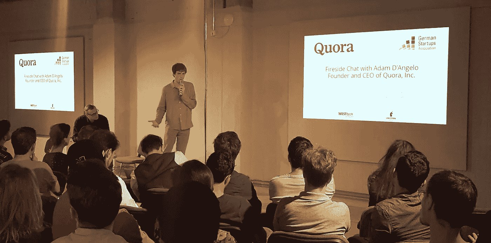

# Quora x 柏林独角兽

> 原文：<https://towardsdatascience.com/quora-x-unicorn-berlin-d04650c07641?source=collection_archive---------9----------------------->

CEO Adam D’Angelo describing Quora to the audience at Unicorn Berlin

## 在德国首都回答你的问题

在一个名为“ [Unicorn](http://unicorn.berlin/) ”的地方参加活动，你永远不知道会听到什么。

我很想看看柏林的合作空间，并从 Quora 首席执行官[亚当·德安杰洛](https://www.quora.com/profile/Adam-DAngelo)那里收集一些智慧的珍珠，他是[联邦德国创业银行](https://deutschestartups.org/en/)组织邀请来演讲的。我目前正在支持拜耳的 [Grants4Apps](https://www.grants4apps.com/) 团队，该团队将创新的数字健康创业公司与制药机会联系起来。所以我喜欢抓住柏林的数字脉搏，此刻，它正涌动着[到](https://toa.berlin/)的能量。

但是回到晚上的嘉宾。也许你听说过 D ' angelo——一家叫做脸书的小公司的前首席技术官？如果你在德国这里搜索 Quora，你会收到一个等待列表邀请，但是[下载](https://play.google.com/store/apps/details?id=com.quora.android&hl=en)应用[程序](https://www.quora.com/topic/iOS-App-Store)。这是一个聪明的论坛，有至少 2 亿访问者的知识丰富、不断增长的社区来回答你的问题。

以下是来自 D'Angelo 的转述要点——这些要点引起了我的注意，可能对创新者和初创公司有所帮助。尤其是不限制自己想象力的重要性。

**在产品上**

个性化和机器学习:对用户有益的也对企业有益。Quora 特别重视这两个话题。但事实证明，很难教会机器识别讽刺。为了给用户创造一个安全的地方来提问，并期待高质量的答案，人类的努力(即 Quora 的 200 名员工，加上其用户对事情的报道)填补了机器学习还不能达到的地方。

**国际化 b4 货币化**

基本上，扩大你的用户群，然后担心美元。投资人要看用户。由于英语市场的激烈竞争，D'Angelo 希望专注于使英语产品尽可能的好和有用。通过他们在其他语言上的工作(到目前为止是西班牙语和法语)，他们已经开始理解语言和文化的细微差别是如何影响用户兴趣和行为的。语言生态系统必须可持续发展。

**投资建议？**

来自 [WestTechVentures](http://westtechventures.de/) 的主持人 Alexander klpin 厚脸皮地询问“投资建议”，例如，D'Angelo 在 Instagram 上有一些不错的预感。事实证明，最佳实践可以归结为依靠一个良好的网络，并坚持你所知道的游戏。

D'Angelo 以一种自我宣称的“随机”(但我要补充的是非常成功)的方式，在他有密切私人关系的地方进行投资。他根据他认识的人筛选选择，并且(对我们来说很可悲)远离生物技术，因为他认为其他人更了解这个领域。他坚持自己的优势:消费互联网和社交网络。很公平。目前为止创造了奇迹。

Smaller group conversation with Adam D’Angelo

**问&一个见解**

自然有机会，观众们向这位说话温和的技术大师提问。他们想知道至少四件事:

> 问:你是如何克服用户的痛点的？

答:通过听他们说。Quora 非常依赖 A/B 测试和用户研究作为良好的信息来源。做你的市场调查，真正了解你的市场。D'Angelo 回忆说参加了一次维基会议，这次会议极大地塑造了他的观点…

> 与许多实际用户交谈，记住有时他们的“想象力仅限于当前的挫折。”但是不要让你的梦想成真。

> 双 Q:作为 CEO 最艰难的时刻是什么？聊天机器人的兴起对你的产品有什么影响？

答:2011 年，Quora 的发展速度超过了其技术基础设施的承受能力。这导致了成长的烦恼，因为某些项目不得不被牺牲。人们在这些领域投入了感情，所以很糟糕。(我猜这是真的，因为他回答的时候声音真的很颤抖。我想所有观众都注意到了。)问题的第二部分:他对聊天机器人持“等等看”的态度，称带屏幕的设备比纯音频设备更有机会。他兴奋地强调，Quora 的重要趋势是机器学习和人工智能。

> 问:在脸书和 Quora 工作过，是什么让一个团队成功？

答:个人需要擅长他们所做的事情:工程和设计等。但他们也要善于在一个团队中，否则团队无法存在。你如何解决问题很重要。团队应该围绕使命和价值观保持一致，团队中的一个人应该对决策负责，即使这意味着艰难的权衡。

> 问:最后，Quora 关注错别字吗？

甲:目前没有。显然，答案的质量不是基于拼写，而是基于社区提供的内容。因为用户被鼓励使用他们的真实姓名和学术证书，这增加了讨论的真实性。Quora 团队似乎对如何分析回复更感兴趣，也许是训练一台机器来阅读、分类和引用它们。

活动结束后，人们聚在一起喝酒和交流。我遇到一个人，他刚从多伦多搬到柏林，在一家金融科技加速器工作。柏林一直吸引着国际人才和演讲者。

对于即将到来的独角兽活动，请查看:【http://unicorn.berlin/events/ 

如果你要去柏林露天科技，亚当·安吉洛将于 7 月 12 日 13:15 在 1 号演播室发表演讲。信息[此处](http://toa.berlin/conference/#adam-dangelo)。

The memorable, iconic logo of Unicorn Berlin