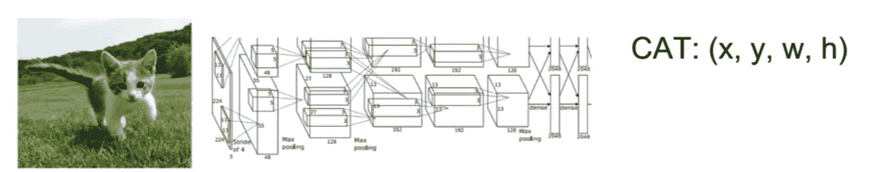
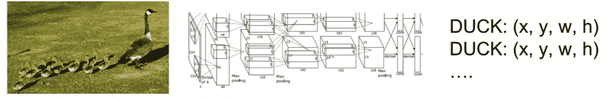
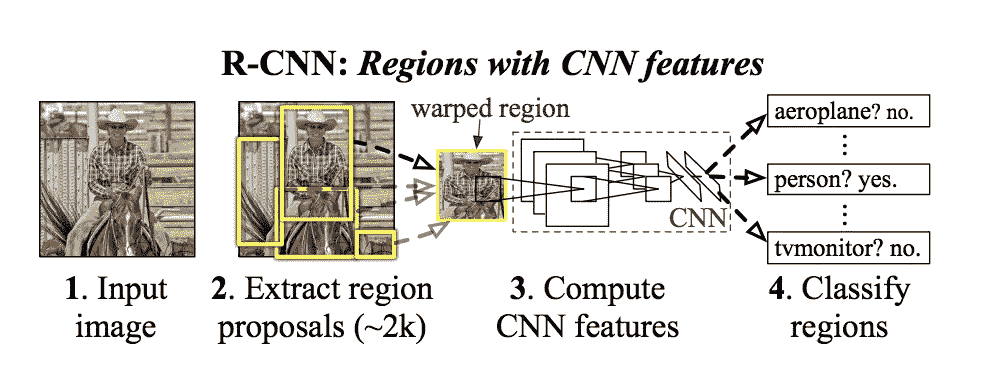
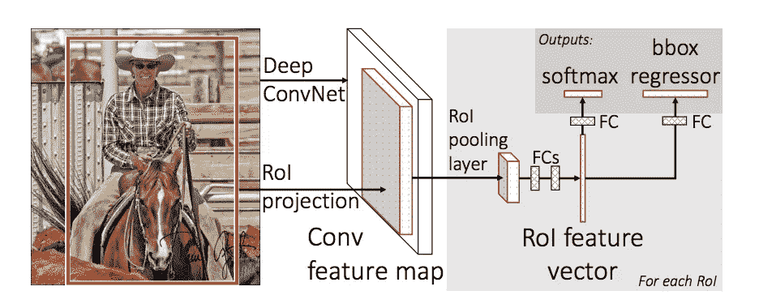
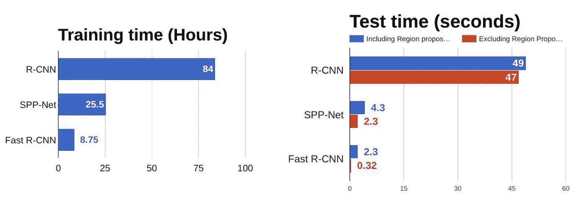
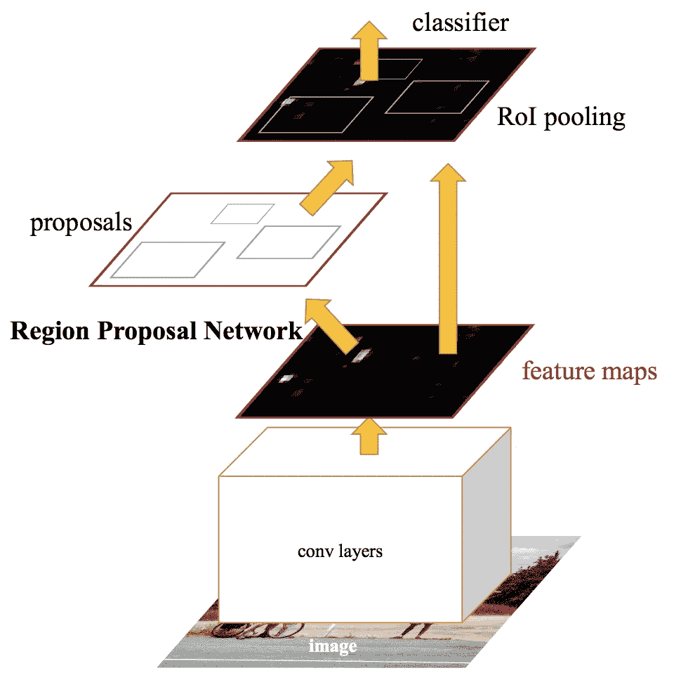
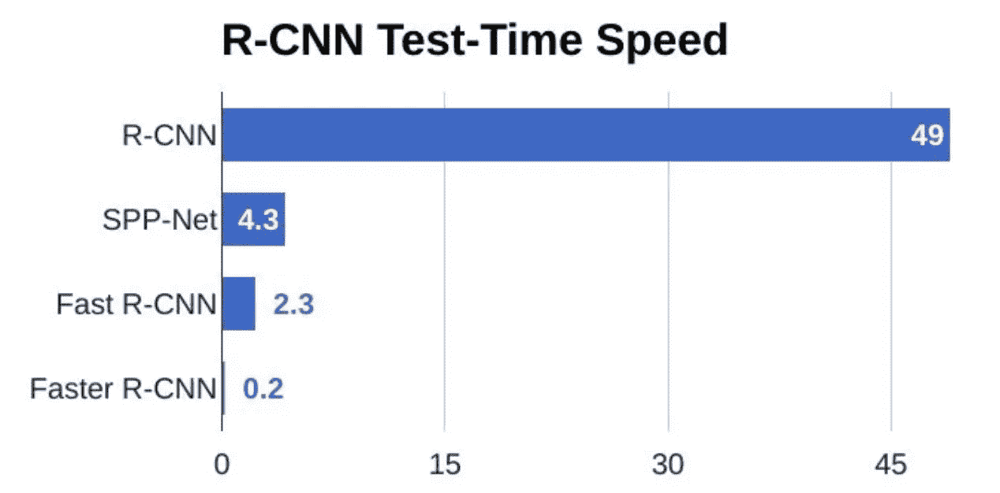
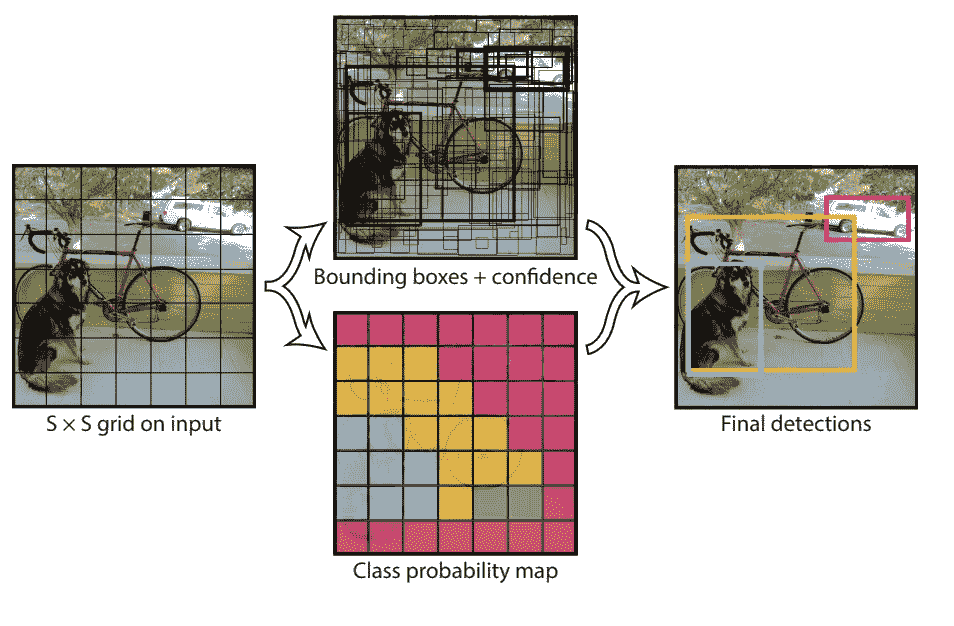

# R-CNN，快速 R-CNN，更快 R-CNN，YOLO —目标检测算法

> 原文：<https://towardsdatascience.com/r-cnn-fast-r-cnn-faster-r-cnn-yolo-object-detection-algorithms-36d53571365e?source=collection_archive---------1----------------------->

## 了解对象检测算法


# 介绍

计算机视觉是一个跨学科领域，近年来(自 CNN 以来)获得了巨大的牵引力，自动驾驶汽车占据了中心舞台。计算机视觉的另一个组成部分是对象检测。目标检测有助于姿态估计、车辆检测、监视等。对象检测算法和分类算法之间的区别在于，在检测算法中，我们试图在感兴趣的对象周围绘制一个边界框，以在图像中定位它。此外，在对象检测情况下，您可能不一定只绘制一个边界框，可能有许多边界框表示图像中感兴趣的不同对象，并且您事先不知道有多少个边界框。



您无法通过构建一个标准卷积网络，然后构建一个全连接层来解决这个问题的主要原因是，输出层的长度是可变的，而不是恒定的，这是因为感兴趣对象的出现次数是不固定的。解决这个问题的简单方法是从图像中提取不同的感兴趣区域，并使用 CNN 对该区域中物体的存在进行分类。这种方法的问题是感兴趣的对象在图像中可能具有不同的空间位置和不同的纵横比。因此，你将不得不选择大量的区域，这可能会在计算上爆炸。因此，像 R-CNN、YOLO 等算法已经被开发来寻找这些事件并快速找到它们。

# R-CNN

为了绕过选择大量区域的问题， [Ross Girshick 等人](https://arxiv.org/pdf/1311.2524.pdf)。提出了一种方法，我们使用选择性搜索从图像中提取 2000 个区域，他称之为区域建议。因此，现在，你可以只处理 2000 个区域，而不是试图对大量的区域进行分类。这 2000 个区域建议是使用下面写的选择性搜索算法生成的。

```
Selective Search:
1\. Generate initial sub-segmentation, we generate many candidate     regions
2\. Use greedy algorithm to recursively combine similar regions into larger ones 
3\. Use the generated regions to produce the final candidate region proposals 
```



R-CNN

要了解更多关于选择性搜索算法的信息，请点击此[链接](https://ivi.fnwi.uva.nl/isis/publications/2013/UijlingsIJCV2013/UijlingsIJCV2013.pdf)。这 2000 个候选区域提议被扭曲成正方形，并被馈送到卷积神经网络，该网络产生 4096 维特征向量作为输出。CNN 充当特征提取器，输出密集层由从图像中提取的特征组成，提取的特征被馈送到 [SVM](/support-vector-machine-introduction-to-machine-learning-algorithms-934a444fca47) 中，以对候选区域提议中的对象的存在进行分类。除了预测区域提议内对象的存在之外，该算法还预测四个偏移值，以提高边界框的精度。例如，给定一个区域提议，该算法将预测到一个人的存在，但是该区域提议中的那个人的脸可能已经被切成两半。因此，偏移值有助于调整区域提议的边界框。


R-CNN

## R-CNN 的问题

*   训练网络仍然需要大量的时间，因为你必须对每幅图像的 2000 个区域提议进行分类。
*   它不能实时实现，因为每个测试图像需要大约 47 秒。
*   选择性搜索算法是一种固定算法。因此，在那个阶段没有学习发生。这可能导致产生坏的候选区域提议。

# 快速 R-CNN



Fast R-CNN

前一篇论文(R-CNN)的同一作者解决了 R-CNN 的一些缺点，以建立更快的对象检测算法，它被称为快速 R-CNN。该方法类似于 R-CNN 算法。但是，我们不是将区域建议提供给 CNN，而是将输入图像提供给 CNN，以生成卷积特征图。从卷积特征图中，我们确定建议的区域，并将其扭曲成正方形，通过使用 RoI 池层，我们将它们重新调整为固定大小，以便可以将其输入到完全连接的层。根据 RoI 特征向量，我们使用 softmax 层来预测建议区域的类别以及边界框的偏移值。

“快速 R-CNN”比 R-CNN 更快的原因是，你不必每次都向卷积神经网络馈送 2000 个区域提议。相反，每个图像只进行一次卷积运算，并从中生成特征图。



Comparison of object detection algorithms

从上面的图表中，您可以推断出快速 R-CNN 在训练和测试会话中明显快于 R-CNN。当您在测试期间查看快速 R-CNN 的性能时，与不使用区域建议相比，包含区域建议会显著降低算法的速度。因此，区域建议成为影响快速 R-CNN 算法性能的瓶颈。

# 更快的 R-CNN



Faster R-CNN

上述两种算法(R-CNN 和快速 R-CNN)都使用选择性搜索来找出区域建议。选择性搜索是一个缓慢而耗时的过程，会影响网络的性能。因此，[任等人](https://arxiv.org/pdf/1506.01497.pdf)。提出了一种对象检测算法，消除了选择性搜索算法，并让网络学习区域建议。

类似于快速 R-CNN，图像作为输入被提供给卷积网络，该网络提供卷积特征图。不是在特征图上使用选择性搜索算法来识别区域提议，而是使用单独的网络来预测区域提议。然后，使用 RoI 池层对预测的区域提议进行整形，然后使用 RoI 池层对提议区域内的图像进行分类，并预测边界框的偏移值。



Comparison of test-time speed of object detection algorithms

从上面的图表中，你可以看到更快的 R-CNN 比它的前辈快得多。因此，它甚至可以用于实时物体检测。

# YOLO——你只能看一次

所有先前的对象检测算法都使用区域来定位图像中的对象。网络不会看到完整的图像。取而代之的是图像中包含物体的概率较高的部分。YOLO 或你只看一次是一个对象检测算法，与上面看到的基于区域的算法有很大不同。在 YOLO，单个卷积网络预测边界框和这些框的类别概率。



YOLO

YOLO 的工作原理是，我们把一幅图像分割成一个 SxS 网格，在每个网格中我们取 m 个边界框。对于每个边界框，网络输出该边界框的类概率和偏移值。具有高于阈值的分类概率的边界框被选择并用于定位图像内的对象。

YOLO 比其他物体检测算法快几个数量级(每秒 45 帧)。YOLO 算法的局限性在于它会与图像中的小对象进行斗争，例如它可能难以检测到一群鸟。这是由于算法的空间限制。

# 结论

计算机视觉会议每年都在观察新的激进概念，我想我们正一步一步地走向人工智能令人瞠目结舌的表现(如果还没有的话！).只会变得更好。我希望这些概念在这篇文章中变得清晰，谢谢:)

# 参考

1.  https://arxiv.org/pdf/1311.2524.pdf
2.  【https://arxiv.org/pdf/1504.08083.pdf 
3.  [https://arxiv.org/pdf/1506.01497.pdf](https://arxiv.org/pdf/1506.01497.pdf)
4.  [https://arxiv.org/pdf/1506.02640v5.pdf](https://arxiv.org/pdf/1506.02640v5.pdf)
5.  [http://cs 231n . Stanford . edu/slides/2017/cs 231n _ 2017 _ lecture 11 . pdf](http://cs231n.stanford.edu/slides/2017/cs231n_2017_lecture11.pdf)