# r 代表 GTFS——获得每条线路每小时的行驶次数

> 原文：<https://towardsdatascience.com/r-for-gtfs-getting-the-number-of-trips-per-hour-for-each-line-4d22491e3944?source=collection_archive---------3----------------------->

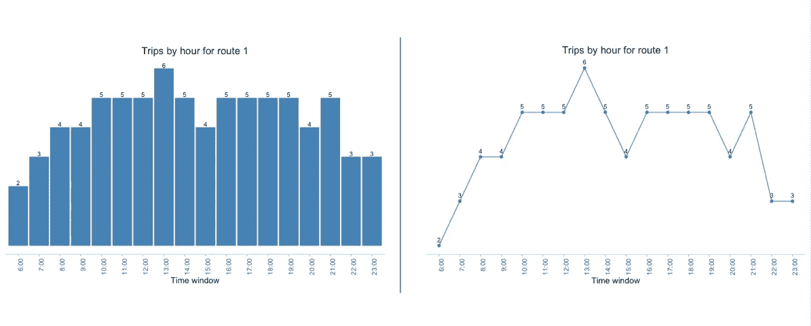

我最近一直在 R 中处理 GTFS 文件，想分享一些我到目前为止学到的东西。

几周前，我的一个客户问我们是否可以根据一条线路每小时的行驶次数给他们的公交线路涂上颜色。为此，我首先要计算这个数字。

在本文中，我将解释如何使用 r 从 GTFS 中获取给定线路的出行次数。然后，我将展示如何将该信息导出到 Excel 并制作图表。

你可以从我的 [GitHub 库](https://github.com/Bondify/GTFS_in_R)获得完整的代码作为 [HTML](https://github.com/Bondify/GTFS_in_R/blob/master/v4-%20Article%20-%20Trips%20per%20hour%20by%20line.html) 或 [R Markdown](https://github.com/Bondify/GTFS_in_R/blob/master/v4-%20Article%20-%20Trips%20per%20hour%20by%20line.Rmd) 。

# 什么是 GTFS？

如果你已经熟悉 GTFS，你可以跳到下一部分。

GTFS 代表“通用交通馈送规范”,是一个面向交通机构的世界知名开源标准。如果你属于公交行业，我敢肯定你已经知道你可以用它来管理信息的基本知识(这是公交机构如何与谷歌地图进行通信，等等)。如果你没听说过，想了解更多，推荐你看看他们的规格[这里](https://developers.google.com/transit/gtfs/reference/)。

# 图书馆

如果您想完全按照本文中详细描述的脚本进行操作，您必须确保安装了以下库:

```
library(tidyverse)
library(pryr)
library(dplyr)
library(ggplot2)
```

您只需复制代码，在 RStudio 中运行它，就万事大吉了。

# 将数据导入 R

对于这篇文章，我使用了 GTFS 的 PTO(称为 EMT)公开提供的[在这里](https://opendata.emtmadrid.es/Datos-estaticos/Datos-generales.aspx?lang=en-GB)。尽管如此，如果您愿意，您可以使用自己的 GTFS 来跟踪这篇文章。

一旦我们下载了文件，我们要做的第一件事就是把它导入到 r。因为 GTFS 文件实际上是。zip 文件，我们将使用下一个脚本对其进行解压缩，并将文件作为数据帧导入:

```
zip <- "/Users/santiagotoso/Descktop/transitEMT.zip"
outDir <- substring(zip, 1, nchar(zip)-4)dir.create(outDir)
setwd(outDir)

unzip(zip, exdir = outDir)trips <- read_csv("trips.txt")
routes <- read_csv("routes.txt")
stop_times <- read_csv("stop_times.txt", col_types= cols(arrival_time = col_character(), departure_time = col_character()))
```

第一行代码是映射 zip 文件的位置(您应该根据自己文件的信息来更改它)。然后，在第二行代码中，我们定义了以。zip 文件:我们获取整个字符串并保留除最后 4 个字符之外的所有内容。zip)。像那样，‘outDir’其实就是“/Users/santiagotoso/Descktop/trans item”。

在第三行中，我们创建一个目录，按照‘outDir’中的定义进行放置和命名。最后，我们解压文件并读取。txt 文件在里面。

现在我们有四个数据帧，每个数据帧对应这个练习的一个相关文件:[行程](https://developers.google.com/transit/gtfs/reference/#tripstxt)、[路线](https://developers.google.com/transit/gtfs/reference/#routestxt)和[停留时间](https://developers.google.com/transit/gtfs/reference/#stop_timestxt)。

> 请注意，当导入“停止时间”时，我们强制将“到达时间”和“离开时间”变量转换为字符。其原因是，有些行程发生在午夜之后，格式类似于 26:45 小时。这变成了 R 中的 NA，我们通过将它们设为字符来避免这种情况。我们稍后会处理它们。

# 到目前为止我们有什么？

如果你习惯于和 GTFS 一起工作，你可能不需要这个部分。如果您仍在学习如何使用 GTFS 文件，现在花一点时间看看我们拥有的每个文件的信息可能会有所帮助，它们如何相互连接，以及哪个文件包含我们需要的信息，以获得一条线路每小时的行程数。

*   **trips.txt:** 该文件存储每个行程的高级信息。是 id，路线，方向，service_id，形状等。请注意，形状是由行程定义的，而不是由路线定义的。

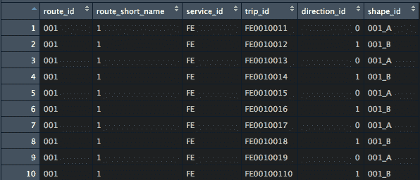

*   **routes.txt:** 该文件存储每条路线的信息。是 id，长短名，颜色等。

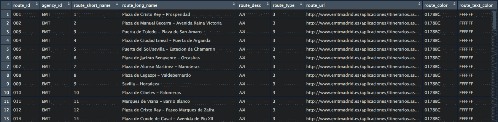

*   **stop_times.txt:** 该文件存储每次行程的详细信息。更准确地说，每个行程的停靠点顺序以及每个停靠点的经过时间。它没有关于路线本身的信息，但是它通过 trip_id 与 trips.txt 相关。

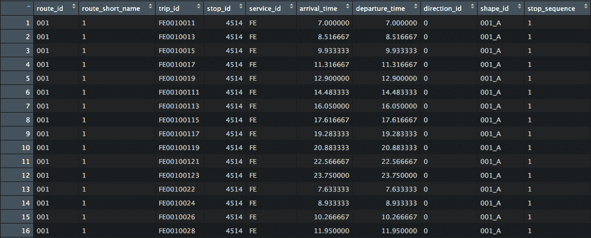

总之，我们可以解释这三个文件之间的关系，如下图所示。

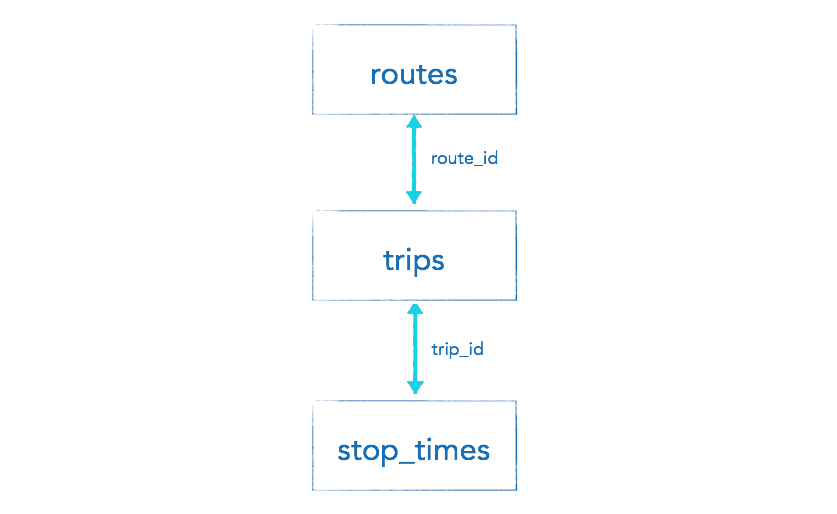

# 连接数据框

正如我们可以从上一节推断的那样，我们将从“stop_times”数据框中获得每小时的出行次数。棘手的是，在“stop_times”中，没有变量告诉我们行程的路线。要获得这些信息，我们首先要通过“旅行”。此数据框保存“行程标识”(出现在“停靠时间”)和“路线标识”(出现在路线中)之间的关系。

为了在同一个数据框中获得我们需要的所有信息，我们将从“停止时间”一直到“路线”遍历上图。

```
stop_times <- stop_times *%>%* 
  left_join(trips) *%>%* 
  left_join(routes) *%>%* 
  select(route_id, route_short_name, trip_id, stop_id, service_id, arrival_time, departure_time, direction_id, shape_id, stop_sequence)
```

首先，我们把停车时间和行程联系起来。此时，数据帧具有 route_id 和 trip_id。然后我们用“路线”把它连接起来。

最后，我们选择相关变量继续。你可以用' head()'函数来看看最终的数据帧。

```
head(stop_times)
```

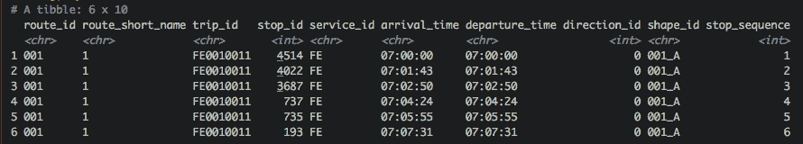

现在，我们有所有站点的通过时间(检查“stop_sequence”列)。但是我们只需要第一站来计算每小时的行程数。此外，考虑到旅行是往返的，我们只需要一个方向。如果没有，我们可能会复制每小时的旅行次数。

另外，请注意“到达时间”和“离开时间”是字符。这不允许我们用它们进行数学运算。

最后,‘service _ id’列告诉我们，在 GTFS 覆盖的时间段内，有许多不同的服务在运行。在计算每小时的行程数之前，我们需要选择一个。

在下一节中，我们将看到如何解决所有这些问题。

# 过滤和转换数据

## 选择具有更多行程的服务标识

为了解决上面列出的问题，我们可以首先从寻找我们想要使用的“service_id”开始。我们可以通过许多不同的方式来完成，如果您使用自己的数据，最有可能的是您已经知道要分析哪个服务。就本文的目的而言，只需要更多的旅行。

```
trips *%>%* 
  group_by(service_id) *%>%* 
  count(service_id) *%>%*
  arrange(desc(n))
```

第一行按“服务标识”对行程进行分组。然后，我们计算每个“service_id”的旅行次数，最后，我们对它进行排序。

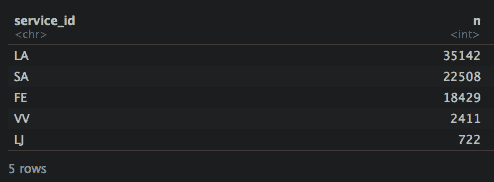

该数据集中最大的服务似乎是“LA ”,因此我们将在之后对其进行过滤。下面，我们将变量“bigger_service”定义为上面所示数据的第一行。

```
bigger_service <- trips *%>%* 
  group_by(service_id) *%>%* 
  count(service_id) *%>%*
  arrange(desc(n)) *%>%* 
  head(1)
```

## 按服务标识、停止顺序和方向标识过滤

现在，我们可以过滤“停止时间”,以便只保留与我们的目的相关的信息。

为此，我们将只保留更多行程(LA)的“service_id ”,只保留每次行程的第一站和每次行程的一个方向。

```
stop_times <- stop_times %>% 
  filter(
    stop_sequence == 1 & 
      direction_id == 0 &
      service_id == bigger_service$service_id)

head(stop_times)
```

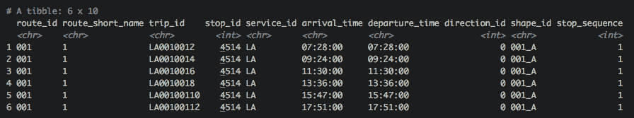

## 将字符转换成数字

现在，我们只保留了与我们的目的相关的数据，我们需要将“到达时间”和“离开时间”(或至少其中之一)转换成数字，以便我们对它们进行数学运算。

事实上，由于我们要计算每小时的旅行次数，我们并不真的需要分钟。我们只需要获得小时值，以便能够在以后对它们进行分组。这样，像“07:28:00”和“07:45:00”这样的字符将变成数字“7 ”,这足以让我们计算出从早上 7 点到早上 8 点每小时有两趟车。

如果我们只需要记下小时数，这就容易了。当我们发现超过 24 小时的数字时，棘手的部分就来了。在这种情况下，“25:00:00”实际上是指凌晨 1 点。为了解决这个问题，我们将进行改造。

```
stop_times <- stop_times %>% 
  mutate(
    arrival_time = ifelse(
      as.integer(substr(arrival_time, 1, 2)) < 24,
      as.integer(substr(arrival_time, 1, 2)),
      as.integer(substr(arrival_time, 1, 2)) - 24),
    departure_time = ifelse(
      as.integer(substr(departure_time, 1, 2)) < 24,
      as.integer(substr(departure_time, 1, 2)),
      as.integer(substr(departure_time, 1, 2)) -24)
    )
head(stop_times)
```

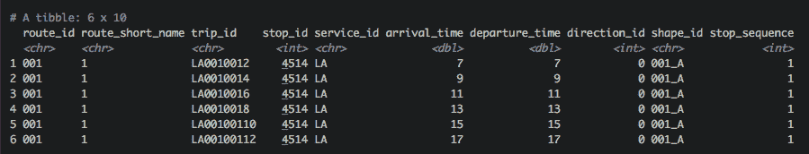

现在看起来相当不错。请注意，我们必须运行“ifelse”条件来处理大于 24 的数字。如果是的话，我们从他们那里拿走了 24 个。就像这样，25h 变成 1h，这正是我们要找的。

另外，我们只记录了到达和离开的时间。现在，我们可以根据这些变量中的一个进行分组，并计算每个时间窗口中的旅行次数。

# 那么，每条线路每小时的行驶次数是多少？

我们的最后一步是计算每条线路每小时的行驶次数。感谢我们经历的所有麻烦，现在这将变得非常容易。

```
output_data <- stop_times *%>%* 
  group_by_at(vars(route_id, route_short_name, arrival_time)) *%>%* 
  count(arrival_time)head(output_data)
```

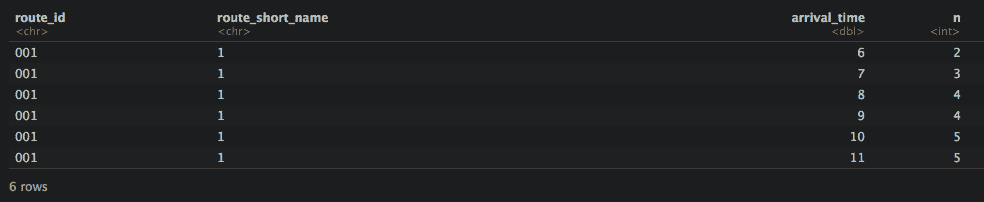

就在那里！我们现在知道了每条线路每小时的行驶次数。

尽管如此，我们可以把它变得更好。为此，我们将再次更改“arrival_time”的格式，从“6”更改为“6:00”。

```
output_data <- stop_times *%>%* 
  group_by_at(vars(route_id, route_short_name, arrival_time)) *%>%* 
  count(arrival_time) *%>%* 
  mutate(time_window = paste(arrival_time, '00', sep = ':')) *%>%* 
  select(route_id, route_short_name, arrival_time, time_window, n)head(output_data)
```

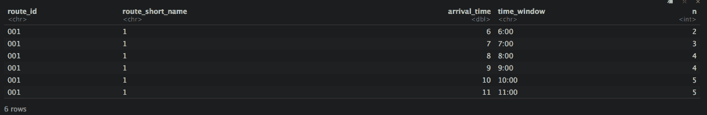

在下面几节中，我们将了解如何将这些数据下载到一个. csv 文件(可以用 Excel 打开)，并使用 ggplot()为其中一条线制作条形图和折线图。

# 导出到 csv 文件

这个很简单:

```
write_csv(output_data, "/Users/santiagotoso/Descktop/transitEMT/trips_per_hour.csv" )
```

你只需要改变路径到你想要的方向。

# 创建每小时旅行次数的图表

在本节中，我们将看到如何创建一个条形图和折线图来显示一条特定线路每小时的行程数。

为此，我们要做的第一件事是过滤某一特定行的信息。例如，我将选择第 1 行。

```
line <- output_data *%>%* 
  filter(route_id == '001')View(line)
```

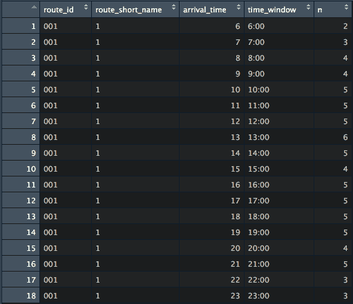

在绘制代表数字的字符(或者在这种情况下代表时间)时，重要的一点是对它们进行因式分解，以便它们作为数字进行排序。如果我们不这样做，它们将被排序为字符串(字符),这意味着我们将首先有 10:00，然后 11:00 等等，而不是 6:00。为了说明这一点，我在下面展示了如果我们现在进行因式分解之前(注意 x 轴)，我们的图表会是什么样子:

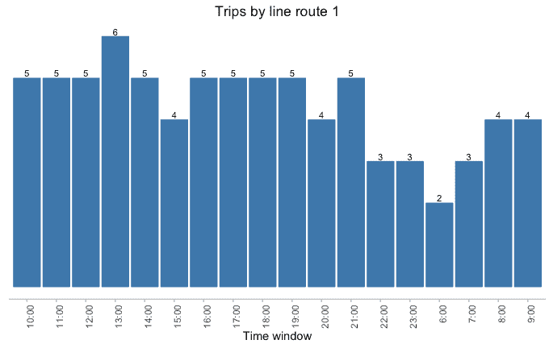

为了避免这种不良行为，我们需要先分解“时间窗口”。

```
line$time_window <- factor(line$time_window, levels = unique(line$time_window))
```

## 条形图

现在我们已经分解了 x 轴，我们将使用 ggplot()制作一个条形图。

```
g_bar <- ggplot(data = line,
            aes(x = time_window, y = n)) + 
  geom_bar(stat = 'identity')g_bar
```

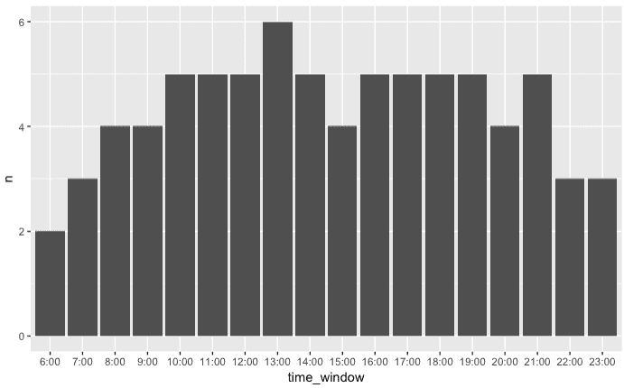

就我个人而言，我喜欢我的图表更干净，更鲜艳一点。如果这也是您的情况，您可以使用下面的代码获得更好的结果。

```
g_bar <- ggplot(data = line,
            aes(x = time_window, y = n)) + 
  geom_bar(stat = 'identity', fill = 'steelblue', color = 'steelblue') + 
  geom_text(aes(label = n), 
            vjust = -0.3, 
            color = "black", 
            size = 3) +
  scale_fill_brewer(palette="Dark2")+
  labs(title = paste('Trips by hour for route', line$route_short_name, sep = ' '),
       x = "Time window",
       y = '') +
  theme(panel.grid = element_blank(), 
        panel.background = element_blank(), 
        axis.line.x = element_line(colour = "grey"), 
        axis.line.y = element_blank(),
        axis.text.x = element_text(angle = 90, hjust = 1),
        axis.text.y = element_blank(),
        axis.ticks.x = element_line(colour = "grey"),
        axis.ticks.y = element_blank(),
        plot.title = element_text(hjust = 0.5) 
        )g_bar
```

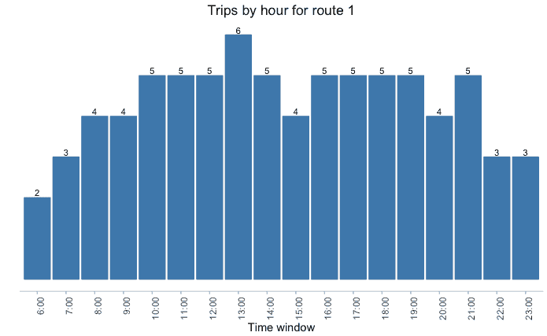

## 折线图

我们将直接制作漂亮的图表，但请记住，您可以做更简单的版本，复制条形图的代码并将其更改为折线图。

```
g_line <- ggplot(data = line,
            aes(x = time_window, y = n, group = 1)) + 
  geom_line(color = 'steelblue') +
  geom_point(color = 'steelblue') +
  geom_text(aes(label = n), 
            vjust = -0.8,
            color = "black",
            size = 3) +
  scale_fill_brewer(palette="Dark2")+
  labs(title = paste('Trips by hour for route', line$route_short_name, sep = ' '),
        x = "Time window",
        y = '') +
  theme(panel.grid = element_blank(),
        panel.background = element_blank(),
        axis.line.x = element_line(colour = "grey"),
        axis.line.y = element_blank(),
        axis.text.x = element_text(angle = 90, hjust = 1),
        axis.text.y = element_blank(),
        axis.ticks.x = element_line(colour = "grey"),
        axis.ticks.y = element_blank(),
        plot.title = element_text(hjust = 0.5)
        )g_line
```

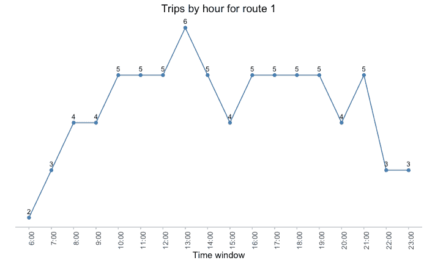

# 结论

我们看到了如何将一个 GTFS 导入到 R 中并研究它。然后，我们研究了数据框架之间的关系，只保留了获得我们所寻求的洞察力所需的数据。

如图所示，用于从 GTFS 获得每小时旅行次数的数学和方法非常简单，不需要很深的数学知识，也不需要 R 语言。这是一个非常好的方式来开始学习 R，并探索你可以从你的 GTFS 中获得的一些见解。

你怎么想呢?对你有帮助吗？请让我知道你在下面评论的想法。

记住，你可以从我的 [GitHub 库](https://github.com/Bondify/GTFS_in_R)中获得原始代码、html 或 [R Markdown](https://github.com/Bondify/GTFS_in_R/blob/master/v4-%20Article%20-%20Trips%20per%20hour%20by%20line.Rmd) 。

这篇故事最初发表于:[https://www . LinkedIn . com/pulse/r-gtfs-getting-number-trips-per-hour-each-line-toso/？已发布=t](https://www.linkedin.com/pulse/r-gtfs-getting-number-trips-per-hour-each-line-toso/?published=t)