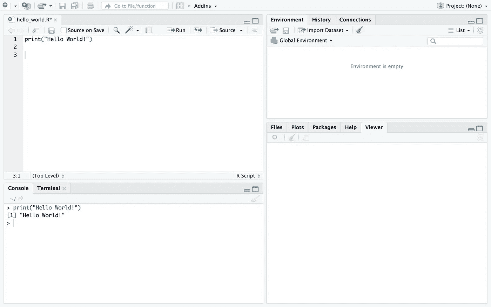
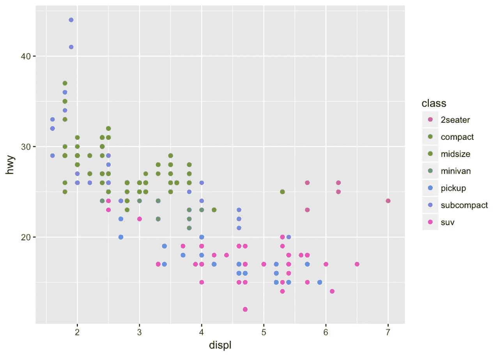

# 朗:从零到英雄

> 原文：<https://towardsdatascience.com/r-lang-zero-to-hero-c59a9f66841c?source=collection_archive---------7----------------------->

统计计算和图形指南。


# **R 语言简介。**

r 是一个计算环境，它结合了一种叫做 S 的编程语言，实现了用数据编程的思想。它对线性代数、微分方程和随机有强大的数值分析工具。r 编程通过提供一组内置的函数和库让你了解数据可视化。r 的图形前端有很多，目前最好的似乎是 RStudio。然而，在了解这些之前，您应该先了解一下 R 本身。

# **为什么是 R？**

1.  r 是灵活的。
2.  r 是强大的。
3.  r 不仅仅是一个统计计算包；这是一种编程语言。
4.  r 被设计成以问题设计的方式运行。
5.  r 在处理数据和存储设备方面效率很高。

用 R 语言编写的代码片段对用户来说总是可用的，所以对任务的小改动通常只需要对代码进行小改动——这种差别可以在更短的时间内完成。

## **在你的机器上安装 R**

要 [**下载 R**](http://cran.r-project.org/mirrors.html) ，请选择您喜欢的[摇柄镜](http://cran.r-project.org/mirrors.html)。

# **R 工作室**

RStudio 让 R 更容易上手。它包括一个代码编辑器，调试和可视化工具。它是一个(IDE ),包括一个控制台、支持直接代码执行的语法高亮编辑器，以及用于绘图、历史、调试和工作空间管理的工具。

从以下链接下载 R-Studio。

[](https://www.rstudio.com/products/rstudio/) [## RStudio

### 控制你的 R 代码 RStudio 是一个 R 的集成开发环境(IDE)。

www.rstudio.com](https://www.rstudio.com/products/rstudio/) 

A Snapshot of RStudio

# **交互使用 R**

在机器上安装 R 之后，在终端或 shell 中点击 R 启动 R 交互式 Shell。默认提示是' **>** '，在 UNIX 上可能与 shell 提示相同，因此可能看起来什么也没发生，它将等待用户的指令。

您可以将 R Shell 用作计算器，您可以从做简单的数学运算到高级机器学习算法。

要退出 R 程序，命令是

```
> q()
```

这将从 R Shell 中退出。您也可以通过在退出后按“y”来保存工作区会话。如果希望继续而不保存，只需按“n”，这将使您返回到终端/shell。

让我们开始打印“Hello World！”在 R 互动壳里。

在 R 中，我们使用 print()函数返回参数中给定的字符串。

```
$R
> print("Hello World!")
[1] "Hello World!"
>
```

# **R 中的注释**

正如我们所知，每种编程语言都需要注释，R 支持注释，而注释会被解释器忽略。

这就是我们在 r 中使用注释的方式。

```
# This is a comment in R
# print("This doesn't work")
```

# **变量**

在编程中，变量只不过是某种东西的名称。R 中的变量可以存储一个原子向量、一组原子向量或许多 R 对象的组合。r 名称区分大小写。要为数据结构创建名称，我们必须遵循以下规则:

> 注意:名称以。被认为是系统名，使用**ls()**-函数时并不总是可见的。

现在让我们看看如何在 R 中声明变量

```
a <- 3
```

这行代码声明了一个变量“a ”,并将其赋值为 3。

typeof()函数返回变量的数据类型。

```
type(a)
[1] "double"
```

# R 中的数据类型

**Numeric (real 或 decimal):** Decimal 值在 r 中称为 Numeric，它是默认的计算数据类型。

**Integer:** 为了在 R 中创建一个 Integer 变量，我们调用 as integer 函数。

**Character:** 一个 Character 对象用来表示 r 中的字符串值，我们用 as character()函数把对象转换成字符值。

**逻辑**:逻辑值通常是通过变量之间的比较产生的。

**复:**R 中的复数值通过纯虚数值 I 来定义。

解释数据类型的代码片段。

> 为了从 shell 中执行 R 文件，我们使用命令“Rscript filename”。r "

```
[1] 3
[1] "double"
[1] "Stark"
[1] "character"
[1] TRUE
[1] "logical"
[1] 1+4i
[1] "complex"
```

> 注意:R 语言中的字符串是字符。

# 算术运算

所有的基本运算，如加、减、除、乘。Etc 可以在 r 中执行

```
[1] 6
[1] 1
[1] 315
[1] 8.333333
[1] 3
[1] 1
[1] 125
```

# R 中的数据结构

## **原子向量**

向量是 R 中最常用的数据结构。它是相同基本类型的数据元素序列。向量中的成员正式称为分量。向量可以是最常见的`character`、`logical`、`integer`或`numeric.`元素的向量

我们使用 vector()函数创建一个空向量，下面的代码片段展示了我们如何声明一个向量。

```
x <- vector()
> character(5)
[1] "" "" "" "" ""
```

## 列表

R lang 中的列表充当容器。它们是包含其他对象通用向量。与原子向量不同，列表的变量不限于单一模式，可以包括任何数据类型的混合。一个列表可以包含其他列表。这使得它们不同于原子向量。

R 中的列表是使用 list()函数创建的。

```
my_list <- list("Red", TRUE, 51.23)
```

```
[1] "Red"
[[2]]
[1] TRUE
[[3]]
[1] 51.23[[1]]
[1] 1
[[2]]
[1] 2
[[3]]
[1] 3
[[4]][1] "Sun"
[[5]]
[1] "Mon"
[[6]]
[1] "Tue"
```

## [数]矩阵

矩阵是 r 中特殊类型的向量。矩阵是以二维矩形布局排列的数据元素的集合。矩阵有行和列。

现在，让我们创建一个 2x2 矩阵，我们使用矩阵函数，并将行和列作为参数发送。行数为 **nrow** ，列数为 **ncol** 。

```
my_matrix <- matrix(nrow = 2, ncol = 2)
```

```
 [,1] [,2] [,3] [,4]
[1,] 59.0 22.3 31.2  9.5
[2,] 55.0 19.7 30.4 13.8
[3,] 53.5 20.8 30.6 14.8
[4,] 55.0 20.3 30.3 15.2
[5,] 52.5 20.8 30.3 15.5
[6,] 57.5 21.5 30.8 15.6
[7,] 53.0 20.6 32.5 15.6
[8,] 55.0 21.5 34.0 15.7
```

## 数据帧

数据帧是 R 语言中最常用的数据结构之一。数据以表格的形式表示，表格中有许多行和列。

我们通常将 csv 文件读入数据帧，为此我们使用 read.csv()函数或 read.table()函数，并将 csv 文件名作为参数发送。

我们还可以使用 data.frame()函数创建一个数据框。

```
> df <- data.frame(id = letters[1:5], x = 1:10, y = rnorm(10))
> df
> ##    id  x        y
> ## 1   a  1 -1.37593
> ## 2   b  2  0.47094
> ## 3   c  3 -0.16046
> ## 4   d  4 -1.36914
> ## 5   e  5  0.39763
```

这些是我们应用于数据框以得出最小结论的几个重要函数。

head() —查看前 6 行

tail() —查看最后 6 行

dim()-请参见尺寸

nrow() —行数

ncol() —列数

str() —每列的结构

## **因素**

因子几乎都是有标签的整数。虽然因子看起来(并且经常表现)像字符向量，但它们实际上是整数，当把它们当作字符串时需要小心。有些字符串方法会将因子强制转换为字符串，而有些则会抛出错误。

可以用`factor()`创建因子。输入通常是一个字符向量。

```
> x <- factor(c("yes", "no", "no", "yes", "yes"))
> x
[1] yes no  no  yes yes
Levels: no yes
# table(x) will return a frequency table.
```

# **控制结构**

这些允许您控制脚本的执行流程，通常是在函数内部。常见的包括:

1.  如果，否则
2.  为
3.  在…期间
4.  重复
5.  破裂

# 如果-否则

我们总是需要检查条件并相应地改变程序行为的能力。条件语句给了我们能力。最简单的形式是“if”语句。

```
if (condition) {
    # do something
} else {
    # do something else
}
```

例子，

```
x is less than 10
```

# For 循环

R 中的 for 循环能够迭代任何序列的项，比如列表或向量。

```
for (i in 1:5) {
    print(i)
}
```

这就是我们在 R 中声明 for 循环的方式，它接受 iterable 变量(I)并迭代直到给定的范围(这里是 10)

```
1
2
3
4
5
```

实现 for 循环的几种方法。

```
[1] NA
[1] NA
[1] NA
[1] NA[1] "apples"
[1] "oranges"
[1] "bananas"
[1] "strawberries"[1] "apples"
[1] "oranges"
[1] "bananas"
[1] "strawberries"[1] "apples"
[1] "oranges"
[1] "bananas"
[1] "strawberries"
```

# 在…期间

只要给定的条件为真，R lang 中的 while 循环语句就会重复执行目标语句。与 for 循环不同，while 循环不会运行 n 次，而是直到满足定义的条件。

*While 循环的语法*

```
while(condition){
    statements
    iteration
}
```

这是一个我们如何实现一个简单的 while 循环的例子，

```
1
2
3
4
5
```

# 重复和中断

重复循环用于多次迭代代码块。重复循环中没有退出循环的条件检查。

重复和中断的语法

```
repeat{
    condition
        statements
        break
}
```

现在让我们使用 repeat 和 break 打印前五个数字。

```
[1] 1
[1] 2
[1] 3
[1] 4
[1] 5
```

# 功能

在任何编程语言中，函数的主要用途是可重用性。它们是组织在一起执行特定任务的一组语句。R 中有各种内置函数，R 中的一些内置函数有 sum()、min()、max()、mean()等。

*在 R 中声明函数的语法*

```
function_name <- function(arg_1, arg_2, ...) {
    function body 
}
```

现在让我们创建一个函数来按顺序打印数字的立方。

```
216
```

# R 中的可视化

可视化数据是决策的重要解决方案之一。r 编程语言为创建数据故事和可视化提供了一套最好的内置函数和库(如 ggplot2、leaflet、lattice)。

现在，让我们在 RStudio 中使用 ggplot2 创建一个简单的线图，为此我们需要安装 ggplot2 包，您会在左上角找到控制台。运行命令 install.packages("package_name ")。

```
> install.packages("ggplot2")
```

我们现在将导入一个内置的数据集(mpg ),并绘制一个简单的图表。

关于 mpg 数据集:这是 1999 年和 2008 年 38 种流行车型的燃油经济性数据。

1.  具有 234 行和 11 个变量的数据框
2.  displ —发动机排量，单位为升
3.  公路——公路英里/加仑



感谢阅读！

这篇文章的代码可以在 [AaqilShaik](https://medium.com/u/6e4ab9d67956?source=post_page-----c59a9f66841c--------------------------------) 的[这里](https://github.com/aaqil/r-lang-fundamentals)找到。

感谢阅读。如果你觉得这个故事有帮助，请点击下面的👏去传播爱。