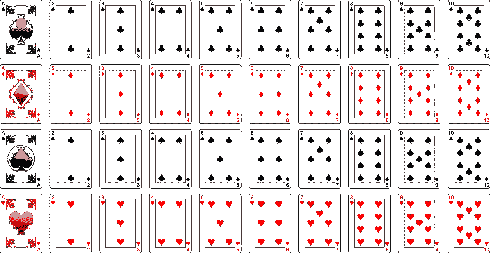
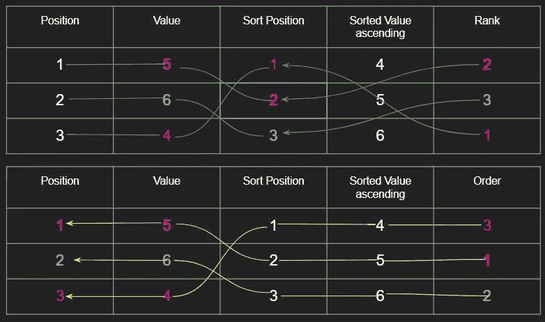

# r:等级与顺序

> 原文：<https://towardsdatascience.com/r-rank-vs-order-753cc7665951?source=collection_archive---------1----------------------->



*如果你正在学习 R，你可能已经遇到过* [***排序***](https://www.rdocumentation.org/packages/base/versions/3.5.0/topics/sort) *，* [***等级***](https://www.rdocumentation.org/packages/base/versions/3.5.0/topics/rank) *和* [***顺序***](https://www.rdocumentation.org/packages/base/versions/3.5.0/topics/order) *函数。因为在语义上有相似性，甚至重叠，问题出现了:每一个具体做什么，每一个的用例是什么？*

这三个函数都要求它们运算的值是可比较的。 **R** 中的比较适用于字符串、数字、复杂和逻辑日期类型。

## 等级与顺序混淆

排序、等级和顺序是 r 中的函数。它们可以应用于向量或因子。如果你习惯用行和列来考虑数据，那么向量代表一列数据。因子是从向量中创建的，代表离散的带标签的值。在下面的 **R** 代码中，X 加载了数据，然后进行排序、排名和排序。 **R** 将结果报告为向量。

```
X = c(3,2,1) 
X 
3 2 1 
sort(X)
[1] 1 2 3
rank(X)
[1] 1 2 3
order(X)
[1] 1 2 3
```

这似乎够清楚了:

*   使用“c”ombine 函数将数据加载到向量中
*   当您查看 X 时，它会按照加载时的方式排列
*   当你对 X 进行排序时，你会看到一个向量，它包含 X 中的值，这些值按升序排列
*   当您对 X 进行排序时，您会看到一个向量，其中包含 X 中按升序排列的值(类似于排序)
*   当您**对** X 排序时，您会看到一个包含 X 中按升序排列的值的向量(类似于 sort)

现在，让我们在创建 X 向量和运行这些函数时应用一个简单的排列。

```
X = c(2,3,1) 
X 
2 3 1
sort(X)
[1] 1 2 3
rank(X)
[1] 2 3 1
order(X)
[1] 3 1 2
```

在上面的输出中，**排序**函数肯定了我们上面所说的，但是**等级**和**顺序**更难解释。现在，看一个不同的向量，在不同的整数范围上有相似的排列。

```
X = c(5,6,4) 
X 
5 6 4
sort(X)
[1] 4 5 6
rank(X)
[1] 2 3 1
order(X)
[1] 3 1 2
```

在上面的代码中，我们看到“5，6，4”的等级和顺序与“2，3，1”相同。这两个序列具有相同的等级和顺序的原因是等级和顺序报告的是相对位置，而不是相对值。等级和顺序基于向量中数据升序排序的结果。具体来说，rank 和 order 返回的值的范围是原始序列中值的索引范围。

*   **Rank** 引用值在排序向量中的位置，与**原始**序列的顺序相同
*   **顺序**返回原始值的位置，按照**排序**的顺序，即从最小值到最大值

下图有助于将按等级和顺序报告的值与它们来自的职位联系在一起。



## 对合循环

首先呈现的“1，2，3”序列返回秩和序的向量“1，2，3 ”,它实际上是一个特殊的序列，因为这些值和“1，2，3”的几个其他排列导致秩和序表现为对合函数。一个[无意识函数](https://en.wikipedia.org/wiki/Involution_(mathematics))是一个它自己的反函数。

```
**X = c(1,2,3)
RANK(X) == ORDER(X) == X
RANK(ORDER(X)) == X
ORDER(RANK(X)) == 1:length(X)**
```

在下面的代码中，您可以看到“1，2，3”的所有六种排列都经过了测试，以确定它们是否是对合的(一个应用两次就会给出初始值的函数)。没有导致对合功能的两种排列可以通过它们分解成的循环来识别。有关对合循环的更多信息，请参见下面的文章[R 中的秩与序](https://ro-che.info/articles/2016-03-19-rank-vs-order-r)。

```
X = c(1,2,3)
all(order(rank(X)) == X)
[1] TRUEX = c(2,3,1)
all(order(rank(X)) == X)
[1] FALSEX = c(3,1,2)
all(order(rank(X)) == X)
[1] FALSEX = c(1,3,2)
all(order(rank(X)) == X)
[1] TRUEX = c(2,1,3)
all(order(rank(X)) == X)
[1] TRUEX = c(3,2,1)
all(order(rank(X)) == X)
[1] TRUEall(order(X)[rank(X)] == rank(x)[order(X)]) == 1:length(X)
TRUE
```

虽然学习查看简单的数据集来帮助理解函数的行为很有吸引力，但当数据的排列影响函数的输出时，它会导致混乱的结论。

## 排序序列

对于任何升序排列的向量序列，下面的代码演示了**顺序**和**等级**之间的关系，因为它们相互作用。**级**的**级**将始终等于**级**的**级**。

```
X = c(100,200,300)
all(order(X)[rank(X)] == rank(X)[order(X)])
TRUE
```

此外，下面的代码验证了对于任何升序序列，秩的顺序和顺序的秩将始终等于由有序元素的位置组成的向量。

```
x = c(100,200,300)
all(order(X)[rank(X)] == 1:length(X))
TRUE
all(rank(X)[order(X)] == 1:length(X))
TRUE
1:length(X)
[1] 1 2 3
```

## 订单函数的用例

*您可以使用 order 函数对数据帧进行排序。*

**排序**命令可用于创建一个新的**向量**，从任何可比较值的向量到按升序排列的**向量**。默认的排序顺序是升序，但是可以选择降序，也可以选择处理未定义的值和指定排序方法。

当您将数据从文件系统读入一个**数据帧**或者用代码构建该数据帧时，您拥有一个包含不同类型数据的行和列的结构。为了按列值对数据框的行进行“排序”，无论是单列还是多列，都必须使用**命令**，因为**命令**只对向量进行排序。

为了了解其工作原理，下面的示例从加载到矢量中的原始数据构建了一个数据框。这些数据也可以很容易地从 CSV 或其他格式的文本文件中读入。注:将最后一条指令括在括号中会导致数据帧被 *test.data* 变量引用，并显示 *test.data* 变量中的内容。显示的第一个整数是由 R 分配给数据帧中各行的计数器标识符。

```
size = 5
sex=sample(c("male","female"),size,replace=T)
age = sample(21:100, size, replace=T)
degree = sample(c("BA","BS","MS","MBA"), size, replace=T)
(test.data = data.frame(sex=sex, age=age, degree=degree))sex age  degree
1 female  30     BA
2   male  49     BA
3   male  39    MBA
4   male  27     MS
5   male  61     MS
```

我们可以使用 **order** 命令按年龄对数据进行排序。向 **order** 函数传递要排序的列的名称，并且顺序为升序。order 命令的结果是一个向量，其中每个值引用原始数据框中项目的位置值，并且它本身位于排序数据的位置。例如，原始数据帧中的第一年龄是 30，而排序数据帧中的第一年龄 30 将在第二位置。因此，值 1 位于顺序向量的第 2 个位置。

一旦获得顺序向量，它将用于从原始*测试数据*中提取数据。您可以在结果中看到原始的计数器 id，以及它如何匹配用于排序的顺序向量。r 使用带有行、列名称的方括号从数据帧(或矩阵)中提取数据。

```
order(test.data$age)
[1] 4 1 3 2 5test.data[order(test.data$age),]
sex age degree
4   male  27     MS
1 female  30     BA
3   male  39    MBA
2   male  49     BA
5   male  61     MS
```

通过在 order 命令指定的列名前使用负号，可以按降序对数据框进行排序。

```
order(-test.data$age)
[1] 5 2 3 1 4test.data[order(-test.data$age),]5   male  61     MS
2   male  49     BA
3   male  39    MBA
1 female  30     BA
4   male  27     MS
```

我们还可以通过向 order 命令添加多列来提供多列排序。

```
order(test.data$degree,-test.data$age)
[1] 2 1 3 5 4
test.data[order(test.data$degree,-test.data$age),]sex age degree
2   male  49     BA
1 female  30     BA
3   male  39    MBA
5   male  61     MS
4   male  27     MS
```

## 等级函数的用例

*您可以使用 rank 函数创建一个值，该值表示一个值在其序列中的相对位置。*

IEEE 提供了一份 2017 年十大编程语言的清单。它们存储在一个文件中，在我的本地文件系统中，按照语言名称的字母顺序排序。下面的代码将它们读入一个变量，这个变量通过名称 *language.ieee* 引用它们并显示内容。

```
(language.ieee =read.csv(file="language-scores.csv"))
    X   language score
1   2          C  99.7
2   5         C#  87.7
3   4        C++  97.1
4   9         Go  75.1
5   3       Java  99.5
6   7 JavaScript  85.6
7   8        PHP  81.2
8   1     Python 100.0
9   6          R  87.7
10 10      Swift  73.1
```

我们可以得到一个排序数据的向量。排名向量中的数据显示为 float，因为有平局: **C#** 与 **R** 并列第 5 和第 6 名。rank 函数中有处理平局的选项，但默认情况下是使用“平均”方法，并为每个平均分赋值。这些值本身通过值在原始数据集中的位置来表示相应值的降序。较高的等级值代表较大的数据值。

```
rank(language.ieee$score)
9.0  5.5  7.0  2.0  8.0  4.0  3.0 10.0  5.5  1.0
```

我可以使用 rank vector，通过向 order 命令提供负秩，按秩对数据进行排序，也就是分数的降序。

```
language.ieee[order(-rank(language.ieee$score)),]
    X   language score
8   1     Python 100.0
1   2          C  99.7
5   3       Java  99.5
3   4        C++  97.1
2   5         C#  87.7
9   6          R  87.7
6   7 JavaScript  85.6
7   8        PHP  81.2
4   9         Go  75.1
10 10      Swift  73.1 
```

计算秩不仅用于排序数据。排名的相关性可以用来检验两个变量之间关系的零假设。由于变量的类型和规模可能不同，秩提供了一种规范化。例如，参见关于使用斯皮尔曼等级相关性的研究:【https://geographyfieldwork.com/SpearmansRank.htm。

## 结论

R 是一种统计编程语言，具有许多帮助格式化和处理数据的功能。它的服务通过函数调用来提供。除了阅读文档之外，通过这些函数运行数据集也有助于弄清楚它们到底做了什么。Sort、Order 和 Rank 在语义上是相同的，但在实践中，它们有非常不同的用途，有时会相互配合以达到预期的结果。