# 径向基函数神经网络—我们需要知道的一切

> 原文：<https://towardsdatascience.com/radial-basis-functions-neural-networks-all-we-need-to-know-9a88cc053448?source=collection_archive---------0----------------------->

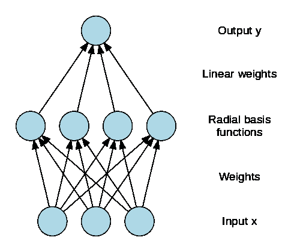

**单感知器** / **多层感知器(MLP)** 中的⁃，我们只有线性可分性，因为它们是由输入层和输出层(MLP 中的一些隐藏层)组成的

比如⁃，与、或函数是**线性**可分的&异或函数是**不**线性可分的。

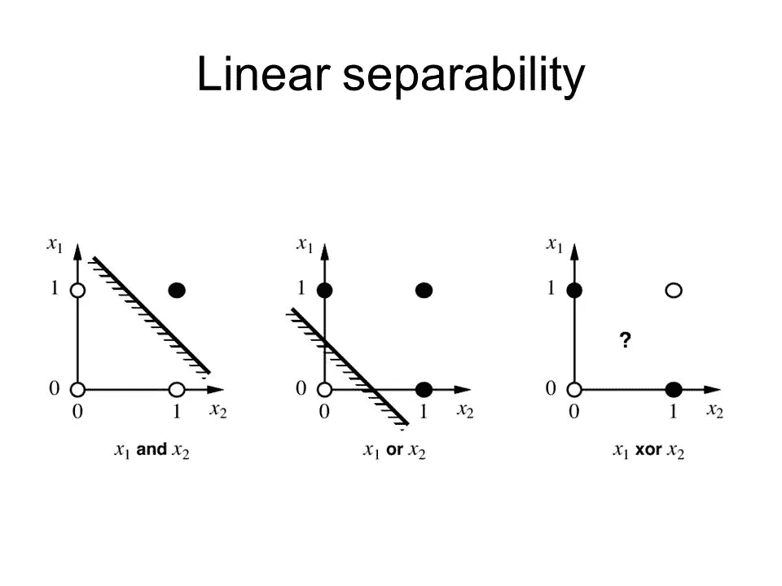

Linear-separability of AND, OR, XOR functions

⁃我们至少需要**一个隐藏层**来导出非线性**分离**。

⁃我们的 RBNN 它做的是，它将输入信号转换成另一种形式，然后可以**馈送**到网络中**以获得线性可分性。**

⁃ RBNN 在结构上与感知器(MLP)相同。

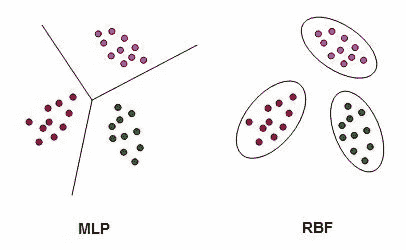

Distinction between MLP and RBF

⁃ RBNN 由**输入、**和**输出**层组成。RBNN 被**严格限制**为只有**一个隐含层**。我们称这个隐藏层为**特征向量。**

⁃ RBNN **增加特征向量的维数**。

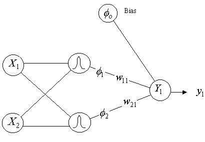

Simplest diagram shows the architecture of RBNN

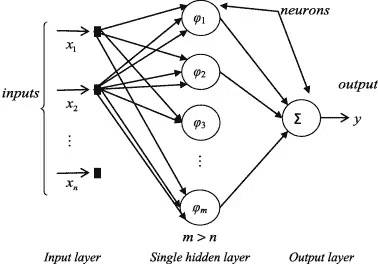

Extended diagram shows the architecture of RBNN with hidden functions.

⁃:在我们进行**分类问题之前，我们将**非线性传递函数**应用于特征向量。**

⁃当我们增加特征向量的维数时，特征向量的线性可分性增加。

> 非线性可分离问题(模式分类问题)在高维空间中比在低维空间中高度可分离。
> 
> 【 ***盖兹定理*** 】

⁃什么是径向基函数？

> ⁃我们定义一个受体= t
> 
> ⁃:我们在受体周围画正面图。
> 
> ⁃高斯函数通常用于弧度基函数(正射映射)。所以我们定义径向距离 r = ||x- t||。

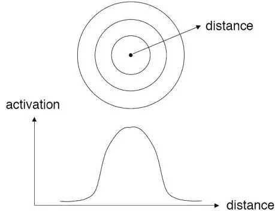

Radial distance and Radial Basis function with confrontal map

高斯径向函数:=

> ϕ(r) = exp (- r /2 **σ** )

> 其中σ > 0

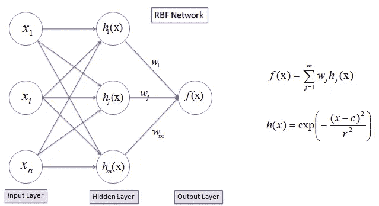

Classification only happens on the second phase, where linear combination of hidden functions are driven to output layer.

# ⁃的例子。XOR 函数:-

⁃，我有 4 个输入，我不会在这里增加特征向量的维数。因此，我将在这里选择 2 个受体。对于每个变换函数ϕ(x)，我们将有每个受体 t

⁃现在考虑 RBNN 结构，

> ⁃ P := #个输入特征/值。
> 
> ⁃ M = #变换的矢量维数(隐藏层宽度)。所以 M ≥ P 通常为。
> 
> ⁃在隐藏层的每个节点上，执行一组非线性的弧度基函数。
> 
> ⁃输出 c 将保持与分类问题相同(预先定义一定数量的类别标签)。

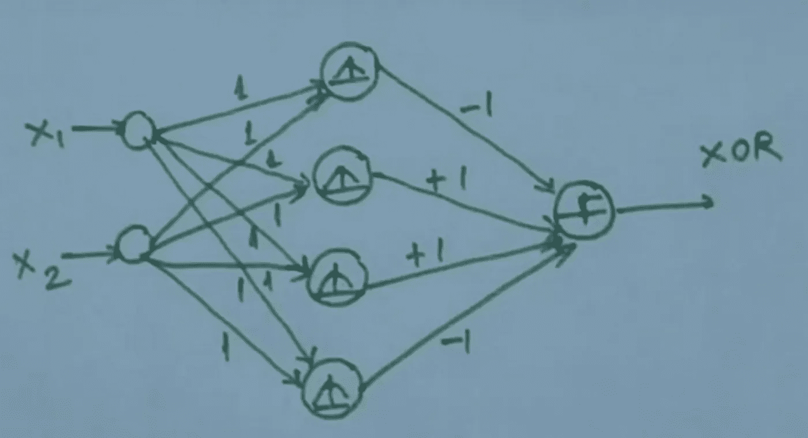

Architecture of XOR RBNN

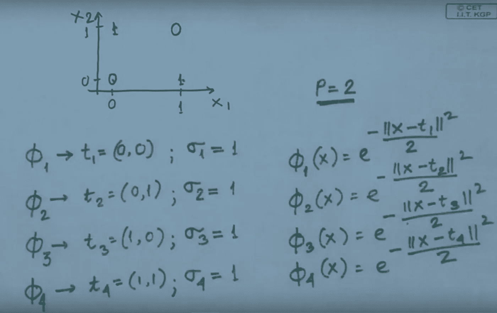

Transformation function with receptors and variances.

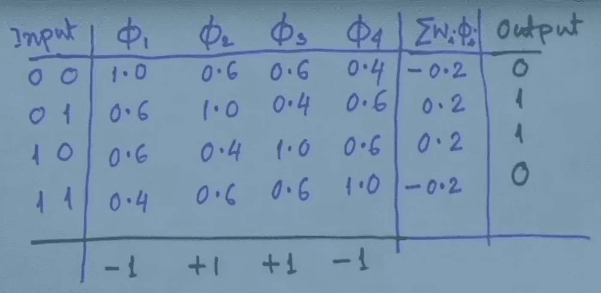

Output → linear combination of transformation function is tabulated.

只有隐藏层中的⁃节点执行弧度基变换功能。

⁃输出层执行隐藏层输出的线性组合，以给出输出层的最终概率值。

⁃所以分类只做了@ ***(隐藏层→输出层)***

# 训练 RBNN :-

⁃ **首先**，我们要用**反向传播训练**隐层**。**

⁃神经网络训练(反向传播)是一种**曲线拟合方法**。在**训练**阶段**拟合**一条**非线性曲线**。它通过随机逼近，我们称之为反向传播。

⁃对于隐藏层中的每个节点，我们必须找到 **t** (受体)&方差( **σ** )【方差——径向基函数的扩散】

⁃在**第二个**训练阶段，我们要**更新**中**隐藏层&输出层**之间的**加权向量。**

在隐藏层中，**的每个**节点代表**的每个**变换基函数。**函数的任意**可以满足非线性可分性，甚至函数集合的**组合**也可以满足非线性可分性。

⁃:所以在我们的隐藏层变换中，所有的非线性项都包括在内。比如说 X+Y+5XY；它全部包含在超曲面方程中(X 和 Y 是输入)。

⁃因此，第一阶段的训练是由**聚类算法完成的。**我们定义我们需要的**个聚类中心**。通过聚类算法，我们计算聚类中心，然后将其指定为每个隐藏神经元的**受体**。

⁃:我必须将 n 个样本或观测值聚类成 m 个聚类(N > M)。

⁃所以输出“集群”就是“受体”。

对于每个受体，我可以找到的方差为"**各个受体之间距离的平方和&每个聚类最近的样本** " := 1/N * ||X — t||

⁃对第一个训练阶段的解释是**“特征向量被投影到变换的空间上”。**

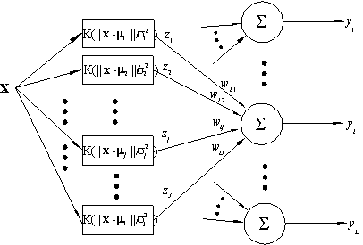

Complex diagram depicting the RBNN

## 使用径向基神经网络比 MLP 的优势:-

> 1.RBNN 中的训练比多层感知器(MLP)中的**快**→需要**许多交互**在 MLP。
> 
> 2.我们可以很容易地解释 RBNN 隐含层中每个节点的意义/ **功能是什么。这是 MLP 的**难**。**
> 
> 3.(什么应该是隐藏层的节点数 **&** 隐藏层的节点数)这个**参数化**在 MLP 很难。但这在 RBNN 中是没有的。
> 
> 4.**分类**在 RBNN 比在 MLP 要花更多的时间。