# 随机蓝调

> 原文：<https://towardsdatascience.com/random-blues-bc011cd1d53f?source=collection_archive---------8----------------------->

## 统计物理学的范式转换理论被用来产生平庸的钢琴即兴创作

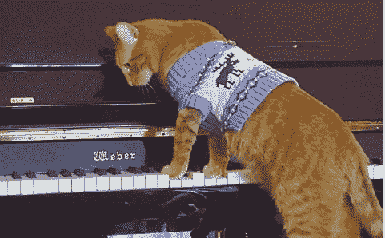

[Source](https://www.instagram.com/p/BdDbTJQHJ7J/)

# 投

无论你是梦想成为著名音乐家的软件工程师，还是梦想成为软件工程师的真正摇滚明星:你可能会对算法音乐生成感兴趣。本文描述了一种可能的 AMG 方法——我们将一种简单的蓝调即兴演奏技术数学建模为多维图上决策的马尔可夫链。

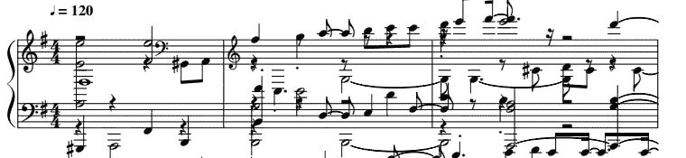

Example result of stochastic composition.

由于大多数 AMG 项目的结果充其量听起来很一般，我们并不真正期望超过那个水平，我们希望通过将算法结构嵌入到一些重要和有趣的科学企业中来带来一些非美学价值(从而获得该领域的洞察力)。我们将把这个问题作为一个非古典(即*)扩散过程来处理，并尝试结合一种新颖的数学工具——MERW(见下文),来生成音符序列，希望这些音符序列听起来至少有点像真正音乐才能的早期阶段。*

## ***物理***

*我们希望将音乐即兴创作视为一个随机过程，我们将把它建模为一组图表上的扩散(见下文)。为了在这些图上移动(从一个节点到另一个节点)，我们将使用一种叫做最大熵随机游走(MERW)的方法。如果你正在跟踪物理学中的“基本”趋势，你可能会遇到这个概念，因为作者的一个大胆的主张是，它提供了一个统计框架，其中贝尔不等式违反是一个确定性的(和局部的！)系统[ [4](https://en.wikipedia.org/wiki/EPR_paradox) ， [5](https://en.wikipedia.org/wiki/Bohr%E2%80%93Einstein_debates) 。*

*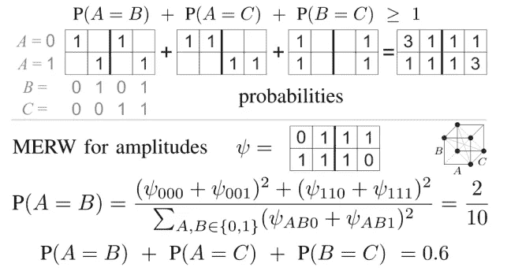*

*Top: schematic proof of simple Bell inequalities. Bottom: Example of its violation for MERW. See [[1, fig. 2](https://arxiv.org/abs/0910.2724)]*

*MERW 的另一个有趣的性质，也是本项目更感兴趣的，是它允许执行经典(即 ***而不是*** *量子*)扩散，并获得量子系统特有的结果——我们可以观察到强局域化性质，而不是均匀分布。这可能(也可能不会)在理论物理中有很多迷人的含义(例如，“*波函数不是真实的，只是统计的，不再有多重宇宙 bs* ”)，并有望使一些有趣的 AMG 成分成为可能。*

# *音乐*

## *音调*

*在我们的钢琴独奏中，我们想要自动化的第一个决策过程，最先进的人工智能算法是这样的问题:接下来弹哪个音符？为了做到这一点，我们在五声音阶 c 小调布鲁斯音阶中定义了这个问题的可能答案的简单图表，并使用它来执行 MERW，在每次迭代中生成一个新的音符。*

*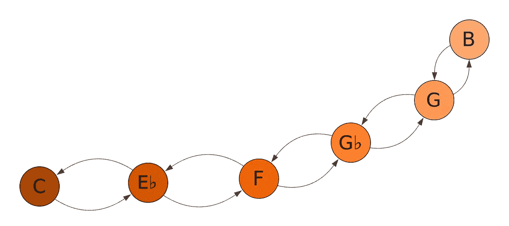*

*This graph is for one octave only. In reality we use a similar graph, but stretched over the same notes in each octave available on the usual piano (resulting in 42 vertices instead of 6).*

*这尽可能地简单明了——图表的定义方式是在每次迭代中强制一步变化，我们只能停留在 c 小调音阶的相邻音符上。*

*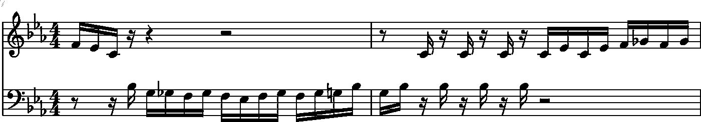*

*Two measures of semiquavers composed by the random walk.*

## *持续时间(值)*

*在我们决定播放哪种声音后，我们需要决定它的时间长度([音符值](https://en.wikipedia.org/wiki/Note_value) ) —我们设计的图表保存了播放声音将响起的三十秒音符(*半半音*)的数量。*

*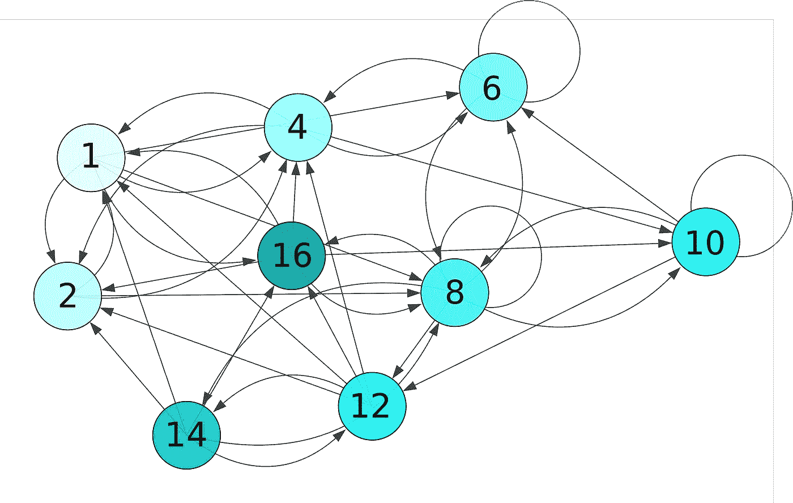*

*Notice that this graph has different numbers of possible transitions for each vertex and some of them have loops (that is, arrows that connect nodes with themselves).*

*希望你可以看到最长的可能值是半音符( *16 * 1/32* )，还有几个奇数值，比如 14/32(四分音符+带点的八分音符)。这个图有点密集:我们不希望在生成的序列中有更多的可变性和动态性，所以我们为每个顶点定义了多个可能的转换。以 python 可接受的格式阅读可能更容易:*

```
*# Measure duration in thirty-second notes
duration_graph = {
        1: [2, 4, 6, 8, 16],
        2: [1, 4, 8],
        4: [1, 2, 6, 10],
        6: [4, 6, 8],
        8: [6, 8, 10, 12, 14, 16],
       10: [6, 8, 10, 12],
       12: [1, 2, 4, 14, 16],
       14: [8, 12, 16, 1, 2],
       16: [1, 2, 4, 8, 10]
       }*
```

*例如，当从八个音符(上图中的 4)开始时，算法将生成这种结果:*

*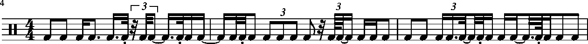*

*Three measures long rhythmic pattern arranged by the random walk.*

## *关节*

*到目前为止，我们定义了一个生成 c 小调音符流的系统。有人怀疑这可能仍然不够令人印象深刻，所以我们将继续添加控制其他音乐事件的图表层。*

*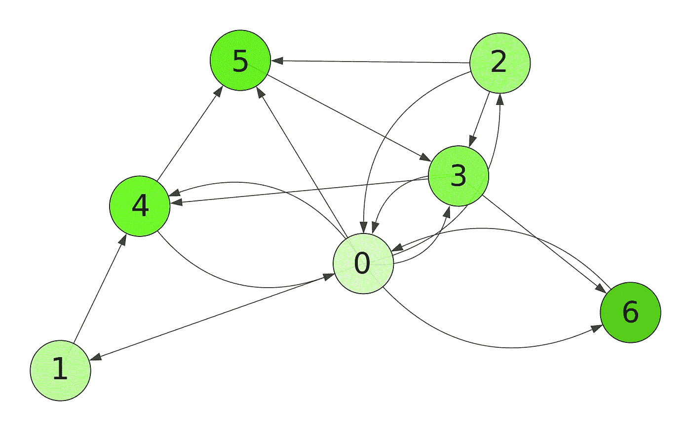*

*Graph for the articulation of every **n**-th note.*

*假设我们想要在每个 ***n*** *-* 音符上提供某种重音，其中 ***n*** 将是一个动态参数，其值由其自己的图形控制。增加音符在序列中的重要性的许多方法之一是添加另一个高一个八度的音符。*

*它实现起来非常简单，并且很好地增加了最终作品的复杂性，同时保持了基本的 c 小调和声不受干扰。此外，对于左边显示的图表，这种技术不会导致任何会产生任何节奏感的东西，这偶尔会被认为是一种特征(被一些人)。*

*为了恰当地说明这种效果，我们可以生成一个一小节的例子，其中充满了中间 C 的半八度音(30 秒的音符),随机加重了一个高八度的 C。*

*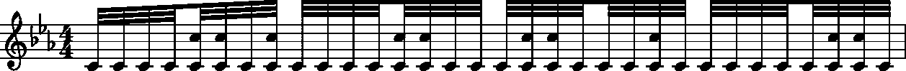*

*Randomly accented demisemiquavers.*

# *和弦进行*

*为了使生成的音乐的和声方面更加复杂，我们添加了另一个图表，该图表可以将 c 小调五声音阶切换到建立在该音阶的第四和第五阶上的音阶( **F** 和 **G** )。它应该会给我们带来著名的 **I-IV-V** 感觉。下图描述了可能的转换。*

*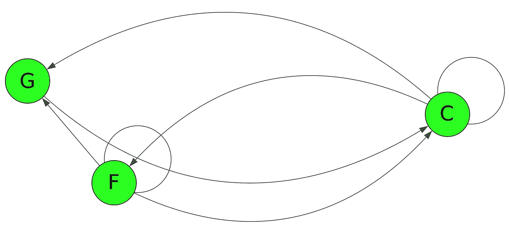*

*Graph defining the space of possible keys.*

# *结果*

*当目前为止描述的所有图表都用于生成一个单独的作品时，结果乐谱可能如下所示:*

*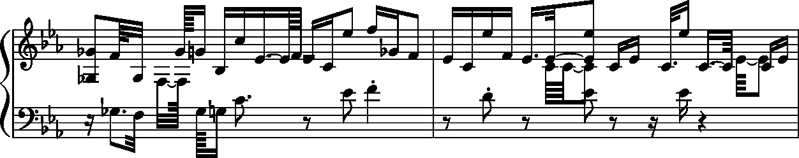*

*This image was generated automatically form a MIDI file, so it is not optimized for readability.*

*在这一点上，活页乐谱似乎不是概念化和评估制作的作品的好方法，所以这是开始产生实际声音的好时机。这是一个 15 分钟的 10000 个音符长序列的表演，由目前描述的方法生成:*

*Share, like, comment and subscribe. Buy merch.*

*我们分享一些[代码](https://github.com/Nospoko/merw-random-blues/tree/v0.1)，你可以用它们来重现这些结果。*