# 随机森林简介

> 原文：<https://towardsdatascience.com/random-forest-3a55c3aca46d?source=collection_archive---------2----------------------->

## 异常值检测和聚类的说明、解释、偏差和使用

*最近更新时间:2018–12–09*

随机森林广泛应用于数据科学竞赛和实际问题。它们通常是准确的，不需要特征缩放、分类特征编码，并且需要很少的参数调整。它们也比神经网络等其他复杂模型更容易解释。

内容组织如下。

*   什么是随机森林
*   解读随机森林
*   偏向于具有更多类别的功能
*   处理冗余功能
*   离群点检测
*   使聚集

# 什么是随机森林

随机森林由多个随机决策树组成。树中内置了两种随机性。首先，每棵树都建立在原始数据的随机样本上。第二，在每个树节点，随机选择一个特征子集来生成最佳分割。

我们使用下面的数据集来说明如何建立一个随机的森林树。注 Class = *XOR* (X1，X2)。X3 被制作成与 X2 相同(在后面的部分中为了说明的目的)。

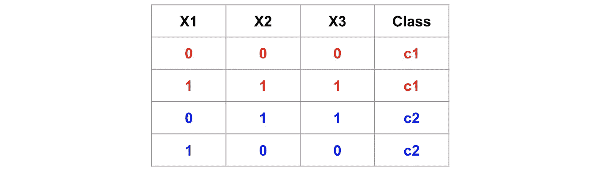

An illustrative dataset with two classes colored in red and blue.

下图演示了如何构建随机森林树。

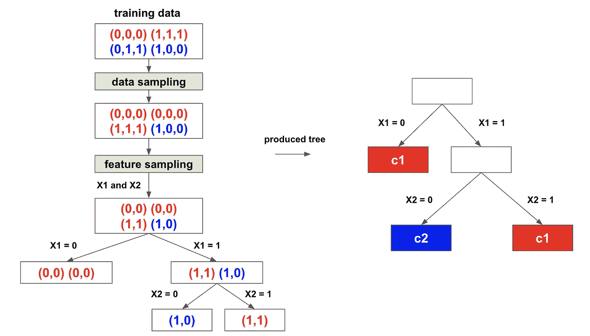

The process of building a random forest tree.

相同的过程适用于构建多个树。下图说明了将带有三棵树的随机森林应用到测试数据实例的流程。

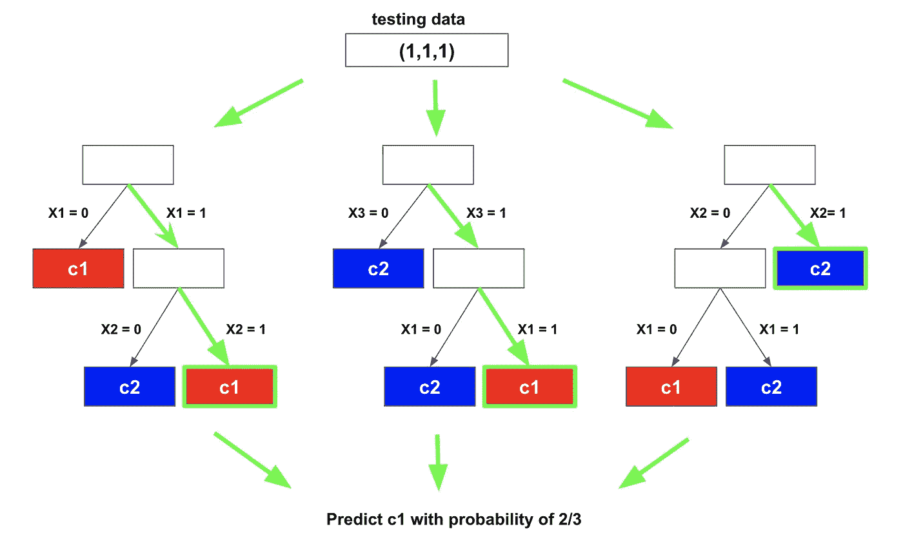

The flow (highlighted in green) of predicting a testing instance with a random forest with 3 trees.

# 解读随机森林

**特征重要性**

要素的重要性分数衡量要素的贡献。它基于由于该特征而导致的杂质减少。

让我们向说明性数据集添加一个不相关的特征 X4。重要性分数绘制如下。显然，X1 和 X4 分别具有最大和最小的分数。X2 和 X3 是相同的，重要性分数不同。

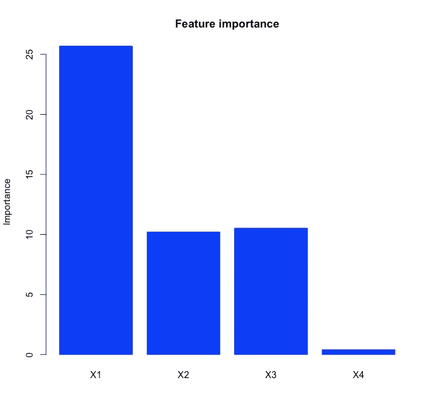

**部分依赖图**

要素的重要性分数并不能说明要素和类是如何关联的。部分依赖图可以可视化特征对类概率的边际效应。

当一个特征与类相关时，图看起来如下图所示，表明 X1 ≤ 0.5 和 X1>0.5 与不同的类相关。

然而，在我们的说明性数据集中，部分依赖关系图看起来像右图-它没有指示 X1 和类之间的任何关系，即使 X1 具有最大的重要性分数。

原因是 X1 必须与 X2 或 X3 交互才能预测类别。单独的 X1 不具有预测性。因此，在这种情况下，部分相关图可能会产生误导。

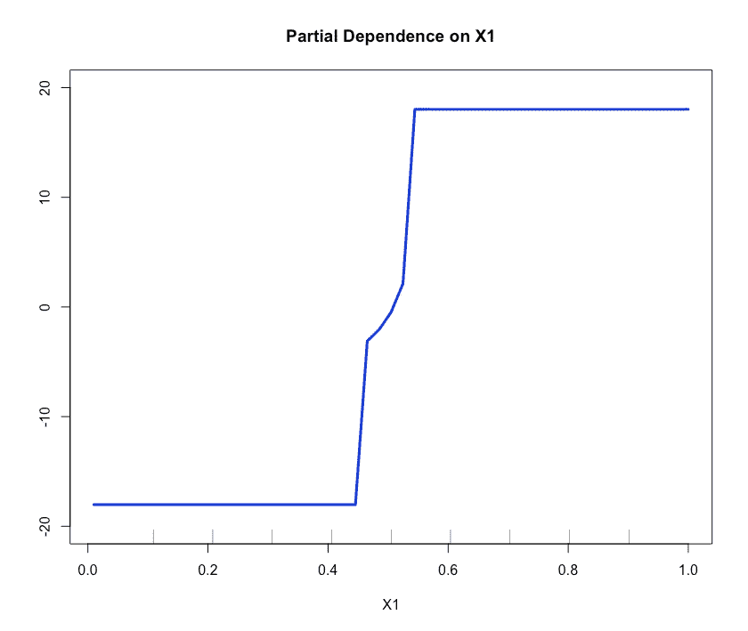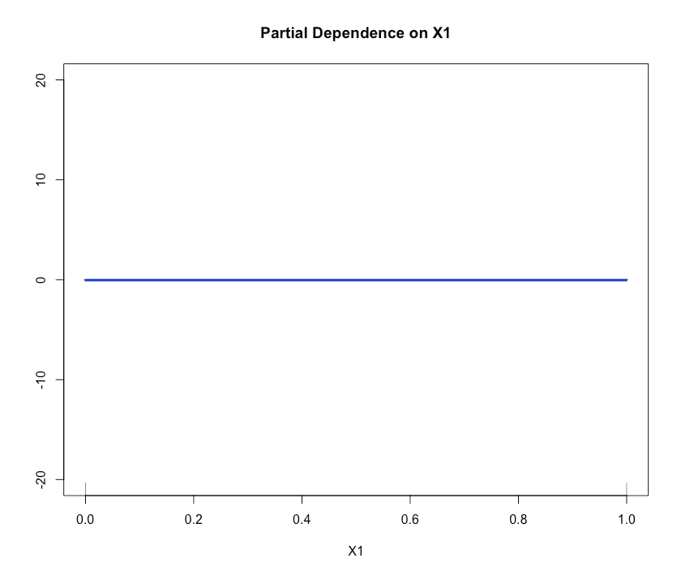

Left: when X1 alone is correlated to the class, partial dependence is informative. Right: when X1 alone is not correlated to the class, partial dependence can be misleading.

**兴趣**

重要性分数和部分依赖图都不能说明多个特征如何与类交互。inTrees 框架可以用来更清楚地了解随机森林内部发生了什么。

对于说明性数据集，高度预测的交互及其相关类可以用 inTrees 提取，如下所示。频率(0%-100%)衡量交互在随机森林中的受欢迎程度，准确度(0-1)衡量交互预测类别的准确度。

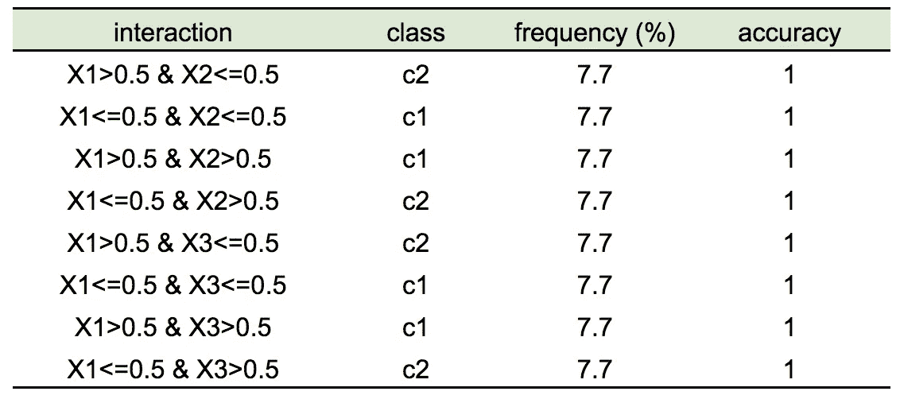

# 偏向于具有更多类别的功能

对于说明性数据集，让我们添加一个具有 30 个类别的随机特征 X5。即使特征与类别无关，X5 的重要性分数也大于真正有信息的特征 X2 和 X3，这表明对具有更多类别的特征的不正确的偏好。

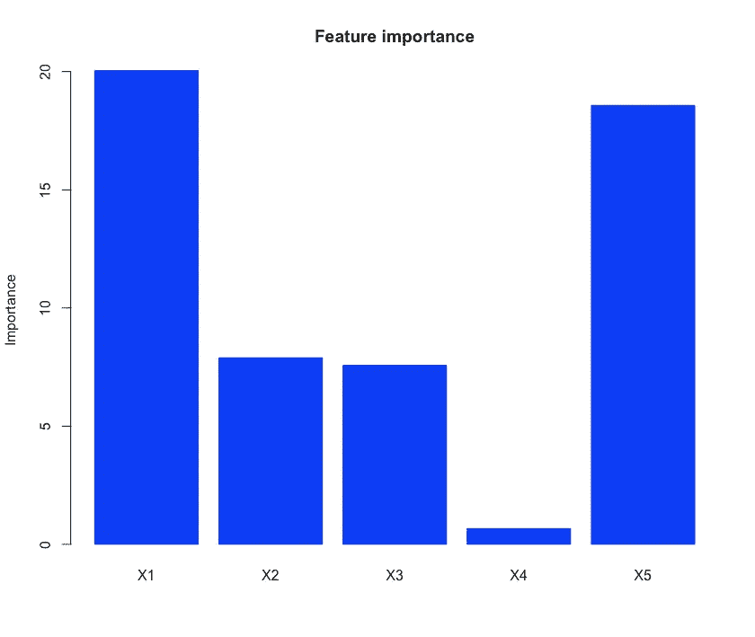

X1, X2, and X3 are truly informative, X4 and X5 are irrelevant, and X5 has many categories.

一种解决方案是执行特征选择。例如，在 randomForest R 包中，可以使用特性对精度的影响(*importance $ meandercise accuracy*)来评估特性。下面的精度影响图显示，与真正提供信息的特征相比，X5 的精度影响非常小，这表明该特征混淆了模型，应该在拟合分类器之前删除。

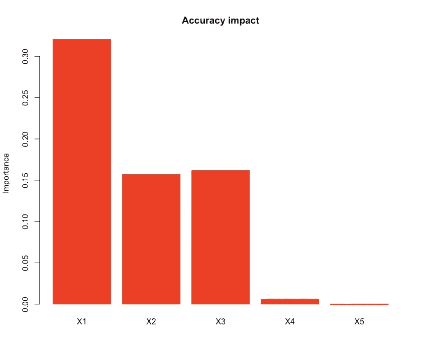

# 处理冗余功能

当特征彼此相似时，这些特征的重要性分数可能会产生误导。在说明性数据集中，X2 和 X3 是相同的，它们“共享”重要性分数(如下左图所示)。当冗余特征越多，每个特征的重要性就越小。

这可能不会损害精度性能，但可能会在解释中产生误导。一个解决方案是规则化随机森林(RRF)。在树构建过程中，RRF 记忆在先前的树节点中使用的特征，并且在分裂未来的树节点时更喜欢这些特征，因此避免了树中的冗余特征。下图显示了 RRF 的重要性分数。

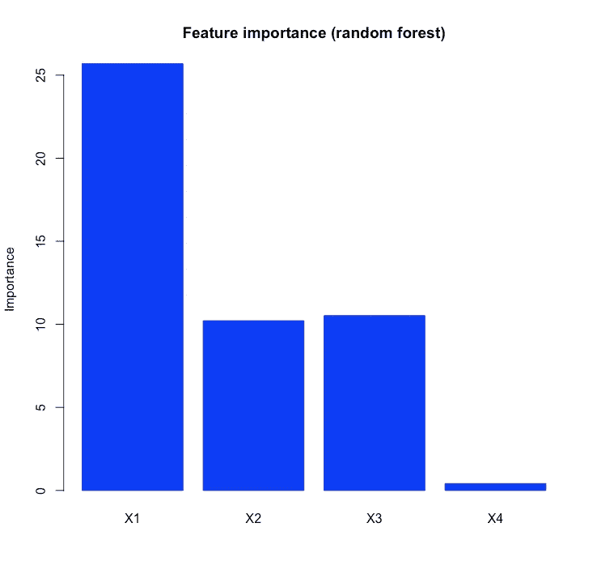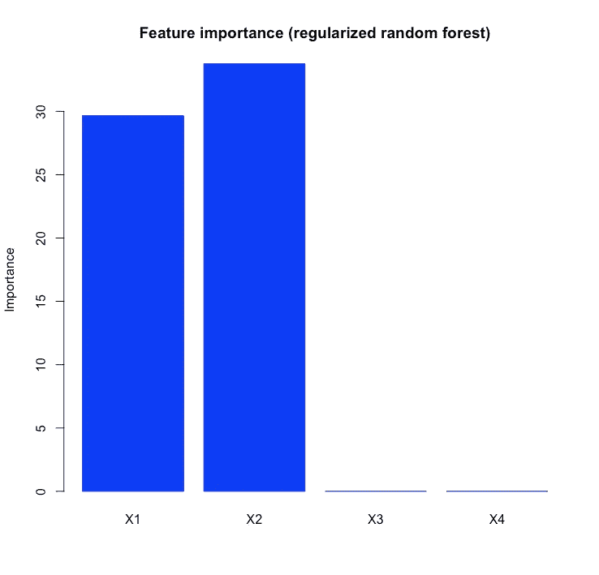

Left: feature importance from a random forest; Right: feature importance from a **regularized** random forest.

# 随机森林中的离群点检测

用随机森林进行聚类可以避免对特征变换(例如，分类特征)的需要。此外，这里还可以使用一些其他随机森林函数，例如概率和解释。在这里，我们用左图中绘制的二维数据集来演示该方法。

这个想法是生成一个与原始数据形成对比的随机数据集。这里我们随机排列每个特征。这两个数据集分别标有两个类别(比如“正常”和“随机”)。合并后的数据集如下右图所示。

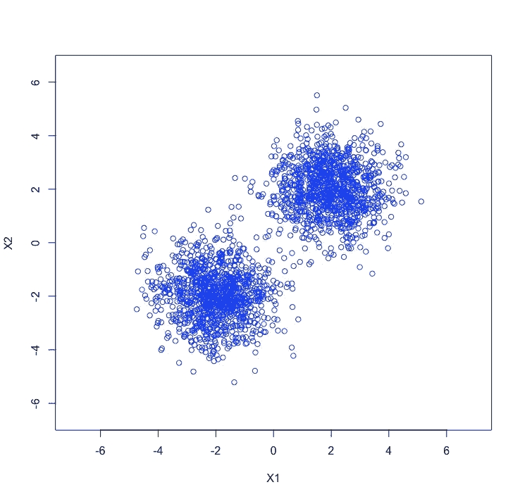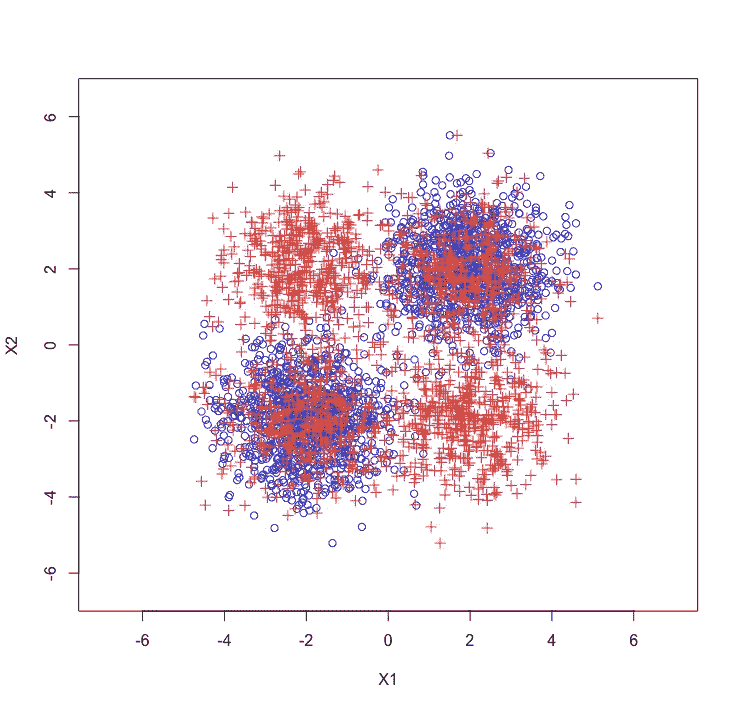

Left: original data; Right: generate a two-class data set. class 1: original data; class 2: the same size as the original data but with X1 and X2 randomly permuted.

在数据集上构建随机森林。然后，可以将分类器应用于测试数据实例。如果预测的类是“随机的”，那么它被识别为异常值。发现的异常值如下图所示。

通过查看重要性分数，我们可以了解哪些特征有助于离群点检测。为了便于说明，我们添加了一个与类别无关的随机特征 X3。重要性分数如下图所示。X1 和 X2 被确定为重要特征，而 X3 不太重要。

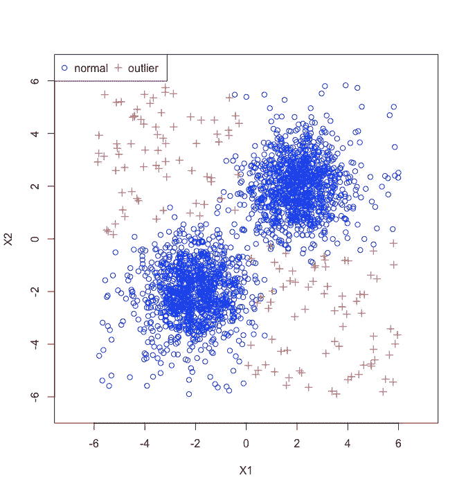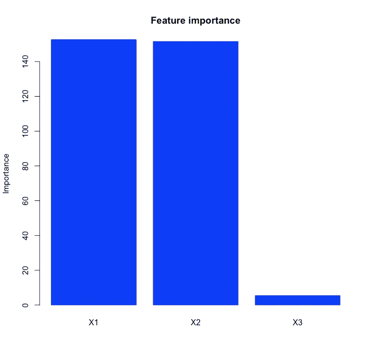

Left: outlier detection. Right: feature importance score in outlier detection.

# 随机森林聚类

与离群点检测类似，使用随机森林进行聚类可以节省特征预处理的工作量。

该过程类似于异常值检测。首先，创建一个与原始数据大小相同的合成数据集。然后用两个不同的类标记原始数据和合成类。然后为分类问题建立一个随机森林。

从构建的随机森林中，提取每对数据实例之间的相似性得分。两个数据实例的相似性通过两个数据实例出现在同一叶节点的树的百分比来衡量。

有了相似性得分，诸如分层聚类之类的聚类算法就可以用于聚类。下图显示了预定义聚类数分别为 2 和 4 时的聚类结果。

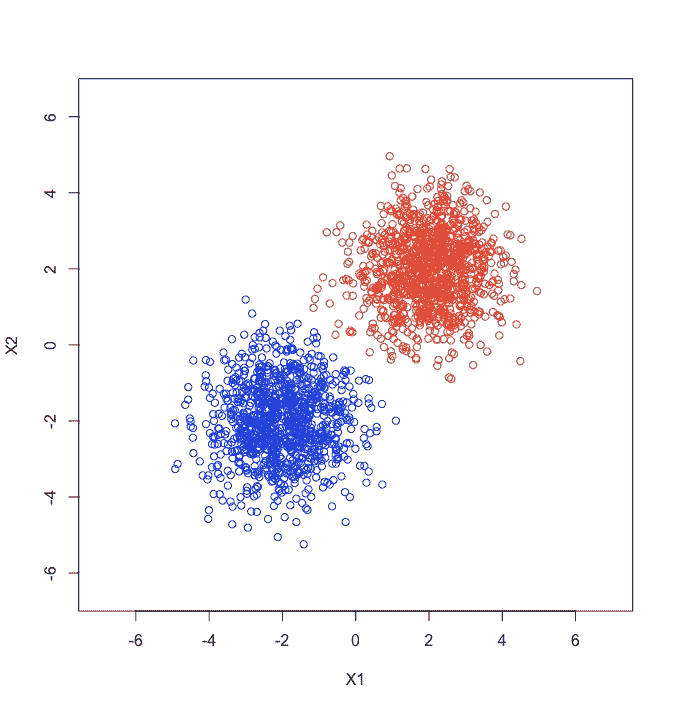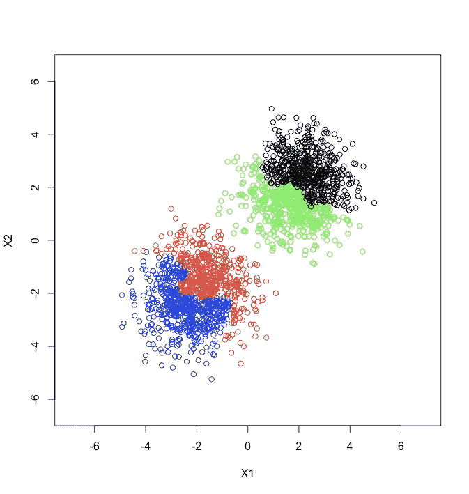

Left: clustering with 2 clusters. Right: clustering with 4 clusters.

# 摘要

随机森林不仅在分类/回归方面非常强大，而且在异常值检测、聚类和解释数据集(例如，作为具有兴趣的规则引擎)等方面也非常强大。

但是，使用随机森林时很容易出错。首先，当数据集中存在多级分类特征时，可能会有偏差。第二，当特征是冗余的时，重要性分数可能是误导的。本文提供了这些问题的解决方案。

你可能有兴趣阅读一篇关于[为什么随机森林优于决策树](/why-random-forests-outperform-decision-trees-1b0f175a0b5)的相关文章。

欢迎您在 github 上贡献[intres](https://github.com/softwaredeng/inTrees)或 [RRF](https://github.com/softwaredeng/RRF) 包。

在 [dataanalyticsbook.info](https://dataanalyticsbook.info/) 可以找到我的书的更多内容。