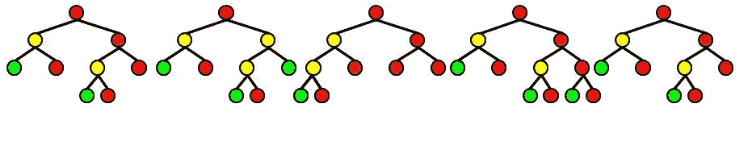
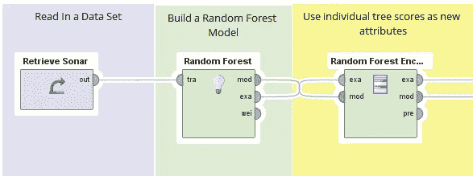

# 随机森林编码器

> 原文：<https://towardsdatascience.com/random-forest-encoder-e7c8b5b9278e?source=collection_archive---------6----------------------->

随机森林是机器学习中最常用的技术之一。它们计算速度快，可以并行计算，可以处理数值和标称值，并且预测能力强。

随机森林中使用的技术是一种叫做装袋的综合方法。集成方法训练许多弱学习者，并将它们组合成一个强学习者；在 bagging 中，弱学习者是通过使用数据的增强捕获样本来训练一个“基础学习者”而产生的。然后将这些基础学习者的结果与(加权)平均值相结合以获得预测。

Example for a Random Forest. The color represents the pruity of the node. Each tree results in one score. The score of the forest is the average of the individual trees.

随机森林使用一个非常特殊的学习器作为基础学习器:随机树。随机树类似于决策树，但是每个节点只使用所有列的子集。

**如何更好的组合树木？**

这里出现的一个问题是——为什么我们只是平均所有的树？我们就不能做一些更“智能”的事情吗？答案当然是——是的，有一点。

一种方法是创建一个新表。新表有一个针对所有行的标签列(用作预测目标)，还有一个新的置信度/概率列。这使我们能够“学习另一个学习者”，将置信度作为输入并预测我们的标签。你可以认为这是另一种系综方法——叠加。

这种想法的危险在于，你给你的模型增加了额外的复杂性，这可能会导致过度拟合。我强烈建议小心验证这些树。

**随机森林作为编码方法**

看待这种方法的另一种方式是将随机树的所有置信度放入一个新列，类似于 PCA 或 t-SNE 所做的。我们输入数据，得到与目标变量更相关的数据的新表示。这就是我所说的“编码器”。这个编码器的美妙之处在于，你可以输入名义数据，然后输出数值。这使我们能够将这种编码的结果输入到神经网络和支持向量机等学习器中。

在编码的情况下，我建议小心控制深度树，不要在一个属性中编码太多的路径。另一方面，深度控制着你的柱子之间的“互动水平”。

**在 RapidMiner 中实现**

Implementation using RapidMiner. The table delivered at the most upper output of Random Forest Encoder has includes all the scores of the individual trees.

我最近添加了一个新的操作符，让它在 RapidMiner 中更容易使用。RapidMiner 是一个开源的数据科学平台，它支持无代码的数据科学。操作符是用 Java 写的，可以从[市场](https://marketplace.rapidminer.com/UpdateServer/faces/product_details.xhtml?productId=rmx_operator_toolbox)下载。操作员获取一个数据集和一个随机森林模型并进行转换。

当然，也可以通过在系综的子树上迭代，在 Python 或 R 中快速实现这一点。