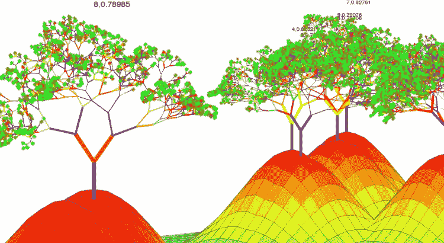
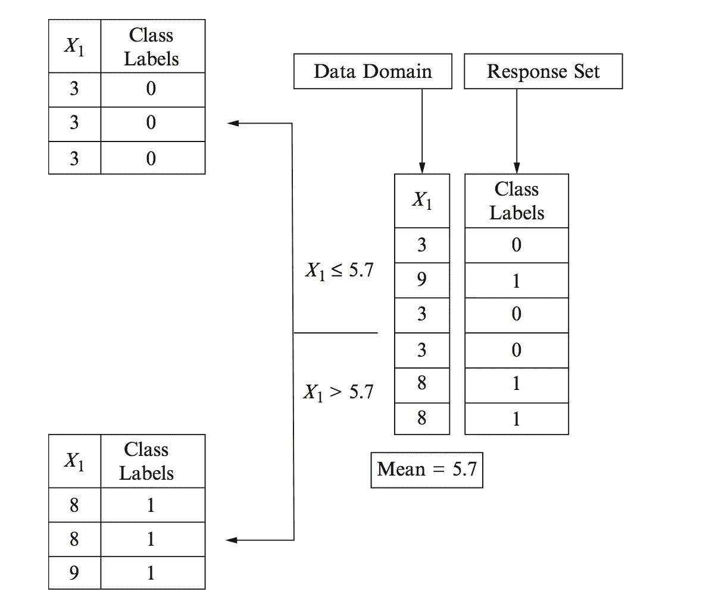
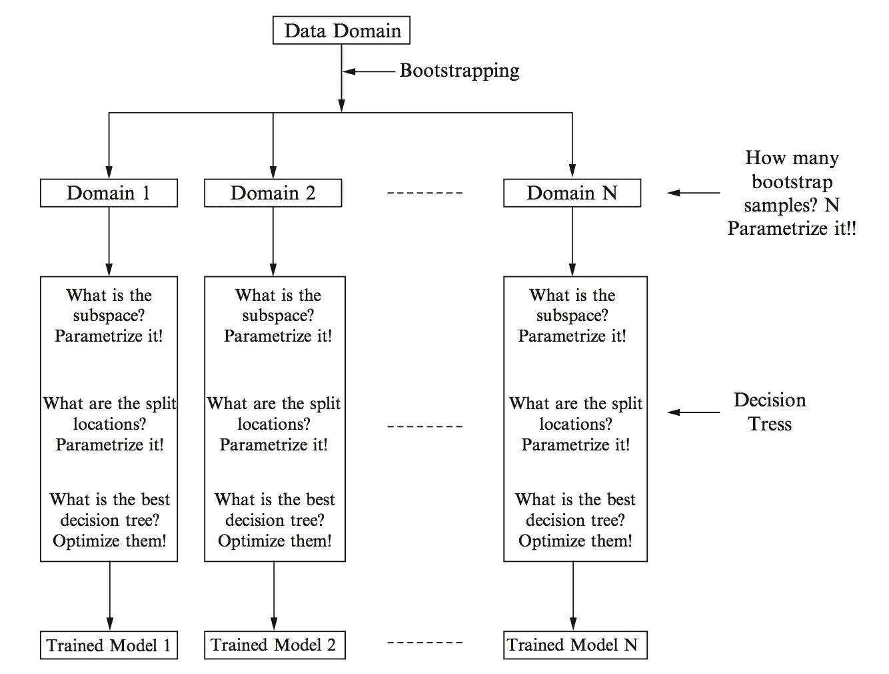
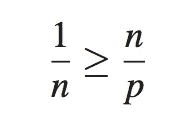
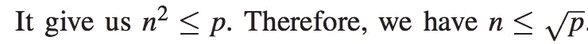
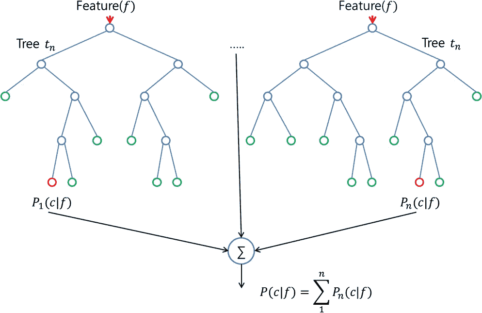

# 随机森林学习-基本理解

> 原文：<https://towardsdatascience.com/random-forest-learning-essential-understanding-1ca856a963cb?source=collection_archive---------2----------------------->

**> >使用> >** 决策树模型进行参数化

**> >集成了> >** 三种技法，

> **1。**一种采样技术
> 
> **2。子空间法，和**
> 
> **3。集合方法**
> 
> **优化**模型构建

****抽样方法** :=** **自举**；采用**随机**抽样方法，用**替换**。

****子空间法** :=** 也采用了**随机**的采样方式，

但是有助于提取更小的特征子集(子空间)。

有助于基于它们构建决策树。

为随机森林构造选择决策树。

****集合方法**:=** 基于**打包**方法；帮助构建**分类器**。

# 1.1 随机森林(RF)

树木可以是

> **1。分类树**
> 
> **2。回归树**

因此 RF 可以应用于两者。

*   **决策树**为**测试**阶段提供**单个**训练好的决策树分类器。
*   但是 **RF** 为**测试**阶段提供**多个**训练好的 DT 分类器。
*   这一特性使得 RF 比常规 DT 学习更受青睐。

The construction of a Decision Tree using 1-D data domain & bootstrap sampling.

# 平行结构

*   **并行化**是 RF 对 ***增强分类性能*** 的贡献属性之一。
*   DT 可以在**的同时**建立，用于 RF 建模的分类。
*   这种射频并行结构有助于**大数据分类。**

The parallelization feature of the random forest technique

# 模型参数

*   RF 的参数化包括 **DT 型号**的**参数化**，因为它内部采用了另一个。
*   因此，RF 模型由 DT 的参数组成，但也有更多的**新**参数。

例如，**特征子集**中的#个，选择用于构建 RF 的#个 DTs

# 增益/损失函数

*   参数的优化基于

> **1。自举采样**
> 
> **2。子空间整合**

在模型建筑中

*   树构建使用与 DTs 中使用的**相同的量化度量**来选择最佳特征，例如。

> **1。熵**
> 
> **2。基尼杂质**
> 
> **3。信息增益**

# 自举和装袋

*   为了优化分类目标，

> **1。统计措施，**
> 
> **2。自举，**
> 
> **3。装袋**

在射频学习中起着重要的作用。

# 1.1.4.1 自举

*   BS 是一种简单的随机化技术。
*   它在射频方面的效果**非常出色。**
*   它通过随机选择从一组数据中选择**几个** **子集**，但与原始数据集中的观测值完全相同，只是用 **替换****。**
*   所以有些观察值可以在数据集的一个子集里多次出现**。**
*   **概念:-**

> **在每个中间节点& DT 的叶子上最大化“类距离”。**

*   ****BS** 应用于射频算法的**训练阶段**。**

# **1.1.4.2 重叠细化**

*   **BS 给数据域带来了一些影响。**
*   **BS 生成**多个域**，其中**类**可能比原始数据域更加**孤立**。**
*   **这些**隔离数据域**中的类可以通过**单个拆分**轻松分离**。****
*   **有时候我们可能不需要分裂。**

# **1.1.4.3 装袋**

*   **指 BS 样本给出的**预测**(分类)**响应**的**平均**，得到**最终**预测结果。**
*   **套袋来自 ***自举聚集。*****
*   **BS 用“ ***简单类重叠细化*** ”创建**多个**域，这些域帮助创建**多个分类模型**，多个分类模型允许**测试算法**高效地评估分类器的**性能。****
*   **在 RF 算法的**测试阶段**应用 Bagging。**

# **1.2 随机森林学习模型**

*   **实现**参数化**目标&优化**目标。****

# **1.2.1 参数化**

*   **参数，**

> ****1。使用自举生成的域数量— A.****
> 
> ****2。每个节点(域)的子空间大小— B.****
> 
> ****3。域分割的阈值— C.****

*   ****参数化的目标**:-**

> **我们需要找到或建议参数的可能值。**

*   ****A** 的通常值是 **10** 。**

**但是进行“**交叉验证**并确定一个合适的**取值范围是合适的。****

*   **对于 B 选择，有 **2 个约束。****
*   **第一个建议是 **n < < p** &它必须在 DT 的整个构建过程中保持不变。**
*   **第二 constriant，**n<= sqrt(p)；**我们在原始数据域中有 **p 个特性**。其中有 n 个是好的。良率在 **n/p.** 其中**特征之一**为**最佳**之一，其良率为 **1/n.****

********

*   **人们使用 **sqrt(p)** 作为特征的 **#进行随机选择。****

# **优化**

> **一旦选择了参数，模型就被参数化了。那么必须优化参数。**

*   **但是在 RF 参数化&优化中**嵌套**，&它们是同时**执行的。****
*   **已经在树的每个节点进行了优化**。****
*   **RF 优化的主要参与者是**基尼指数(熵)**&**信息增益**。**

# **1.3 随机森林学习算法**

*   **像其他机器学习算法一样，由 3 部分组成； ***培训、验证和测试。*****
*   ****交叉验证**已经**包含在**培训协议**中。****
*   **所以射频技术不需要**不需要**单独的 验证算法。**

## **简单地说:-**

> **RF 学习为我们提供了几个空间(最佳特征组合)，在这些空间中可以执行最佳的领域划分&可以获得高的分类精度。**

*   **因此，射频分类目标只分为****训练&测试**算法。****

# ****1.3.1 训练算法****

*   ****这提供了一种**系统化的**方法来开发**多分类器** (DTs)，以便测试算法使用多分类器来选择**对新数据进行分类的最佳方式。******

## ****第一步::—****

****— **为给定数据创建多个**子空间。****

******r < = sqrt(p)******

> *****p = #特性；*****
> 
> *****r =子空间尺寸*****

## ****第二步::—****

****—我们有**明显更小的 r** ( ***维度子空间*** )，因此我们可以使用 DT 构建过程为**根节点**找到**最佳特征** & **最佳分裂位置(**域划分)。****

> ****[但是我们不对这个子空间执行这个过程，所以跳到下一步]****

## ****第三步::—****

****— **随机改变**子空间**使用引导样本&创建多个**引导子空间**，其中**重叠细化**发生在数据域中。******

## ****第四步::——****

****—通过应用 DT 算法为每个引导子空间寻找最佳特征和最佳分裂位置来为 DTs 构建节点。****

## ****第五步::—****

****—现在，每个引导样本都有一个 DT(分类器)。****

****——这些树可以被**测试**算法用来**分类**新的数据。****

******射频相对于 DT 的优势，******

> ****1.在测试空间**=>****将增加**和**的分类精度。******
> 
> ****2.bootstrap 样本用于多个 DTs，这将有助于通过**重叠细化增加**分类边界**的**锐化**。******
> 
> **3.为了在整个空间中找到最佳特征&最佳分割位置而进行的**穷举搜索**被**通过子空间搜索 **= >** **消除**在 **bootstrap 采样中很小的附加计算成本**。** ( *计算优势*)**

# **测试算法**

*   **测试要求**整个**射频可以**在早期使用几个自举样本(10)** 构建。然后**贴标过程**就可以开始了。**
*   ****步骤**，**

## **1.功能选择:**

**来自**输入数据**的**正确的特征序列**必须是“**观察到的**”。**

## **2.树选择:**

**我们有 N 个射频分类器。所以我们**推送**新的数据**根据**的特性通过所有的&DTs 获取其类标签。**

## **3.装袋:**

**上一步选择的树用于寻找获得的结果的**集合(**套袋技术******

**F 最后，我们可以通过 ***表决机制*** 得出新的观察属于一个特定的标签。**

********

# **随机森林可扩展性**

*   **在典型的**数据科学应用中，****

****#的特性是固定的。****

**RF 技术从中选择一个子空间，并基于 bootstrapping 构建“**深度优先决策树**”来构造 RF。**

*   **但是在**大数据中，****

****功能集可以动态“增长”。****

*   **这个问题可以通过构建“宽度优先决策树”来解决。这里的 DTs 是在**并行**中构建的。**

**然而，在**深度优先** & **传统 RF** 中，DT 是在一个 DT 被完全构建之后构建的。**

# ****参考:-****

*****大数据分类的机器学习模型与算法，Shan Suthaharan 第十一章——随机森林学习*****