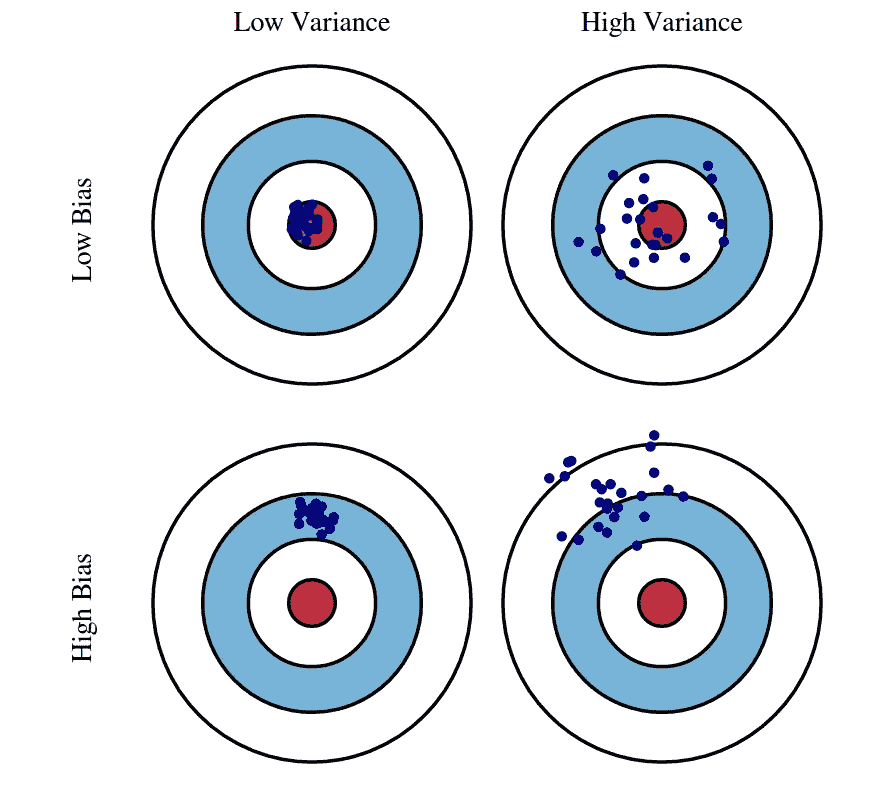
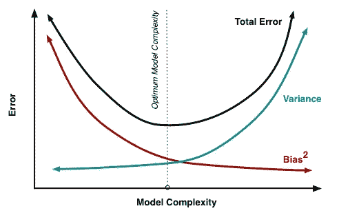
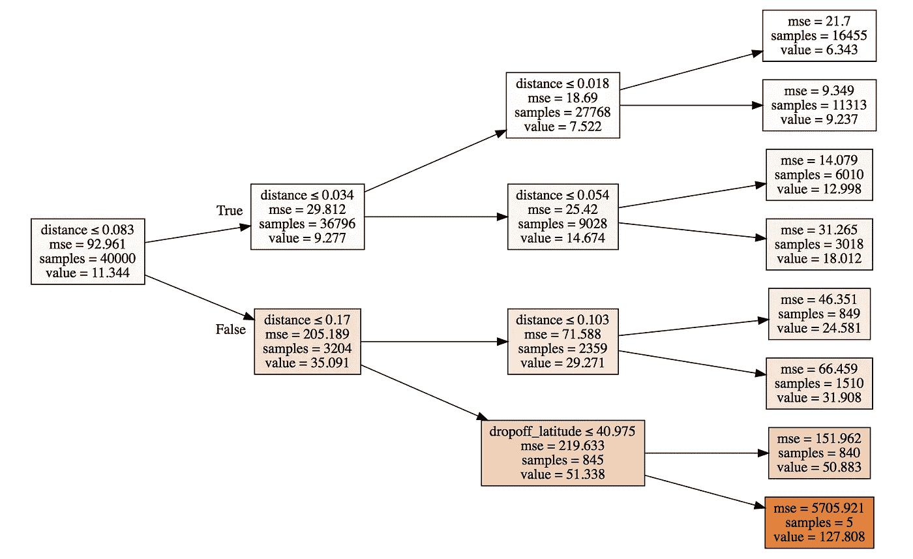
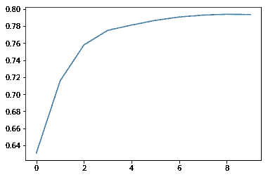

# 随机森林和偏差-方差权衡

> 原文：<https://towardsdatascience.com/random-forests-and-the-bias-variance-tradeoff-3b77fee339b4?source=collection_archive---------3----------------------->


Photo by [Lukasz Szmigiel](https://unsplash.com/@szmigieldesign?utm_source=medium&utm_medium=referral) on [Unsplash](https://unsplash.com?utm_source=medium&utm_medium=referral)

随机森林是一种非常流行的机器学习算法。通常，在没有太多预处理的情况下，人们可以快速构建一个不需要超参数调整的脏模型，并获得不错的结果。例如，我最近在 Kaggle 上使用`scikit-learn`用 Python 编写了一个用于纽约市出租车费用预测游乐场竞赛的`RandomForestRegressor`，没有向模型构造器传递任何参数，使用 1/100 作为训练数据(554238 行，约 55M)，验证 R 约为 0.8。你自己试试！

**注意**:这个代码片段假设您将数据分成训练集和验证集，并将您的特征和目标变量分开。你可以在我的 [GitHub](https://github.com/prratek/nycTaxi/blob/master/nycTaxi_rf.ipynb) 个人资料上看到完整的代码。

这种算法如此聪明的部分原因是它如何处理被称为**的偏差-方差权衡**。我在以下 5 个步骤中探索了随机森林的这一方面:

1.  **偏差和方差**
2.  **决策树**
3.  **装袋、引导和随机森林**
4.  **超参数调谐**
5.  **随机森林和偏差-方差权衡**

# 偏差和方差

统计模型的均方误差(MSE)可以表示为其预测的**平方偏差、**这些预测的**方差**和某个误差项𝜖的**方差**的总和。由于偏差和方差的平方都是非负的，并且捕捉数据随机性的𝜖超出了我们的控制，我们通过最小化模型的方差和偏差来最小化 MSE。我发现图 1 中的图像特别能说明这两个术语的意思。



Fig. 1: A visual representation of the terms bias and variance.

如果我们的模型系统地低估或高估了目标变量，我们就说它有偏差。在机器学习中，这通常是我们选择的模型做出的统计假设或训练数据中的偏差的结果。看看[这篇文章](https://motherboard.vice.com/en_us/article/j5jmj8/google-artificial-intelligence-bias)的一个偏见的例子，谷歌的云自然语言 API 通过互联网上的文本了解到“同性恋”这个词带有固有的负面内涵。

另一方面，方差在某种意义上抓住了模型的普遍性。更准确地说，这是一个衡量我们的预测会发生多大变化的指标，如果我们对不同的数据进行训练的话。高方差通常意味着我们过度适应我们的训练数据，发现模式和复杂性是随机性的产物，而不是一些真实的趋势。通常，由于过度拟合，更复杂或更灵活的模型往往具有较高的方差，但偏差较低，因为对几次预测进行平均，我们的模型会更准确地预测目标变量。另一方面，拟合不足或过于简化的模型虽然方差较低，但可能会更有偏差，因为它缺乏充分捕捉数据趋势的工具。

理想情况下，我们想要的是**低偏差-低方差。**为了了解如何做到这一点，我们先来看看典型的偏差平方方差曲线。



Fig. 2: A curve of squared bias vs variance showing the inverse correlation that is typical of the relation between the two as the model gets more complex. It is not uncommon for the resulting Total Error to follow some variant of the U-shape shown in the figure.

*图 2* 展示了随着我们的模型变得越来越复杂，我上面描述的偏倚减少和方差增加的总体趋势。我们的目标是**选择一个最小化两个**之和的模型，如虚线所示。为了了解随机森林是如何做到这一点的，让我们从一个简单的决策树开始。

# 决策树



Fig. 3: Representation of a single decision tree with no bootstrapping and max_depth of 3 that I created for the New York City Taxi Fare Prediction competition on Kaggle.

让我们回到出租车费用预测任务。给定特定出租车乘坐的某些特征，决策树通过简单地预测训练数据集中的平均出租车费用(＄11.33)开始，如图 3*中最左边的框所示。然后，它遍历所有特性及其值的列表，找到一个给我们最大 MSE 改进的**二进制分割**。这通常是通过预测两个新子集的平均值并计算它们各自的 MSE 来计算的，MSE 由每个子集中的观察值的数量来加权。*

在这种情况下，最佳分割恰好是行驶距离是否小于或等于 0.083(纬度/经度单位= 5.727 英里)。当它小于 5.727 英里时，该树预测为 9.28 美元，这是距离小于此值的乘坐的平均费用，通过相同的程序，对于比我们的阈值更长的乘坐，预测为 35.09 美元。这是有道理的。长途旅行更贵。

如图所示，然后根据 MSE 最大改进的相同标准，将每个*分支*分成新的分支，递归继续，直到每个*叶*(样本组)中只有一个训练观察。决策树具有极低的偏差，因为它们最大限度地过度适应训练数据。**它在验证集上做出的每个“预测”本质上都是我们的训练数据中某次出租车乘坐的费用，该数据与我们预测其费用的乘坐在同一个最终叶节点中结束。**然而，这种过度拟合也会导致不可接受的高方差，从而导致对未知数据的不良预测。

# 打包、引导和随机森林

虽然单个树过度适应训练数据并且可能具有较大的误差，但是*bagging*(**B**ootstrap**Agg**regat**ing**使用适当的**大量不相关误差平均为零**的洞察力来解决这个问题。Bagging 从训练数据中选择多个随机观察样本，通过替换，从每个样本中构建一个树。因为每棵树都从不同的数据中学习，所以它们彼此之间是不相关的。随着我们增加“袋装”树的数量，绘制我们模型的其余部分(`scikit-learn`称这些树为`estimators`)说明了这种技术的威力。

```
(array([ 9\. ,  8.1,  8.1, 11.5,  6.1,  6.9,  6.5,  8.1, 10.5,  6.5]), 8.13)
```



Fig. 5: A plot showing incresing R² as n_estimators is increased from 1 to 9.

把我们森林中的每棵树都想象成从它所建模的数据子集中学习一些关于纽约市出租车费用的独特见解。将他们的每个预测平均在一起，然后给我们一个更强大、更稳定的模型，能够以更高的精度预测出租车的费用。

# 超参数调谐

然而，随机森林不仅仅是装袋的树，它使用了许多有趣的技术来进一步降低树之间的相关性和减少过度拟合。快速浏览一下 scikit-learn 实现`RandomForestRegressor`的文档，可以看到我们可以传入的*超参数*:

```
*class* sklearn.ensemble.**RandomForestRegressor**(*n_estimators=10*, *criterion=’mse’*, *max_depth=None*, *min_samples_split=2*, *min_samples_leaf=1*, *min_weight_fraction_leaf=0.0*, *max_features=’auto’*, *max_leaf_nodes=None*, *min_impurity_decrease=0.0*, *min_impurity_split=None*, *bootstrap=True*, *oob_score=False*, *n_jobs=1*, *random_state=None*, *verbose=0*, *warm_start=False*
```

它们有十几种，但在这里我会仔细看看`n_estimators`、`max_depth`、`min_samples_leaf`和`max_features`的作用，以及为什么它们中的每一种都有可能降低模型的误差。

## n _ 估计量

`n_estimators`简单来说就是树的数量。森林中不相关的树木越多，它们的个体误差就越接近平均值。然而，越多并不总是越好，这里有一些注意事项要记住:

1.  更多的树=更多的计算。超过某一点，权衡可能就不值得了。
2.  与此相关，增加`n_estimators`会导致**收益减少**，如图 5 所示。例如，从 370 棵树增加到 400 棵树，甚至不能保证减少验证 MSE。
3.  没有任何不相关的树能够消除由模型假设或不具代表性的训练数据产生的偏差所导致的错误。

## 最大深度

`max_depth`是您希望每棵树分裂的深度。例如，`max_depth = 50`将限制树在任何给定的分支上最多分裂 50 次。其结果是，我们的随机森林不再能如此接近地拟合训练数据，因此更加稳定。它具有较低的方差，使我们的模型误差更小。请记住，即使严格限制`max_depth`可能会增加每棵树的偏差，因为它们可能无法在达到极限之前捕获数据中的某些模式，我们也不必担心这一点。选择合适的`n_estimators`，再加上装袋，可以确保整个森林的偏差在这个过程中不会增加。

`max_depth`是一个超参数，我通常不去碰它，因为我真正关心的是在禁止树进一步分裂之前，在一个分支的末端有多少观察值。这是对随机森林过度适应程度的更好预测。

## 最小样本叶

允许我们做我上面描述的事情。例如，`min_samples_leaf = 10`告诉每棵树停止分裂，如果这样做会导致任何结果分支的结束节点少于 10 个叶子。为了更好地理解为什么这是有用的，想一想决策树是如何做出预测的，我在出租车费用预测问题的背景下再次概述了这一点。一旦完成训练，它通过在树中传递出租车的特征并在树空间中找到距离该出租车最近的末端节点来预测出租车的费用。

如果这是叶节点，这将是如果`min_samples_leaf = 1`(缺省值)的情况，则森林正在预测该游乐设施碰巧最接近的训练集中的特定游乐设施的实际费用。几乎可以肯定的是，分支末端的分裂并没有捕捉到纽约市出租车费用的实际模式，而只是训练数据中与更高或更低费用相对应的情况。传入一些更大的`min_samples_leaf`意味着我们现在预测一些样本组的平均值，这些样本组在树空间中与所讨论的游乐设备最接近。这种技术的推广性明显更好。

我通常会尝试`min_samples_leaf = [1, 3, 5, 10, 20, 50]`，一旦增加`min_samples_leaf`并不能提高我感兴趣的指标，我就会停止。

## 最大 _ 功能

`max_features`告诉每棵树在寻找最佳分割时要检查多少个特征。这里的一个微妙之处是，传入`max_features = 15`并不意味着每棵树选择 15 个特征的子集来建模。更确切地说，一棵树为每次分裂选择了 15 个不同的随机样本。像`min_samples_leaf`一样，这不允许树过于接近数据。更重要的是，随机森林中的树现在彼此之间的相关性甚至更低，因为它们甚至没有在相同的数据上进行训练。有一些实用的机器学习研究表明，不太准确、不太相关的树的森林比更准确、更相关的树的森林表现更好。

## 实际例子

机器学习中超参数调整的一种常见方法是使用在`scikit-learn`中实现的一种叫做`RandomizedSearchCV`的技术。这将模型本身和我们感兴趣的参数空间作为必需的参数。

```
*class* sklearn.model_selection.**RandomizedSearchCV**(*estimator*, *param_distributions*, *n_iter=10*, *scoring=None*, *fit_params=None*, *n_jobs=1*, *iid=True*, *refit=True*, *cv=None*, *verbose=0*, *pre_dispatch=‘2*n_jobs’*, *random_state=None*, *error_score=’raise’*, *return_train_score=’warn’*)
```

它随机尝试这些参数的`n_iter`组合，并返回这些样本的最佳超参数和相应的分数。然而，为了说明改变单个参数的效果，我在这里展示了我的`RandomForestRegressor`对于一些手动选择的组合的表现。首先，让我们看看一个没有其他参数传入的随机森林有多好:

```
[4.262844864358172, 4.098490006842908, 0.8090730776697076, 0.8239641822866088]
```

`n_jobs = -1`只是告诉`scikit-learn`使用计算机上所有可用的内核。此外，`print_score()`是 fast.ai 库中的一个函数，它返回训练误差、验证误差、训练 R 和验证 R。我们的基线是大约 0.824 的验证 R。玩`max_features`的作用如下:

```
[4.289944262409593, 3.9900355584905385, 0.8066378726809564, 0.8331574522424692]
```

```
[4.322218978148121, 4.136388496420818, 0.8037174696184352, 0.820693545036434]
```

虽然使用`max_features = 'log2'`乘以特征的数量在一定程度上提高了性能，但是`max_features = 'sqrt'`却做了相反的事情。最有效的方法可能因情况而异，这使得某种形式的试错法成为最简单和最受欢迎的选择。您可以自己随意使用一些其他的超参数。为了简洁起见，我不会在这里这样做。最后，在选择了我的超参数之后，我使用大量的估计器训练了一个`RandomForestRegressor`,以进一步提高 R:

```
[4.013807675575337, 3.8493455368979235, 0.830729516598271, 0.8447158691316341]
```

# 结论

总之，随机森林采用了许多技术来减少预测中的方差，同时保持(在某种程度上)单独决策树的低方差特征。这主要是通过将一些非常弱相关(如果不是完全不相关)的树平均在一起来实现的。像`max_features`和`min_samples_leaf`这样的超参数是减少树之间这种相关性的有用技术之一，但它们通常以增加偏差为代价，因为每棵树现在处理的数据更少了。

因此，我们的目标是选择一组超参数，在偏差和方差之间进行权衡，以便在一些新的数据集(验证集)上最小化误差(或最大化拟合优度)，我们认为这些数据集代表了模型在解决其设计的真实世界问题(测试集)时可能遇到的情况。