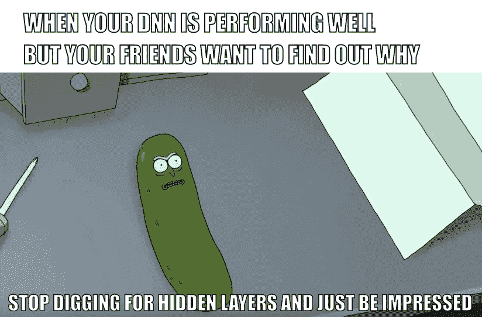

# 神经网络的随机初始化:过去的事情

> 原文：<https://towardsdatascience.com/random-initialization-for-neural-networks-a-thing-of-the-past-bfcdd806bf9e?source=collection_archive---------1----------------------->

Photo by [NASA](https://unsplash.com/@nasa?utm_source=medium&utm_medium=referral) on [Unsplash](https://unsplash.com?utm_source=medium&utm_medium=referral)

最近，神经网络已经成为我们几乎所有机器学习相关问题的*到*解决方案。这仅仅是因为神经网络有能力合成复杂的非线性，这种非线性几乎总是能神奇地给出以前不可能的精度。

在业内，神经网络被视为黑匣子。这是因为当我们从一个密集层移动到下一个密集层时，它们使用给定数据的特征来公式化越来越复杂的特征。研究人员试图研究这些复杂的特征生成过程，但迄今为止还没有太大的进展。神经网络仍然是黑匣子。

这一点正是让*深*学、*深*的原因。

courtesy: [Machine Learning Memes for Convolutional Teens,facebook](https://www.facebook.com/convolutionalmemes/)

一些研究人员也反对在自动驾驶汽车和无人机等非常重要的领域使用神经网络。他们说，与支持向量机或随机森林的决策框架相比，深度神经网络做出的决策是不合理的。如果明天出现任何问题，比如说，如果一辆自动驾驶汽车在去杂货店的路上跳下悬崖，如果是支持向量机在控制汽车的行为，那么问题背后的原因可以很容易地纠正和纠正，另一方面，由于神经网络的框架非常复杂，没有人能够预测汽车为什么跳下悬崖，为什么它会做出这个决定。

但总的来说，今天没有其他方法可以像神经网络一样准确地学习数据。神经网络是图像识别成为今天这个样子的原因。如今，复杂的卷积网络正在被制造出来，它们在识别物体方面变得越来越精确，甚至可以在这项任务中与人类竞争。

在神经网络中，每两层之间存在权重。这些权重和先前层中的值的线性变换通过非线性激活函数来产生下一层的值。这个过程在前向传播期间逐层发生，通过反向传播，可以找出这些权重的最佳值，以便在给定输入的情况下产生精确的输出。

到目前为止，机器学习工程师一直使用随机初始化的权重作为这个过程的起点。直到现在(即:2015 年)，还不知道这些权重的初始值在寻找深度神经网络成本函数的全局最小值中起到如此重要的作用

我目前正在吴恩达的 coursera 上做深度学习专业化，专业化的第二个课程涉及这些深度神经网络的超参数调整。

在我们开始前向、后向传播以找到最佳权重之前，让我们看看初始化层之间的权重的三种方式。

## 1:零初始化

## 2:随机初始化

## 3: he-et-al 初始化

# 零初始化

零初始化没有任何意义。神经网络不执行对称破坏。如果我们将所有的权重都设置为零，那么所有层的所有神经元都执行相同的计算，给出相同的输出，从而使整个深度网络变得无用。如果权重为零，整个深度网络的复杂性将与单个神经元的复杂性相同，并且预测将不会比随机更好。

> w=np.zeros((层大小[l]，层大小[l-1])

courtesy: [Machine Learning Memes for Convolutional Teens,facebook](https://www.facebook.com/convolutionalmemes/)

# 随机初始化

这有助于对称性破缺的过程，并给出更好的精度。在这种方法中，权重被初始化为非常接近零，但是随机的。这有助于打破对称性，每个神经元不再执行相同的计算。

> w = NP . random . randn(layer _ size[l]，layer_size[l-1])*0.01

courtesy: [Machine Learning Memes for Convolutional Teens,facebook](https://www.facebook.com/convolutionalmemes/)

# He-et-al 初始化

这种初始化的方法通过何等人 2015 年提交的一篇论文而出名，类似于 Xavier 初始化，因子乘以 2。在这种方法中，记住前一层的大小来初始化权重，这有助于更快更有效地获得成本函数的全局最小值。权重仍然是随机的，但是范围根据前一层神经元的大小而不同。这提供了受控的初始化，因此更快和更有效的梯度下降。

> w=np.random.randn(层大小[l]，层大小[l-1])* NP . sqrt(2/层大小[l-1])

 [## 芝加哥大学深度网络深度学习的初始化

### 提供芝加哥式的深度学习。来自芝加哥大学的深度学习博客。

deepdish.io](http://deepdish.io/2015/02/24/network-initialization/) 

阅读这篇文章以获得更多关于这个主题的信息。

通过在相同的数据上尝试所有三种初始化技术，我观察到以下情况:

# 零初始化:

15000 次迭代后的成本:0.7

精确度:0.5

# 随机初始化:

15000 次迭代后的成本:0.38

精确度:0.83

# 何等人初始化:

15000 次迭代后的成本:0.07

精确度:0.96

这本身显示了权重的初始化如何影响神经网络的性能。

看看 facebook 上的这个 rad 页面。

 [## 卷积青少年的机器学习迷因

### 卷积青少年的机器学习迷因。20K 赞。在它变深之前，我就已经在做了

www.facebook.com](https://www.facebook.com/convolutionalmemes/) 

一如既往，快乐学习。