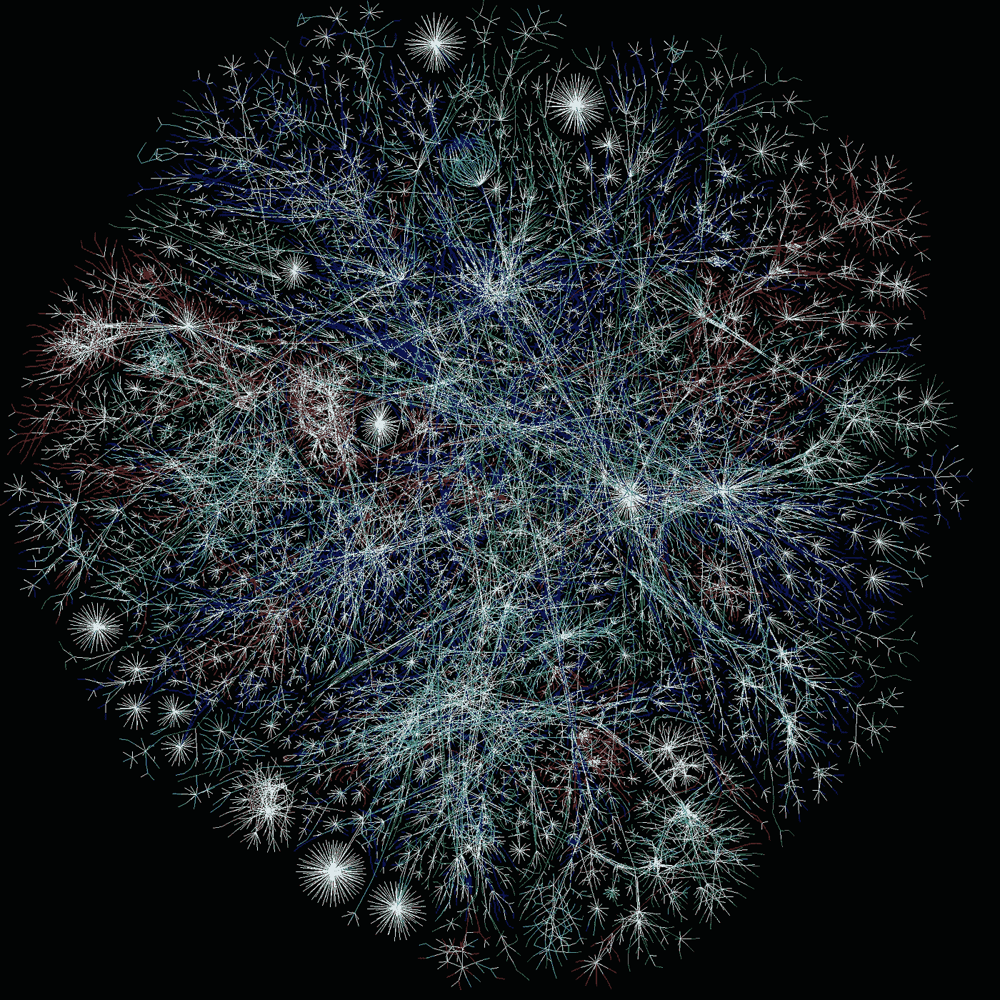
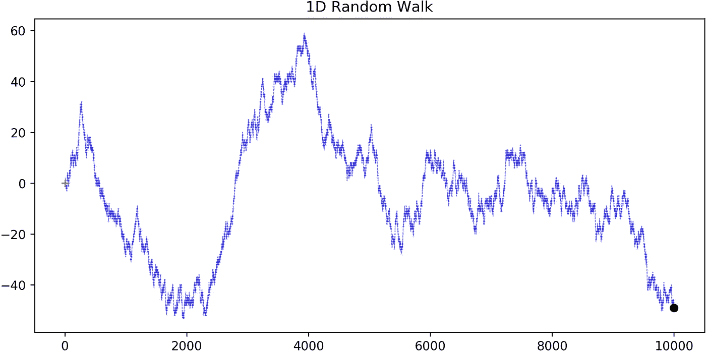
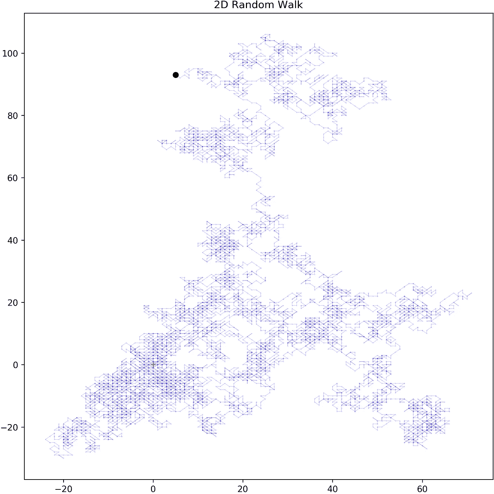
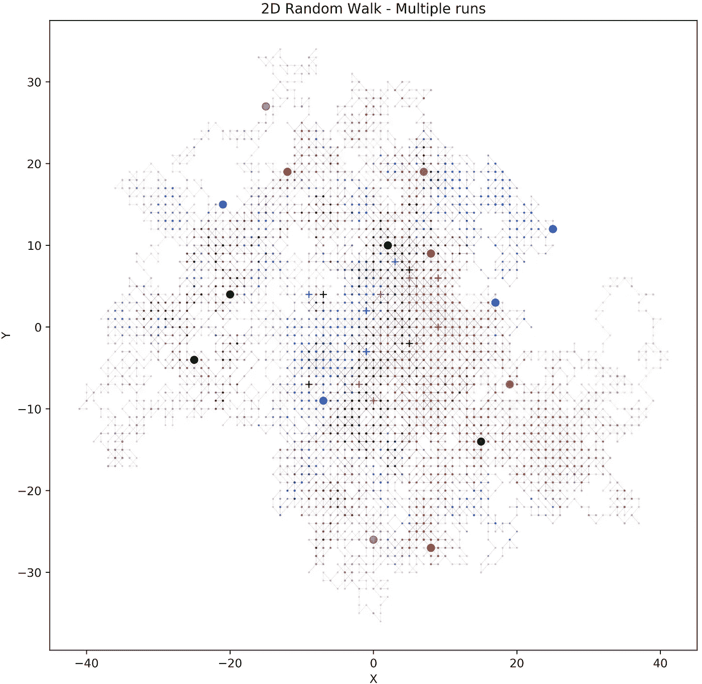
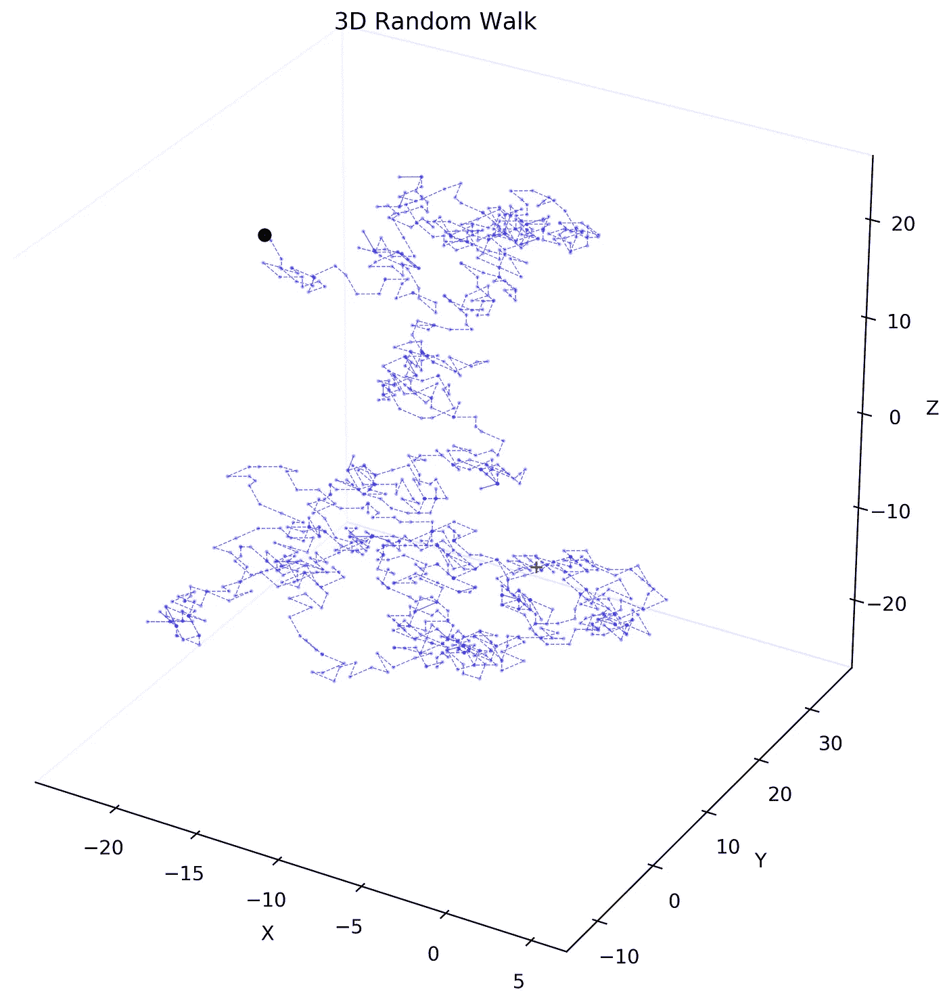
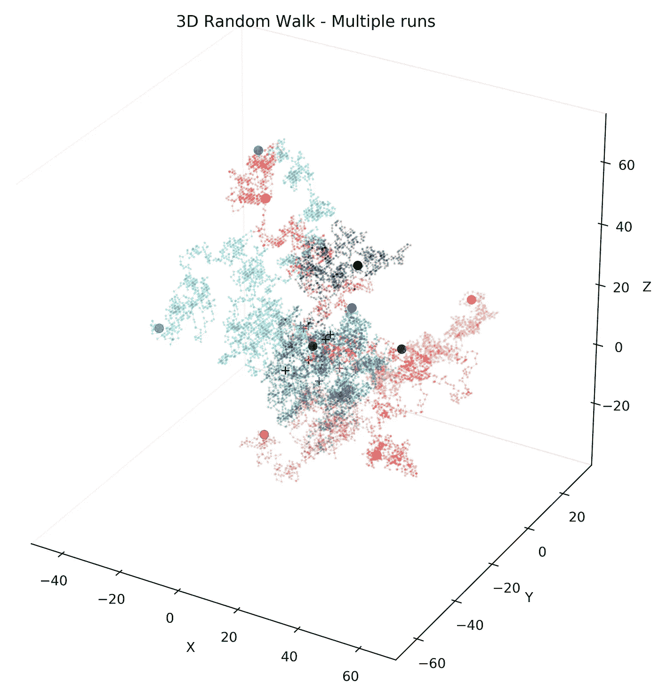

# 用 Python 模拟随机漫步

> 原文：<https://towardsdatascience.com/random-walks-with-python-8420981bc4bc?source=collection_archive---------4----------------------->

## 用 [*Numpy*](https://numpy.org) 模拟和绘制随机行走

***什么是随机漫步？***

简单地说，[随机行走](https://en.wikipedia.org/wiki/Random_walk)是以一种“随机”方式对当前状态采取连续步骤的过程。然后，可以将附加条件应用于这个基本描述，以便为您的特定用例创建随机漫步。粒子的[布朗运动](https://www.britannica.com/science/Brownian-motion)、股票行情自动收录器的[运动](https://www.investopedia.com/terms/r/randomwalktheory.asp)、[活细胞在基质中的运动](https://doi.org/10.1088/0256-307X/30/7/070501)只是现实世界中一些更为人所知的随机行走。

这里，我们模拟了从原点开始的一维、二维和三维中的简化随机行走，离散步长以相等的概率选自[-1，0，1]。起点用`+`表示，终点用`o`表示。

对于不同的应用，这些条件根据需要而改变，例如，在选定的股票价格、使用显微镜等检测的初始细胞位置开始行走，并且步骤选择通常是随机的，并且取决于来自过去数据、预测假设、被测试的假设等的附加信息。



Random Walks on networks can be used for clustering nodes too ([https://en.wikipedia.org/wiki/Internet](https://en.wikipedia.org/wiki/Internet))

***设置你的 Jupyter 笔记本:***

```
%pylab inlinefrom itertools import cycle
from mpl_toolkits.mplot3d import Axes3Dcolors = cycle(‘bgrcmykbgrcmykbgrcmykbgrcmyk’)
```

***一维随机行走:***

我们从原点 ***( y=0 )*** 开始，选择一个步长，以相等的概率移动每一个连续的步长。起点显示为红色，终点显示为黑色。累积和绘制在下图中，该图显示了在 1D 超过 10k 步的物体所遵循的路径。



```
# Define parameters for the walkdims = 1
step_n = 10000
step_set = [-1, 0, 1]
origin = np.zeros((1,dims))# Simulate steps in 1Dstep_shape = (step_n,dims)
steps = np.random.choice(a=step_set, size=step_shape)
path = np.concatenate([origin, steps]).cumsum(0)
start = path[:1]
stop = path[-1:]# Plot the pathfig = plt.figure(figsize=(8,4),dpi=200)
ax = fig.add_subplot(111)ax.scatter(np.arange(step_n+1), path, c=’blue’,alpha=0.25,s=0.05);
ax.plot(path,c=’blue’,alpha=0.5,lw=0.5,ls=’ — ‘,);
ax.plot(0, start, c=’red’, marker=’+’)
ax.plot(step_n, stop, c=’black’, marker=’o’)plt.title(‘1D Random Walk’)
plt.tight_layout(pad=0)
plt.savefig(‘plots/random_walk_1d.png’,dpi=250);
```

***二维随机行走:***

我们从原点 ***(x=0，y=0)*** 开始，在每个方向上采取随机步骤，在每个步骤中给我们 9 个可能的移动方向*(∏x，∏y)⋲{-1，0，1}* :

> (-1，-1)，(-1，0)，(-1，1)，
> (0，-1)，(0，0)，(0，1)，
> (1，-1)，(1，0)，(1，1)

10k 步以上的模拟给出了以下路径。在流体表面移动的粒子表现出 2D 随机行走，并显示如下的轨迹。



```
# Define parameters for the walkdims = 2
step_n = 10000
step_set = [-1, 0, 1]
origin = np.zeros((1,dims))# Simulate steps in 2Dstep_shape = (step_n,dims)
steps = np.random.choice(a=step_set, size=step_shape)
path = np.concatenate([origin, steps]).cumsum(0)
start = path[:1]
stop = path[-1:]# Plot the pathfig = plt.figure(figsize=(8,8),dpi=200)
ax = fig.add_subplot(111)ax.scatter(path[:,0], path[:,1],c=’blue’,alpha=0.25,s=0.05);
ax.plot(path[:,0], path[:,1],c=’blue’,alpha=0.5,lw=0.25,ls=’ — ‘);
ax.plot(start[:,0], start[:,1],c=’red’, marker=’+’)
ax.plot(stop[:,0], stop[:,1],c=’black’, marker=’o’)plt.title(‘2D Random Walk’)
plt.tight_layout(pad=0)
plt.savefig(‘plots/random_walk_2d.png’,dpi=250);
```

***模拟 2D k 次随机漫步:***



***三维随机行走:***

在体积中运动的物体是 3D 空间中随机行走的一个例子。我们从原点 ***(x=0，y=0，z=0)*** 开始，从 27 个方向*(∏x，∏y，∆z)⋲ {-1，0，1}* 中随机选择步伐:



```
# Define parameters for the walkdims = 3
step_n = 1000
step_set = [-1, 0, 1]
origin = np.zeros((1,dims))# Simulate steps in 3Dstep_shape = (step_n,dims)
steps = np.random.choice(a=step_set, size=step_shape)
path = np.concatenate([origin, steps]).cumsum(0)
start = path[:1]
stop = path[-1:]# Plot the pathfig = plt.figure(figsize=(10,10),dpi=200)
ax = fig.add_subplot(111, projection=’3d’)
ax.grid(False)
ax.xaxis.pane.fill = ax.yaxis.pane.fill = ax.zaxis.pane.fill = False
ax.set_xlabel(‘X’)
ax.set_ylabel(‘Y’)
ax.set_zlabel(‘Z’)ax.scatter3D(path[:,0], path[:,1], path[:,2], 
             c=’blue’, alpha=0.25,s=1)
ax.plot3D(path[:,0], path[:,1], path[:,2], 
          c=’blue’, alpha=0.5, lw=0.5)
ax.plot3D(start[:,0], start[:,1], start[:,2], 
          c=’red’, marker=’+’)
ax.plot3D(stop[:,0], stop[:,1], stop[:,2], 
          c=’black’, marker=’o’)
plt.title(‘3D Random Walk’)
plt.savefig(‘plots/random_walk_3d.png’,dpi=250);
```

***3D 模拟 k 次随机行走:***

现在我们在 3D 中模拟多个随机行走。每一次随机行走代表一个点源的运动，该点源与从 *(x，y，z) ⋲ [-10，10]* 中选择的点同时开始。

一些细胞/粒子在没有任何持续方向力的情况下移动，会显示出这样的轨迹。三维随机漫步的一个有趣的方面是，即使起点很近，随着时间的推移，物体会散开。



Simulating multiple random walks in the same 3D space

```
# Define parameters for the walkdims = 3
n_runs = 10
step_n = 1000
step_set = [-1, 0 ,1]
runs = np.arange(n_runs)
step_shape = (step_n,dims)# Plotfig = plt.figure(figsize=(10,10),dpi=250)
ax = fig.add_subplot(111, projection=’3d’)
ax.grid(False)
ax.xaxis.pane.fill = ax.yaxis.pane.fill = ax.zaxis.pane.fill = False
ax.set_xlabel(‘X’)
ax.set_ylabel(‘Y’)
ax.set_zlabel(‘Z’)

for i, col in zip(runs, colors): # Simulate steps in 3D origin = np.random.randint(low=-10,high=10,size=(1,dims))
    steps = np.random.choice(a=step_set, size=step_shape)
    path = np.concatenate([origin, steps]).cumsum(0)
    start = path[:1]
    stop = path[-1:] # Plot the path ax.scatter3D(path[:,0], path[:,1], path[:,2],
                 c=col,alpha=0.15,s=1);
    ax.plot3D(path[:,0], path[:,1], path[:,2], 
              c=col, alpha=0.25,lw=0.25)
    ax.plot3D(start[:,0], start[:,1], start[:,2],
              c=col, marker=’+’)
    ax.plot3D(stop[:,0], stop[:,1], stop[:,2],
              c=col, marker=’o’);

plt.title(‘3D Random Walk - Multiple runs’)
plt.savefig(‘plots/random_walk_3d_multiple_runs.png’,dpi=250);
```

在这篇文章中，我们讨论了如何在 1D、2D 和 3D 中模拟一次基本的随机漫步。我们可以使用不同的方法对群体表现出的随机游走进行描述性分析*(距离、位移、速度、速率、角度分布、指示器计数、限制比等)*。我们还可以模拟和讨论有向/有偏随机行走，其中下一步的方向取决于当前位置，这是由于某种形式的现有梯度或定向力。