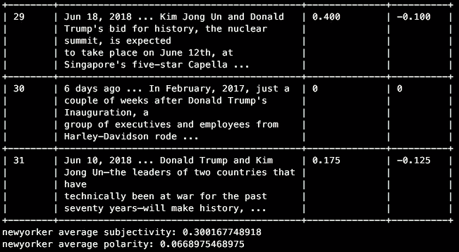

# Python 中的新闻倾向性排名

> 原文：<https://towardsdatascience.com/ranking-news-bias-in-python-e9bb5d1ba93f?source=collection_archive---------8----------------------->

我最近在《华盛顿邮报》上读到一篇文章，标题是[“根据受众对媒体进行从自由到保守的排序”](https://www.washingtonpost.com/news/the-fix/wp/2014/10/21/lets-rank-the-media-from-liberal-to-conservative-based-on-their-audiences/?noredirect=on&utm_term=.592ab216ff0a)。启发我根据新闻网站在特定主题上的主观性和极性对其进行排名，在这个例子中，是唐纳德·特朗普。


Photo by [rawpixel](https://unsplash.com/photos/UrA0VtUAgmo?utm_source=unsplash&utm_medium=referral&utm_content=creditCopyText) on [Unsplash](https://unsplash.com/search/photos/newspapers-bias?utm_source=unsplash&utm_medium=referral&utm_content=creditCopyText)

我用 Python 调出了以下新闻网站中包含关键词“特朗普”的 30 篇最新文章(从《华盛顿邮报》文章的自由派到保守派):

1.  纽约市人
2.  噪声功率比(noise power ratio)
3.  美国有线新闻网；卷积神经网络
4.  福克斯新闻频道
5.  德鲁吉报告
6.  布莱巴特

然后对文章的描述进行文本分析，以返回一个列表，其中列出了文章的主观程度(或固执己见)以及极性(作者对特朗普的感觉是积极还是消极)。通过这样做，我可以得出一个新闻网站的(非常基本的)排名，显示他们对我们的总统有多么偏见，以及他们对他的看法如何。有了这个，我就可以和《华盛顿邮报》的文章进行比较，看新闻来源与哪个政治派别联系最紧密，哪个最有偏见。

# 进口

为了搜索 google，我使用了[这个库](https://github.com/MarioVilas/googlesearch)、 [TextBlob](https://textblob.readthedocs.io/en/dev/) 进行文本分析，使用 [TextTable](https://pypi.org/project/texttable/) 在终端中显示结果。

```
from google import google
from textblob import TextBlob
import texttable as tt
from time import sleep
```

# 搜索

为了获得和分析来自不同网站的文章，我使用了 [Google Dork searches](https://whatis.techtarget.com/definition/Google-dorkhttps://whatis.techtarget.com/definition/Google-dork) ，它允许你搜索特定网站的关键词(以及其他许多东西)。例如，您可以键入

```
inurl:medium.com intext:python
```

以便只从提到 python 的中型网站返回搜索结果。


我创建了一个名为`search`的函数，它接受您正在搜索的站点的参数和要搜索的关键字。然后将变量`search_results`设置为使用站点和关键字参数的 Google Dork 搜索，我们就可以收集文章了。

然后，我创建了一个`search_results_list`、`subjectivity_list`和一个`polarity_list`，以便稍后追加结果。创建`num`列表只是让文章按照它们在文本表格中出现的顺序编号。

```
def search(site, search):
 site = site
 search = search
 num_page = 3
 search_results = google.search(“inurl:” + site + “ intext:” + search, 3)
 search_results_list = []
 subjectivity_list = []
 polarity_list = []
 num = []
 number = 1
```

# 情感分析

下一步是确定给定文章的主观性和极性。这可以通过在搜索结果上调用`result.description`方法来完成，然后将其附加到`search_results_list.`

通过设置 TextBlob，将`search_results`作为变量`analysis`，可以对文章进行基本的情感分析。运行`analysis.sentiment.subjectivity`获得结果的主观性，运行`analysis.sentiment.polarity`返回极性。将这些结果附加到各自的列表中。

```
for result in search_results:
 search_results = result.description
 search_results_list.append(search_results) analysis = TextBlob(search_results)
 subjectivity = analysis.sentiment.subjectivity
 subjectivity_list.append(subjectivity)
 polarity = analysis.sentiment.polarity
 polarity_list.append(polarity)
 number = number + 1
 num.append(number)
 sleep(5)
```

# 文本表格

为了创建表格，创建一个新变量`tab`，并将其设置为等于`tt.Texttable()`。然后写出你的标题，我用了数字、结果、主观性和极性。

```
tab = tt.Texttable()
headings = [‘Number’,’Results’,’Subjectivity’, ‘Polarity’]
tab.header(headings)
```

然后运行一个`for`循环，将列表中的每个元素作为一行添加到表中。

```
for row in zip(num, search_results_list, subjectivity_list, polarity_list):
 tab.add_row(row)
```

采用主观性和极性列表，我们可以找到每个新闻源的平均值，然后我们可以将它与给定的网站、搜索结果和表格一起打印出来。

```
avg_subjectivity = (sum(subjectivity_list) / len(subjectivity_list))
avg_polarity = (sum(polarity_list) / len(polarity_list))table = tab.draw()
print site
print search
print table
print (site + “ average subjectivity: “ + str(avg_subjectivity))
print (site + “ average polarity: “ + str(avg_polarity))
```

# 调用函数

最后，您必须为每个新闻站点调用`search`函数。

```
search(“newyorker”, “trump”)
search(“npr”, “trump”)
search(“cnn”, “trump”)
search(“foxnews”, “trump”)
search(“drudgereport”, “trump”)
search(“breitbart”, “trump”)
```

就是这样！

# 结果

运行该脚本，终端输出将如下所示:



显示站点、文章数量、文章描述、每篇文章的主观性和极性，然后显示站点的平均值。

网站各自主观评价的平均值如下(从最客观到最主观的顺序):

1.  NPR (0.21)
2.  福克斯新闻频道(0.23)
3.  CNN (0.25)
4.  《纽约客》( 0.27)
5.  布莱巴特(0.34)
6.  德拉吉报告(0.36)

毫不奇怪，NPR 是最客观的新闻来源，而《德拉吉报道》和布莱巴特在特朗普问题上最固执己见。然而，福克斯新闻频道在客观性上排名第二的事实让我很惊讶。

极性的排名同样令人惊讶，数值越接近-1 越负，越接近 1 越正。

1.  福克斯新闻频道(0.04)
2.  NPR (0.05)
3.  CNN (0.07)
4.  《纽约客》( 0.07)
5.  德拉吉报告(0.11)
6.  布莱巴特(0.12)

福克斯新闻频道再一次让我吃惊，在 30 篇文章中，他对川普的负面看法最多。在那之后，新闻来源如预期的那样一致。非常有趣的是，最高的正平均值仅仅在零以上！我预计德拉吉报告和布莱巴特至少在 0.6 的范围内。

布莱巴特在一篇文章上记录了 0.8 的最积极情绪，然而，它也有 0.4 的最消极情绪。这让我相信布莱巴特的文章比它的同行使用了更多的内涵语言。布莱巴特在主观性方面排名第二的事实支持了这一点。

# 最后的想法

显然，这是一个非常基本的排名，不应该被视为真理，因为一个非常小和有限的(仅使用描述，而不是全文)数据集。

我看到了邮报的文章，并认为这将是一个有趣的实验，运行并查看结果。希望你喜欢！

这里是 Github 上的完整源代码

查看我的其他 Python 文章:

[](https://medium.freecodecamp.org/creating-a-twitter-bot-in-python-with-tweepy-ac524157a607) [## 使用 Tweepy 在 Python 中创建一个 Twitter 机器人

### Twitter 大约有 15%是由机器人组成的，我想尝试一下。我谷歌了如何创建一个推特机器人…

medium.freecodecamp.org](https://medium.freecodecamp.org/creating-a-twitter-bot-in-python-with-tweepy-ac524157a607) [](https://medium.freecodecamp.org/basic-data-analysis-on-twitter-with-python-251c2a85062e) [## 基于 Python 的 Twitter 基础数据分析

### 在使用 Tweepy 和 Python 以及这段代码创建了免费的 Wtr bot 之后，我想用一种方式来看看 Twitter 用户是如何…

medium.freecodecamp.org](https://medium.freecodecamp.org/basic-data-analysis-on-twitter-with-python-251c2a85062e)