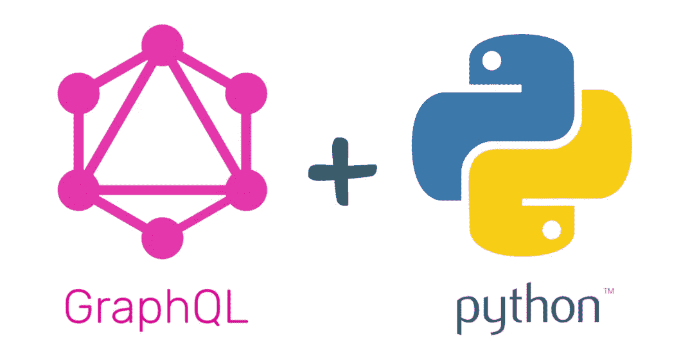
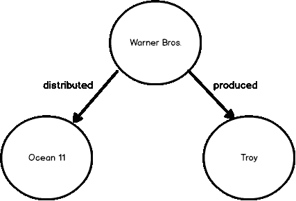
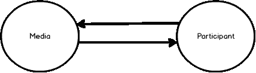
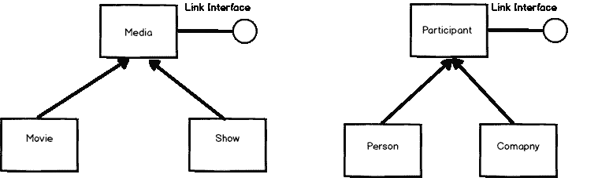
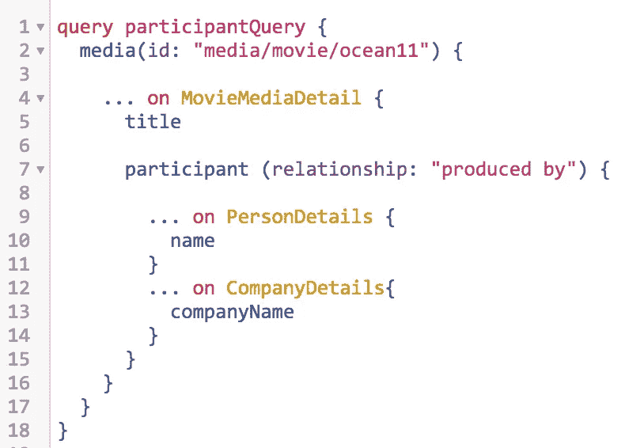
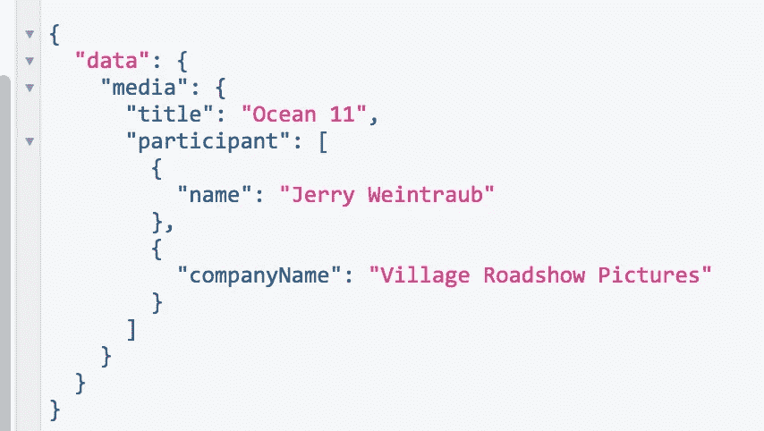
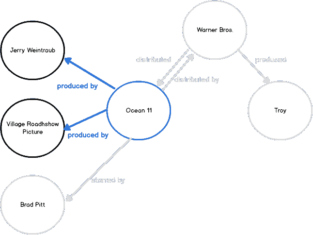
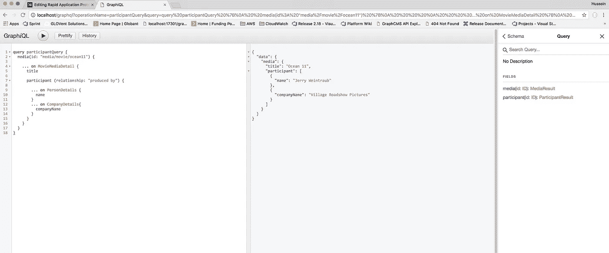
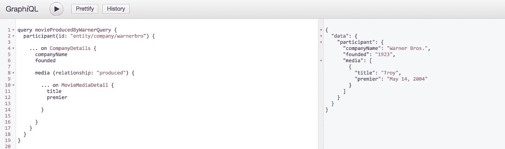
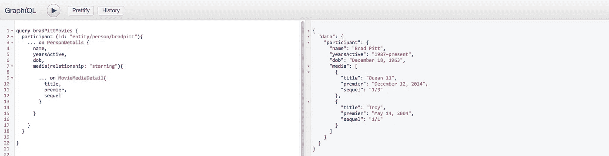

# 使用 GraphQL 的快速应用原型——一种思考数据和 API 设计的不同方式

> 原文：<https://towardsdatascience.com/rapid-application-prototyping-using-graphql-a-different-way-of-thinking-about-your-data-and-api-f93faadad421?source=collection_archive---------6----------------------->



***标签*** *: GraphQL，Graphene，Python，Docker。*

# Python-石墨烯框架中的多态性

这篇文章的主要目的是说明如何使用 **Python-Graphene** 框架([https://github.com/graphql-python/graphene](https://github.com/graphql-python/graphene))来构建 GraphQL 端点。具体来说，它说明了在表示数据时使用**石墨烯**中的**联合**和**接口**构造来模拟**多态性**。

> 这个项目的源代码可以在 GitHub 上找到(下面的链接)。按照 README 中的说明在 docker 容器中运行该示例。

[](https://github.com/husseinmoghnieh/graphql-polymorphism) [## husseinmoghnieh/graph QL-多态性

### GitHub 是人们构建软件的地方。超过 2800 万人使用 GitHub 来发现、分享和贡献超过…

github.com](https://github.com/husseinmoghnieh/graphql-polymorphism) 

# 介绍

GraphQL 是一种查询语言，它使数据的消费者(即前端/ UI)能够通过单个 API 端点查询数据。这是一种不同于使用 RESTful 端点的方法，在 RESTful 端点中，每个端点都是针对特定于服务的功能定制的，并且具有固定的响应结构。

在 RESTful API 设计中，产品需求被转化为一组 API，这些 API 主要在数据存储上执行 CRUD(创建、读取、更新和删除)操作。这个过程非常耗时，尤其是当目标是提供一个原型时。GraphQL 可以加速应用程序原型化的过程，因为它提供了一个 API 端点，充当 UI 和数据存储之间的数据代理。

我将带您去看这篇博客文章，这篇文章很容易说明 RESTful 和 graphQL 端点之间的区别。

[](https://blog.apollographql.com/graphql-vs-rest-5d425123e34b) [## GraphQL 与 REST

### 通过 HTTP 发送数据的两种方式:有什么区别？

blog.apollographql.com](https://blog.apollographql.com/graphql-vs-rest-5d425123e34b) 

总体而言，GraphQL 在以下情况下具有优势:

*   数据自然地以图表的形式出现
*   快速原型制作。一个服务于所有查询场景的 API
*   代表问题域的所有实体之间的多种关系

# 电影行业——图表示例

选择以电影行业为例来展示 GraphQL 的强大之处，是因为在这个行业中，任何类型的制作都涉及许多实体的参与，每个实体在作品制作中都有不同的角色，包括演员、作家、制片人等..制作公司和流媒体服务。因此，这个问题可以用图形来表示。

这篇文章的其余部分解释了完全工作的 GraphQL 示例的组件。

**下一个:**

*   数据表示法
*   模式设计
*   密码
*   查询示例

# 数据表示法

让我们假设电影业中每个实体的信息都以 JSON 格式存储，如下所示，为了简单起见，数据保存在磁盘上。该解决方案可以很容易地扩展到从任何数据源获取数据(关系数据库、NoSQL、S3，甚至更好图形数据库)。

华纳兄弟公司:

```
{
  "id": "company/production/warnerbro",
  "companyName": "Warner Bros.",
  "established" : 1923,
  "type": "company",
  "links": [
    {
      "relationship": "distributed",
      "target": "media/movie/ocean11"
    },
    {
      "relationship": "produced",
      "target": "media/movie/troy"
    }
  ]
}
```

上面显示了与*(简体)相关的数据及其与两部电影(*特洛伊*和*海洋 11* )的关系。华纳兄弟生产了第一种，发行了第二种。图形表示:*

**

*另一方面*海洋 11(电影)*，可以这样表示(简化):*

```
*{
  "id": "media/movie/ocean11",
  "title": "Ocean 11",
  "premier": "December 12, 2014",
  "sequel" : "1/3",
  "links": [
    {
      "relationship": "distributed by",
      "target": "entity/company/WarnerBro"
    },
    {
      "relationship": "produced by",
      "target": "entity/person/JerryWeintraub"
    },
    {
      "relationship": "produced by",
      "target": "entity/company/VillageRoadshow"
    },
    {
      "relationship": "starred",
      "target": "entity/person/BradPitt"
    }
  ]
}*
```

**华纳兄弟*和*海洋 11* 的集合图形表示为:*

**

# *模式设计*

*用面向对象的术语来说，我们可以将上述实体分为两大类。一个我们称之为**媒体**，代表电影、表演等..另一个我们称之为**参与者**，代表一个人或一家公司。一个人可以是制片人、发行人、演员、作家等，一个公司可以是制作公司、发行人、流媒体公司等*

**

*将上述实体扩展为子类会产生下面的类图。同样，这个博客的范围是处理几种类型的**媒体**和**参与者**。*

**

## *简单的例子*

*在深入研究技术细节之前，让我展示一个示例 GraphQL 查询及其相应的输出:*

***样本查询:***

**

*内容如下:*

*   *找到媒体*海洋 11**
*   *如果媒体是一部电影，则显示其**标题**并查找其**参与者**中有**关系的**"制作的*
*   ***对于**参与者**满足产生的条件**，如果参与者是**人**则显示**名称**，如果**参与者**是**公司**则显示**公司名称*******

***输出结构映射输入结构，如下所示。***

*****输出:*****

******

***这实质上是显示下面突出显示的图形节点的内容***

******

# ***密码***

## ***1 —链接接口***

***我将从表示实体间链接的代码(即链接接口)开始。该接口由所有类实现。***

## ***2-参与者接口和参与者实体***

***以下代码包含由所有**参与者**类实现的**参与者**接口。***

***注意，每个类都实现了**参与者接口**和**链接接口**。最后，一个名为 **ParticipantResult** 的附加类充当占位符，聚合通过解析不同类型的参与者(即 PersonDetails 和 CompanyDetails)而产生的对象。***

***在面向对象中，结果类类似于声明一个保存父类类型对象的数组。例如，在 Java 中，这大致翻译为:***

```
***List<**Participant**> participantResult = new ArrayList<**Participant**>();
participantResult.add(**companyDetails**)
participantResult.add(**personDetails**)***
```

## ***3 —媒体接口和媒体实体***

***下面是媒体接口和相关实体的代码。***

## ***4-查询模式定义***

***在定义了表示存储数据的所有类之后，定义了一组查询(**媒体**查询和**参与者**查询)。然后，使用定义的查询初始化模式，如下所示***

## ***4- API GraphQL 端点***

***下面所有的代码都是配置一个 FLASK，启动一个 FALSK 应用。公开上面的**模式**的代码在第 29 行:***

```
***app.add_url_rule('/graphql', view_func=GraphQLView.as_view
('graphql', schema=schema, graphiql=True))***
```

# ***使用 Docker 运行***

***要运行这个示例，只需下载项目并运行:***

```
***docker-compose builddocker-compose up***
```

***将您的浏览器指向[http://localhost/graphql](http://localhost/graphql)和 **Graphene** 提供了一个交互式界面，允许您编写和执行 graph QL 查询。它还提供了一个**模式**浏览器(最右边)。***

******

# ***GraphQL 查询示例***

## ***显示华纳兄弟制作的所有电影。***

******

## ***显示布拉德·皮特主演的所有电影***

******