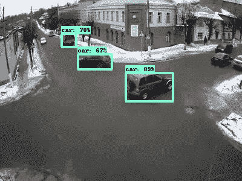
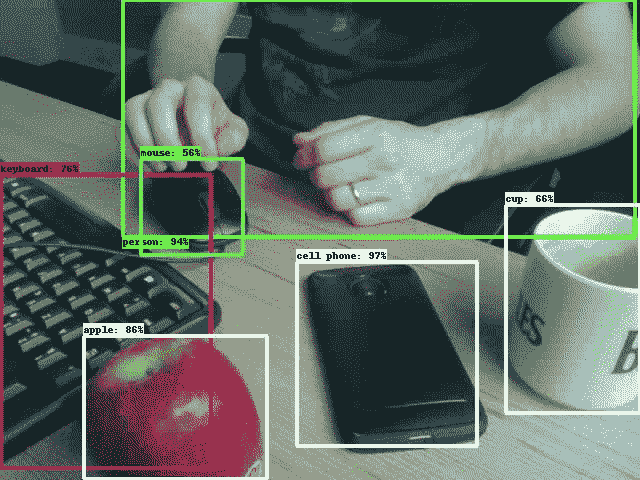

# 使用 Tensorflow，OpenCV 和 Docker 的实时和视频处理对象检测。

> 原文：<https://towardsdatascience.com/real-time-and-video-processing-object-detection-using-tensorflow-opencv-and-docker-2be1694726e5?source=collection_archive---------0----------------------->

在本文中，我将介绍如何在 Docker 容器中使用 Tensorflow 对象检测 API 来执行实时(网络摄像头)和视频后处理。我使用 OpenCV 和 python3 多处理和多线程库。

我将把重点放在我遇到的障碍，以及我找到了什么解决方案(或者没有！).完整的代码在我的 Github 上。



Video processing test with Youtube video

# 动机

我从[这篇优秀的 Dat Tran 文章](/building-a-real-time-object-recognition-app-with-tensorflow-and-opencv-b7a2b4ebdc32)开始探索实时对象检测的挑战，引导我用 [Adrian Rosebrock 的网站](https://www.pyimagesearch.com/2015/12/21/increasing-webcam-fps-with-python-and-opencv/)研究 python 多处理库来增加 FPS。为了进一步增强可移植性，我想将我的项目集成到 Docker 容器中。这里的主要困难是处理进入和来自容器的视频流。

此外，我在我的项目中添加了一个视频后处理功能，也使用了多处理来减少处理时间(当使用原始 Tensorflow 对象检测 API 时，处理时间可能会非常非常长)。

在我的个人笔记本电脑上，仅使用 8GB CPU，实时和视频处理都可以高性能运行。

# 数据科学码头工人

我不会花时间描述 Tensorflow 对象检测 API 实现，因为关于这个主题的文章很多。相反，我将展示如何在我作为数据科学家的日常工作中使用 Docker。请注意，我使用了 Tensorflow 的经典 [ssd_mobilenet_v2_coco](https://github.com/tensorflow/models/blob/master/research/object_detection/g3doc/detection_model_zoo.md) 模型，以获得速度性能。我复制了这个模型。pb 文件)和相应的本地标签映射(在模型/目录中)以保持以后使用个人模型的可能性。

我相信今天使用 Docker 已经成为数据科学家的一项基本技能。在数据科学和机器学习领域，每周都会发布许多新的算法、工具和程序，将它们安装到您的计算机上进行测试是让您的操作系统崩溃的最佳方式(有经验的！).为了防止这种情况，我现在使用 Docker 容器来创建我的数据科学工作区。

你可以在我的知识库中找到我正在为这个项目工作的 docker 文件。下面是我如何安装 Tensorflow 对象检测(遵循[官方安装指南](https://github.com/tensorflow/models/tree/master/research/object_detection)):

```
# Install tensorFlow
RUN pip install -U tensorflow# Install tensorflow models object detection
RUN git clone [https://github.com/tensorflow/models](https://github.com/tensorflow/models) /usr/local/lib/python3.5/dist-packages/tensorflow/models
RUN apt-get install -y protobuf-compiler python-pil python-lxml python-tk#Set TF object detection available
ENV PYTHONPATH "$PYTHONPATH:/usr/local/lib/python3.5/dist-packages/tensorflow/models/research:/usr/local/lib/python3.5/dist-packages/tensorflow/models/research/slim"
RUN cd /usr/local/lib/python3.5/dist-packages/tensorflow/models/research && protoc object_detection/protos/*.proto --python_out=.
```

同样，我安装了 OpenCV:

```
# Install OpenCV
RUN git clone [https://github.com/opencv/opencv.git](https://github.com/opencv/opencv.git) /usr/local/src/opencv
RUN cd /usr/local/src/opencv/ && mkdir build
RUN cd /usr/local/src/opencv/build && cmake -D CMAKE_INSTALL_TYPE=Release -D CMAKE_INSTALL_PREFIX=/usr/local/ .. && make -j4 && make install
```

图像构建有点长，需要几分钟时间。然后，使用它是快速和容易的。

# 实时目标检测

我首先尝试应用对象检测到我的网络摄像头流。这项工作的主要部分在 [Dat Tran 的文章](/building-a-real-time-object-recognition-app-with-tensorflow-and-opencv-b7a2b4ebdc32)中有完整的描述。困难在于将网络摄像头流发送到 docker 容器中，并使用 X11 服务器恢复输出流以显示它。

## 将视频流发送到容器中

在 Linux 中，设备位于/dev/目录中，可以作为文件进行操作。通常，您的笔记本电脑网络摄像头是“0”设备。要将其流发送到 docker 容器中，在运行 docker 映像时使用*设备*参数:

```
docker run --device=/dev/video0
```

对于 Mac 和 Windows 用户来说，将网络摄像头流发送到容器中的方式不像 Linux 那样简单(尽管 Mac 是基于 Unix 的)。我没有深入研究这个问题，但是 Windows 用户的解决方案是使用虚拟盒子来启动 docker 容器。

## 从容器中恢复视频流

这是我花了一些时间解决的问题(解决方案不令人满意)。我在 Docker [这里](http://wiki.ros.org/docker/Tutorials/GUI)找到了关于使用图形用户界面的有用信息，特别是将容器连接到主机的 X 服务器进行显示。

首先，您必须公开您的 xhost，这样容器就可以通过 X11 unix 套接字读写来正确显示。首先设置 X 服务器主机的权限(这不是最安全的方法)让 docker 访问它:

```
xhost +local:docker
```

然后，当您使用完项目后，将访问控制恢复为默认值:

```
xhost -local:docker
```

然后，创建两个环境变量 XSOCK 和 XAUTH:

```
XSOCK=/tmp/.X11-unix
XAUTH=/tmp/.docker.xauth
```

第一个引用 X11 Unix 套接字，第二个引用我们现在创建的具有适当权限的 X 身份验证文件:

```
xauth nlist $DISPLAY | sed -e 's/^..../ffff/' | xauth -f $XAUTH nmerge -
```

最后，我们只需更新 docker 运行行命令。我们转发我们的 DISPLAY 环境变量，为 X11 Unix 套接字和 X 身份验证文件挂载一个卷，该文件带有一个名为 XAUTHORITY 的环境变量，它链接到:

```
docker run -it --rm --device=/dev/video0 -e DISPLAY=$DISPLAY -v $XSOCK:$XSOCK -v $XAUTH:$XAUTH -e XAUTHORITY=$XAUTH
```

现在我们可以运行 docker 容器了，它已经完成了:



Me with common objects at work (I’m a shy person).

尽管主机的 X 服务器配置，我不能完全删除我的代码中似乎是一个错误。OpenCV 需要通过使用 *cv2.imshow* 函数调用 python 脚本( *init-openCV.py* )进行“初始化”。我得到以下错误消息:

```
The program 'frame' received an X Window System error.
```

然后，可以调用主 python 脚本( *my-object-detection.py* )并且视频流被很好地发送到主机显示器。我对使用第一个 python 脚本来初始化 X11 系统的解决方案不是很满意，但是到目前为止我还没有找到任何解决这个问题的方法。

编辑:我终于(而且不小心！)通过使用 OpenCV (3.4.1)的稳定版本，而不是在本地克隆 git repo，找到了这个问题的解决方案。因此，现在不需要在主 python 脚本之前调用 *init-openCV.py* 。

# 视频处理

为了设法用我的网络摄像头实时运行对象检测 API，我使用了*线程*和*多处理* python 库。一个线程被用来读取网络摄像头流。帧被放入队列中，由一组工作线程(Tensorflow 对象检测在其中运行)进行处理。

出于视频处理的目的，不可能使用线程，因为在工人能够对放入输入队列的第一个帧应用对象检测之前，所有视频的帧都被读取。输入队列已满时读取的帧会丢失。也许使用大量工作人员和庞大的队列可以解决这个问题(计算成本高得令人望而却步)。

简单队列的另一个问题是，由于不断变化的分析时间，帧在输出队列中的发布顺序不同于在输入队列中的顺序。

为了增加我的视频处理功能，我移除了读取帧的线程。相反，我使用下面几行代码来读取帧:

```
while True:
  # Check input queue is not full
  if not input_q.full():
     # Read frame and store in input queue
     ret, frame = vs.read()
      if ret:            
        input_q.put((int(vs.get(cv2.CAP_PROP_POS_FRAMES)),frame))
```

如果输入队列未满，则从视频流中读取下一帧并放入队列。否则，当帧没有从输入队列中获取时，什么也不做。

为了解决帧顺序的问题，我使用了一个优先级队列作为第二个输出队列:

1.  读取帧并将其与相应的帧编号一起放入输入队列(实际上，一个 python 列表对象被放入队列)。
2.  然后，工人从输入队列中取出帧，对它们进行处理，并将其放入第一个输出队列中(仍然使用它们的相对帧号)。

```
while True:
  frame = input_q.get()frame_rgb = cv2.cvtColor(frame[1], cv2.COLOR_BGR2RGB)
  output_q.put((frame[0], detect_objects(frame_rgb, sess, detection_graph)))
```

3.如果输出队列不为空，则帧被提取并放入优先级队列，其对应的帧号作为优先级号。优先级队列的大小被任意设置为其它队列大小的三倍。

```
# Check output queue is not empty
if not output_q.empty():
  # Recover treated frame in output queue and feed priority queue
  output_pq.put(output_q.get())
```

4.最后，如果输出优先级队列不为空，则采用优先级最高的帧(优先级最小的帧)(这是标准优先级队列)。如果先前对应于预期的帧号，则该帧被添加到输出视频流(并且如果需要的话写入)，否则该帧被放回到优先级队列中。

```
# Check output priority queue is not empty
  if not output_pq.empty():
    prior, output_frame = output_pq.get()
    if prior > countWriteFrame:
      output_pq.put((prior, output_frame))
    else: 
      countWriteFrame = countWriteFrame + 1    
      # Do something with your frame
```

为了停止这个过程，我检查了所有的队列都是空的，并且所有的帧都已经从视频流中提取出来:

```
if((not ret) & input_q.empty() & 
    output_q.empty() & output_pq.empty()):
  break
```

# 结论

在本文中，我将介绍如何使用 docker 通过 Tensorflow 实现一个实时对象检测项目。如上所述，docker 是测试新数据科学工具以及打包我们向客户交付的解决方案的最安全方式。我还向您展示了我是如何改编 Dat Tran 的原始 python 脚本来执行多处理视频处理的。

如果你从头到尾看完这篇文章，谢谢你！正如你所看到的，这个项目有很多可能的改进。不要犹豫给我一些反馈，我总是渴望得到建议或意见。