# 在 python 中监视子编辑的实时机器人。

> 原文：<https://towardsdatascience.com/real-time-bot-for-monitoring-subredditts-in-python-691cc692fdb5?source=collection_archive---------26----------------------->

大家好，Reddit 是美国最大的社交新闻聚合之一。所有成员都可以在相关的[子编辑](https://www.reddit.com/subreddits/)中发表任何内容。如果你有一个被很多人使用的产品，那么了解他们对这个产品的感受是非常重要的。facebook、Twitter、reddit 等社交媒体平台。是人们使用最广泛的方法之一。Reddit 也是一个论坛，人们可以谈论和讨论任何事情。几乎所有的产品，无论是微软 Azure 还是 AWS，都有与用户交流的子界面。那么，如果你想了解用户的情绪，并从子编辑中获得所有负面的标题，以便你可以相应地改进产品，或者如果你想与用户实时互动，该怎么办呢？在这里，我将解释如果任何用户开始对与你相关的产品进行负面讨论，你如何通过标题的 URL 链接获得通知。

现在，除此之外，假设您还希望看到一个时间序列图，显示用户对您的产品进行负面评价的频率，并且您希望以某种形式显示出来，以便您可以看到有多少负面标题，有多少人对这些标题投了赞成票，以及有多少人参与了这些标题。

我想现在你一定已经知道我想要达到的目标了。假设你是一家为 PUBG、堡垒之夜、使命召唤、坦克世界等大型游戏提供语音服务的公司，你想知道人们在网上对语音服务的讨论。如果很多人投票赞成一个标题，那么这意味着它是一个普通的问题，你可以实时处理它。但是如果只有很少的投票，那么问题可能出在用户端，比如速度慢之类的。

那么，让我们开始吧。

1.)首先，我们需要像下面这样的一些细节，可以通过在 twitter 上创建并遵循【https://redditclient.readthedocs.io/en/latest/oauth/
T2 的指示。你可以使用自己的 reddit 帐户，因为没有必要使用官方 vivox 帐户，我不知道我们是否有任何官方 reddit 帐户。

**客户端标识** = '客户端标识'，\

**客户端秘密** = '客户端秘密'，\

**用户代理** = '用户代理'，\

**用户名** = '用户名'，\

**密码**=‘密码’

2.)要与 slack 交互，我们需要创建一个 slack bot API，您可以按照下面的说明创建它:-

松弛 API= ' xox b-44323424–234324243-dfsdfdsfsf '

3.)我们还将维护一个 csv 文件，在该文件中，我们将以如下格式维护客户 twitter 名称信息:-

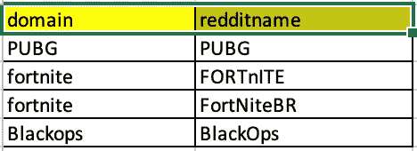

4.)我们需要一些库来设置整个过程。因此，请将以下库安装到您的环境中:-

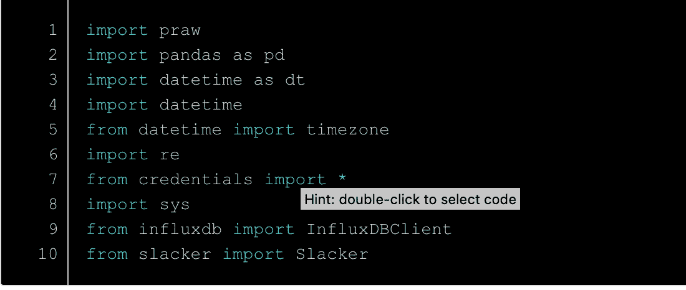

5.)之后，我们将使用 praw 方法设置 reddit，因为 praw 是与 reddit 数据交互的 api。如果你想了解更多关于 praw 的信息，请点击这里[https://praw.readthedocs.io/en/latest/](https://praw.readthedocs.io/en/latest/)。

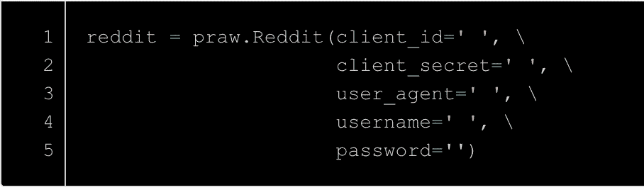

6.)然后我们将 CSV 文件读入熊猫的数据帧。CSV 文件包含子编辑的所有细节，如果您需要添加或删除任何子编辑，您可以在 CSV 文件中完成，无需编辑 python 脚本。

7.)之后，由于我们是动态进行的，所以我们将创建两个变量，一个是读取子编辑名称，另一个是客户端名称。

8.)现在，我们将阅读子编辑的标题。因为我们在这里构建一个动态机器人，所以我们将只阅读新的标题，为此我们将遵循下面的代码行。在这里，我们首先将 subreddit 的名称放入一个变量 subreddit 中，然后我们在这里只读取新的注释。我已经通过了这里的限制= 1000，你也可以不通过，但你将无法获得超过 1000 个标题，默认为 100。

9.)那么，如果你需要所有的历史头条呢。我们在这里不需要它，但是如果你想下载所有的，你可以使用 pushshiftapi(【https://github.com/pushshift/api】T2)

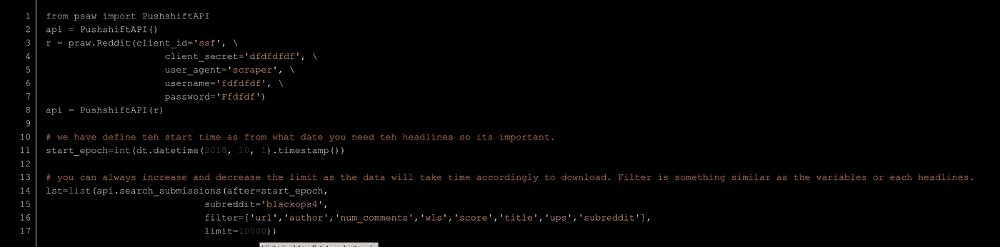

10.)现在我们将为我们将从 reddit 中读取的键创建一个字典。reddit 提供了 95 种不同的值，但我们并不需要所有的值。按照我们的要求，我正在使用下面的。

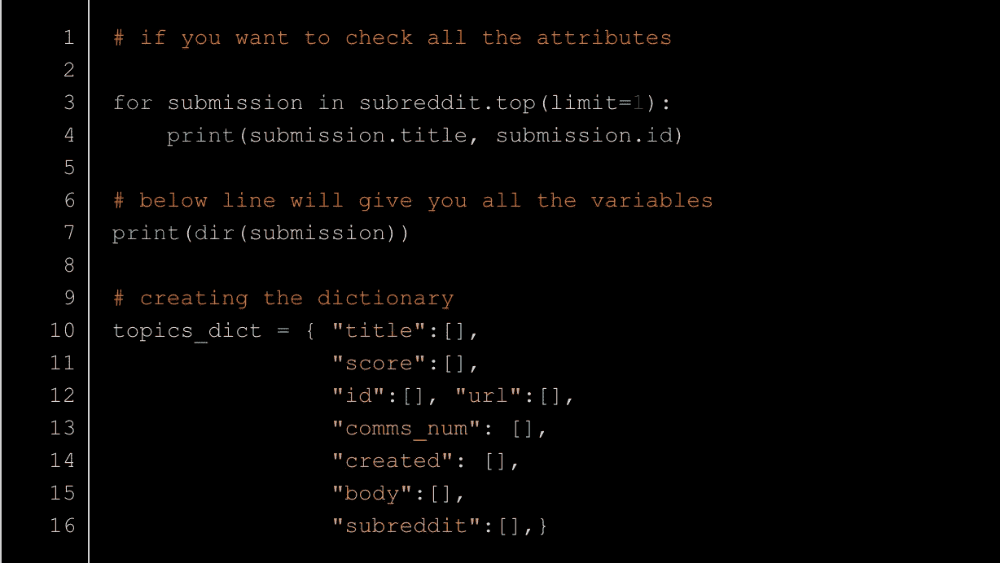

11.)一旦我们声明了字典的结构，现在就该从 reddit 将数据读入字典了:-

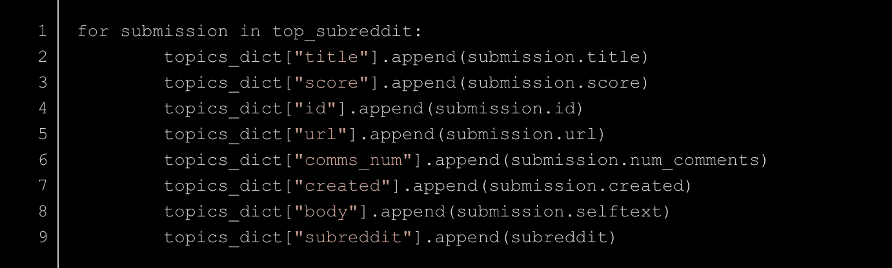

12.)最后，我们有了数据，现在我们将把它转换成一个 pandas 数据框，以便对它执行进一步的操作:-

13.)Reddit 总是以纪元格式给出时间，我们需要一个通用时间戳来读取和执行操作:-

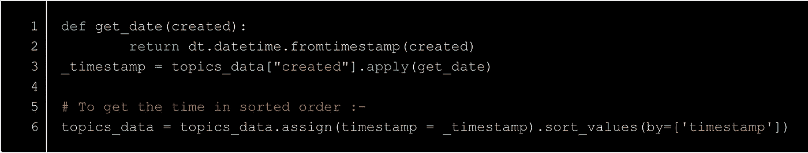

14.)现在，是时候决定我们的机器人的时间间隔了，假设你想每 15 分钟做一次。此外，由于 reddit 和 yor 时区可能不同，所以选择一个共同的时区总是明智的，这就是为什么我把两者都转换成 UTC。

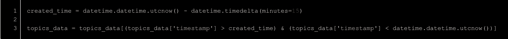

15.)现在，是时候过滤掉标题了，你可以按照下面的代码来做

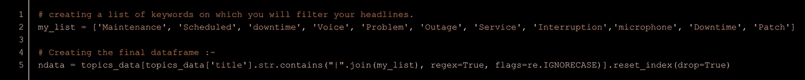

16.)发布到 slack 频道:-

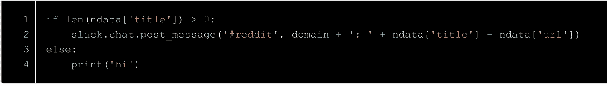

17.)现在，如果我们想将数据存储到某个数据库中，并在 grafana 上可视化该数据，该怎么办呢？我在这里使用 InfluxDB，所以只需用下面的代码替换步骤 15，数据将存储在 InfluxDB 中。

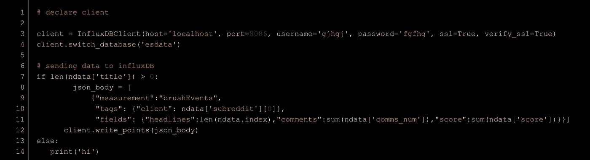

18.)为时间序列可视化设置 Grafana，您将获得如下图表

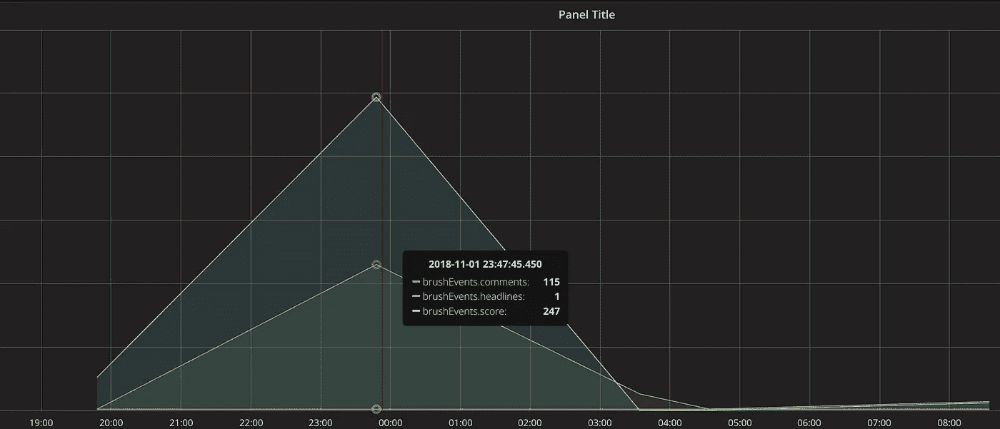

在上面的图表中，我们可以看到，在午夜，一些人发布了一个标题，在短短的 15 分钟内，有 247 人投了赞成票，115 人发表了评论。所以，这是一个问题。grafana 仪表板将如下图所示

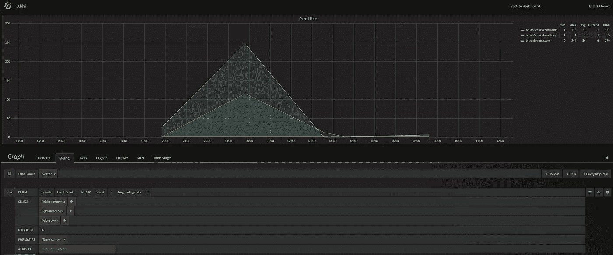

结束注释:-

1.  如果您设置了 15 分钟的时间间隔，那么请确保您为所有客户端编写的脚本花费的时间少于该时间间隔。
2.  我们总是可以根据我们的需要修改脚本，比如我们想要什么样的通知。

我还写了一篇关于制作 twitter 机器人的文章。请阅读:-

 [## Python 中的实时动态 tweet 监控机器人。

### 如果你正在阅读这篇博客，那么你可能正在寻找为 slack 开发某种推特监控机器人。在这个…

towardsdatascience.com](/real-time-dynamic-tweet-monitor-bot-for-slack-in-python-d0409b66de62) 

如果你在评论区有任何错误，请告诉我。请添加任何有价值的建议，我甚至可以改善这个脚本。我是东北大学的研究生，目前在 Vivox 做数据科学家。

请访问下面的 Github 库获取代码:-

 [## abhimanyu3/RedditBot_for_slack

### 设置一个 Reddit 机器人来监控关于用户情绪的实时子编辑标题，并将其放入 slack…

github.com](https://github.com/abhimanyu3/RedditBot_for_slack) 

请联系 Linkedin:-

 [## Abhimanyu Kumar -数据科学家(Co Op) - Vivox | LinkedIn

### 查看 Abhimanyu Kumar 在世界上最大的职业社区 LinkedIn 上的个人资料。Abhimanyu 有 8 份工作列在…

www.linkedin.com](https://www.linkedin.com/in/abhimanyu0301/)