# 针对 slack 的实时推特通知机器人。

> 原文：<https://towardsdatascience.com/real-time-dynamic-tweet-monitor-bot-for-slack-in-python-d0409b66de62?source=collection_archive---------17----------------------->

如果你正在阅读这篇博客，那么你可能正在寻找为 slack 开发某种推特监控机器人。在这篇文章中，我将描述我如何用 python 创建了一个动态 tweet monitor bot 来监控客户是否在 tweet 上发布了某些特定的内容。假设您想监控您的一个客户何时发布关于某件特定事情的推文。如果你只想监控一个账户，那没问题，但是想想你监控 100 个 twitter 账户的情况。你肯定会错过你的 slack 频道中的 tweet 洪流中的重要 tweet。假设您正在监控 Zara，并想知道他们何时在推特上发布销售信息。当 Zara、Columbia、North face 等大公司都在推特上发布出售消息时，你只是想要一个宽松的通知。那可能是任何一种公司。所以，你不想为 50 家公司写 50 个脚本，而是创建一个动态脚本，为所有客户完成工作。现在，如果您想在您的观察列表中添加或删除某些客户，该怎么办？我们赢了；不接触脚本，但我们将维护一个 CSV 文件或任何类型的数据库，它将服务于目的。

1.)首先，我们需要像下面这样的一些细节，这些细节可以通过在 twitter 上创建，并遵循[https://chimpgroup.com/knowledgebase/twitter-api-keys/](https://chimpgroup.com/knowledgebase/twitter-api-keys/)上的指示

#消费者:

**消费者 _ 密钥** = '消费者 _ 密钥'

**消费者 _ 秘密** = '消费者 _ 秘密'

#访问:

**访问令牌** = '访问令牌'

**访问密码** = '访问密码'

2.)要与 slack 交互，我们需要创建一个 slack bot API，您可以按照下面 youtube 视频中的说明来创建它

**SLACK API**= ' xox b-gfgdfgdfgdgfdfg '

从 xoxb 开始，你会得到类似上面的 slack api。

3.)我们还将维护一个 csv 文件，在该文件中，我们将以如下格式维护客户 twitter 名称信息:-

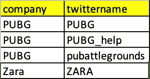

4.)我们需要一些库来设置整个过程。因此，请将以下库安装到您的环境中:-

5.)之后我们会声明 twitter 开发者账户和 slack API 的密钥。您可以使用任何帐户，但如果您想使用 Vivox 的详细信息，请联系 JIM。你总是可以自己创建 slack API，我已经分享了上面的链接，作为如何创建 slack API 密钥的参考。

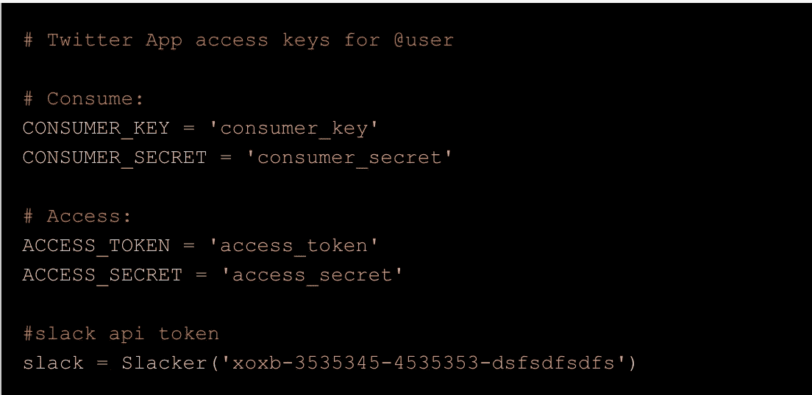

6.)然后我们将 CSV 文件读入熊猫的数据帧。CSV 文件包含客户 twitter 名称的所有详细信息，如果您需要添加或删除任何 twitter 名称，您可以在 CSV 文件中完成，无需编辑 python 脚本。

7.)然后我们将定义 tweepy 函数，稍后我们将使用它作为提取器:-

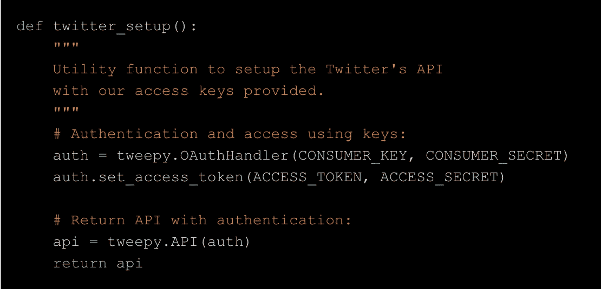

8.)现在，我们将创建一个 datafrme“数据”:

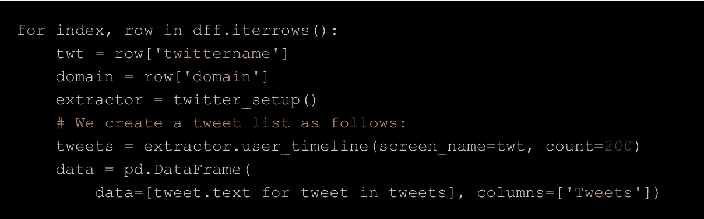

9.)现在，Twitter 会在每条推文中提供各种细节。所以，如果你想知道每条推文的所有细节，你可以使用下面的代码

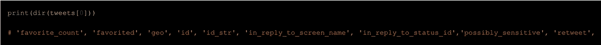

10.)现在，用下面的代码将您想要提取的任何信息作为一列添加到数据帧中。我刚刚添加了三个细节，但你可以添加你想要的。

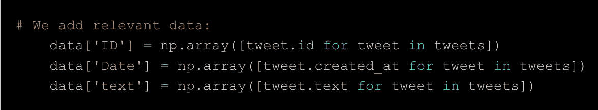

11.)我们不希望任何用户发布任何推文，也不希望我们的客户在推文中回应任何用户的推文。要忽略所有这类推文，请使用以下代码:-

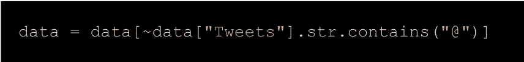

12.)现在，我们不希望相同的推文作为通知出现两次，所以我限制我的推文窗口只检查最后 1 分钟的推文，并且 cron 作业每分钟都在运行。这里的问题是 twitter 数据在不同的时区，而我们的系统时区是不同的。因此，我将两个时间都改为通用格式，即 UTC。

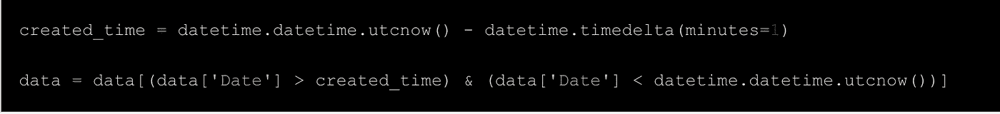

13.)在我们完成这一步后，我们将创建一个值列表，在此基础上，我们将根据我们想要的 tweets 过滤 tweets，其中包含某些词，如停机时间、维护等。

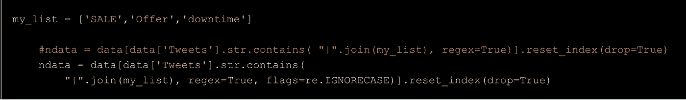

14.)在最后一步中，我们将检查数据帧“ndata”中是否有任何数据，并将其作为松弛通知发送:-

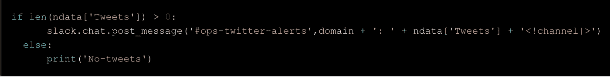

15.)完成上述所有步骤后，在终端上使用以下命令设置 cron 作业:-

16.)然后为 cron 作业创建条目，如下所示，它将每分钟运行一次:-

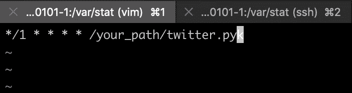

结束注释:-

1.  )确保任何帐户名都不是无效的或私有的。
2.  )根据您的要求修改您的 my_list。

如果你在评论区有任何错误，请告诉我。请添加任何有价值的建议，我甚至可以改善这个脚本。我是东北大学的研究生，目前在 Vivox 做数据科学家。

请访问下面的 Github 库获取代码:-

 [## abhimanyu 3/Twitter bot _ for _ slack

### 设置一个 twitter 机器人来实时监控多个 twitter 帐户，并在空闲时获得实时通知…

github.com](https://github.com/abhimanyu3/twitterbot_for_slack) 

让我们连接起来:-

 [## Abhimanyu Kumar -数据科学家(Co Op) - Vivox | LinkedIn

### 查看 Abhimanyu Kumar 在世界上最大的职业社区 LinkedIn 上的个人资料。Abhimanyu 有 8 份工作列在…

www.linkedin.com](https://www.linkedin.com/in/abhimanyu0301/)