# 实时人脸识别:一个端到端的项目

> 原文：<https://towardsdatascience.com/real-time-face-recognition-an-end-to-end-project-b738bb0f7348?source=collection_archive---------0----------------------->

逐步了解如何使用 PiCam 实时识别人脸。

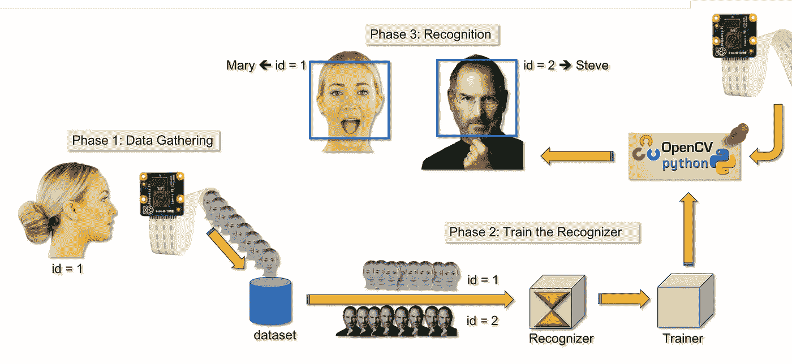

# 1.介绍

在我探索 OpenCV 的教程中，我们学习了[自动视觉物体跟踪](https://medium.com/@rovai/automatic-vision-object-tracking-347af1cc8a3b)。现在，我们将使用 PiCam 实时识别人脸，如下图所示:


这个项目是用这个神奇的“开源计算机视觉库” [OpenCV](https://opencv.org/) 完成的。在本教程中，我们将专注于 Raspberry Pi(所以，Raspbian 作为操作系统)和 Python，但我也在我的 Mac 上测试了代码，它也运行良好。

> “要在 Mac 上运行它，需要对代码做一些修改。不要担心，我会对此进行评论”

OpenCV 是为计算效率而设计的，非常注重实时应用。因此，它非常适合使用摄像头进行实时人脸识别。

## 三个阶段

为了创建一个完整的人脸识别项目，我们必须在三个截然不同的阶段开展工作:

*   人脸检测和数据收集
*   训练识别器
*   人脸识别

下面的框图恢复了这些阶段:

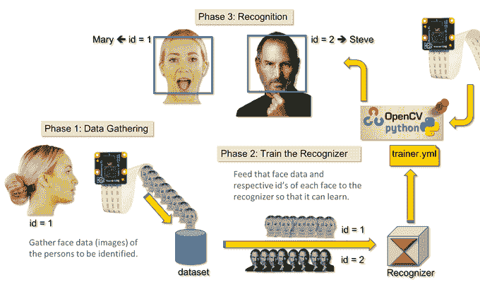

# 2.安装 OpenCV 3 包

我用的是 Raspberry Pi V3，更新到了 Raspbian (Stretch)的最新版本，所以安装 OpenCV 的最好方法是遵循 Adrian Rosebrock 开发的优秀教程: [Raspbian Stretch:在你的 Raspberry Pi 上安装 OpenCV 3+Python](https://www.pyimagesearch.com/2017/09/04/raspbian-stretch-install-opencv-3-python-on-your-raspberry-pi/)。

> 我尝试了几种不同的指南在我的 Pi 上安装 OpenCV。阿德里安的教程是最好的。我建议你也这样做，一步一步地遵循他的指导方针。

一旦您完成了 Adrian 的教程，您就应该有一个 OpenCV 虚拟环境，可以在您的 Pi 上运行我们的实验。

让我们进入虚拟环境，确认 OpenCV 3 安装正确。

Adrian 建议每次打开新终端时运行命令“source ”,以确保系统变量设置正确。

```
source ~/.profile
```

接下来，让我们进入虚拟环境:

```
workon cv
```

如果您在提示前看到文本(cv ),则您处于 *cv 虚拟*环境中:

```
(cv) pi@raspberry:~$
```

> *Adrian 提醒注意，* **cv Python 虚拟环境** *完全独立于 Raspbian Stretch 下载中包含的默认 Python 版本。因此，全局站点包目录中的任何 Python 包对于 cv 虚拟环境都是不可用的。类似地，任何安装在 cv 的 site-packages 中的 Python 包对于 Python 的全局安装都是不可用的。*

现在，在 Python 解释器中输入:

```
python
```

并确认您运行的是 3.5(或更高)版本。

在解释器内部(会出现" > > > ")，导入 OpenCV 库:

```
import cv2
```

如果没有出现错误消息，则 OpenCV 已正确安装在您的 PYTHON 虚拟环境中。

您也可以检查安装的 OpenCV 版本:

```
cv2.__version__
```

3.3.0 应该会出现(或者将来可能发布的更高版本)。

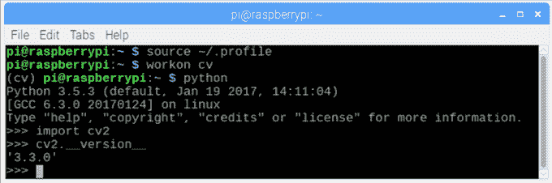

上面的终端打印屏幕显示了前面的步骤。

# 3.测试您的相机

一旦你在 RPi 中安装了 OpenCV，让我们来测试一下你的相机是否工作正常。

我假设您已经在您的 Raspberry Pi 上安装并启用了 PiCam。

在您的 IDE 上输入以下 Python 代码:

```
import numpy as np
import cv2cap = cv2.VideoCapture(0)
cap.set(3,640) # set Width
cap.set(4,480) # set Heightwhile(True):
    ret, frame = cap.read()
    frame = cv2.flip(frame, -1) # Flip camera vertically
    gray = cv2.cvtColor(frame, cv2.COLOR_BGR2GRAY)

    cv2.imshow('frame', frame)
    cv2.imshow('gray', gray)

    k = cv2.waitKey(30) & 0xff
    if k == 27: # press 'ESC' to quit
        breakcap.release()
cv2.destroyAllWindows()
```

上述代码将捕获您的 PiCam 生成的视频流，以 BGR 彩色和灰色模式显示这两种视频流。

> 注意，由于组装的方式，我垂直旋转了我的相机。如果不是你的情况，评论或删除“翻转”命令行。

你也可以从我的 GitHub 下载代码: [simpleCamTest.py](https://github.com/Mjrovai/OpenCV-Object-Face-Tracking/blob/master/simpleCamTest.py)

要执行脚本，请输入命令:

```
python simpleCamTest.py
```

> 要完成该程序，您必须按键盘上的[ESC]键。在按[ESC]键之前，在视频窗口上单击鼠标。

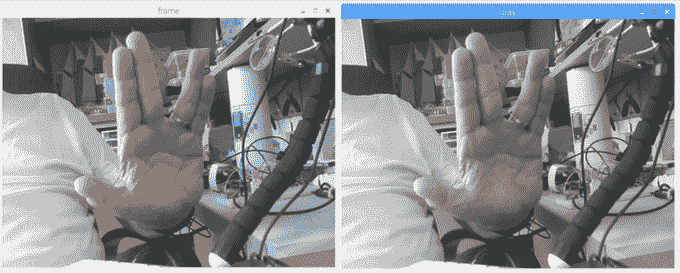

上图是结果。

一些人在试图打开相机时发现问题，并得到“断言失败”的错误消息。如果在 OpenCv 安装过程中没有启用相机，相机驱动程序就不会正确安装，这种情况就会发生。要进行更正，请使用以下命令:

```
sudo modprobe bcm2835-v4l2
```

> *您还可以将 bcm2835-v4l2 添加到/etc/modules 文件的最后一行，以便在引导时加载驱动程序。*

了解 OpenCV 的更多内容，可以关注教程:[加载-视频-python-OpenCV-教程](https://pythonprogramming.net/loading-video-python-opencv-tutorial/)

# 4.人脸检测

人脸识别最基本的任务当然是“人脸检测”。在做任何事情之前，你必须“捕捉”一张脸(阶段 1)，以便在与未来(阶段 3)捕捉的新脸进行比较时识别它。

最常见的检测人脸(或任何物体)的方法，是使用[哈尔级联分类器](https://docs.opencv.org/3.3.0/d7/d8b/tutorial_py_face_detection.html)

使用基于 Haar 特征的级联分类器的目标检测是由 Paul Viola 和 Michael Jones 在 2001 年的论文“使用简单特征的增强级联的快速目标检测”中提出的一种有效的目标检测方法。这是一种基于机器学习的方法，其中从大量正面和负面图像中训练级联函数。然后，它被用于检测其他图像中的对象。

这里我们将使用人脸检测。最初，该算法需要大量的正面图像(人脸图像)和负面图像(没有人脸的图像)来训练分类器。然后我们需要从中提取特征。好消息是 OpenCV 带有一个训练器和一个检测器。如果你想为任何物体训练你自己的分类器，比如汽车，飞机等等。您可以使用 OpenCV 创建一个。这里给出了它的全部细节:[级联分类器训练](https://docs.opencv.org/3.3.0/dc/d88/tutorial_traincascade.html)。

如果你不想创建自己的分类器，OpenCV 已经包含了许多预先训练好的人脸、眼睛、微笑等分类器。那些 XML 文件可以从 [haarcascades](https://github.com/Itseez/opencv/tree/master/data/haarcascades) 目录下载。

理论够了，我们用 OpenCV 造一个人脸检测器吧！

从我的 GitHub 下载文件: [faceDetection.py](https://github.com/Mjrovai/OpenCV-Face-Recognition/blob/master/FaceDetection/faceDetection.py) 。

```
import numpy as np
import cv2faceCascade = cv2.CascadeClassifier('Cascades/haarcascade_frontalface_default.xml')
cap = cv2.VideoCapture(0)
cap.set(3,640) # set Width
cap.set(4,480) # set Heightwhile True:
    ret, img = cap.read()
    img = cv2.flip(img, -1)
    gray = cv2.cvtColor(img, cv2.COLOR_BGR2GRAY)
    faces = faceCascade.detectMultiScale(
        gray,     
        scaleFactor=1.2,
        minNeighbors=5,     
        minSize=(20, 20)
    )
    for (x,y,w,h) in faces:
        cv2.rectangle(img,(x,y),(x+w,y+h),(255,0,0),2)
        roi_gray = gray[y:y+h, x:x+w]
        roi_color = img[y:y+h, x:x+w]  
    cv2.imshow('video',img)
    k = cv2.waitKey(30) & 0xff
    if k == 27: # press 'ESC' to quit
        breakcap.release()
cv2.destroyAllWindows()
```

信不信由你，上面的几行代码就是你检测一张脸所需要的全部，使用 Python 和 OpenCV。

当您与用于测试相机的最后一个代码进行比较时，您会发现添加到其中的部分很少。请注意下面一行:

```
faceCascade = cv2.CascadeClassifier('Cascades/haarcascade_frontalface_default.xml')
```

这是加载“分类器”的一行代码(必须位于项目目录下名为“Cascades/”的目录中)。

然后，我们将设置我们的摄像机，在循环中，以灰度模式加载我们的输入视频(和我们之前看到的一样)。

现在我们必须调用我们的分类器函数，给它传递一些非常重要的参数，如比例因子、邻居数量和检测到的人脸的最小尺寸。

```
faces = faceCascade.detectMultiScale(
        gray,     
        scaleFactor=1.2,
        minNeighbors=5,     
        minSize=(20, 20)
        )
```

在哪里，

*   **灰度**是输入的灰度图像。
*   **比例因子**是指定在每个图像比例下图像尺寸缩小多少的参数。它用于创建比例金字塔。
*   **minNeighbors** 是一个参数，指定每个候选矩形应该有多少个邻居来保留它。数字越大，误报率越低。
*   **最小尺寸**是被视为面的最小矩形尺寸。

该功能将检测图像上的人脸。接下来，我们必须“标记”图像中的人脸，例如，使用蓝色矩形。这是通过这部分代码完成的:

```
for (x,y,w,h) in faces:
    cv2.rectangle(img,(x,y),(x+w,y+h),(255,0,0),2)
    roi_gray = gray[y:y+h, x:x+w]
    roi_color = img[y:y+h, x:x+w]
```

如果找到了人脸，它会将检测到的人脸的位置返回为一个矩形，左上角为(x，y)，宽度为“w ”,高度为“h ”= = >(x，y，w，h)。请看图片。

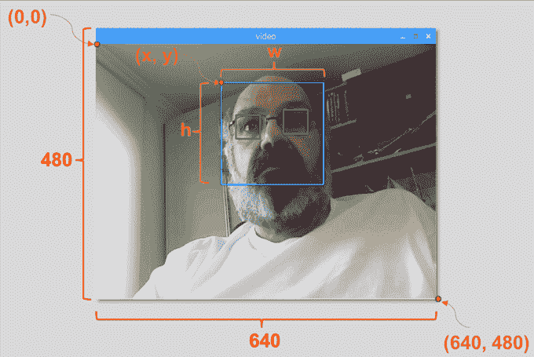

一旦我们得到这些位置，我们就可以为面部创建一个“ROI”(绘制的矩形)，并用 *imshow()* 函数呈现结果。

使用 Rpi 终端，在您的 python 环境中运行上述 python 脚本:

```
python faceDetection.py
```

结果是:


您还可以包括用于“眼睛检测”甚至“微笑检测”的分类器。在这些情况下，您将在面部循环中包含分类器函数和矩形绘制，因为在面部之外检测眼睛或微笑是没有意义的。

> *请注意，在 Pi 上，几个分类器使用相同的代码会减慢处理速度，因为这种检测方法(HaarCascades)使用了大量的计算能力。在台式机上，运行它更容易。*

## 例子

在我的 GitHub 上，您可以找到其他示例:

*   [faceyeedetection . py](https://github.com/Mjrovai/OpenCV-Face-Recognition/blob/master/FaceDetection/faceEyeDetection.py)
*   [faces milled detection . py](https://github.com/Mjrovai/OpenCV-Face-Recognition/blob/master/FaceDetection/faceSmileDetection.py)
*   [faceSmileEyeDetection.py](https://github.com/Mjrovai/OpenCV-Face-Recognition/blob/master/FaceDetection/faceSmileEyeDetection.py)

在图片中，你可以看到结果。

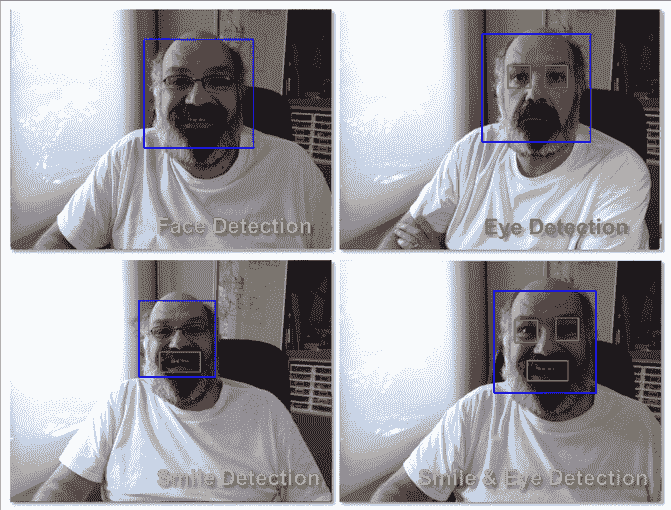

您也可以按照下面的教程来更好地理解人脸检测:

[哈尔级联物体检测人脸& Eye OpenCV Python 教程](https://pythonprogramming.net/haar-cascade-face-eye-detection-python-opencv-tutorial/)

# 5.数据采集

首先，我必须感谢 Ramiz Raja 在照片人脸识别方面的出色工作:

[使用 OPENCV 和 PYTHON 的人脸识别:初学者指南](https://www.superdatascience.com/opencv-face-recognition/)

还有阿尼班·卡尔，他用视频开发了一个非常全面的教程:

[人脸识别— 3 个部分](https://thecodacus.com/category/opencv/face-recognition/)

我真的建议你看一看这两个教程。

说到这里，让我们开始我们项目的第一阶段。我们在这里要做的是，从最后一步(人脸检测)开始，我们将简单地创建一个数据集，其中我们将为每个 id 存储一组灰色照片，其中一部分用于人脸检测。

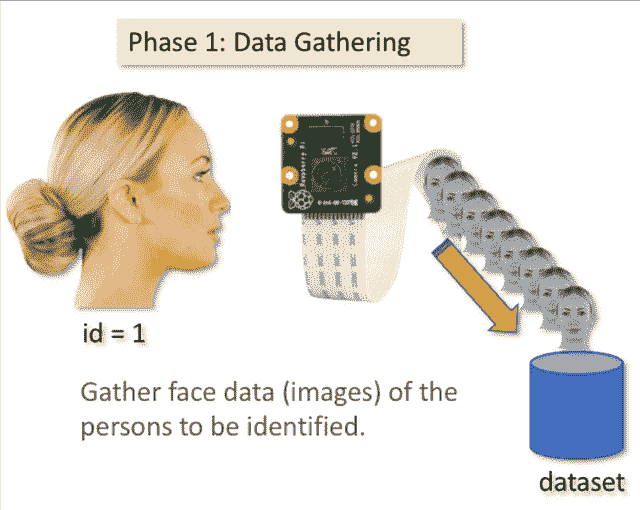

首先，创建一个开发项目的目录，例如 FacialRecognitionProject:

```
mkdir FacialRecognitionProject
```

在这个目录中，除了我们将为项目创建的 3 个 python 脚本之外，我们必须在上面保存面部分类器。可以从我的 GitHub 下载:[Haar cascode _ frontal face _ default . XML](https://github.com/Mjrovai/OpenCV-Face-Recognition/blob/master/FacialRecognition/haarcascade_frontalface_default.xml)

接下来，创建一个子目录，我们将在其中存储面部样本，并将其命名为“数据集”:

```
mkdir dataset
```

并从我的 GitHub 下载代码: [01_face_dataset.py](https://github.com/Mjrovai/OpenCV-Face-Recognition/blob/master/FacialRecognition/01_face_dataset.py)

```
import cv2
import oscam = cv2.VideoCapture(0)
cam.set(3, 640) # set video width
cam.set(4, 480) # set video height
face_detector = cv2.CascadeClassifier('haarcascade_frontalface_default.xml')# For each person, enter one numeric face id
face_id = input('\n enter user id end press <return> ==>  ')
print("\n [INFO] Initializing face capture. Look the camera and wait ...")# Initialize individual sampling face count
count = 0
while(True):
    ret, img = cam.read()
    img = cv2.flip(img, -1) # flip video image vertically
    gray = cv2.cvtColor(img, cv2.COLOR_BGR2GRAY)
    faces = face_detector.detectMultiScale(gray, 1.3, 5)
    for (x,y,w,h) in faces:
        cv2.rectangle(img, (x,y), (x+w,y+h), (255,0,0), 2)     
        count += 1
        # Save the captured image into the datasets folder
        cv2.imwrite("dataset/User." + str(face_id) + '.' +  
                    str(count) + ".jpg", gray[y:y+h,x:x+w])
        cv2.imshow('image', img)
    k = cv2.waitKey(100) & 0xff # Press 'ESC' for exiting video
    if k == 27:
        break
    elif count >= 30: # Take 30 face sample and stop video
         break# Do a bit of cleanup
print("\n [INFO] Exiting Program and cleanup stuff")
cam.release()
cv2.destroyAllWindows()
```

该代码与我们看到的人脸检测代码非常相似。我们添加的是一个“输入命令”来捕获一个用户 id，它应该是一个整数(1，2，3 等)

```
face_id = input('\n enter user id end press  ==>  ')
```

对于每一个捕捉到的帧，我们应该将其保存为“数据集”目录中的一个文件:

```
cv2.imwrite("dataset/User." + str(face_id) + '.' + str(count) + ".jpg", gray[y:y+h,x:x+w])
```

请注意，要保存上述文件，您必须导入库“os”。每个文件的名称将遵循以下结构:

```
User.face_id.count.jpg
```

例如，对于 face_id = 1 的用户，数据集/目录上的第 4 个样本文件将类似于:

```
User.1.4.jpg
```

如我的 Pi 中的照片所示:

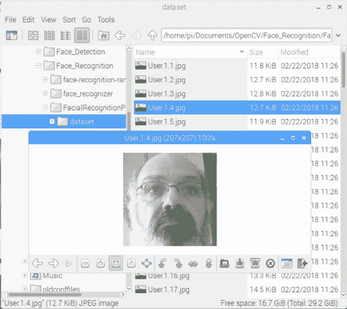

在我的代码中，我从每个 id 中捕获 30 个样本。最后一个“elif”可以改。样本数量用于打破捕捉面部样本的循环。

运行 Python 脚本并捕获一些 id。每次您想要聚合新用户(或更改已存在用户的照片)时，您都必须运行该脚本。

# 6.运动鞋

在第二阶段，我们必须从我们的数据集中获取所有用户数据，并“训练”OpenCV 识别器。这是由特定的 OpenCV 函数直接完成的。结果将是一个. yml 文件，该文件将保存在“trainer/”目录中。

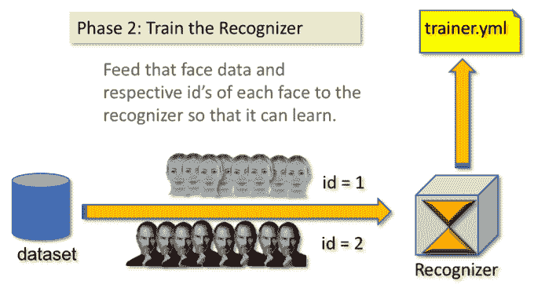

因此，让我们开始创建一个子目录，用于存储训练数据:

```
mkdir trainer
```

从我的 GitHub 下载第二个 python 脚本: [02_face_training.py](https://github.com/Mjrovai/OpenCV-Face-Recognition/blob/master/FacialRecognition/02_face_training.py)

```
import cv2
import numpy as np
from PIL import Image
import os# Path for face image database
path = 'dataset'
recognizer = cv2.face.LBPHFaceRecognizer_create()
detector = cv2.CascadeClassifier("haarcascade_frontalface_default.xml");# function to get the images and label data
def getImagesAndLabels(path):
    imagePaths = [os.path.join(path,f) for f in os.listdir(path)]     
    faceSamples=[]
    ids = []
    for imagePath in imagePaths:
        PIL_img = Image.open(imagePath).convert('L') # grayscale
        img_numpy = np.array(PIL_img,'uint8')
        id = int(os.path.split(imagePath)[-1].split(".")[1])
        faces = detector.detectMultiScale(img_numpy)
        for (x,y,w,h) in faces:
            faceSamples.append(img_numpy[y:y+h,x:x+w])
            ids.append(id)
    return faceSamples,idsprint ("\n [INFO] Training faces. It will take a few seconds. Wait ...")faces,ids = getImagesAndLabels(path)
recognizer.train(faces, np.array(ids))# Save the model into trainer/trainer.yml
recognizer.write('trainer/trainer.yml') # Print the numer of faces trained and end program
print("\n [INFO] {0} faces trained. Exiting Program".format(len(np.unique(ids))))
```

> `# recognizer.save() worked on Mac, but not on Pi`

确认您的 Rpi 上是否安装了 PIL 库。如果没有，请在终端中运行以下命令:

```
pip install pillow
```

我们将使用 OpenCV 包中包含的 LBPH(局部二进制模式直方图)人脸识别器作为识别器。我们用下面的代码行来实现这一点:

```
recognizer = cv2.face.LBPHFaceRecognizer_create()
```

函数“getImagesAndLabels (path)”，将拍摄目录:“dataset/”上的所有照片，返回 2 个数组:“Ids”和“faces”。将这些数组作为输入，我们将“训练我们的识别器”:

```
recognizer.train(faces, ids)
```

因此，名为“trainer.yml”的文件将保存在我们之前创建的培训师目录中。

就是这样！我包括了最后一个打印声明，其中我显示了我们已经训练的用户面部的数量以供确认。

每次执行阶段 1 时，也必须运行阶段 2。

# 7.承认者

现在，我们到了项目的最后阶段。在这里，我们将在我们的相机上捕捉一张新面孔，如果这个人的脸之前被捕捉并训练过，我们的识别器将进行“预测”，返回其 id 和索引，显示识别器对这一匹配的信心程度。

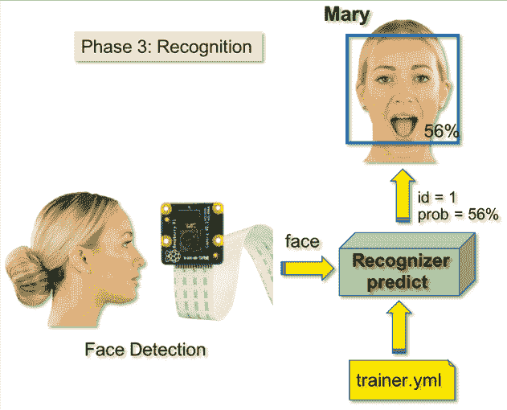

下面从我的 GitHub 下载第三期 python 脚本: [03_face_recognition.py](https://github.com/Mjrovai/OpenCV-Face-Recognition/blob/master/FacialRecognition/03_face_recognition.py) 。

```
import cv2
import numpy as np
import os recognizer = cv2.face.LBPHFaceRecognizer_create()
recognizer.read('trainer/trainer.yml')
cascadePath = "haarcascade_frontalface_default.xml"
faceCascade = cv2.CascadeClassifier(cascadePath);
font = cv2.FONT_HERSHEY_SIMPLEX#iniciate id counter
id = 0# names related to ids: example ==> Marcelo: id=1,  etc
names = ['None', 'Marcelo', 'Paula', 'Ilza', 'Z', 'W'] # Initialize and start realtime video capture
cam = cv2.VideoCapture(0)
cam.set(3, 640) # set video widht
cam.set(4, 480) # set video height# Define min window size to be recognized as a face
minW = 0.1*cam.get(3)
minH = 0.1*cam.get(4)while True:
    ret, img =cam.read()
    img = cv2.flip(img, -1) # Flip vertically
    gray = cv2.cvtColor(img,cv2.COLOR_BGR2GRAY)

    faces = faceCascade.detectMultiScale( 
        gray,
        scaleFactor = 1.2,
        minNeighbors = 5,
        minSize = (int(minW), int(minH)),
       )
    for(x,y,w,h) in faces:
        cv2.rectangle(img, (x,y), (x+w,y+h), (0,255,0), 2)
        id, confidence = recognizer.predict(gray[y:y+h,x:x+w])
                # If confidence is less them 100 ==> "0" : perfect match 
        if (confidence < 100):
            id = names[id]
            confidence = "  {0}%".format(round(100 - confidence))
        else:
            id = "unknown"
            confidence = "  {0}%".format(round(100 - confidence))

        cv2.putText(
                    img, 
                    str(id), 
                    (x+5,y-5), 
                    font, 
                    1, 
                    (255,255,255), 
                    2
                   )
        cv2.putText(
                    img, 
                    str(confidence), 
                    (x+5,y+h-5), 
                    font, 
                    1, 
                    (255,255,0), 
                    1
                   )  

    cv2.imshow('camera',img) 
    k = cv2.waitKey(10) & 0xff # Press 'ESC' for exiting video
    if k == 27:
        break# Do a bit of cleanup
print("\n [INFO] Exiting Program and cleanup stuff")
cam.release()
cv2.destroyAllWindows()
```

我们在这里包含了一个新的数组，所以我们将显示“名称”，而不是编号的 id:

```
names = ['None', 'Marcelo', 'Paula', 'Ilza', 'Z', 'W']
```

所以，举个例子:Marcelo 将 id = 1 的用户；宝拉:id=2，等等。

接下来，我们将检测一张脸，就像我们之前用哈斯卡德分类器所做的一样。检测到人脸后，我们可以调用上面代码中最重要的函数:

```
id, confidence = recognizer.predict(gray portion of the face)
```

recognizer.predict()将把要分析的面部的捕获部分作为参数，并将返回其可能的所有者，指示其 id 以及识别器与该匹配相关的置信度。

> *注意，如果被认为是完美匹配，信心指数将返回“零”*

最后，如果识别器可以预测人脸，我们就在图像上放一段文字，说明可能的 id 以及匹配正确的“概率”是多少(百分比)(“概率”= 100 —置信度指数)。如果没有，就在脸上贴上“未知”的标签。

下面是结果的 gif:

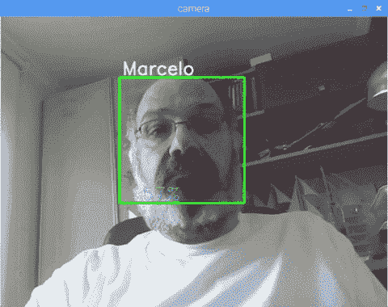

在图片上，我展示了这个项目的一些测试，我也用照片来验证识别器是否工作。

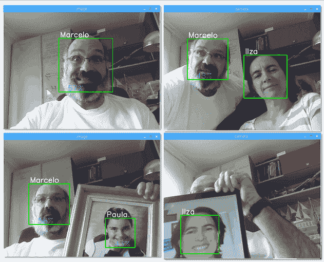

# 8.结论


一如既往，我希望这个项目可以帮助其他人找到进入令人兴奋的电子世界的方法！

有关详细信息和最终代码，请访问我的 GitHub 仓库:

https://github.com/Mjrovai/OpenCV-Face-Recognition

更多项目，请访问我的博客:【MJRoBot.org 

来自世界南部的 Saludos！

我的下一篇文章再见！

谢谢你，

马塞洛