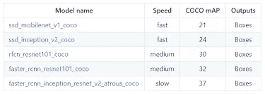
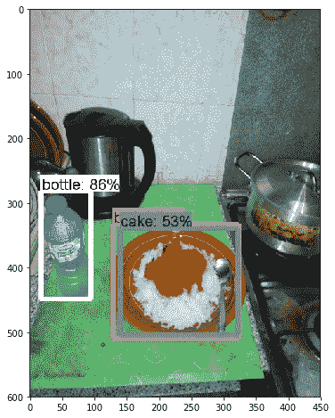
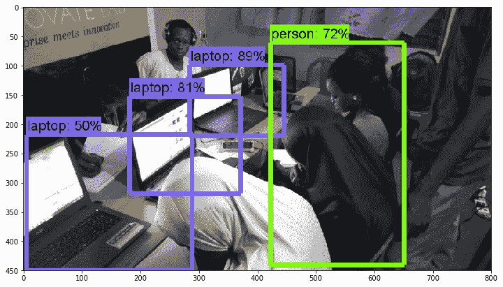
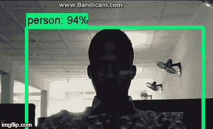

# 使用 Tensorflow 和 OpenCV 的实时对象检测 API

> 原文：<https://towardsdatascience.com/real-time-object-detection-api-using-tensorflow-and-opencv-47b505d745c4?source=collection_archive---------2----------------------->

在过去几年中，当今世界的视觉数据量呈指数级增长，这主要是由于到处都有大量的传感器。构建能够在单个图像中定位和识别物体的机器学习模型仍然是计算机视觉中的核心挑战。致力于解决这个问题点燃了我对这个领域的兴趣。

作为我探索的一个途径，我发现 Google 刚刚发布了一个对象检测 API。该 API 已经在具有不同可训练检测模型的微软 COCO 数据集(90 个常见对象的大约 300，000 个图像的数据集)上进行训练。



different trainable detection models

地图越高(最小平均精度)，模型越好

# **项目描述**

我首先在 github 上克隆了 [Tensorflow 对象检测](https://github.com/tensorflow/models)库。该 API 是一个基于 tensorflow 的开源框架，可以轻松构建、训练和部署对象检测模型。

对于这个项目[am on windows 10，Anaconda 3，Python 3.6]，我只关心[安装](https://github.com/tensorflow/models/blob/master/research/object_detection/g3doc/installation.md)部分，并遵循包括

*   使用 pip(最新版本)安装最新版本的 tensorflow 时会附带安装所需的库，例如 pillow、lxml 等
*   下载与我的系统兼容的最新版本的 **protobuf** 用于在 [google protobuf 版本](https://github.com/google/protobuf/releases)上编译
*   将 [tensorflow/models](https://github.com/tensorflow/models) 文件夹克隆为 zip 文件
*   在我的 Anaconda 提示符下，运行这个命令进行 protobuf 编译，没有它这个例子就不能工作。

```
# From tensorflow/models/research/
protoc object_detection/protos/*.proto --python_out=.
```

*   我更喜欢使用 Spyder 作为我的编辑器，所以我复制了[示例](https://github.com/tensorflow/models/blob/master/research/object_detection/object_detection_tutorial.ipynb)中的笔记本，并将其转换为 python 文件

# **测试模型**

使用预先训练好的 **ssd_mobilenet_v1_coco** 模型(虽然速度很快，但准确性最低)，我决定在自己的图像上测试一下，结果令人惊讶！


Django girls event in my school



This was actually my dinner



Ongoing free python training organized by **@lautechdatasci** team

**技巧:**测试图片是用我的手机和数码相机拍摄的。调整它们的尺寸有助于模型的检测。

现在我想要实时检测，所以我用我的网络摄像头连接了 OpenCV。OpenCV 是一个用于图像处理、机器学习和实时检测的开源计算机视觉库。

这是结果:



请不要介意我的网络摄像头的质量😊，这是一个旧的。我希望我能安装升级程序

# **我的下一个任务**

使用预先训练好的模型真的很酷，但是我喜欢在我自己的数据集上为超级应用程序训练 API。这可能不容易，但事实上，**我已经准备好战斗了！！！**

你可以在我的[库](https://github.com/am-sirdaniel/Real-Time-Object-detection-API)上获得完整的代码，这样你就可以直接运行文件并进行测试。如果你觉得我的帖子有趣😍，尽可能地按下鼓掌按钮。

在推特上关注我:@danielajisafe，@lautechdatasci

#fromlautechtotheworld

YOUTUBE 参考

[https://www.youtube.com/watch?v=MoMjIwGSFVQ](https://www.youtube.com/watch?v=MoMjIwGSFVQ)
[https://www.youtube.com/watch?v=COlbP62-B-U&list = plqvvaa 0 qudcnk 5 gecqnxynssaar 2 tpku](https://www.youtube.com/watch?v=COlbP62-B-U&list=PLQVvvaa0QuDcNK5GeCQnxYnSSaar2tpku)
[https://www.youtube.com/watch?v=Rgpfk6eYxJA](https://www.youtube.com/watch?v=Rgpfk6eYxJA)