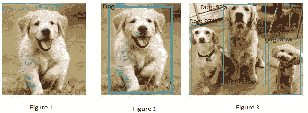
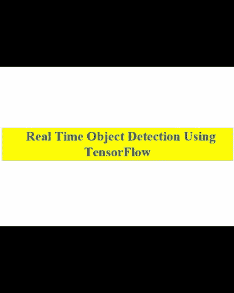

# 基于张量流检测模型的实时目标检测

> 原文：<https://towardsdatascience.com/real-time-object-detection-with-tensorflow-detection-model-e7fd20421d5d?source=collection_archive---------3----------------------->

最近，我完成了 [deeplearning.ai](https://www.coursera.org/specializations/deep-learning) 通过 [Coursera](https://www.google.co.in/url?sa=t&rct=j&q=&esrc=s&source=web&cd=1&cad=rja&uact=8&ved=0ahUKEwjW5K2ys-7YAhUMpJQKHXZ0BzkQFggoMAA&url=https%3A%2F%2Fwww.coursera.org%2F&usg=AOvVaw1_A8hEzXvBhSqZAjuapKcN) 提供的课程 4，“ [**卷积神经网络**”](https://www.coursera.org/learn/convolutional-neural-networks)作为“**深度学习专业化**”的一部分。[吴恩达](http://www.andrewng.org/)、[基安·卡坦弗什](https://www.linkedin.com/in/kiankatan)和[尤尼斯·本苏达·莫里](https://www.linkedin.com/in/younes-bensouda-mourri-8749b9a9)在这一专业领域提供了大量的实践和理论知识。因此，我强烈推荐任何想获得深度学习经验的人。

自从我开始学习以来，我就对 CNN 的潜力充满了雄心和好奇，在那门课程的一周中，我学习了在图像分类中实现的思想如何对具有定位的图像分类有用，以及从定位中学到的思想如何对检测有用。嗯，在完成完全基于物体探测的第三周之后，一些事情困扰着我。

但是，在深入探讨困扰我的细节之前。我先简单解释一下什么是图像分类，我提到带定位的图像分类是什么意思。首先，让我们看看下面的图片，我知道这些狗太可爱了，所以我亲爱的读者，不要失去你的焦点:)。因此，我所说的图像分类是指每当一种算法看到这张图片[图 1]时，可能会做出反应并说这是一只狗，这意味着它能够将图像分类为一只狗的图像。

和[图 2]，显示了该算法如何在图像中狗的位置周围放置一个边界框或绘制一个蓝色矩形。因此，这被称为定位分类，术语定位指的是计算出狗在照片中的哪个位置被检测到。

以及[图 3]示出了该算法如何检测和定位图像中的不止一个而是多个对象。

在这个简洁的解释之后，我应该把你的注意力集中到我反复提到的“事物”的问题上。我脑海中的问题是，是否存在比[你只看一次(YOLO)](https://arxiv.org/abs/1506.02640) 更准确的物体检测方法，以及比[更快的 R-CNNs](https://arxiv.org/abs/1506.01497) 更快的每秒帧数(FPS)。除此之外，我甚至开始寻找可以在没有高计算能力或没有利用 Nvidia GPU 能力的设备上运行的网络架构，如 Titan X 或 Jetson。

俗话说“**为了发现任何东西，你必须寻找某些东西**”。因此，我花了几个小时的时间进行研究，找到了“ [TensorFlow 对象检测 API](https://github.com/tensorflow/models/tree/master/research/object_detection) ”，这是一个基于 TensorFlow 构建的开源框架，可以轻松构建、训练和部署对象检测模型，并且它还提供了一系列在 [COCO 数据集](http://mscoco.org/)、 [Kitti 数据集](http://www.cvlibs.net/datasets/kitti/)和[开放图像数据集](https://github.com/openimages/dataset)上预先训练的检测模型。众多检测模型中的一种是[**单次检测器(SSD)**](https://arxiv.org/abs/1512.02325)和 [**MobileNets**](https://arxiv.org/abs/1704.04861) 架构的组合，其快速、高效且不需要巨大的计算能力来完成对象检测任务，其示例可在下图中看到。所以，简而言之，我的每一个问题都通过 SSDs 和 MobileNets 模型的结合得到了回答。

在向大家介绍了计算机视觉领域中经常使用的各种术语并自我回答了我的问题之后，现在我应该跳到实践部分，告诉大家如何通过使用 [OpenCV](https://www.google.co.in/url?sa=t&rct=j&q=&esrc=s&source=web&cd=1&cad=rja&uact=8&ved=0ahUKEwiTz_nav_DYAhVDs48KHe3WBsUQFggoMAA&url=https%3A%2F%2Fopencv.org%2F&usg=AOvVaw0nLWFztJIlbNMAYoheT9Qm) 和 [TensorFlow](https://www.tensorflow.org/) 以及 ssd_mobilenet_v1 模型[[**SSD _ mobilenet _ v1 _ COCO**】在 COCO[上下文中的常见对象]数据集上训练，我能够使用一个 7 美元的网络摄像头和一台笔记本电脑进行实时对象检测。](http://download.tensorflow.org/models/object_detection/ssd_mobilenet_v1_coco_2017_11_17.tar.gz)

那么，不多说了，让我们开始吧

1.  首先到达这个 [**链接**](https://github.com/tensorflow/models/tree/master/research/object_detection) ，在目录下，设置部分，点击安装子部分。
2.  基本上，安装部分由 TensorFlow 对象检测 API 所依赖的库列表组成。因此，在前进之前安装每一个依赖项。
3.  在所有的库中，你需要再安装一个库，就是 [Protobuf 2.6](https://github.com/google/protobuf/releases) 。由于我用的是 Windows 10【你可以根据你用的操作系统下载 zip 文件】我下载并解压了这个文件[**protocol-3 . 5 . 1-win32 . zip**](https://github.com/google/protobuf/releases/download/v3.5.1/protoc-3.5.1-win32.zip)**。**
4.  安装好所有要求后，就该下载模型了，你可以在这里 找到 [**。这完全取决于你是想克隆还是下载这个库。做好决定后，解压**](https://github.com/tensorflow/models) **[**文件**](https://github.com/tensorflow/models.git) ，确保你的协议和模型文件在同一个文件夹里。**
5.  然后，我们需要将模型主文件夹的名称更改为模型，如果您在模型文件夹中查找研究文件夹，然后在研究文件夹中查找对象检测文件夹，在对象检测文件夹中查找 protos 文件夹。
6.  一旦你打开它，你会发现没有像 box.predictor_pb2.py，faster_rcnn_box_coder_pb2.py 这样命名的文件，为了得到这些文件，我们需要编译 Protobuf 库。
7.  因此，为了编译 Protobuf 库，打开 Anaconda 提示符，将目录更改为保存这两个文件夹的位置，然后执行[change directory]CD models/research，然后给出这个命令，该命令包含您的 protoc.exe 文件所在的完整路径，后跟[protoc object _ detection/protos/*。proto — python_out=。].
8.  例如，[C:/Users/ADMIN/TF _ obj _ det/protoc-3 . 4 . 0-win32/bin/protoc object _ detection/protos/*。proto — python_out=。]，这里 tf_obj_det 是我解压后保存模型和协议文件的文件夹。
9.  现在，完成编译部分后，只需在 Anaconda 提示符/ Anaconda 终端上键入 jupyter notebook，然后一旦 jupyter notebook 打开，您就可以为实时对象检测编写代码了。
10.  你可以使用我的资源库中的这个项目的代码，这个资源库在“参考资料”一节中提到，我还包括了 YouTube 视频的链接，它实际上演示了我的网络摄像头如何检测一帧中的每个对象，你可以在下图中体验。

最后一件事…
如果你喜欢这篇文章，请点击👏下面，并与他人分享，这样他们也可以享受它。

参考资料:

1.  这个项目代码的 GitHub 库链接可以在[这里](https://github.com/ElephantHunters/Real_time_object_detection_using_tensorflow)找到。
2.  为了了解更多关于物体探测的信息，你可以点击[这里](https://en.wikipedia.org/wiki/Object_detection)。
3.  为了了解更多关于卷积神经网络的知识，你可以点击[这里](https://en.wikipedia.org/wiki/Convolutional_neural_network)。
4.  最后但同样重要的是，你可以在这里查看 YouTube 视频。