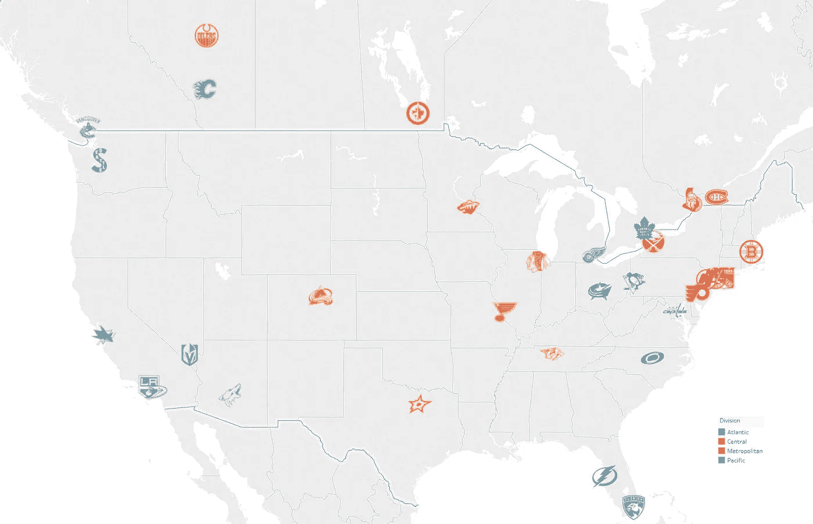
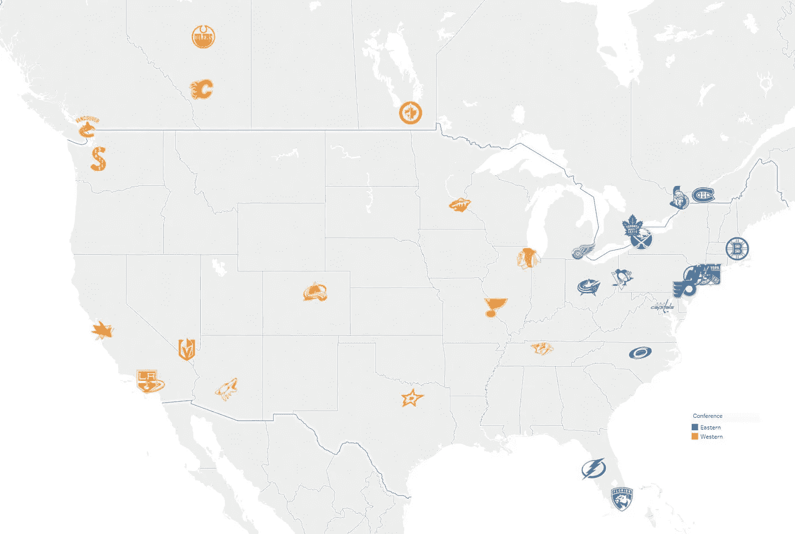
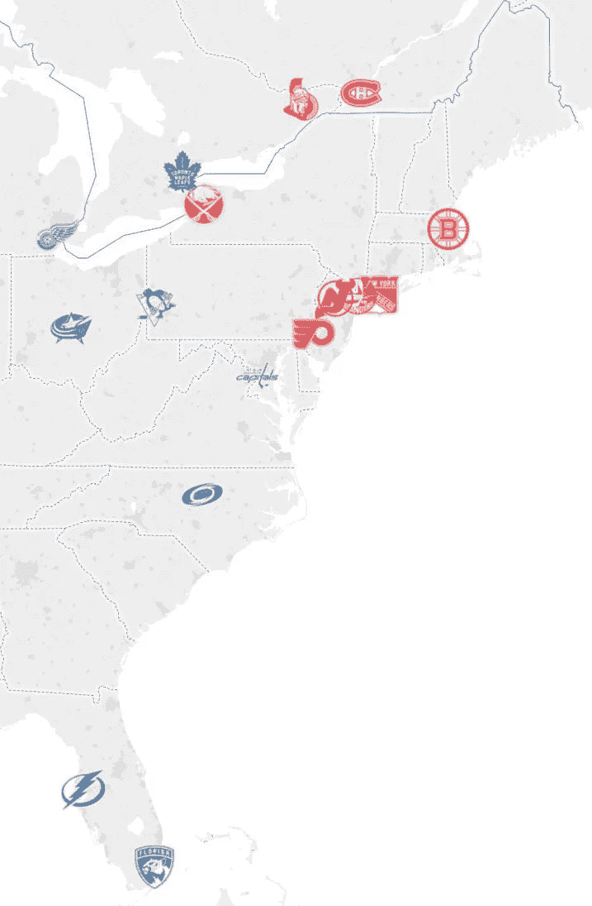
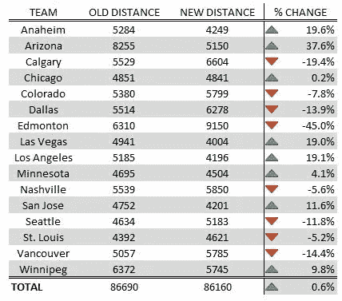

# 用数学重新排列 NHL

> 原文：<https://towardsdatascience.com/realigning-the-nhl-with-math-or-why-edmonton-and-calgary-should-play-in-different-divisions-bc41cb493332?source=collection_archive---------14----------------------->

## **为什么埃德蒙顿和卡尔加里应该在不同的赛区比赛**

This is the best possible NHL divisional alignment, according to the immutable laws of math. Read on!

12 月 4 日，星期二，准备好参加西雅图的大型派对吧，人们普遍预计这座城市将获得第 32 届 NHL 特许经营权。在 2008 年输给超音速队后，热情的球迷们终于可以享受冬季运动了，温哥华将获得一个区域性的竞争对手。

增加第 32 支队伍也需要 NHL 重新调整其部门。目前，NHL 在太平洋地区有 8 支球队，在中部有 7 支球队。西雅图几乎肯定会被放在太平洋赛区，导致西部联盟内部暂时不平衡。有很多关于哪支球队将被转移到补偿的互联网聊天，领先的候选人是亚利桑那郊狼队，因为缺乏传统的竞争，以及他们作为太平洋赛区中位于最东边的球队的位置。

但是，如果团队仅仅根据紧密度被分配到不同的部门，而不考虑传统的竞争，那会怎么样呢？这些部门会是什么样子？

幸运的是，这是一个可以解决的问题。通过计算每个 NHL 城市之间的距离，我们可以将 32 支球队分成 4 个分区，这样可以最小化分区内的总旅行距离。

**假设和免责声明**

1)我使用离每个 NHL 队的比赛场地最近的主要机场作为每个城市的起点/终点。这就产生了一些有趣的边缘案例——例如，两个纽约团队都将他们的起点/终点列为拉瓜迪亚机场，这使得他们在我们的模型中彼此之间的有效旅行距离为 0 英里。虽然这显然是不正确的，但模型的目的是做出有用的预测，而不是 100%精确。况且，两个在同一个城市打球的球队应该留在同一个赛区的建议，也不会让任何人震惊。

2)值得再次强调的是，这种模式并不重视将传统竞争对手团结在一起。该模型完全是通过最小化旅行距离来生成最紧凑的分区。我不打算说我的结果从商业角度来看有意义，但这些信息可以作为关于重组的更广泛对话中的数据点。

**最优会议**

首先，我们需要通过最小化会议间的距离，将我们的 32 个团队分成两个 16 人的会议。有趣的是，目前的团队联盟是最佳的。NHL 在这方面做得很好，最近几年将哥伦布、底特律和多伦多从西部转移到东部。

The current NHL conference setup is optimal…

**东部联盟**

…but there’s room for improvement in the Eastern Conference.

尽管东部联盟并没有因为西雅图的加入而改变其组成，但目前的联盟仍然值得研究。不出所料，还有很大的改进空间——我们的模型显示，总的部门内距离可以减少 15.8%。

东部 16 支球队中有 10 支通过我提议的重组变得更好了。让坦帕湾和佛罗里达与加拿大和新英格兰北部的球队在同一个分区比赛一直是一种好奇，更多的是出于一时的便利而不是常识，几乎所有这些球队都通过重新调整而明显改善。

Units are in miles.

我当然可以看到匹兹堡、多伦多和华盛顿的球迷在这里大喊犯规。匹兹堡将失去与费城的分区竞争，但这将是回到不久前的状态——就在 1998 年，[匹兹堡和费城处于不同的分区](https://www.nhl.com/standings/1997/division)。让水牛城和多伦多在不同的部门比赛可能会感觉不太直观，但是回想一下，这个练习的目标是最小化*总*行程距离。虽然多伦多有一个势均力敌的对手可能对*更好，但这对其他车队的伤害大于对多伦多的帮助。然而，如果我们把华盛顿换成布法罗，我们只会差 582 英里(1.29%)，同时保留几个传统的对手。*

**西部联盟**

Can I ever set foot in Edmonton again?

Units are in miles. Note that the “old distance” condition consists of the current divisional alignment with Phoenix in the Central, consistent with popular speculation.

这是一个非常接近的电话，但全国曲棍球联合会将通过交换埃德蒙顿到中央分区和保持菲尼克斯在太平洋上节省 530 英里的分区旅行距离。虽然这样的举动显然会使卡斯卡迪亚+阿尔伯塔团队旅行更长的距离，但这种变化对西南团队的好处大于对北方团队的伤害。最终，这些信息应该放在适当的背景下——当成本是打破阿尔伯塔省的战斗时，节省 0.6%的总旅行距离真的值得吗？我的猜测是没有。

**结论**

虽然注意力理所应当地集中在未来几周的西部联盟重组上，但 NHL 将会很好地以紧凑的重点重组东部联盟。这样做，NHL 可以大大减少旅行时间和碳足迹的产品。然后，他们可以将这些积分中的一部分用于类似无会议斯坦利杯季后赛的活动，这将是未来帖子的主题！

**带着归属和感激**

所有的地图都是用 Tableau 设计的；NHL 标志是在合理使用原则下使用的。我已经把我的距离矩阵和数据文件上传到 GitHub 它们在[这里](https://github.com/jacksonbtaylor/NHLDivisions)有售。

我要感谢华盛顿大学的陈石教授在我着手这个项目时给予我的建议和鼓励。我还要感谢伊恩·马丁内斯，他的指导和富有感染力的乐观精神是我灵感的源泉。